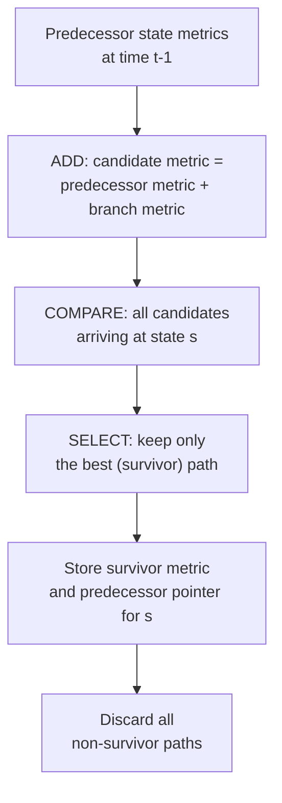

## Viterbi Decoding Algorithm

### Purpose and Setting

The Viterbi algorithm is a dynamic programming procedure for finding the **maximum-likelihood path** through the trellis of a convolutional code (previously introduced), given a received sequence that may be corrupted by channel noise. It solves the decoding problem: among all possible input sequences the encoder could have produced, find the one whose corresponding trellis path is most consistent with what was actually received.

**[Confirmed]** Without dynamic programming, maximum-likelihood decoding would require comparing every possible input sequence against the received sequence — a search space of size $2^L$ for an information sequence of length $L$, growing exponentially and quickly becoming computationally infeasible. The Viterbi algorithm exploits the trellis's layered structure to reduce this to a computation that is linear in $L$.

### Path Metrics

**[Confirmed]** Two related quantities drive the algorithm:

- **Branch metric:** a cost assigned to each individual trellis edge, measuring how well the edge's expected output matches the actually received symbols at that time step. For **hard-decision** decoding (received bits already quantized to 0/1), the branch metric is typically the Hamming distance between the expected output bits and the received bits. For **soft-decision** decoding (using unquantized or multi-level received values, retaining more channel reliability information), the branch metric is typically a Euclidean-distance-based or log-likelihood-based cost.
- **Path metric:** the cumulative sum of branch metrics along an entire path through the trellis, up to some point in time. This is the quantity the algorithm ultimately minimizes (for distance-style metrics) or maximizes (for likelihood-style metrics).

### The Core Algorithm

**[Confirmed]** The Viterbi algorithm proceeds in three logical stages:

1. **Initialization:** Set the path metric of the known starting state (typically the all-zero state, assuming the encoder starts in state 0) to zero, and the path metric of all other states to infinity (or an equivalent "unreachable" marker), since no valid path could reach them at time zero.
2. **Recursion (add-compare-select):** At each subsequent time step $t$, for every state $s$, consider all trellis edges entering $s$ from states at time $t-1$. For each incoming edge, compute a candidate path metric as the predecessor's stored path metric plus this edge's branch metric ("add"). Compare all such candidates for state $s$ ("compare"), and retain only the single best one as the new path metric for $s$, discarding the rest ("select"). Record which predecessor state produced the surviving path, for later traceback.
3. **Termination and traceback:** At the final time step, select the state with the best overall path metric (or, if the encoder is deliberately terminated to a known final state via tail bits, use that known final state directly). Trace backward through the recorded predecessor pointers to reconstruct the full maximum-likelihood path, and read off the corresponding input bit sequence from the edge labels along that path.

### Diagram: Add-Compare-Select

### Why Path Pruning Is Valid

**[Confirmed]** The correctness of discarding non-survivor paths rests on a key dynamic-programming argument: once two distinct paths arrive at the *same* state at the *same* time, any future continuation from that state onward is identical in cost contribution for both paths (since future branch metrics depend only on the current state and future inputs, not on the specific history that led to the current state). Therefore, whichever of the two paths has the better cumulative metric so far will remain better (or at worst tie) for any shared future continuation — the inferior path can never become part of the overall optimal path and is safely discarded without loss of optimality.

### Diagram: Trellis with Survivor Paths Highlighted

<svg xmlns="http://www.w3.org/2000/svg" viewBox="0 0 600 300">
<text x="300" y="25" text-anchor="middle" font-size="16" font-weight="bold" fill="#1a1a1a">Viterbi Survivor Paths on the Trellis (svg_diagram)</text>

<text x="60" y="90" font-size="11" fill="`#374151`">00</text>

<text x="60" y="150" font-size="11" fill="`#374151`">01</text>

<text x="60" y="210" font-size="11" fill="`#374151`">10</text>

<text x="60" y="270" font-size="11" fill="`#374151`">11</text>

<circle cx="120" cy="85" r="6" fill="#1d4ed8" />
<circle cx="120" cy="145" r="6" fill="#9ca3af" />
<circle cx="120" cy="205" r="6" fill="#9ca3af" />
<circle cx="120" cy="265" r="6" fill="#9ca3af" />
<circle cx="280" cy="85" r="6" fill="#1d4ed8" />
<circle cx="280" cy="145" r="6" fill="#9ca3af" />
<circle cx="280" cy="205" r="6" fill="#1d4ed8" />
<circle cx="280" cy="265" r="6" fill="#9ca3af" />
<circle cx="440" cy="85" r="6" fill="#1d4ed8" />
<circle cx="440" cy="145" r="6" fill="#1d4ed8" />
<circle cx="440" cy="205" r="6" fill="#1d4ed8" />
<circle cx="440" cy="265" r="6" fill="#1d4ed8" />
<line x1="120" y1="85" x2="280" y2="85" stroke="#059669" stroke-width="3" />
<text x="200" y="75" text-anchor="middle" font-size="9" fill="#059669">survivor</text>
<line x1="120" y1="85" x2="280" y2="205" stroke="#d1d5db" stroke-width="1.5" stroke-dasharray="3,2" />
<line x1="280" y1="85" x2="440" y2="85" stroke="#059669" stroke-width="3" />
<line x1="280" y1="205" x2="440" y2="145" stroke="#059669" stroke-width="3" />

<text x="120" y="295" text-anchor="middle" font-size="10" fill="`#374151`">t=0</text>

<text x="280" y="295" text-anchor="middle" font-size="10" fill="`#374151`">t=1</text>

<text x="440" y="295" text-anchor="middle" font-size="10" fill="`#374151`">t=2</text>

<text x="550" y="90" font-size="9" fill="`#059669`">green = survivor</text>

<text x="550" y="105" font-size="9" fill="`#9ca3af`">gray = pruned</text>

</svg>

### Worked Example: Hard-Decision Decoding

Using the $(2,1,3)$ code from the previous topic (generator polynomials $7_8, 5_8), suppose the encoded sequence $(1,1),(1,0),(0,0)
 was transmitted (as computed in the earlier worked example) but the channel introduces a single bit error, so the received sequence is $(1,1),(1,1),(0,0)$ (error in the second output pair, position 2).

**[Confirmed]** At $t=1$, the branch metric for the correct transition (expected output $(1,0)$) against received $(1,1)$ is Hamming distance $1, while an incorrect transition might have Hamming distance $0
 or $2$ depending on its expected output. The Viterbi algorithm does not commit to a decision at $t=1$ in isolation; it carries forward all path metrics and only resolves the ambiguity as more of the sequence is processed, since the *cumulative* metric of the truly correct path will, with high probability for a code with adequate free distance, still be lowest once t=2's information is incorporated — this delayed, sequence-level decision is precisely what gives Viterbi decoding its error-correcting power beyond naive per-symbol decisions.

**[Unverified]** The exact surviving path and specific numeric metrics for this example depend on carrying the computation through all states at $t=2$ and comparing final cumulative metrics; a full worked trace requires enumerating all four states at each time step, which is omitted here for brevity but follows directly from the add-compare-select procedure described above.

### Computational Complexity

**[Confirmed]** For a code with $2^{K-1}$ states (where $K$ is the constraint length) and an information sequence of length $L$, the Viterbi algorithm requires $O(L \cdot 2^{K-1})$ operations — linear in sequence length, but **exponential in constraint length**. This exponential dependence on $K$ is why practical convolutional codes typically use modest constraint lengths (e.g., $K=7$ or $K=9$ are common in real systems), trading off the improved error-correction performance of longer constraint lengths against decoder complexity.

### Soft-Decision vs. Hard-Decision Decoding

**[Confirmed]** Soft-decision Viterbi decoding, which uses the raw or quantized channel output values (e.g., log-likelihood ratios reflecting confidence in each received bit) rather than pre-quantized hard 0/1 decisions, generally provides better error-correction performance than hard-decision decoding for the same code, because it preserves reliability information that hard quantization discards. **[Inference]** This performance gain is commonly cited as approximately 2 dB in required signal-to-noise ratio for AWGN channels, though the exact figure depends on the specific code, modulation scheme, and quantization granularity used, and should be treated as an order-of-magnitude characterization rather than an exact universal constant.

### Traceback Depth and Truncation

**[Inference]** In practice, waiting until the very end of a (potentially very long or continuous) stream to perform traceback is impractical for latency and memory reasons. Real implementations typically use a **truncated traceback depth** — waiting a fixed number of time steps (often around 5 times the constraint length, as a commonly used practical heuristic) before committing to a decision for the oldest undecided bits, since with high probability all surviving paths will have converged to the same history that far back. This introduces a small fixed decoding delay and a small, generally negligible, performance loss compared to full-sequence traceback.

### Key Points

**Key Points**

- The Viterbi algorithm is dynamic programming applied to a trellis: it never explores exponentially many full paths, only tracks the single best partial path into each state at each time step.
- Its complexity is linear in sequence length but exponential in constraint length, which directly bounds the practical constraint lengths used in real convolutional codes.
- Soft-decision decoding, integrated naturally via the branch metric computation, generally outperforms hard-decision decoding by preserving channel reliability information.
- Practical implementations use truncated traceback rather than waiting for full-sequence completion, trading a small fixed delay and negligible performance cost for bounded memory and latency.

### Related Topics

- Convolutional codes and trellis representation (prerequisite, previously covered)
- Free distance and its role in convolutional code error-correction capability
- BCJR algorithm (forward-backward algorithm) as an alternative providing soft outputs, used in turbo decoding
- Turbo codes and iterative decoding built on convolutional code components
- Log-likelihood ratios and their use in soft-decision metrics
- Sequential decoding (Fano algorithm) as a non-dynamic-programming alternative
- Punctured convolutional codes and their effect on trellis structure
- Trellis-coded modulation combining Viterbi decoding with modulation design