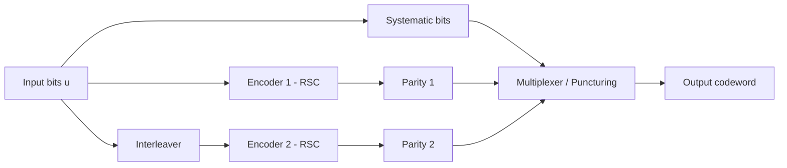
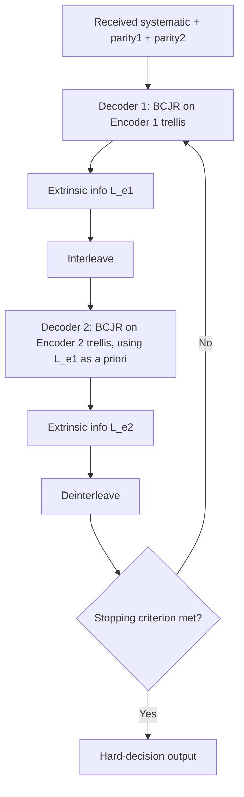

## Turbo Codes and Iterative Decoding

### Overview

Turbo codes are a class of high-performance error-correcting codes that achieve error rates close to the Shannon limit through the combination of parallel concatenated convolutional codes and iterative ("turbo") decoding. Introduced in 1993, they marked a major leap in coding theory by demonstrating that near-capacity performance was achievable with feasible decoding complexity, ending decades of a widening gap between theoretical limits and practical code performance.

### Historical Background

Turbo codes were introduced by Claude Berrou, Alain Glavieux, and Punya Thitimajshima in 1993. Their result was initially met with skepticism because the reported performance—within roughly 0.5 dB of the Shannon limit at moderate signal-to-noise ratios—seemed implausibly close to theoretical bounds achieved by codes with far higher decoding complexity. Independent verification confirmed the results, and turbo codes rapidly became foundational to modern communication standards.

### Core Architecture

**Parallel Concatenation**

A turbo encoder consists of two (or more) constituent convolutional encoders operating on the same input bits, but with one of them fed an interleaved version of the input sequence:

**Recursive Systematic Convolutional (RSC) Encoders**

The constituent encoders are typically Recursive Systematic Convolutional (RSC) codes rather than plain convolutional codes. "Systematic" means the input bits appear directly in the output; "recursive" means the encoder has feedback, which spreads the influence of each input bit over a longer output sequence and improves the code's distance properties when combined with interleaving.

**The Interleaver**

The interleaver reorders the input bit sequence before it enters the second encoder. This is a defining and critical element of turbo code design:

- It ensures that low-weight input patterns causing a weak codeword in one encoder are unlikely to also produce a weak codeword in the other encoder
- Interleaver design directly affects the code's minimum distance and its "error floor" behavior at high signal-to-noise ratios
- Common types include block (row-column) interleavers, random interleavers, and specially designed S-random or algebraic interleavers used in standards

**Puncturing**

To maintain a practical code rate (e.g., rate 1/2 rather than rate 1/3 from two full constituent encoders plus systematic bits), selected parity bits from the two encoders are punctured (omitted) according to a periodic pattern.

### Encoding Summary

For a rate-1/3 turbo code:

- Systematic bits: the original input sequence
- Parity 1: output of the first RSC encoder
- Parity 2: output of the second RSC encoder, applied to the interleaved input

$$R = \frac{k}{n}$$

For unpunctured rate-1/3 output, $n = 3k$; puncturing patterns increase the effective rate toward 1/2 or higher.

### Iterative ("Turbo") Decoding

**Core Idea**

Rather than a single-pass decoding operation, turbo decoding uses two soft-input/soft-output (SISO) decoders that exchange probabilistic information about each bit iteratively, refining estimates with each pass—analogous to a turbocharger's feedback loop, which inspired the name.

**Soft Information and Extrinsic Information**

Each constituent decoder does not simply output hard bit decisions; it computes a soft reliability value for each bit, commonly expressed as a log-likelihood ratio (LLR):

$$L(u_i) = \log\left(\frac{P(u_i = 1 \mid \text{received})}{P(u_i = 0 \mid \text{received})}\right)$$

The key innovation is the separation of this LLR into components:

$$L(u_i) = L_c(u_i) + L_a(u_i) + L_e(u_i)$$

where:

- $L_c(u_i)$ is the channel-derived intrinsic information
- $L_a(u_i)$ is the a priori information fed in from the other decoder
- $L_e(u_i)$ is the extrinsic information generated by this decoder, to be passed to the other decoder

Only the extrinsic information is passed between decoders (not the full LLR), which prevents the decoders from reinforcing their own previous beliefs and turning the process into a feedback loop that would falsely amplify confidence rather than genuinely refine it.

**BCJR / MAP Algorithm**

The dominant SISO decoding algorithm for turbo codes is the BCJR algorithm (named for Bahl, Cocke, Jelinek, and Raviv), which computes the Maximum A Posteriori (MAP) probability for each bit using forward and backward recursions over the trellis of the constituent code:

- **Forward recursion**: computes $\alpha$ values (probability of being in a given trellis state given the observations up to that point)
- **Backward recursion**: computes $\beta$ values (probability of the future observations given a state)
- **Branch metrics**: computed as $\gamma$ values combining channel likelihood and a priori information
- Combining $\alpha$, $\beta$, and $\gamma$ yields the a posteriori probability for each bit, from which the LLR and extrinsic information are extracted

Simplified variants, such as the Max-Log-MAP and Log-MAP algorithms, approximate the BCJR computations in the log domain to reduce implementation complexity at a modest performance cost.

**Iterative Decoding Loop**

Each pass through both decoders is one iteration. Performance typically improves rapidly over the first several iterations, then yields diminishing returns; 6 to 10 iterations are common in practical systems [Inference: exact iteration counts used in deployed systems vary by standard, target latency, and power budget].

### Convergence Behavior

**Waterfall Region**

At moderate to high signal-to-noise ratios, turbo codes exhibit a sharp drop in bit error rate as SNR increases slightly—the "waterfall" region—reflecting the code's near-capacity performance.

**Error Floor**

At very high SNR, the bit error rate curve flattens into an "error floor," where further SNR increases yield only marginal improvement. This behavior is primarily governed by the code's minimum distance, which is influenced heavily by interleaver design.

**EXIT Chart Analysis**

Extrinsic Information Transfer (EXIT) charts are a graphical analysis tool used to predict convergence behavior of iterative decoders by tracking how mutual information between extrinsic outputs and true bits evolves across decoders and iterations, without requiring full simulation.

### Key Points

- Turbo codes achieve near-Shannon-limit performance using two simple constituent codes decoded jointly and iteratively
- The interleaver is essential to performance, not merely a rearrangement step
- Only extrinsic information is exchanged between decoders, which is what allows genuine iterative refinement rather than circular reinforcement
- The BCJR algorithm (or its Log-MAP/Max-Log-MAP approximations) is the standard SISO decoding engine
- Performance is characterized by a waterfall region followed by an error floor

### Comparison with Other Codes

|Property|Turbo Codes|LDPC Codes|Convolutional Codes|
|---|---|---|---|
|Decoding|Iterative BCJR|Iterative belief propagation|Viterbi (non-iterative)|
|Distance to Shannon limit|Very small|Very small|Larger|
|Error floor|Present, interleaver-dependent|Present, generally lower|N/A (different error behavior)|
|Latency|Higher (iterative, block-based)|Higher (iterative)|Lower|
|Typical use|3G/4G mobile, deep space|5G, Wi-Fi, DVB-S2, storage|Legacy/simple systems|

[Inference: exact standard-by-standard adoption reflects widely documented usage patterns; specific version details of any given standard may differ.]

### Practical Applications

- 3GPP UMTS (3G) and LTE (4G) mobile standards used turbo codes for data channels
- Deep-space communication (e.g., missions adopting CCSDS turbo code standards)
- Digital Video Broadcasting return channels
- Various satellite communication systems

### Advantages and Limitations

**Advantages**

- Near-capacity performance at moderate block lengths
- Well-understood, mature soft-decision decoding theory
- Flexible rate adaptation via puncturing

**Limitations**

- Iterative decoding introduces latency unsuitable for some ultra-low-latency applications
- Error floor can limit performance in applications requiring extremely low error rates (e.g., some storage systems), where LDPC codes are often preferred instead
- Decoder complexity and power consumption are higher than for single-pass decoders such as Viterbi decoders
- Performance is sensitive to accurate channel state (noise variance) estimation for correct LLR scaling

### Related Topics

- LDPC codes and belief propagation decoding
- BCJR / MAP decoding algorithm (detailed treatment)
- Convolutional codes and the Viterbi algorithm
- Interleaver design (block, random, S-random, algebraic)
- Shannon limit and channel capacity
- EXIT chart analysis
- Polar codes
- Log-likelihood ratios and soft-decision decoding