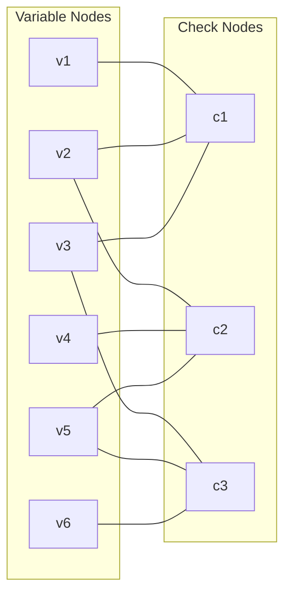

## Low-Density Parity-Check Codes

### Definition

Low-density parity-check (LDPC) codes are linear block codes (previously introduced generally) distinguished by a **sparse** parity-check matrix $H$ — a matrix in which the number of nonzero entries per row and per column is small relative to the matrix dimensions, and in particular grows much more slowly than $n$ as the block length increases. This sparsity is the defining structural property, and it is what makes efficient iterative decoding possible, in contrast to the dense parity-check matrices typical of generic linear block codes.

**[Confirmed]** LDPC codes were originally introduced by Robert Gallager in his 1960 doctoral thesis, decades before turbo codes (previously covered), but the required decoding computation was considered impractical for the hardware of that era and the codes were largely overlooked until their rediscovery in the mid-1990s, following the excitement generated by turbo codes' demonstrated capacity-approaching performance.

### Regular vs. Irregular LDPC Codes

**[Confirmed]** LDPC codes are classified by the structure of their sparse parity-check matrix:

- **Regular LDPC codes:** every column of $H$ has exactly $w_c$ nonzero entries (the "column weight" or "variable node degree"), and every row has exactly $w_r$ nonzero entries (the "row weight" or "check node degree"), for fixed constants $w_c, w_r$.
- **Irregular LDPC codes:** column and row weights vary across the matrix according to prescribed degree distributions, rather than being uniform.

**[Confirmed]** Irregular LDPC codes, with carefully optimized (rather than uniform) degree distributions, generally achieve performance closer to channel capacity than regular LDPC codes of comparable length and rate — this is a well-established finding from the density evolution analysis used to design LDPC degree distributions, discussed further below.

### Tanner Graph Representation

**[Confirmed]** The standard way to visualize an LDPC code's structure is the **Tanner graph**, a bipartite graph with two types of nodes:

- **Variable nodes**, one per codeword bit (column of $H$).
- **Check nodes**, one per parity-check equation (row of $H$).

An edge connects variable node $j$ to check node $i$ if and only if $H_{ij} = 1$ — that is, if bit $j$ participates in parity-check equation $i$. The sparsity of $H$ translates directly into a Tanner graph with low connectivity (low node degrees), which is precisely what makes efficient local message-passing decoding feasible.

### Diagram: Tanner Graph

### Belief Propagation Decoding

**[Confirmed]** LDPC codes are decoded via **belief propagation** (also called the sum-product algorithm), an iterative message-passing procedure operating directly on the Tanner graph:

1. **Initialization:** each variable node initializes its belief (typically a log-likelihood ratio) based solely on the channel observation for that bit.
2. **Variable-to-check messages:** each variable node sends a message to each check node it is connected to, summarizing its current belief about its own bit value, computed using information from the channel and from all *other* connected check nodes (excluding the one the message is being sent to — this extrinsic-style exclusion mirrors the extrinsic information principle previously discussed for turbo decoding).
3. **Check-to-variable messages:** each check node sends a message back to each connected variable node, expressing the constraint that all bits participating in that parity-check equation must sum to zero (mod 2) — computed using the incoming messages from all *other* connected variable nodes (again excluding the one being messaged back to).
4. **Iteration:** steps 2–3 repeat for a fixed number of rounds or until the current hard-decision estimate satisfies all parity checks (i.e., $\hat{c}H^T = 0$), at which point decoding can terminate early.
5. **Final decision:** after the final iteration, each variable node combines all incoming information (channel plus all connected check nodes) to make a final hard decision on its bit value.

### Diagram: Message Passing on the Tanner Graph

<svg xmlns="http://www.w3.org/2000/svg" viewBox="0 0 550 260">
  <text x="275" y="25" text-anchor="middle" font-size="16" font-weight="bold" fill="#1a1a1a">Belief Propagation Message Flow (svg_diagram)</text>

  <circle cx="120" cy="100" r="20" fill="#dbeafe" stroke="#1d4ed8" stroke-width="2" />
  <text x="120" y="105" text-anchor="middle" font-size="11" fill="#1d4ed8">v1</text>

  <circle cx="120" cy="200" r="20" fill="#dbeafe" stroke="#1d4ed8" stroke-width="2" />
  <text x="120" y="205" text-anchor="middle" font-size="11" fill="#1d4ed8">v2</text>

  <rect x="380" y="130" width="45" height="45" fill="#fce7f3" stroke="#be185d" stroke-width="2" />
  <text x="402" y="157" text-anchor="middle" font-size="11" fill="#be185d">c1</text>

  <line x1="140" y1="105" x2="380" y2="145" stroke="#059669" stroke-width="2" />
  <text x="250" y="115" text-anchor="middle" font-size="9" fill="#059669">variable→check msg</text>

  <line x1="140" y1="195" x2="380" y2="160" stroke="#059669" stroke-width="2" />

  <line x1="380" y1="150" x2="140" y2="100" stroke="#dc2626" stroke-width="2" stroke-dasharray="5,3" />
  <text x="250" y="185" text-anchor="middle" font-size="9" fill="#dc2626">check→variable msg (return)</text>

  <text x="275" y="230" text-anchor="middle" font-size="10" fill="#374151">Each message excludes info from the edge it's sent on</text>
</svg>

### Density Evolution

**[Confirmed]** **Density evolution** is the primary analytical tool for designing and analyzing LDPC codes, tracking how the probability distribution of belief-propagation messages evolves across iterations, in the limit of infinite block length (where the Tanner graph is treated as locally tree-like, making the independence assumptions underlying belief propagation asymptotically exact). Using density evolution, code designers can compute the **decoding threshold** — the worst channel noise level for which the message error probability provably converges to zero as the number of iterations grows — and optimize the variable/check node degree distributions to push this threshold as close as possible to the channel's Shannon limit.

**[Inference]** This threshold-based design methodology is a major reason well-optimized irregular LDPC codes can achieve performance extremely close to capacity — in some published constructions, within hundredths of a dB of the Shannon limit for specific channels and rates — though such precise figures are construction- and channel-specific and should be checked against the specific published result rather than treated as a general LDPC property.

### Comparison to Turbo Codes

**[Inference]** LDPC and turbo codes (previously covered) share the underlying principle of iterative, probabilistic message-passing decoding, but differ structurally: turbo decoding exchanges messages between two full trellis-based SISO decoders via the BCJR algorithm, while LDPC belief propagation exchanges much simpler, local messages directly between individual variable and check nodes on a sparse graph. **[Unverified]** Comparative performance between well-optimized LDPC and turbo codes depends heavily on specific block length, rate, channel type, and implementation details; general claims that one family is definitively superior to the other should be treated with caution, as both have found extensive practical deployment in different standards and contexts (e.g., LDPC in Wi-Fi and 5G data channels, turbo codes historically in 3G/4G and deep-space applications) reflecting engineering trade-offs rather than a strict universal performance ranking.

### The "Low-Density" Property and Decoding Complexity

**[Confirmed]** The sparsity of $H$ directly bounds decoding complexity: since each variable node has only $w_c$ (or, for irregular codes, an average degree $\bar{w}_c$) connected check nodes, and each check node has only $w_r$ connected variable nodes, the total number of messages passed per iteration scales with the number of nonzero entries in $H$ — which by design grows only linearly with $n$ for fixed average degrees, rather than growing with the dense $O(n^2)$ entry count a generic (non-sparse) parity-check matrix would have. This linear-in-$n$ per-iteration cost is what makes belief propagation decoding practical even for very large block lengths, a scale at which dense-matrix decoding approaches would become computationally prohibitive.

### Worked Example: Small Regular LDPC Code

Consider a simple regular LDPC code with column weight $w_c=3$ and row weight $w_r=6$, meaning each bit participates in exactly 3 parity checks, and each parity check involves exactly 6 bits. For a code with $n=12$ variable nodes, the total number of edges in the Tanner graph is $n \cdot w_c = 36$, giving $m = 36/w_r = 6$ check nodes — a $(6,12)$ structure with rate $R = (n-m)/n = 6/12 = 1/2$ (assuming $H$ has full row rank).

**[Unverified]** This small example is illustrative of the row/column weight bookkeeping relationship rather than a specific named or standardized code; real LDPC codes deployed in practice use much larger block lengths (often thousands of bits) to achieve performance approaching the density-evolution-predicted threshold, since finite-length effects (short cycles in the Tanner graph, error floors) become more pronounced at small $n$.

### Key Points

**Key Points**
- The defining property of LDPC codes is a *sparse* parity-check matrix, translating to a low-degree Tanner graph, which is what enables tractable, local, iterative belief-propagation decoding.
- Irregular LDPC codes, with degree distributions optimized via density evolution, generally outperform regular LDPC codes of comparable rate and length, approaching the Shannon limit more closely.
- Belief propagation's variable-to-check and check-to-variable message updates each exclude the receiving edge's own prior contribution, mirroring the extrinsic-information principle established for turbo decoding — both are instances of the general belief-propagation/message-passing framework.
- LDPC decoding complexity per iteration scales linearly with block length (for fixed average node degree), a critical practical advantage enabling very large block lengths in modern deployments.

### Related Topics

- Turbo codes and iterative decoding as a related message-passing paradigm (prerequisite, previously covered)
- Density evolution and decoding threshold computation in detail
- Tanner graphs, cycles, and their effect on belief propagation accuracy (girth and short-cycle problems)
- Gallager's original LDPC construction and its historical rediscovery
- Error floors in iterative decoders and mitigation techniques
- Polar codes as an alternative provably capacity-achieving construction
- Fountain/Raptor codes and their LDPC-like sparse graph structure for erasure channels
- Practical LDPC deployments (Wi-Fi 802.11n/ac, 5G NR data channel, DVB-S2)