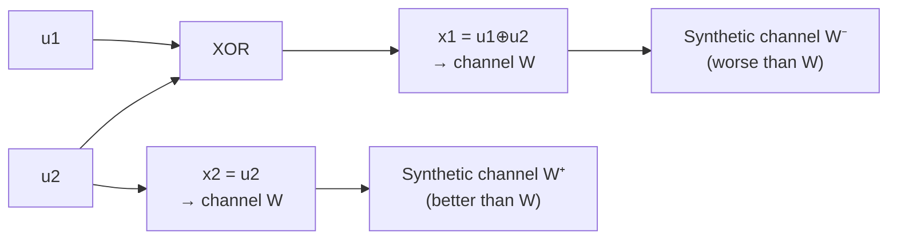
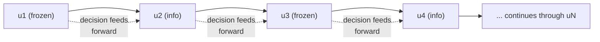

## Polar Codes

### Historical Significance

Polar codes, introduced by Erdal Arıkan in 2009, hold a distinctive place in coding theory: they were the first explicit code construction **provably** shown to achieve channel capacity for binary-input symmetric memoryless channels, with both encoding and decoding complexity of $O(n \log n)$. **[Confirmed]** This closed a decades-long gap left open by Shannon's original 1948 proof (previously covered), which established capacity as achievable via random coding but offered no explicit, efficiently-decodable construction — unlike turbo codes and LDPC codes (previously covered), which achieve excellent *empirical* capacity-approaching performance without a matching rigorous capacity-achieving proof for general channels, polar codes come with a formal asymptotic capacity-achieving guarantee.

### The Channel Polarization Phenomenon

**[Confirmed]** The foundational idea behind polar codes is **channel polarization**: starting from $N = 2^n$ independent copies of a binary-input channel $W$ with capacity $I(W)$, a specific recursive combining-and-splitting transformation produces $N$ new "synthetic" channels whose capacities polarize toward the two extremes — as $N \to \infty$, the fraction of synthetic channels with capacity approaching $1$ (essentially noiseless) approaches $I(W)$, while the fraction with capacity approaching $0$ (essentially useless) approaches $1-I(W)$. Very few synthetic channels remain in an intermediate, partially-reliable state as $N$ grows large.

### The Basic Polarization Transform

**[Confirmed]** The core building block combines two independent copies of channel $W$ into two synthetic channels using a simple $2\times2$ transform. Given two input bits $u_1, u_2$, the encoder computes:

$$x_1 = u_1 \oplus u_2, \qquad x_2 = u_2$$

and transmits $x_1, x_2$ through two independent uses of $W$. This single combining step already produces polarization at the smallest scale: one resulting synthetic channel (call it $W^-$, associated with $u_1$) becomes *worse* than the original $W$, while the other (call it $W^+$, associated with $u_2$, decoded using knowledge of $u_1$) becomes *better* than $W$. Crucially, the average capacity is preserved: $I(W^-) + I(W^+) = 2I(W)$, so polarization redistributes reliability rather than creating or destroying it.

### Recursive Construction

**[Confirmed]** The full polar code construction recursively applies this basic $2\times2$ transform in a butterfly-like structure across $n = \log_2 N$ stages, analogous in structural spirit to the recursive divide-and-conquer pattern of the Fast Fourier Transform (though operating over $\mathbb{F}_2$ with XOR rather than complex arithmetic). After $n$ recursive stages, the $N$ synthetic bit-channels exhibit polarization to the degree described above, with the strength of polarization increasing as $N$ grows.

### Diagram: Basic Polarization Building Block

### Diagram: Polarization Effect on Capacity

<svg xmlns="http://www.w3.org/2000/svg" viewBox="0 0 550 260">
  <text x="275" y="25" text-anchor="middle" font-size="16" font-weight="bold" fill="#1a1a1a">Channel Polarization as N Grows (svg_diagram)</text>

  <text x="140" y="55" text-anchor="middle" font-size="12" fill="#374151">Small N</text>
  <rect x="60" y="65" width="160" height="30" fill="#fef3c7" stroke="#c2410c" stroke-width="1.5" />
  <text x="140" y="85" text-anchor="middle" font-size="10" fill="#c2410c">mixed-capacity channels</text>

  <text x="410" y="55" text-anchor="middle" font-size="12" fill="#374151">Large N</text>
  <rect x="330" y="65" width="65" height="30" fill="#dcfce7" stroke="#15803d" stroke-width="1.5" />
  <text x="362" y="85" text-anchor="middle" font-size="9" fill="#15803d">capacity ≈ 1</text>
  <rect x="405" y="65" width="65" height="30" fill="#fee2e2" stroke="#991b1b" stroke-width="1.5" />
  <text x="437" y="85" text-anchor="middle" font-size="9" fill="#991b1b">capacity ≈ 0</text>

  <line x1="60" y1="130" x2="490" y2="130" stroke="#1a1a1a" stroke-width="1.5" />
  <text x="490" y="150" font-size="11" fill="#374151">bit-channel index</text>
  <text x="60" y="150" font-size="11" fill="#374151">0</text>

  <path d="M 60 200 Q 275 100 490 60" stroke="#1d4ed8" stroke-width="2" fill="none" />
  <text x="500" y="65" font-size="9" fill="#1d4ed8">reliable fraction ≈ I(W)</text>

  <path d="M 60 60 Q 275 100 490 200" stroke="#dc2626" stroke-width="2" fill="none" />
  <text x="500" y="205" font-size="9" fill="#dc2626">unreliable fraction ≈ 1-I(W)</text>
</svg>

### Encoding: Frozen Bits

**[Confirmed]** Given the polarization result, the polar code construction is direct: identify the $K$ synthetic bit-channels with the highest capacity (the most reliable ones) and use those positions to carry the $K$ actual information bits. The remaining $N-K$ positions, corresponding to the least reliable synthetic channels, are set to fixed, predetermined values (conventionally all zero) known to both encoder and decoder — these are called **frozen bits**. The rate of the resulting code is $R = K/N$.

**[Inference]** This construction directly embodies the polarization phenomenon: as $N \to \infty$, the fraction of reliable channels approaches $I(W)$, so choosing $K/N \to I(W)$ (i.e., freezing exactly the unreliable fraction) allows the code rate to approach capacity while, by construction, information is placed only on channels that are becoming perfectly reliable in the limit — this is the essential mechanism by which polar codes achieve the capacity-achieving guarantee.

### Successive Cancellation Decoding

**[Confirmed]** The standard decoding algorithm for polar codes is **successive cancellation (SC)** decoding, which processes the $N$ synthetic bit-channels in a fixed order (matching the recursive structure of the encoder), making a hard decision on each bit in turn:

1. For each bit position $i$ (in order), compute the likelihood of $u_i$ given the channel observations and the *already-decided* values of $u_1, \dots, u_{i-1}$ (using the recursive structure of the polarization transform to compute this efficiently).
2. If position $i$ is a frozen bit, simply set $\hat{u}_i$ to its known frozen value (no decision needed).
3. If position $i$ carries information, make a hard decision (e.g., choosing whichever value of $u_i$ is more likely given the computed likelihood).
4. Proceed to the next position, using the newly decided $\hat{u}_i$ in subsequent likelihood computations.

**[Confirmed]** This recursive likelihood computation can be implemented efficiently using the same butterfly/recursive structure as the encoder, giving $O(N \log N)$ decoding complexity — matching the encoding complexity and giving polar codes their favorable low-complexity profile.

### Diagram: Successive Cancellation Order

### Limitations of Plain Successive Cancellation

**[Confirmed]** While SC decoding is asymptotically capacity-achieving as $N\to\infty$, its finite-length performance is comparatively modest — because each bit decision is made greedily and irreversibly (an incorrect early decision propagates and cannot be corrected later in the sequence), plain SC decoding under-performs well-optimized LDPC or turbo codes at practically relevant, moderate block lengths.

### List Decoding and CRC-Aided Improvements

**[Confirmed]** **Successive cancellation list (SCL) decoding** substantially improves finite-length performance by maintaining multiple (a fixed list size $L$) candidate decoding paths simultaneously, rather than committing irrevocably to a single hard decision at each step — at each information bit position, the list is expanded to consider both possible values, then pruned back down to the $L$ most likely candidate paths (evaluated cumulatively), somewhat analogous in spirit to the Viterbi algorithm's path-metric tracking, though following a different underlying decoding logic. **[Confirmed]** Concatenating a short CRC (cyclic redundancy check) with the information bits before polar encoding, then using the CRC to select the correct candidate among the final list (rather than simply picking the single most-likely path), yields substantial further performance gains — this combined **CRC-aided SCL decoding** approach is widely credited with making polar codes practically competitive with, and in some regimes superior to, well-optimized LDPC and turbo codes at moderate block lengths.

### Standardization: 5G

**[Confirmed]** Polar codes were selected as part of the 5G New Radio (NR) standard, specifically for control channel coding, marking their transition from a purely theoretical breakthrough to real-world deployment roughly a decade after their original 2009 publication. **[Unverified]** Specific details of the 5G polar code construction (exact frozen-bit selection procedure, rate-matching, list size used in practice) involve standard-specific engineering choices beyond the core theoretical construction described here, and should be checked against the relevant 3GPP standard documentation for implementation-level accuracy.

### Comparison to Previously Covered Capacity-Approaching Codes

**[Inference]** Polar codes occupy a distinct theoretical position relative to turbo and LDPC codes (previously covered): turbo and LDPC codes are empirically excellent and, for LDPC, analyzable via density evolution to find good practical thresholds, but neither comes with a general closed-form proof of asymptotic capacity achievement for arbitrary channels in the way polar codes do. This makes polar codes theoretically the "cleanest" capacity-achieving construction, even though, prior to list decoding refinements, their practical finite-length performance initially lagged behind the empirically-tuned LDPC and turbo families.

### Key Points

**Key Points**
- Channel polarization is the central phenomenon: recursive combining of channel copies drives synthetic bit-channel capacities toward the extremes of 0 and 1, with the reliable fraction converging to the original channel capacity.
- Frozen bits occupy the unreliable synthetic channels; information bits occupy the reliable ones — a direct, capacity-matching construction rather than an algebraic distance-based design (contrasting with Hamming/BCH/Reed-Solomon) or an empirically-tuned graph-based design (contrasting with LDPC/turbo).
- Plain successive cancellation decoding is asymptotically capacity-achieving but modest at finite block lengths; CRC-aided successive cancellation list decoding closes much of this practical performance gap.
- Polar codes are the first and, as of their introduction, the only explicit code family with a rigorous proof of capacity achievement alongside low-complexity ($O(N\log N)$) encoding and decoding, and have since been adopted in the 5G NR standard.

### Related Topics

- Channel coding theorem and its original non-constructive achievability proof (prerequisite, previously covered)
- LDPC codes and turbo codes as empirically capacity-approaching alternatives (prerequisite, previously covered)
- Successive cancellation list decoding and CRC-aided refinements in detail
- Channel polarization proof techniques and rate of polarization
- Binary erasure channel as a common pedagogical example for illustrating polarization
- 5G NR channel coding standards (polar codes for control, LDPC for data)
- Reed-Muller codes and their structural relationship to polar codes
- Kernel design and generalizations of polar codes beyond the basic 2×2 transform