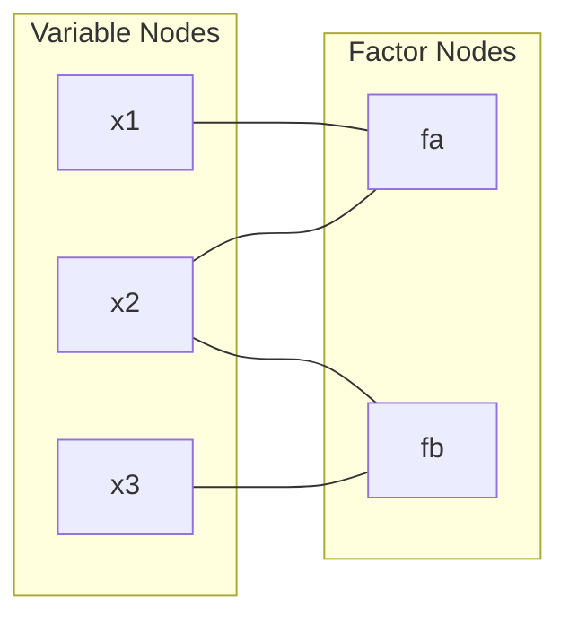
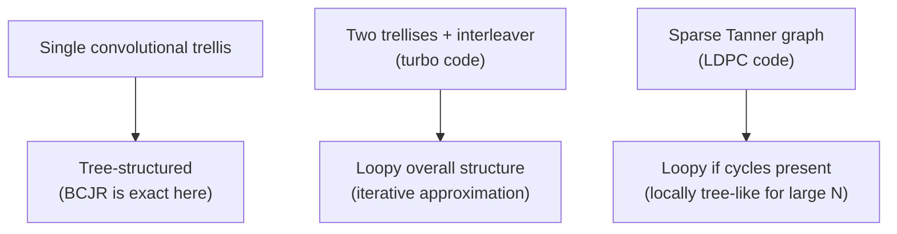

## Belief Propagation and Message Passing Decoding

### Unifying Framework

Belief propagation (BP), also known as the **sum-product algorithm**, is a general inference algorithm for computing marginal probability distributions on graphical models — and, as previously seen in the LDPC and turbo code discussions, it is the underlying computational engine behind both. This topic consolidates and generalizes those two applications: turbo decoding's extrinsic-information exchange between BCJR decoders and LDPC's variable-to-check/check-to-variable message passing are both specific instantiations of the same general belief propagation principle operating on different graph structures.

### Factor Graphs

**[Confirmed]** The general setting for belief propagation is a **factor graph**, a bipartite graph representing how a global joint probability distribution factors into a product of local functions:

$$p(x_1, \dots, x_n) = \frac{1}{Z}\prod_{a} f_a(x_{N(a)})$$

where each **factor node** $f_a$ depends only on a subset of variables $x_{N(a)}$ (its neighbors in the graph), each **variable node** $x_i$ represents one variable in the distribution, and $Z$ is a normalization constant. The Tanner graph (previously introduced for LDPC codes) is a specific factor graph where each factor node encodes a single parity-check constraint (equal to 1 if the connected bits sum to zero mod 2, and 0 otherwise).

### Diagram: General Factor Graph Structure

### The Sum-Product Message Update Rules

**[Confirmed]** Belief propagation operates by passing two types of messages along each edge of the factor graph, iteratively refining beliefs about each variable:

- **Variable-to-factor message:** the message from variable node $x_i$ to factor node $f_a$ is the product of all incoming messages to $x_i$ from its *other* connected factor nodes (excluding $f_a$ itself):

$$\mu_{i \to a}(x_i) = \prod_{b \in N(i)\setminus a} \mu_{b\to i}(x_i)$$

- **Factor-to-variable message:** the message from factor node $f_a$ to variable node $x_i$ is computed by summing the factor function, weighted by all incoming messages from $f_a$'s *other* connected variables (excluding $x_i$), over all possible values of those other variables:

$$\mu_{a\to i}(x_i) = \sum_{x_{N(a)\setminus i}} f_a(x_{N(a)}) \prod_{j\in N(a)\setminus i} \mu_{j\to a}(x_j)$$

**[Confirmed]** In both update rules, the exclusion of the target edge's own prior contribution is precisely the extrinsic-information principle previously encountered in both the turbo decoding and LDPC contexts — this is not a coincidental similarity but the same underlying mathematical requirement, since including a node's own message back to itself would cause information to be double-counted, corrupting the marginal probability computation.

### Exactness on Trees

**[Confirmed]** A foundational theoretical result is that belief propagation computes **exact** marginal probabilities when the factor graph is a **tree** (i.e., contains no cycles). On a tree, the message-passing recursion directly mirrors the structure of exact marginalization via the distributive law (summing out variables in a specific valid order determined by the tree structure), and a finite number of message-passing rounds (equal to the tree's diameter) suffices to guarantee convergence to the exact marginals at every node.

### Loopy Belief Propagation

**[Confirmed]** Real LDPC and turbo code factor graphs (Tanner graphs, or the combined trellis-interleaver structure of turbo codes) generally contain **cycles** — they are not trees. Applying the same message-passing update rules to a graph with cycles is called **loopy belief propagation**. In this setting, the algorithm is no longer guaranteed to converge, and even when it does converge, the resulting beliefs are no longer guaranteed to be the exact marginals — messages can circulate around cycles and reinforce themselves, effectively double-counting the same underlying evidence multiple times.

**[Confirmed]** Despite lacking the exactness guarantee of the tree case, loopy belief propagation is empirically highly effective for LDPC and turbo decoding — this apparent paradox (a heuristic without formal correctness guarantees performing so well in practice) was, historically, one of the significant open questions in coding theory following the introduction of turbo codes, since Gallager-style graph-based decoding had a theoretical rigor gap relative to its excellent observed performance.

### Diagram: Tree vs. Loopy Graph

<svg xmlns="http://www.w3.org/2000/svg" viewBox="0 0 550 260">
  <text x="275" y="25" text-anchor="middle" font-size="16" font-weight="bold" fill="#1a1a1a">Tree-Structured vs Loopy Factor Graphs (svg_diagram)</text>

  <text x="140" y="55" text-anchor="middle" font-size="12" font-weight="bold" fill="#1d4ed8">Tree (exact BP)</text>
  <circle cx="140" cy="90" r="16" fill="#dbeafe" stroke="#1d4ed8" stroke-width="2" />
  <circle cx="80" cy="150" r="16" fill="#dbeafe" stroke="#1d4ed8" stroke-width="2" />
  <circle cx="200" cy="150" r="16" fill="#dbeafe" stroke="#1d4ed8" stroke-width="2" />
  <circle cx="60" cy="210" r="16" fill="#dbeafe" stroke="#1d4ed8" stroke-width="2" />
  <circle cx="110" cy="210" r="16" fill="#dbeafe" stroke="#1d4ed8" stroke-width="2" />
  <line x1="140" y1="90" x2="80" y2="150" stroke="#374151" stroke-width="1.5" />
  <line x1="140" y1="90" x2="200" y2="150" stroke="#374151" stroke-width="1.5" />
  <line x1="80" y1="150" x2="60" y2="210" stroke="#374151" stroke-width="1.5" />
  <line x1="80" y1="150" x2="110" y2="210" stroke="#374151" stroke-width="1.5" />

  <text x="410" y="55" text-anchor="middle" font-size="12" font-weight="bold" fill="#be185d">Loopy (approximate BP)</text>
  <circle cx="410" cy="90" r="16" fill="#fce7f3" stroke="#be185d" stroke-width="2" />
  <circle cx="350" cy="150" r="16" fill="#fce7f3" stroke="#be185d" stroke-width="2" />
  <circle cx="470" cy="150" r="16" fill="#fce7f3" stroke="#be185d" stroke-width="2" />
  <circle cx="410" cy="210" r="16" fill="#fce7f3" stroke="#be185d" stroke-width="2" />
  <line x1="410" y1="90" x2="350" y2="150" stroke="#374151" stroke-width="1.5" />
  <line x1="410" y1="90" x2="470" y2="150" stroke="#374151" stroke-width="1.5" />
  <line x1="350" y1="150" x2="410" y2="210" stroke="#374151" stroke-width="1.5" />
  <line x1="470" y1="150" x2="410" y2="210" stroke="#374151" stroke-width="1.5" />
  <text x="410" y="235" text-anchor="middle" font-size="9" fill="#be185d">cycle: 410→350→410→470→410</text>
</svg>

### Density Evolution as a Loopy-BP Analysis Tool

**[Confirmed]** As previously noted in the LDPC context, **density evolution** provides a rigorous asymptotic analysis of loopy belief propagation's behavior, by assuming the graph is **locally tree-like** — meaning that, for a randomly constructed sparse graph, the neighborhood around any given node looks like a tree out to a radius that grows with the graph size (short cycles become increasingly rare as $N \to \infty$ for well-designed random sparse constructions). Under this asymptotic local-tree assumption, the independence assumptions underlying exact BP become asymptotically valid, justifying loopy BP's strong empirical performance and enabling rigorous threshold computation, even though any *finite* real Tanner graph inevitably contains some cycles.

### Girth and Short Cycles

**[Confirmed]** The **girth** of a graph is the length of its shortest cycle. Short cycles (low girth) in a Tanner graph are particularly damaging to belief propagation performance, since messages can reinforce their own prior beliefs after only a few iterations, rather than incorporating genuinely independent evidence — this correlated, self-reinforcing message flow is precisely what breaks the tree-based exactness guarantee. **[Inference]** This is why LDPC code design (parity-check matrix construction) generally aims to maximize girth, or at minimum avoid very short cycles (particularly 4-cycles, widely regarded in the literature as especially harmful), as part of the overall code design process alongside degree-distribution optimization via density evolution.

### The BCJR Algorithm as Belief Propagation on a Trellis

**[Confirmed]** The BCJR algorithm (forward-backward algorithm), previously mentioned as the component decoder used within turbo decoding, can itself be understood as an exact instance of belief propagation applied to the specific factor graph structure of a trellis — since a trellis, despite its layered appearance, is structurally a tree when unrolled over time (no cycles exist within a single convolutional code's trellis in isolation). This is why BCJR provides *exact* soft outputs for a single constituent convolutional code, while the turbo decoder's overall iterative loop between two BCJR decoders (connected via the interleaver) constitutes the *loopy* part of turbo decoding — the two trellises combined with the interleaver's cross-connections form the cycles responsible for turbo decoding's approximate, iterative nature.

### Diagram: Where Loopiness Enters Turbo and LDPC Decoding

### Key Points

**Key Points**
- Belief propagation is the unifying algorithmic principle underlying both LDPC decoding (message passing on a Tanner graph) and, at a higher structural level, turbo decoding (extrinsic information exchange between BCJR decoders) — both previously covered as seemingly distinct techniques.
- Exactness is guaranteed only on tree-structured factor graphs; real coding-theory factor graphs (Tanner graphs, combined turbo trellis structures) are generally loopy, making decoding an empirically effective but formally approximate procedure in general.
- Density evolution's locally-tree-like assumption is what bridges the gap between the tree-exactness theory and loopy graphs' strong empirical performance, at least asymptotically as block length grows.
- Girth and short-cycle avoidance in Tanner graph design directly targets minimizing the self-reinforcing message correlation that degrades loopy BP's approximation quality, complementing degree-distribution optimization as a design lever.

### Related Topics

- LDPC codes and belief propagation decoding (prerequisite, previously covered)
- Turbo codes and iterative decoding (prerequisite, previously covered)
- BCJR algorithm (forward-backward algorithm) as exact tree-structured belief propagation
- Density evolution and the locally-tree-like graph assumption
- Girth, short cycles, and Tanner graph design for LDPC codes
- Graphical models and factor graphs in general probabilistic inference (beyond coding theory)
- Gallager's original graph-based decoding work and its historical rediscovery
- Min-sum algorithm as a reduced-complexity approximation to sum-product belief propagation