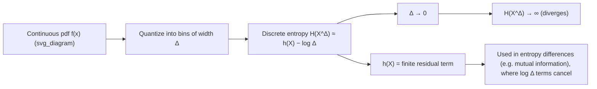

## Differential Entropy

### Definition

For a continuous random variable $X$ with probability density function (pdf) $f(x)$ supported on a set $\mathcal{S} \subseteq \mathbb{R}$, the differential entropy is defined as:

$$h(X) = -\int_{\mathcal{S}} f(x) \log f(x)\, dx$$

This is the continuous analogue of Shannon entropy $H(X) = -\sum_i p_i \log p_i$ for discrete random variables. The integral is taken over the support of $f$, with the convention $0 \log 0 = 0$.

As with discrete entropy, the base of the logarithm sets the unit: base 2 gives bits, base $e$ gives nats. Unless otherwise specified, this material uses base 2.

For a joint density $f(x, y)$ over random variables $X$ and $Y$, the joint differential entropy is:

$$h(X, Y) = -\int\int f(x,y) \log f(x,y)\, dx\, dy$$

### Why "Differential" Entropy

The name reflects its derivation as a limiting case of discrete entropy. Partition the real line into bins of width $\Delta$, and let $X^\Delta$ be the discretized version of $X$, where $X^\Delta = x_i$ with probability $p_i \approx f(x_i)\Delta$. The discrete entropy of this quantized variable is:

$$H(X^\Delta) \approx -\sum_i f(x_i)\Delta \log(f(x_i)\Delta) = -\sum_i f(x_i)\Delta \log f(x_i) - \log \Delta$$

As $\Delta \to 0$, the first term converges to $h(X)$, but the $-\log \Delta$ term diverges to $+\infty$. This means:

$$H(X^\Delta) \approx h(X) - \log \Delta \to \infty \text{ as } \Delta \to 0$$

The discrete entropy of an infinitely finely quantized continuous variable is infinite — this makes sense, since specifying a real number to infinite precision requires infinite bits. Differential entropy $h(X)$ is what remains after subtracting off this divergent $-\log \Delta$ term. It captures the "shape" of the distribution's uncertainty but discards the absolute reference point that discrete entropy has.

### Fundamental Differences from Discrete Entropy

**Differential entropy can be negative.** Unlike $H(X) \geq 0$ for discrete variables, $h(X)$ has no such floor. A narrow, highly concentrated density can produce $\log f(x) > 0$ over much of its support (since $f(x) > 1$ is possible for continuous densities, unlike discrete probabilities which are bounded by 1), making the integral negative.

**Differential entropy is not invariant under change of variables.** If $Y = g(X)$ for an invertible, differentiable $g$, then:

$$h(Y) = h(X) + E\left[\log \left|\frac{dg}{dx}\right|\right]$$

Rescaling a variable changes its differential entropy — a critical distinction from discrete entropy, which is invariant under any relabeling of outcomes. For a scalar scaling $Y = aX$:

$$h(aX) = h(X) + \log|a|$$

**Differential entropy is not an absolute measure of uncertainty in bits.** Because of the issues above, $h(X)$ does not directly represent the number of bits needed to describe $X$ — that quantity is always infinite for a continuous variable at full precision. Differential entropy is best understood as a relative or comparative quantity, meaningful primarily through differences (such as in mutual information) rather than in isolation.

**Key Points**

- $h(X) = -\int f(x) \log f(x)\,dx$, defined only when the integral exists
- Can be negative, zero, or positive — no non-negativity guarantee
- Not invariant under invertible transformations of $X$
- Arises as a finite correction term in the divergent limit of discretized discrete entropy
- Retains usefulness chiefly through entropy differences (e.g., mutual information), where the divergent $-\log \Delta$ terms cancel

### Properties

**Translation invariance.** Shifting a random variable does not change its differential entropy:

$$h(X + c) = h(X) \quad \text{for any constant } c$$

This follows directly from the change-of-variables formula with $g(x) = x + c$, whose derivative is 1.

**Scaling property.** As shown above, for $a \neq 0$:

$$h(aX) = h(X) + \log|a|$$

More generally, for a linear transformation $Y = AX$ of a random vector $X \in \mathbb{R}^n$ with invertible matrix $A$:

$$h(AX) = h(X) + \log|\det A|$$

**Joint entropy and the chain rule.** Analogous to the discrete case:

$$h(X, Y) = h(X) + h(Y \mid X) = h(Y) + h(X \mid Y)$$

where conditional differential entropy is defined as:

$$h(Y \mid X) = -\int\int f(x,y) \log f(y \mid x)\, dx\, dy$$

**Conditioning reduces entropy (on average).** As in the discrete case:

$$h(Y \mid X) \leq h(Y)$$

with equality if and only if $X$ and $Y$ are independent. This follows from the non-negativity of mutual information (covered in the next topic), and unlike marginal differential entropy itself, this inequality direction is preserved from the discrete case.

**Independence and additivity.** If $X_1, \dots, X_n$ are independent:

$$h(X_1, \dots, X_n) = \sum_{i=1}^n h(X_i)$$

**Concavity.** Differential entropy $h(f)$, viewed as a functional of the density $f$, is concave: for densities $f_1, f_2$ and $\lambda \in [0,1]$,

$$h(\lambda f_1 + (1-\lambda) f_2) \geq \lambda h(f_1) + (1-\lambda) h(f_2)$$

### Differential Entropy of Common Distributions

**Uniform distribution** on $[a, b]$, with $f(x) = \frac{1}{b-a}$:

$$h(X) = \log(b - a)$$

Note that for $b - a < 1$, this is negative — a direct illustration that differential entropy can go below zero.

**Gaussian distribution** $X \sim \mathcal{N}(\mu, \sigma^2)$:

$$h(X) = \frac{1}{2} \log(2\pi e \sigma^2)$$

This depends only on the variance, not the mean — consistent with translation invariance. This result generalizes to the multivariate Gaussian $X \sim \mathcal{N}(\boldsymbol{\mu}, \Sigma)$ in $\mathbb{R}^n$:

$$h(X) = \frac{1}{2} \log\left((2\pi e)^n |\Sigma|\right)$$

**Exponential distribution** with rate $\lambda$, $f(x) = \lambda e^{-\lambda x}$ for $x \geq 0$:

$$h(X) = \log\left(\frac{e}{\lambda}\right) = 1 - \log \lambda \quad \text{(in nats; convert as needed)}$$

**Laplace distribution** with scale $b$, $f(x) = \frac{1}{2b} e^{-|x|/b}$:

$$h(X) = \log(2eb)$$

### Maximum Entropy Property of the Gaussian

Among all continuous distributions with a fixed variance $\sigma^2$, the Gaussian distribution maximizes differential entropy. This is a cornerstone result: it establishes the Gaussian as the "most uncertain" or "least structured" distribution for a given second moment, which is why Gaussian noise represents the worst-case (most capacity-limiting) additive noise for a fixed power constraint — a fact used directly in Shannon's capacity formula for the AWGN channel.

More generally, subject to different constraints, other distributions emerge as maximum-entropy solutions: the uniform distribution maximizes entropy on a bounded interval with no other constraints, and the exponential distribution maximizes entropy on $[0, \infty)$ subject to a fixed mean.

### Visualizing the Divergence Term

The following diagram illustrates why differential entropy is a relative quantity: as bin width $\Delta$ shrinks, discrete entropy of the quantized variable grows without bound, while differential entropy remains the finite, stable term left behind.

### Worked Example

**Example**

Compute the differential entropy of $X \sim \mathcal{N}(0, 4)$ (i.e., $\sigma^2 = 4$), in bits.

Using the Gaussian formula:

$$h(X) = \frac{1}{2}\log_2(2\pi e \sigma^2) = \frac{1}{2}\log_2(2\pi e \cdot 4)$$

$$= \frac{1}{2}\log_2(8\pi e) \approx \frac{1}{2}\log_2(68.3) \approx \frac{1}{2}(6.09) \approx 3.05 \text{ bits}$$

Compare this to $X' \sim \mathcal{N}(0, 1)$:

$$h(X') = \frac{1}{2}\log_2(2\pi e) \approx 2.05 \text{ bits}$$

The difference, $h(X) - h(X') = \frac{1}{2}\log_2(4) = 1$ bit, matches the scaling property exactly, since $X = 2X'$ in distribution and $\log_2|2| = 1$.

### Common Pitfalls

- Treating $h(X) < 0$ as an error rather than a valid outcome for narrow, concentrated densities.
- Assuming $h(X)$ is invariant under variable substitution — always reapply the Jacobian correction term when changing coordinates.
- Interpreting $h(X)$ as "the number of bits to store $X$" — this conflates differential entropy with quantized discrete entropy, which additionally requires the $-\log \Delta$ correction and depends on the chosen precision.
- Comparing differential entropies across variables with different units without accounting for the scaling property (e.g., comparing $h(X)$ in meters to $h(Y)$ in centimeters directly).

**Related Topics**

- Mutual information for continuous random variables
- Relative entropy (KL divergence) between continuous distributions
- Maximum entropy distributions under general moment constraints
- Differential entropy and the AWGN channel capacity theorem
- Asymptotic equipartition property (AEP) for continuous sources
- Rate-distortion theory for continuous sources