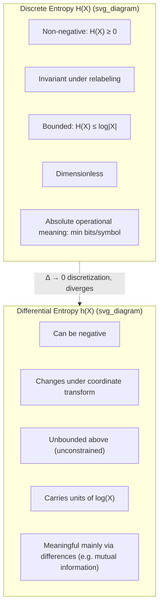

## Discrete vs. Differential Entropy

### Overview

Discrete entropy $H(X)$ and differential entropy $h(X)$ share a common notational and conceptual ancestry — both are called "entropy," both use the $-\sum$ or $-\int f \log f$ form, and both quantify uncertainty. But they are fundamentally different mathematical objects with different units, different guarantees, and different interpretations. Conflating them is one of the most common sources of error when moving between discrete and continuous information theory.

### Side-by-Side Definitions

For a discrete random variable $X$ with pmf $p(x)$ over a countable alphabet $\mathcal{X}$:

$$H(X) = -\sum_{x \in \mathcal{X}} p(x) \log p(x)$$

For a continuous random variable $X$ with pdf $f(x)$ over support $\mathcal{S} \subseteq \mathbb{R}$:

$$h(X) = -\int_{\mathcal{S}} f(x) \log f(x)\, dx$$

The formal similarity is deliberate — differential entropy was defined by analogy — but the analogy breaks down in several structural ways detailed below.

### Key Structural Differences

**Key Points**

- $H(X)$ is always non-negative; $h(X)$ can be negative, zero, or positive
- $H(X)$ is invariant under any relabeling of outcomes; $h(X)$ changes under change of variables
- $H(X)$ has an absolute operational meaning (expected code length in bits); $h(X)$ does not, on its own
- $H(X)$ is dimensionless; $h(X)$ carries units tied to the units of $X$
- $H(X) \leq \log|\mathcal{X}|$ when $\mathcal{X}$ is finite (bounded above); $h(X)$ has no such universal bound
- Both obey a chain rule and both are reduced (on average) by conditioning

### Non-Negativity

$H(X) \geq 0$ always, because each $p(x) \in [0, 1]$ implies $-\log p(x) \geq 0$, and entropy is a sum of non-negative terms weighted by non-negative probabilities. Equality $H(X) = 0$ holds exactly when $X$ is deterministic.

For $h(X)$, no such guarantee exists. Because a continuous density $f(x)$ can exceed 1 (probabilities are areas under the curve, not point masses, so there is no upper bound of 1 on $f$), the integrand $f(x)\log f(x)$ can be positive over regions where $f(x) > 1$, driving the overall integral negative. A distribution concentrated tightly enough will have negative differential entropy — this is not a pathological edge case but a routine occurrence for narrow densities.

**Example**

$X \sim \text{Uniform}(0, 0.5)$ has $f(x) = 2$ on $[0, 0.5]$, giving:

$$h(X) = \log(0.5 - 0) = \log(0.5) = -1 \text{ bit}$$

A negative entropy value, which has no discrete counterpart.

### Invariance Under Transformation

$H(X)$ depends only on the probability masses $p(x)$, not on the labels or numerical values attached to outcomes. Relabeling outcomes (e.g., mapping "heads" to 0 and "tails" to 1, versus 1 and 0) leaves $H(X)$ unchanged, because entropy is a functional of the probability mass function alone, independent of the underlying sample space's structure.

$h(X)$ depends on the actual real-valued structure of $X$, because the density $f(x)$ is defined with respect to Lebesgue measure on $\mathbb{R}$, and rescaling the variable rescales the density. For invertible differentiable $g$:

$$h(g(X)) = h(X) + E\left[\log\left|\frac{dg}{dx}\right|\right]$$

This means $h(X)$ is not a property of the "shape" of uncertainty alone — it also encodes the coordinate system in which $X$ is measured. Two densities that are literally rescaled versions of each other (e.g., measuring length in meters vs. centimeters) have different differential entropies despite representing "the same" physical randomness.

### Operational Meaning

$H(X)$ has a direct operational interpretation via the source coding theorem: it is the infimum of the expected number of bits per symbol needed to losslessly encode i.i.d. draws of $X$, achievable in the limit of long block lengths. This is a concrete, achievable, absolute quantity.

$h(X)$ has no equivalent absolute interpretation. As established in the discretization argument, the number of bits needed to represent a continuous value to arbitrary precision is infinite; $h(X)$ is only the finite part left over after the divergent precision-dependent term is subtracted out. $h(X)$ becomes operationally meaningful primarily in differences — most importantly in mutual information $I(X;Y) = h(X) - h(X|Y)$, where the divergent $-\log \Delta$ terms from both sides cancel, leaving a finite, well-defined, and non-negative quantity that retains the same interpretation as discrete mutual information (in fact, mutual information between continuous variables, or between a continuous and discrete variable, is always non-negative — unlike differential entropy itself).

### Units and Dimensional Analysis

$H(X)$ is dimensionless (bits, nats, or dits are unit labels for the logarithm base, not physical units) because it is built from unitless probabilities.

$h(X)$ carries the units of $\log(\text{units of } X)$. Formally, since $f(x)$ has units of $1/[\text{units of }X]$ (density integrates to the dimensionless value 1), $\log f(x)$ is only well-defined once $f(x)$ is treated as implicitly divided by a reference unit density. Practically, this shows up as: measuring $X$ in meters versus centimeters shifts $h(X)$ by $\log(100)$, per the scaling property. This is why raw differential entropy values are not comparable across different measurement scales without adjustment.

### Boundedness

For a finite discrete alphabet of size $|\mathcal{X}| = n$, entropy is maximized by the uniform distribution and satisfies:

$$0 \leq H(X) \leq \log n$$

This gives a hard ceiling determined purely by the alphabet size.

$h(X)$ has no analogous universal upper bound in general — for a fixed variance, the Gaussian maximizes $h(X)$ at $\frac{1}{2}\log(2\pi e \sigma^2)$, but $\sigma^2$ itself is unbounded, so $h(X)$ can be made arbitrarily large by spreading the distribution out. Only under an explicit constraint (fixed variance, fixed support, fixed mean on a half-line, etc.) does a maximum-entropy bound exist, and the bound depends on which constraint is imposed.

### What Is Preserved

Despite these differences, several structural properties carry over intact:

- **Chain rule**: $H(X,Y) = H(X) + H(Y|X)$ and $h(X,Y) = h(X) + h(Y|X)$ hold in parallel form.
- **Conditioning reduces entropy on average**: $H(Y|X) \leq H(Y)$ and $h(Y|X) \leq h(Y)$, both with equality iff independence.
- **Additivity under independence**: entropy of independent components sums, in both cases.
- **Concavity**: both $H(p)$ (as a function of the pmf) and $h(f)$ (as a functional of the density) are concave.
- **Mutual information**: $I(X;Y) = H(X) - H(X|Y)$ in the discrete case and $I(X;Y) = h(X) - h(X|Y)$ in the continuous case are both well-defined, finite, and non-negative — this is the key quantity that survives the transition from discrete to continuous cleanly.

### Visual Comparison

### The Bridge: Quantized Continuous Entropy

The precise relationship connecting the two, from the discretization derivation, is:

$$H(X^\Delta) \approx h(X) - \log \Delta$$

This equation is the Rosetta Stone between the two frameworks: it shows that discrete entropy of a finely quantized continuous variable is differential entropy plus a term that depends only on quantization resolution, not on the shape of the distribution. As $\Delta \to 0$, $-\log \Delta \to \infty$, confirming that infinite-precision discrete entropy is unbounded — while $h(X)$ remains the finite, resolution-independent residual.

[Inference] In practical digital systems where continuous signals are quantized to a fixed number of bits (e.g., ADC resolution), this relationship implies that the effective discrete entropy of the quantized signal is approximately $h(X) + n$ bits for an $n$-bit uniform quantizer over a unit range, though exact behavior depends on the quantizer's design and the signal's dynamic range relative to the quantization step.

### Common Pitfalls

- Assuming a negative $h(X)$ indicates a computational error — it does not; it is expected behavior for concentrated densities.
- Directly comparing $H(X)$ (bits) to $h(Y)$ (bits, but dimensionally tied to units of $Y$) as though they measure the same kind of quantity.
- Assuming $h(X) \leq h(X')$ implies $X$ is "more predictable" than $X'$ in the same operational sense that $H(X) \leq H(X')$ would imply for discrete variables — without accounting for units and transformation dependence, this comparison can be misleading.
- Forgetting that mutual information, not entropy alone, is the quantity that transfers its full operational meaning (e.g., channel capacity bounds) from the discrete to the continuous setting.

**Related Topics**

- Mutual information for continuous random variables
- Quantization and rate-distortion theory
- KL divergence between continuous distributions
- Channel capacity for continuous (AWGN) channels
- Asymptotic equipartition property (AEP) in continuous settings