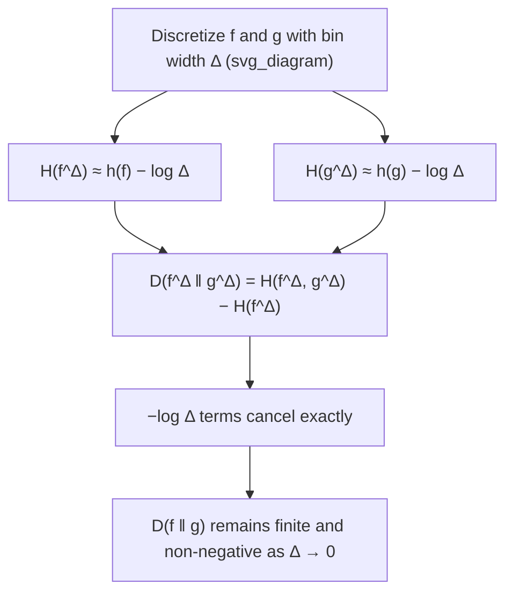

## Relative Entropy for Continuous Distributions

### Definition

For two continuous random variables (or, more precisely, two probability densities) $f(x)$ and $g(x)$ defined over the same support $\mathcal{S} \subseteq \mathbb{R}$, the relative entropy — also called Kullback-Leibler (KL) divergence — of $f$ with respect to $g$ is:

$$D(f \parallel g) = \int_{\mathcal{S}} f(x) \log \frac{f(x)}{g(x)}\, dx$$

This is the direct continuous analogue of discrete KL divergence:

$$D(p \parallel q) = \sum_{x} p(x) \log \frac{p(x)}{q(x)}$$

with sums replaced by integrals and pmfs replaced by pdfs. $D(f \parallel g)$ measures how much the density $f$ diverges from a reference density $g$ — it is often interpreted as the expected number of extra bits needed to encode samples from $f$ using a code optimized for $g$.

The expression $E_f\left[\log \frac{f(X)}{g(X)}\right]$ is an equivalent way to write $D(f \parallel g)$, making explicit that it is an expectation taken under $f$.

### Requirement: Absolute Continuity

$D(f \parallel g)$ is well-defined only when $f$ is absolutely continuous with respect to $g$, meaning $g(x) = 0 \implies f(x) = 0$ almost everywhere. If there is a region where $g(x) = 0$ but $f(x) > 0$, the ratio $f(x)/g(x)$ is undefined (division by zero) and $D(f \parallel g)$ is conventionally taken to be $+\infty$. Intuitively: if $g$ assigns zero density to an outcome that $f$ considers possible, no finite code built around $g$ can ever encode that outcome, so the "extra cost" is infinite.

### Fundamental Properties

**Non-negativity (Gibbs' inequality).** For any two valid densities $f$ and $g$ over the same support:

$$D(f \parallel g) \geq 0$$

with equality if and only if $f(x) = g(x)$ almost everywhere. This is proven via Jensen's inequality applied to the concave function $\log$:

$$-D(f \parallel g) = \int f(x) \log \frac{g(x)}{f(x)}\, dx \leq \log \int f(x) \cdot \frac{g(x)}{f(x)}\, dx = \log \int g(x)\, dx = \log 1 = 0$$

This is one of the properties that transfers cleanly and exactly from the discrete case — unlike differential entropy itself, $D(f \parallel g)$ retains the full non-negativity guarantee, because the divergent $-\log \Delta$ quantization terms present in $h(X)$ appear identically in both $f$'s and $g$'s discretized entropies and cancel in the ratio.

**Asymmetry.** In general, $D(f \parallel g) \neq D(g \parallel f)$. Relative entropy is not a true metric — it fails symmetry and the triangle inequality — though it is still useful as a directed measure of divergence. The choice of which distribution is the "reference" ($g$) versus the "true" or "data" distribution ($f$) matters and changes the value.

**Invariance under invertible transformations.** Unlike differential entropy alone, $D(f \parallel g)$ is invariant under any invertible, differentiable change of variables $Y = \phi(X)$:

$$D(f_Y \parallel g_Y) = D(f_X \parallel g_X)$$

This is because the Jacobian factor introduced by the transformation appears identically in both $f_Y$ and $g_Y$ (via the standard density transformation formula) and cancels inside the log-ratio $\log(f_Y/g_Y)$. This invariance is a major reason relative entropy is often considered more fundamental than differential entropy itself — it does not suffer from the coordinate-dependence problem.

**Convexity.** $D(f \parallel g)$ is jointly convex in the pair $(f, g)$: for two pairs of densities $(f_1, g_1)$ and $(f_2, g_2)$, and $\lambda \in [0,1]$:

$$D(\lambda f_1 + (1-\lambda)f_2 \,\|\, \lambda g_1 + (1-\lambda)g_2) \leq \lambda D(f_1 \| g_1) + (1-\lambda) D(f_2 \| g_2)$$

### Relation to Differential Entropy and Cross-Entropy

Expanding the definition:

$$D(f \parallel g) = \int f(x) \log f(x)\, dx - \int f(x) \log g(x)\, dx = -h(f) + h(f, g)$$

where $h(f,g) = -\int f(x) \log g(x)\,dx$ is the cross-entropy of $f$ relative to $g$. Rearranged:

$$h(f, g) = h(f) + D(f \parallel g)$$

This mirrors the discrete relationship exactly and shows why $D(f\|g) \geq 0$ implies $h(f,g) \geq h(f)$: encoding with the wrong reference distribution $g$ never does better, on average, than encoding with the true distribution $f$.

### Relation to Mutual Information

Mutual information between continuous $X$ and $Y$ can be written directly as a relative entropy:

$$I(X;Y) = D\big(f(x,y) \,\|\, f(x)f(y)\big) = \int\int f(x,y) \log \frac{f(x,y)}{f(x)f(y)}\, dx\, dy$$

This expresses mutual information as the KL divergence between the true joint density and the product of marginals (the density under the independence hypothesis). Because $D(\cdot \| \cdot) \geq 0$ always, this immediately gives $I(X;Y) \geq 0$ for continuous variables, with equality iff $X \perp Y$ — the same non-negativity that fails to transfer for differential entropy transfers perfectly here, because mutual information is fundamentally a relative-entropy quantity, not a raw entropy quantity.

### KL Divergence Between Two Gaussians

A widely used closed form. For $f \sim \mathcal{N}(\mu_1, \sigma_1^2)$ and $g \sim \mathcal{N}(\mu_2, \sigma_2^2)$:

$$D(f \parallel g) = \log\frac{\sigma_2}{\sigma_1} + \frac{\sigma_1^2 + (\mu_1 - \mu_2)^2}{2\sigma_2^2} - \frac{1}{2} \quad \text{(in nats)}$$

For the multivariate case, $f \sim \mathcal{N}(\boldsymbol{\mu}_1, \Sigma_1)$ and $g \sim \mathcal{N}(\boldsymbol{\mu}_2, \Sigma_2)$ in $\mathbb{R}^n$:

$$D(f \parallel g) = \frac{1}{2}\left[\log\frac{|\Sigma_2|}{|\Sigma_1|} - n + \text{tr}(\Sigma_2^{-1}\Sigma_1) + (\boldsymbol{\mu}_2 - \boldsymbol{\mu}_1)^T \Sigma_2^{-1} (\boldsymbol{\mu}_2 - \boldsymbol{\mu}_1)\right]$$

**Example**

Compute $D(f \parallel g)$ (in nats) for $f \sim \mathcal{N}(0, 1)$ and $g \sim \mathcal{N}(2, 4)$.

Here $\mu_1 = 0, \sigma_1^2 = 1, \mu_2 = 2, \sigma_2^2 = 4$, so $\sigma_1 = 1, \sigma_2 = 2$:

$$D(f \parallel g) = \log\frac{2}{1} + \frac{1 + (0-2)^2}{2 \cdot 4} - \frac{1}{2} = \log 2 + \frac{1+4}{8} - \frac{1}{2}$$

$$= 0.693 + 0.625 - 0.5 = 0.818 \text{ nats}$$

Checking the reverse direction confirms asymmetry: $D(g \parallel f) = \log\frac{1}{2} + \frac{4 + (2-0)^2}{2 \cdot 1} - \frac{1}{2} = -0.693 + 4 - 0.5 = 2.807$ nats — a substantially different value, as expected.

### Key Points

- $D(f \parallel g) = \int f(x) \log\frac{f(x)}{g(x)}dx \geq 0$, with equality iff $f = g$ almost everywhere
- Requires absolute continuity of $f$ with respect to $g$; otherwise $D(f\|g) = \infty$
- Asymmetric: $D(f\|g) \neq D(g\|f)$ in general — not a true distance metric
- Invariant under invertible change of variables, unlike differential entropy alone
- Continuous mutual information is a special case: $I(X;Y) = D(f(x,y) \| f(x)f(y)) \geq 0$
- Closed-form expressions exist for common families (Gaussian shown above; also exponential, Laplace, etc.)

### Why Relative Entropy Survives Where Differential Entropy Does Not

The $-\log \Delta$ divergence that makes standalone differential entropy an ill-behaved, coordinate-dependent quantity appears identically in both the numerator and denominator of the discretized KL divergence and cancels exactly. This is the structural reason relative entropy — not differential entropy — is the quantity that generalizes most robustly from discrete to continuous settings, and why mutual information (built from relative entropy) is similarly well-behaved.

### Common Pitfalls

- Treating $D(f\|g)$ as symmetric or as a true distance — always specify direction.
- Applying the KL formula when $g$ has zero density on part of $f$'s support without checking absolute continuity — the divergence is infinite there, not merely large.
- Confusing cross-entropy $h(f,g)$ with relative entropy $D(f\|g)$ — they differ by $h(f)$, and only $D(f\|g)$ is guaranteed non-negative down to zero at equality; cross-entropy itself has no such fixed lower reference point independent of $f$.
- Assuming closed-form KL results (like the Gaussian formula) hold for other distribution pairs without rederiving — most pairs require direct integration or numerical methods.

**Related Topics**
- Continuous mutual information and its properties
- Jensen-Shannon divergence for continuous distributions
- f-divergences as a generalization of KL divergence
- KL divergence in variational inference and the ELBO
- Channel capacity via mutual information maximization (AWGN channel)
