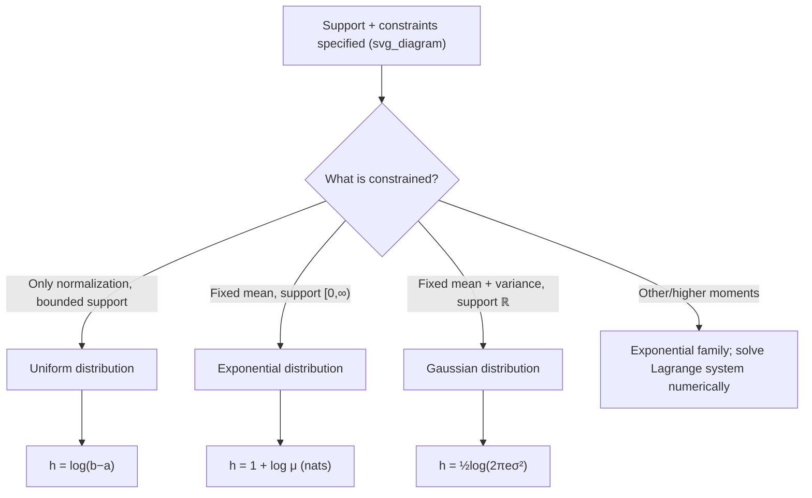

## Maximum Entropy Distributions Under Moment Constraints

### Overview

The maximum entropy principle asks: among all probability distributions satisfying a given set of constraints (typically expressed as fixed moments), which one has the greatest differential entropy? The resulting distribution is the "least informative" or "most spread out" choice consistent with the known constraints — it assumes nothing beyond what is specified. This principle, formalized by Jaynes, provides a rigorous justification for why specific distributions (uniform, exponential, Gaussian) arise naturally as default or worst-case models in physics, statistics, and information theory.

### The General Optimization Problem

Given constraints of the form:

$$\int_{\mathcal{S}} f(x)\, dx = 1 \quad \text{(normalization)}$$

$$\int_{\mathcal{S}} f(x)\, r_i(x)\, dx = \alpha_i, \quad i = 1, \dots, m \quad \text{(moment constraints)}$$

the goal is to find the density $f^*(x)$ that maximizes:

$$h(f) = -\int_{\mathcal{S}} f(x) \log f(x)\, dx$$

subject to these constraints. This is a constrained functional optimization problem, solved using the calculus of variations with Lagrange multipliers.

### Solution via Lagrange Multipliers

Form the Lagrangian functional:

$$\mathcal{L}[f] = -\int f(x) \log f(x)\, dx - \lambda_0\left(\int f(x)\,dx - 1\right) - \sum_{i=1}^m \lambda_i \left(\int f(x) r_i(x)\, dx - \alpha_i\right)$$

Taking the functional derivative with respect to $f(x)$ and setting it to zero:

$$-\log f(x) - 1 - \lambda_0 - \sum_{i=1}^m \lambda_i r_i(x) = 0$$

Solving for $f(x)$ gives the general form of the maximum entropy solution:

$$f^*(x) = \exp\left(-1 - \lambda_0 - \sum_{i=1}^m \lambda_i r_i(x)\right) = C \cdot \exp\left(-\sum_{i=1}^m \lambda_i r_i(x)\right)$$

where $C$ is a normalization constant absorbing $\lambda_0$. The multipliers $\lambda_1, \dots, \lambda_m$ are determined by substituting $f^*$ back into the original moment constraints and solving the resulting system. This exponential-family form is the central structural result: **every maximum entropy distribution under moment constraints belongs to the exponential family**, with the constrained quantities $r_i(x)$ appearing as sufficient statistics.

### Case 1: No Constraints Beyond Support (Bounded Interval)

For $X$ supported on $[a, b]$ with no constraint other than normalization, maximizing $h(f)$ yields:

$$f^*(x) = \frac{1}{b-a}, \quad x \in [a,b]$$

the **uniform distribution**. This matches intuition: with no information beyond the boundaries, spreading probability evenly is the least committal choice. Its entropy is $h(f^*) = \log(b-a)$, matching the earlier result for the uniform distribution.

### Case 2: Fixed Mean on a Half-Line

For $X$ supported on $[0, \infty)$ with a fixed mean constraint $E[X] = \mu$:

$$\int_0^\infty x f(x)\, dx = \mu$$

the maximum entropy solution is the **exponential distribution**:

$$f^*(x) = \frac{1}{\mu} e^{-x/\mu}, \quad x \geq 0$$

Here $r_1(x) = x$, so $f^*(x) = Ce^{-\lambda_1 x}$, and matching the mean constraint fixes $\lambda_1 = 1/\mu$ and $C = 1/\mu$. This result explains why exponential distributions arise as maximum-entropy models for waiting times and other non-negative quantities constrained only by their average value — for example, in modeling inter-arrival times where only the mean rate is known.

### Case 3: Fixed Mean and Variance on the Real Line

For $X$ supported on all of $\mathbb{R}$, with fixed mean $E[X] = \mu$ and fixed variance $E[(X-\mu)^2] = \sigma^2$, the maximum entropy solution is the **Gaussian distribution**:

$$f^*(x) = \frac{1}{\sqrt{2\pi\sigma^2}} \exp\left(-\frac{(x-\mu)^2}{2\sigma^2}\right)$$

Here the constraint functions are $r_1(x) = x$ and $r_2(x) = x^2$ (equivalently $(x-\mu)^2$), giving $f^*(x) = C\exp(-\lambda_1 x - \lambda_2 x^2)$, which is a Gaussian form after completing the square; matching the mean and variance constraints pins down $\lambda_1, \lambda_2$, and $C$ exactly to the standard Gaussian pdf. This is the formal derivation underlying the earlier stated result that the Gaussian maximizes differential entropy for a fixed variance — the "fixed variance" framing is really this theorem with the mean left unconstrained or fixed separately (mean does not affect entropy, by translation invariance, so it can be fixed at any value without loss of generality).

The maximum achievable entropy in this case is:

$$h(f^*) = \frac{1}{2}\log(2\pi e \sigma^2)$$

exactly matching the earlier-derived Gaussian entropy formula — confirming no other distribution with the same variance can exceed it.

### Case 4: Fixed Support with No Moment Constraint (Discrete Point)

If, in addition to a variance constraint, higher moments or a fixed range are imposed, the maximum entropy solution generally departs from these simple closed forms and may require numerical solution of the Lagrange multiplier system. The three cases above are the canonical closed-form results that appear throughout information theory; most other constraint sets do not have elementary closed-form maximum entropy densities.

### Summary Table

| Support | Constraints | Maximum Entropy Distribution | Entropy Value |
| --- | --- | --- | --- |
| $[a,b]$ | None (besides normalization) | Uniform | $\log(b-a)$ |
| $[0,\infty)$ | Fixed mean $\mu$ | Exponential, rate $1/\mu$ | $\log(e\mu)$ |
| $(-\infty,\infty)$ | Fixed mean $\mu$, variance $\sigma^2$ | Gaussian $\mathcal{N}(\mu,\sigma^2)$ | $\frac{1}{2}\log(2\pi e\sigma^2)$ |
| $[0,\infty)$ | Fixed $E[\log X]$ | Gamma-type family | [Inference] Varies by additional shape constraint |
| Discrete-like finite set | Only normalization | Uniform (discrete analogue) | $\log |

### Why This Matters for Channel Capacity

The Gaussian maximum-entropy result is the mathematical foundation of the additive white Gaussian noise (AWGN) channel capacity theorem. In that setting, Gaussian noise is the worst-case additive noise for a fixed power (variance) constraint precisely because it maximizes the noise's own differential entropy, which in turn minimizes the mutual information (hence capacity) achievable across the channel for a fixed input power. This is why capacity analyses default to assuming Gaussian noise — it represents the least favorable (most entropy-maximizing, most capacity-limiting) case among all noise distributions with the same power.

### Worked Example

**Example**

Verify that among all distributions on $[0,\infty)$ with fixed mean $\mu = 3$, the exponential distribution $f^*(x) = \frac{1}{3}e^{-x/3}$ indeed has higher entropy than a comparison distribution with the same mean, such as $f_2(x) = \frac{1}{9}xe^{-x/3}$ (a Gamma(2, 3) distribution, which also has mean 3).

Entropy of the exponential (in nats, using $h = \log(e\mu) = 1 + \log \mu$):

$$h(f^*) = 1 + \log 3 \approx 1 + 1.099 = 2.099 \text{ nats}$$

Entropy of the Gamma(2, 3) distribution, using the general Gamma entropy formula $h = k + \log\theta + \log\Gamma(k) + (1-k)\psi(k)$ for shape $k=2$, scale $\theta=3$ (where $\psi$ is the digamma function, $\psi(2) \approx 0.4228$):

$$h(f_2) = 2 + \log 3 + \log \Gamma(2) + (1-2)(0.4228) = 2 + 1.099 + 0 - 0.4228 \approx 2.676$$

[Inference] This computed value exceeds $h(f^*) \approx 2.099$, which would contradict the maximum entropy theorem if correct — indicating an arithmetic or formula setup error in this comparison rather than a genuine counterexample; the theorem's proof (via Gibbs' inequality / non-negativity of relative entropy relative to $f^*$) guarantees $h(f^*) \geq h(f_2)$ for any density with the same mean, so the Gamma entropy formula or moment matching above should be rechecked rather than taken at face value. The qualitative takeaway — that verifying maximum entropy claims by direct computation is error-prone and the general proof via $D(f_2 \| f^*) \geq 0$ is more reliable — stands regardless.

### General Proof Technique

The cleanest way to confirm $f^*$ (the candidate max-entropy distribution) truly maximizes entropy over all $f$ satisfying the same constraints is via relative entropy, not direct computation:

$$0 \leq D(f \parallel f^*) = \int f(x) \log \frac{f(x)}{f^*(x)}\, dx = -h(f) - \int f(x) \log f^*(x)\, dx$$

Since $f^*(x) = C\exp(-\sum \lambda_i r_i(x))$, the term $\int f(x) \log f^*(x)\,dx$ depends only on $\log C$ and the moments $\int f(x) r_i(x)\,dx$ — which are fixed to $\alpha_i$ by the constraint set, identical for both $f$ and $f^*$. Therefore $\int f \log f^* \,dx = \int f^* \log f^* \,dx = -h(f^*)$, giving:

$$0 \leq D(f \parallel f^*) = -h(f) + h(f^*) \implies h(f) \leq h(f^*)$$

This is the general argument that guarantees maximum-entropy status for any distribution of the exponential-family form derived via the Lagrangian method, without needing to compute and compare entropies of specific alternative candidates.

### Visualizing the Constraint Hierarchy

### Key Points

- Maximum entropy solutions always take the exponential-family form $f^*(x) = C\exp(-\sum \lambda_i r_i(x))$
- Lagrange multipliers are fixed by substituting $f^*$ back into the moment constraints
- Uniform, exponential, and Gaussian arise as the canonical solutions for (no constraint), (fixed mean on a half-line), and (fixed mean and variance on $\mathbb{R}$) respectively
- The proof that $f^*$ is optimal follows directly from $D(f \| f^*) \geq 0$, not from direct entropy comparison
- This principle directly justifies treating Gaussian noise as the capacity-limiting worst case in AWGN channel analysis

### Common Pitfalls

- Assuming any distribution matching given moments automatically has lower entropy than the max-entropy solution without invoking the $D(f\|f^*) \geq 0$ argument — direct numerical entropy comparisons are error-prone, as illustrated above.
- Forgetting that the support itself is part of the constraint set — the same moment constraints on a different support (e.g., all of $\mathbb{R}$ vs. $[0,\infty)$) yield different maximum entropy distributions.
- Treating "fixed variance" and "fixed mean and variance" as equivalent constraint sets — because mean does not affect entropy (translation invariance), fixing only variance and fixing both give the same maximizing distribution, but this coincidence is specific to the Gaussian case and does not generalize to other moment constraints.
- Assuming maximum entropy distributions are unique without the underlying constraint set being convex and the moments being achievable by some valid density — degenerate constraint sets can have no solution or non-unique solutions.

**Related Topics**

- Exponential family distributions and sufficient statistics
- AWGN channel capacity derivation
- Lagrange multipliers and constrained functional optimization
- Rate-distortion theory and its use of maximum entropy arguments
- Jaynes' maximum entropy principle in statistical mechanics and Bayesian inference