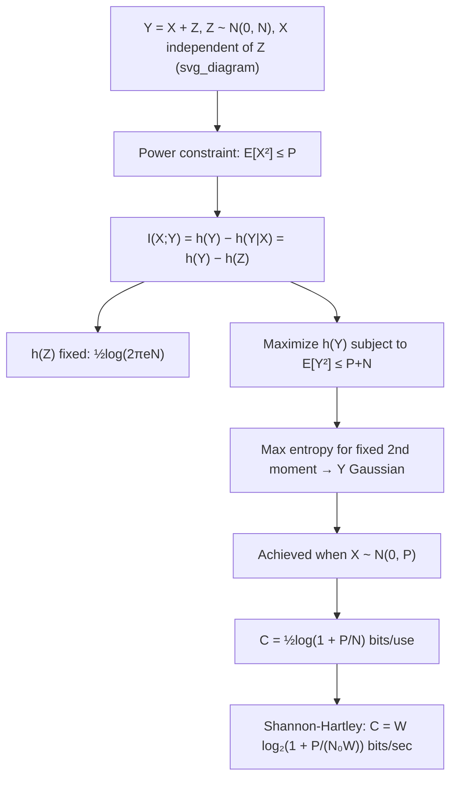

## Gaussian Channel Model

### Definition

The Gaussian channel is the canonical continuous-alphabet communication channel model, in which a real-valued input $X$ is corrupted by additive noise $Z$ drawn independently from a Gaussian (normal) distribution, producing output $Y$:

$$Y = X + Z, \quad Z \sim \mathcal{N}(0, N)$$

Here $N$ denotes the noise variance (noise power), and $Z$ is independent of $X$. This is often called the **Additive White Gaussian Noise (AWGN) channel**: "additive" because the noise adds to the signal, "white" because the noise has a flat power spectral density (equal power at all frequencies, implying uncorrelated noise samples over time), and "Gaussian" because each noise sample follows a normal distribution.

### Why Gaussian Noise

Gaussian noise is not merely a convenient mathematical idealization — it is well-motivated physically and information-theoretically:

- **Central Limit Theorem**: many independent, small sources of physical noise (thermal agitation of electrons, quantum effects, interference from many independent sources) sum to produce an approximately Gaussian distribution, regardless of the underlying distribution of each individual contribution.
- **Maximum entropy property**: as established previously, among all noise distributions with a fixed variance (power) $N$, Gaussian noise maximizes differential entropy. This makes it the worst-case, most capacity-limiting noise distribution for a given power constraint, which is why capacity analysis conservatively assumes Gaussian noise.
- **Thermal noise in physical systems**: Johnson-Nyquist thermal noise in resistive electronic components is well-modeled as Gaussian, making it directly applicable to real communication hardware.

### The Power Constraint

Because the input alphabet is continuous (unbounded real numbers), an unconstrained input could carry infinite information — there is no analogue of a finite discrete alphabet size limiting the number of distinguishable input symbols. To make the problem well-posed, an **average power constraint** is imposed on the input:

$$E[X^2] \leq P$$

This constraint reflects physical reality: real transmitters have finite power budgets. Without it, channel capacity would be unbounded, since arbitrarily large input values could be used to encode arbitrarily fine distinctions even in the presence of fixed-variance noise.

### Channel Capacity Derivation

Capacity is defined as the maximum mutual information between input and output, over all input distributions satisfying the power constraint:

$$C = \max_{f(x): E[X^2] \leq P} I(X;Y)$$

Since $Y = X + Z$ with $Z$ independent of $X$:

$$I(X;Y) = h(Y) - h(Y|X)$$

Because $Y = X + Z$ and $Z$ is independent of $X$, conditioning on $X$ leaves only the randomness of $Z$:

$$h(Y|X) = h(X+Z \mid X) = h(Z \mid X) = h(Z)$$

(the last equality holds because $Z \perp X$, so knowing $X$ gives no information about $Z$). Thus:

$$I(X;Y) = h(Y) - h(Z)$$

Since $h(Z) = \frac{1}{2}\log(2\pi e N)$ is fixed by the noise distribution, maximizing $I(X;Y)$ reduces to maximizing $h(Y)$ subject to the implied constraint on $Y$'s second moment. Given $E[X^2] \leq P$ and $Z \sim \mathcal{N}(0,N)$ independent of $X$:

$$E[Y^2] = E[(X+Z)^2] = E[X^2] + 2E[X]E[Z] + E[Z^2] = E[X^2] + N \leq P + N$$

(using $E[Z]=0$ and independence to drop the cross term). By the maximum entropy property, $h(Y)$ is maximized — subject to a fixed second moment $P+N$ — when $Y$ is Gaussian, which occurs precisely when $X$ itself is chosen Gaussian: $X \sim \mathcal{N}(0, P)$. This gives:

$$h(Y)_{\max} = \frac{1}{2}\log\big(2\pi e (P+N)\big)$$

### The Capacity Formula

Substituting back:

$$C = h(Y)_{\max} - h(Z) = \frac{1}{2}\log\big(2\pi e(P+N)\big) - \frac{1}{2}\log(2\pi e N)$$

$$C = \frac{1}{2}\log\left(\frac{P+N}{N}\right) = \frac{1}{2}\log\left(1 + \frac{P}{N}\right) \text{ bits per channel use}$$

This is the celebrated **Shannon-Hartley theorem** result for the discrete-time AWGN channel, where $P/N$ is the signal-to-noise ratio (SNR). Capacity is achieved when the input distribution is Gaussian: $X^* \sim \mathcal{N}(0, P)$.

### Key Points

- Channel model: $Y = X + Z$, $Z \sim \mathcal{N}(0, N)$ independent of $X$
- A power constraint $E[X^2] \leq P$ is required for finite capacity, since continuous input alphabets are otherwise unbounded
- Capacity is achieved by a Gaussian input distribution: $X^* \sim \mathcal{N}(0, P)$
- $C = \frac{1}{2}\log(1 + P/N)$ bits per channel use, a direct function of SNR $= P/N$
- Gaussian noise is the capacity-minimizing (worst-case) choice among noise distributions with fixed variance, by the maximum entropy property

### Continuous-Time Extension: The Shannon-Hartley Theorem

When the channel operates over a continuous-time signal with bandwidth $W$ Hz, sampled at the Nyquist rate $2W$ samples per second, and noise has power spectral density $N_0/2$ (two-sided), the total noise power within bandwidth $W$ is $N = N_0 W$. Applying the per-sample capacity formula and converting from bits per channel use to bits per second (multiplying by $2W$ channel uses per second) yields the full **Shannon-Hartley theorem**:

$$C = W \log_2\left(1 + \frac{P}{N_0 W}\right) \text{ bits per second}$$

This formula is the practical, widely cited form of channel capacity in communications engineering — it directly relates achievable data rate to bandwidth $W$, transmit power $P$, and noise power spectral density $N_0$.

### Behavior at Extremes

**High SNR regime** ($P/N \gg 1$): $C \approx \frac{1}{2}\log(P/N)$, so capacity grows logarithmically with SNR — each doubling of SNR adds a fixed increment to capacity (diminishing returns from raw power increases).

**Low SNR regime** ($P/N \ll 1$): using $\log(1+x) \approx x/\ln 2$ (in bits) for small $x$, $C \approx \frac{P}{2N\ln 2}$, so capacity grows approximately linearly with power — power increases are much more capacity-effective in this regime.

**Bandwidth scaling** (Shannon-Hartley form, $W \to \infty$ with fixed $P$ and $N_0$): capacity approaches a finite limit rather than growing unboundedly:

$$\lim_{W\to\infty} W\log_2\left(1+\frac{P}{N_0 W}\right) = \frac{P}{N_0 \ln 2}$$

[Inference] This limit is derived using $\log_2(1+x) \approx x/\ln 2$ as $x \to 0$ (since $P/(N_0 W) \to 0$ as $W \to \infty$), showing that beyond a certain bandwidth, adding more bandwidth yields negligible capacity gains for fixed power — the channel becomes noise-power-limited rather than bandwidth-limited. This is sometimes referred to as the power-limited regime of the capacity curve.

### Worked Example

**Example**

A channel has bandwidth $W = 1$ MHz, transmit power $P = 10$ mW, and noise power spectral density $N_0 = 10^{-9}$ W/Hz. Compute the channel capacity.

First compute total noise power:

$$N = N_0 W = 10^{-9} \times 10^6 = 10^{-3} \text{ W} = 1 \text{ mW}$$

SNR:

$$\frac{P}{N} = \frac{10 \text{ mW}}{1 \text{ mW}} = 10$$

Capacity:

$$C = W \log_2(1 + 10) = 10^6 \times \log_2(11) \approx 10^6 \times 3.459 \approx 3.459 \text{ Mbps}$$

### Diagram: AWGN Channel and Capacity Derivation

The following diagram traces the logical flow from channel model to capacity formula.

### Common Pitfalls

- Omitting the power constraint and treating capacity as unbounded — without $E[X^2] \leq P$, the maximization has no finite solution, since differential entropy of $X$ (and hence $I(X;Y)$) can be driven arbitrarily high by spreading $X$ over an ever-larger range.
- Assuming any input distribution with variance $P$ achieves capacity — only the Gaussian input $\mathcal{N}(0,P)$ achieves it; other distributions with the same power yield strictly lower mutual information.
- Confusing per-channel-use capacity (bits per use, from the discrete-time formula) with the Shannon-Hartley bits-per-second formula — the conversion requires the sampling rate ($2W$ samples/sec at Nyquist rate) and bandwidth-dependent noise power $N = N_0 W$.
- Treating the Shannon-Hartley capacity as an achievable throughput in real systems without qualification — it is a strict theoretical upper bound; practical systems fall short due to implementation constraints, non-ideal coding, and non-Gaussian or bandlimited practical noise/signal shapes. [Inference] Actual achievable rates in engineered systems are typically discussed as a fraction of this Shannon limit, with the gap depending on the specific modulation and coding scheme used.

**Related Topics**

- Parallel Gaussian channels and water-filling power allocation
- Channel capacity with colored (non-white) Gaussian noise
- Bandwidth-power tradeoff and the Shannon limit
- Coding theorems and achievability/converse proofs for the AWGN channel
- MIMO Gaussian channel capacity
