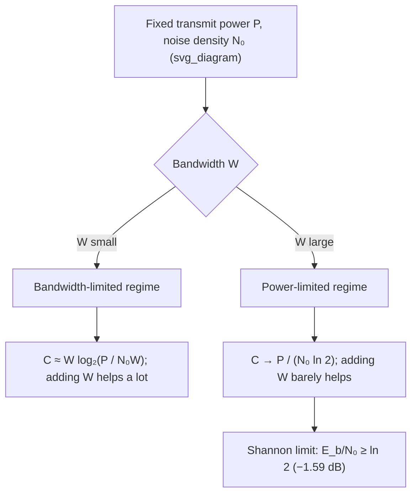

## Shannon-Hartley Theorem and Channel Capacity

### Statement of the Theorem

The Shannon-Hartley theorem gives the capacity of a continuous-time, bandwidth-limited channel corrupted by additive white Gaussian noise:

$$C = W \log_2\left(1 + \frac{P}{N_0 W}\right) \text{ bits per second}$$

where:

- $W$ is the channel bandwidth in Hz
- $P$ is the average transmit signal power in watts
- $N_0$ is the noise power spectral density (two-sided) in watts/Hz
- $N = N_0 W$ is the total noise power within bandwidth $W$
- $P/N$ is the signal-to-noise ratio (SNR)

This theorem establishes $C$ as the supremum of achievable, arbitrarily reliable data rates over the channel — rates below $C$ admit codes with error probability approaching zero as block length grows; rates above $C$ do not, regardless of coding scheme complexity.

### Derivation from the Discrete-Time AWGN Result

The theorem follows from combining two results already established: the per-channel-use Gaussian channel capacity, and the Nyquist sampling theorem.

**Step 1 — Per-sample capacity.** For a discrete-time AWGN channel with per-sample noise variance $N$ and power constraint $P$:

$$C_{\text{per use}} = \frac{1}{2}\log_2\left(1+\frac{P}{N}\right) \text{ bits/channel use}$$

**Step 2 — Sampling rate.** A signal strictly bandlimited to $W$ Hz is fully characterized by samples taken at the Nyquist rate of $2W$ samples per second (Nyquist-Shannon sampling theorem). This gives $2W$ independent channel uses per second.

**Step 3 — Noise power in bandwidth $W$.** With noise power spectral density $N_0/2$ (two-sided) or $N_0$ (one-sided convention) watts/Hz, the total noise power captured within bandwidth $W$ is:

$$N = N_0 W$$

**Step 4 — Combine.** Multiplying the per-use capacity by the number of channel uses per second:

$$C = 2W \times \frac{1}{2}\log_2\left(1 + \frac{P}{N_0 W}\right) = W\log_2\left(1+\frac{P}{N_0 W}\right) \text{ bits/second}$$

recovering the Shannon-Hartley formula.

### Key Points

- $C = W\log_2(1 + P/(N_0 W))$ bits/second is a hard upper bound on reliable communication rate
- Depends on three physical quantities only: bandwidth $W$, signal power $P$, noise spectral density $N_0$
- Achieved in the limit only by Gaussian-distributed channel inputs and asymptotically long, capacity-achieving codes
- Capacity is a supremum of achievable rates, not a guarantee that any particular finite-length code achieves it exactly
- Logarithmic in SNR, linear-ish in bandwidth for large $W$, but saturates at high $W$ due to the interplay between $W$ and $N=N_0W$

### The Bandwidth-Power Tradeoff

The formula reveals an explicit tradeoff: the same capacity $C$ can be achieved through different combinations of bandwidth and power. Two channels with different $(W, P)$ pairs can have identical capacity if:

$$W_1 \log_2\left(1+\frac{P_1}{N_0 W_1}\right) = W_2\log_2\left(1+\frac{P_2}{N_0W_2}\right)$$

This tradeoff underlies practical engineering decisions: bandwidth is often a scarcer, more regulated resource (e.g., licensed spectrum) than power, so systems are frequently designed to trade increased power for reduced bandwidth requirements, or vice versa, depending on which resource is cheaper in a given context. [Inference] The specific exchange rate between power and bandwidth is not linear and depends on the operating point on the capacity curve — near the power-limited regime, extra bandwidth is cheap in capacity terms, while near the bandwidth-limited regime, extra power is cheap in capacity terms.

### Two Limiting Regimes

**Bandwidth-limited regime** (narrow $W$, high $P/N$): capacity is well-approximated by the per-use high-SNR formula:

$$C \approx \frac{W}{1}\log_2\left(\frac{P}{N_0W}\right)$$

Capacity grows only logarithmically with additional power — adding bandwidth is the more effective lever here.

**Power-limited regime** (wide $W$, low $P/(N_0W)$): using the small-argument approximation $\log_2(1+x) \approx x/\ln 2$:

$$C \approx W \cdot \frac{P}{N_0 W \ln 2} = \frac{P}{N_0 \ln 2}$$

Capacity becomes independent of bandwidth and saturates at a value determined only by power and noise spectral density. This is the **Shannon limit** on power efficiency: no matter how much bandwidth is added, capacity cannot exceed $\frac{P}{N_0\ln 2}$ for fixed power $P$.

$$C_{\infty} = \lim_{W\to\infty} W\log_2\left(1+\frac{P}{N_0W}\right) = \frac{P}{N_0\ln 2} \text{ bits/second}$$

### The Shannon Limit and Energy per Bit

A related and widely cited quantity is the minimum energy per bit required for reliable communication, $E_b/N_0$. Writing $P = C \cdot E_b$ (power equals rate times energy-per-bit) and taking the infinite-bandwidth limit of the capacity formula:

$$\frac{E_b}{N_0} \geq \ln 2 \approx 0.693 \implies \frac{E_b}{N_0}\Big|_{\text{dB}} \geq -1.59 \text{ dB}$$

This is the absolute Shannon limit on energy efficiency: no communication scheme, regardless of bandwidth, coding, or modulation, can achieve reliable communication with $E_b/N_0$ below $-1.59$ dB. This bound is a standard benchmark against which real-world modulation and coding schemes (e.g., LDPC, turbo codes) are measured, since modern near-capacity-achieving codes now operate within roughly 1 dB of this limit under specific conditions.

### Diagram: Capacity vs. Bandwidth and Power

### Worked Example

**Example**

A telephone-line channel has bandwidth $W = 3$ kHz and operates at SNR $= 1000$ (30 dB, a typical value for early modem-era analysis). Compute the capacity, then compute the capacity if bandwidth is doubled to 6 kHz with SNR halved to 500 (to keep $P/N_0$ roughly constant given $N = N_0W$ doubling).

Original channel:

$$C_1 = 3000 \times \log_2(1+1000) = 3000 \times \log_2(1001) \approx 3000 \times 9.967 \approx 29{,}901 \text{ bps} \approx 29.9 \text{ kbps}$$

Doubled bandwidth, halved SNR:

$$C_2 = 6000 \times \log_2(1+500) = 6000 \times \log_2(501) \approx 6000 \times 8.969 \approx 53{,}814 \text{ bps} \approx 53.8 \text{ kbps}$$

Even though SNR was halved, doubling bandwidth still nearly doubled capacity — illustrating that in this regime (moderate SNR, not yet deep in the power-limited saturation zone), bandwidth remains an effective lever, since the logarithmic penalty from halved SNR ($\log_2(501)$ vs. roughly half of $\log_2(1001)$'s implied linear scaling) is much smaller than the linear gain from doubled $W$.

### Practical Significance

The Shannon-Hartley theorem is the theoretical ceiling against which all real communication systems (Wi-Fi, cellular, satellite, DSL, fiber-optic with electronic noise limits) are benchmarked. It explains, for instance, why 20th-century dial-up modems converged toward but never exceeded roughly 56 kbps over standard telephone lines (a channel with $W \approx 3.4$ kHz and limited achievable SNR), and it motivates the ongoing search for codes and modulation schemes that close the gap to capacity (turbo codes, LDPC codes, polar codes) rather than exceed it, since exceeding it is proven impossible.

### Common Pitfalls

- Treating $C$ as an exactly achievable data rate rather than a supremum approached only asymptotically by ideal, infinitely long codes.
- Forgetting the factor of 2 relating one-sided and two-sided noise PSD conventions ($N_0$ vs. $N_0/2$) — inconsistent convention use is a common source of factor-of-2 errors in capacity calculations.
- Assuming capacity scales linearly with bandwidth in all regimes — it only approaches a bandwidth-independent ceiling ($P/(N_0\ln2)$) as $W \to \infty$, and scales closer to linearly only in the power-limited region for finite $W$; general behavior is logarithmic, not linear, in most operating regimes.
- Ignoring that the $-1.59$ dB Shannon limit assumes literally infinite bandwidth and idealized Gaussian signaling — practical systems with finite bandwidth face a less favorable, finite-$W$ tradeoff curve, not this asymptotic bound directly.

**Related Topics**

- Nyquist sampling theorem and bandlimited signal representation
- Water-filling algorithm for parallel/colored Gaussian channels
- Capacity-approaching codes: LDPC, turbo codes, polar codes
- Bandwidth efficiency and spectral efficiency metrics (bits/s/Hz)
- MIMO channel capacity and spatial multiplexing gain