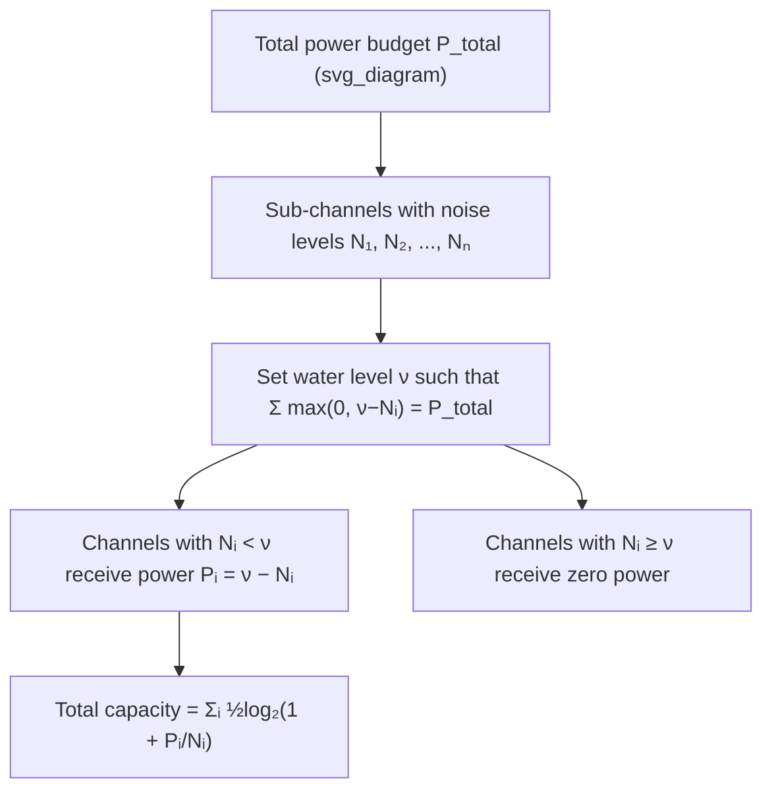

## Power and Bandwidth Constraints

### Overview

Power and bandwidth are the two fundamental resources governing channel capacity in continuous-alphabet, continuous-time communication systems. Both appear directly in the Shannon-Hartley formula $C = W\log_2(1+P/(N_0W))$, but they behave very differently: capacity grows without bound in power in the limit of infinite power (though only logarithmically), while it saturates to a finite ceiling as bandwidth grows without bound for fixed power. Understanding these constraints — individually and in tradeoff — is central to practical system design and to extending the single-channel Gaussian result to more realistic multi-dimensional settings.

### Recap: The Two Constraints in the Capacity Formula

$$C = W\log_2\left(1+\frac{P}{N_0W}\right)$$

- **Power constraint** $P$: enters the capacity formula because it bounds $E[X^2] \leq P$ for the channel input, without which differential entropy — and hence mutual information — is unbounded.
- **Bandwidth constraint** $W$: enters because it limits the number of independent channel uses per second (via Nyquist sampling at rate $2W$) and simultaneously determines the total noise power $N=N_0W$ admitted into the channel.

These two constraints interact rather than acting independently: increasing $W$ both adds more channel uses (helping capacity) and admits more noise power (hurting capacity), which is precisely why capacity saturates rather than growing unboundedly with bandwidth.

### Asymptotic Behavior in Power Alone

Holding $W$ and $N_0$ fixed and letting $P \to \infty$:

$$C = W\log_2\left(1+\frac{P}{N_0W}\right) \to \infty \text{ as } P \to \infty$$

but only logarithmically — doubling $P$ adds a fixed, bandwidth-dependent increment to $C$, not a fixed multiple. This diminishing-returns behavior in power is a direct consequence of the $\log(1+\text{SNR})$ structure of the capacity formula and reflects the underlying maximum-entropy Gaussian result: entropy (and thus mutual information gain) scales as the log of variance, not linearly with it.

### Asymptotic Behavior in Bandwidth Alone

Holding $P$ and $N_0$ fixed and letting $W \to \infty$:

$$\lim_{W\to\infty} W\log_2\left(1+\frac{P}{N_0W}\right) = \frac{P}{N_0\ln 2}$$

Capacity saturates at a finite value — the **infinite-bandwidth (power-limited) capacity** — because as $W$ grows, $P/(N_0W) \to 0$, and the diminishing marginal SNR per unit of added bandwidth exactly offsets the benefit of additional channel uses in the limit. This establishes bandwidth as a resource with strictly diminishing, ultimately vanishing marginal returns, in sharp contrast to power's unbounded (if slow) marginal returns.

### Key Points

- Power and bandwidth both appear in $C=W\log_2(1+P/(N_0W))$, but with fundamentally different asymptotic behavior
- Capacity grows unboundedly (logarithmically) with power; capacity saturates to $P/(N_0\ln2)$ as bandwidth grows
- The interaction term $N=N_0W$ means added bandwidth simultaneously helps (more channel uses) and hurts (more noise) capacity
- Bandwidth-limited and power-limited regimes represent opposite ends of the same tradeoff curve, not separate models
- Spectral efficiency ($C/W$, bits/s/Hz) is the standard metric for comparing systems across different bandwidth allocations

### Spectral Efficiency

A practically important normalized quantity is **spectral efficiency**, capacity per unit bandwidth:

$$\eta = \frac{C}{W} = \log_2\left(1+\frac{P}{N_0W}\right) = \log_2(1+\text{SNR}) \text{ bits/s/Hz}$$

This metric allows fair comparison of systems operating at different bandwidths — e.g., comparing a narrowband system at high SNR to a wideband system at low SNR, based purely on how efficiently each uses its allocated spectrum. High spectral efficiency requires high SNR (bandwidth-limited regime); wideband, low-SNR systems (like spread-spectrum or ultra-wideband systems) deliberately trade spectral efficiency for total capacity or robustness.

### Power-Limited vs. Bandwidth-Limited System Design

**Key Points**
- **Bandwidth-limited systems** (e.g., cable modems, DSL, licensed cellular spectrum): bandwidth is the scarce, expensive, or regulated resource; designs favor high spectral efficiency, often via dense modulation constellations (high-order QAM) that pack more bits per symbol at the cost of requiring higher SNR
- **Power-limited systems** (e.g., deep-space communication, satellite downlinks, battery-powered IoT devices): power is the scarce resource; designs favor low-order modulation and strong error-correction coding to approach the $-1.59$ dB Shannon limit on energy per bit, willingly consuming more bandwidth to do so

[Inference] This classification is a design heuristic rather than a strict dichotomy — most real systems operate somewhere between the two extremes and must jointly optimize modulation order, coding rate, and bandwidth allocation subject to both constraints simultaneously, particularly as available spectrum and power budgets both tighten in modern dense wireless deployments.

### Multiple/Parallel Channels: Water-Filling

When power must be allocated across multiple parallel Gaussian sub-channels (e.g., different frequency bins in an OFDM system, or the eigenmodes of a MIMO channel), each with its own noise level $N_i$, the total capacity-maximizing allocation of a total power budget $P_{\text{total}} = \sum_i P_i$ follows the **water-filling** solution:

$$P_i = \max(0, \, \nu - N_i)$$

where $\nu$ (the "water level") is chosen so that $\sum_i P_i = P_{\text{total}}$. The name comes from the visual analogy of pouring a fixed amount of water over a landscape whose floor height in each channel is set by that channel's noise level $N_i$ — water (power) naturally flows to fill the lowest-noise channels first, and channels whose noise floor exceeds $\nu$ receive zero power (are not used at all).

This generalizes the single-channel power constraint to the realistic multi-dimensional case and is the theoretical basis for practical adaptive bit-loading in OFDM-based systems (DSL, Wi-Fi, LTE/5G).

### Diagram: Water-Filling Power Allocation

### Worked Example

**Example**

Three parallel sub-channels have noise levels $N_1 = 1$, $N_2 = 2$, $N_3 = 4$ (arbitrary units), and a total power budget $P_{\text{total}} = 5$ is to be allocated via water-filling. Find the allocation.

Try including all three channels with a common water level $\nu$:

$$\sum_i (\nu - N_i) = 3\nu - (1+2+4) = 3\nu - 7 = 5 \implies \nu = 4$$

Check: with $\nu = 4$, $P_3 = \nu - N_3 = 4 - 4 = 0$. Channel 3 receives exactly zero power, right at the boundary — consistent with the $\max(0, \cdot)$ formulation, so this solution is valid (not violating non-negativity). Allocation:

$$P_1 = 4 - 1 = 3, \quad P_2 = 4 - 2 = 2, \quad P_3 = 4 - 4 = 0$$

Check total: $3 + 2 + 0 = 5 = P_{\text{total}}$. ✓.

Resulting capacity (per channel use, in bits, base-2 log, using the factor-1/2 discrete-time-per-real-dimension form):

$$C = \frac{1}{2}\log_2\left(1+\frac{3}{1}\right) + \frac{1}{2}\log_2\left(1+\frac{2}{2}\right) + \frac{1}{2}\log_2\left(1+\frac{0}{4}\right)$$

$$= \frac{1}{2}\log_2(4) + \frac{1}{2}\log_2(2) + \frac{1}{2}\log_2(1) = \frac{1}{2}(2) + \frac{1}{2}(1) + 0 = 1 + 0.5 = 1.5 \text{ bits}$$

Channel 3, with the highest noise, is correctly excluded entirely — illustrating the water-filling principle that very noisy sub-channels are better left unused than allocated power that yields little capacity gain.

### Common Pitfalls

- Assuming equal power allocation across sub-channels is optimal — water-filling is generally unequal and can allocate zero power to sufficiently noisy channels.
- Forgetting to check the non-negativity condition when solving for the water level $\nu$ — if a naive equal split produces negative $P_i$ for some channel, that channel must be excluded and $\nu$ recomputed over the remaining channels iteratively.
- Treating power and bandwidth as independently, additively beneficial resources — their interaction through $N = N_0 W$ means bandwidth's marginal benefit depends on the current power and vice versa, not a simple sum of separate effects.
- Conflating spectral efficiency (bits/s/Hz, a rate metric) with total capacity (bits/s, an absolute throughput metric) — a low-spectral-efficiency wideband system can still have higher total capacity than a high-spectral-efficiency narrowband one.

**Related Topics**
- Water-filling in MIMO channel eigenmode power allocation
- OFDM and practical adaptive bit-loading algorithms
- Energy-per-bit and the $-1.59$ dB Shannon limit revisited under real constraints
- Capacity of colored (frequency-dependent) Gaussian noise channels
- Outage capacity and capacity under fading channel conditions

