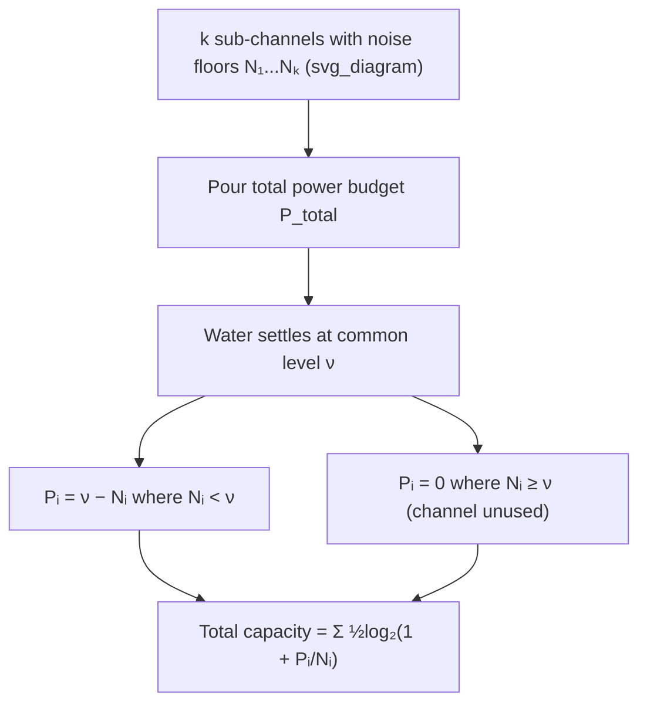

## Parallel Gaussian Channels and Water-Filling

### The Parallel Channel Model

A parallel Gaussian channel consists of $k$ independent, non-interfering Gaussian sub-channels used simultaneously:

$$Y_i = X_i + Z_i, \quad Z_i \sim \mathcal{N}(0, N_i), \quad i = 1, \dots, k$$

where each $Z_i$ is independent across sub-channels, and each sub-channel may have a different noise variance $N_i$. This model arises naturally whenever a communication resource is split into independent dimensions — separate frequency bins in an OFDM system, separate time slots, or the independent eigenmodes obtained by diagonalizing a MIMO channel's covariance structure. Because the sub-channels are independent and non-interfering, this setting extends the single Gaussian channel capacity result to a vector formulation, subject to one shared total power constraint.

### Total Power Constraint

Unlike $k$ separate, unrelated channels, a parallel Gaussian channel setting typically imposes a single joint power budget shared across all sub-channels:

$$\sum_{i=1}^k E[X_i^2] = \sum_{i=1}^k P_i \leq P_{\text{total}}$$

The capacity problem becomes: how should the fixed total power budget $P_{\text{total}}$ be distributed among the $k$ sub-channels — i.e., what is the optimal $(P_1, \dots, P_k)$ — to maximize total mutual information?

### Capacity as a Sum

Because the sub-channels are independent, the total mutual information decomposes as a sum of per-channel mutual informations:

$$I(X_1,\dots,X_k; Y_1,\dots,Y_k) = \sum_{i=1}^k I(X_i;Y_i) = \sum_{i=1}^k \frac{1}{2}\log\left(1+\frac{P_i}{N_i}\right)$$

This follows from the independence of the $(X_i, Z_i)$ pairs across sub-channels, which makes the joint differential entropies additive (as established for independent random variables), causing the cross terms in joint mutual information to vanish. The optimization problem is therefore:

$$\max_{P_1,\dots,P_k \geq 0} \sum_{i=1}^k \frac{1}{2}\log\left(1+\frac{P_i}{N_i}\right) \quad \text{subject to} \quad \sum_{i=1}^k P_i \leq P_{\text{total}}$$

### Solving via Lagrange Multipliers

Form the Lagrangian, incorporating the power constraint and non-negativity of each $P_i$:

$$\mathcal{L} = \sum_i \frac{1}{2}\log\left(1+\frac{P_i}{N_i}\right) - \nu\left(\sum_i P_i - P_{\text{total}}\right)$$

Taking the derivative with respect to $P_i$ and setting it to zero (for $P_i > 0$):

$$\frac{\partial \mathcal{L}}{\partial P_i} = \frac{1}{2\ln 2} \cdot \frac{1}{N_i + P_i} - \nu = 0 \implies N_i + P_i = \frac{1}{2\nu\ln 2} \equiv \nu'$$

This gives $P_i = \nu' - N_i$ for every sub-channel actively used. Incorporating the non-negativity constraint $P_i \geq 0$ via the Karush-Kuhn-Tucker (KKT) conditions yields the complete solution:

$$P_i^* = \max(0, \, \nu' - N_i)$$

with $\nu'$ (commonly just written $\nu$, the "water level") chosen so that $\sum_i P_i^* = P_{\text{total}}$.

### The Water-Filling Interpretation

Visualize each sub-channel's noise level $N_i$ as the height of a floor segment in a container, arranged side by side. Pouring a fixed total volume of water $P_{\text{total}}$ into this container, the water settles to a common level $\nu$ across all filled segments — deep segments (low noise) fill with more water (more power); shallow segments (high noise) fill with less; and segments whose floor already rises above the water level (noise exceeding $\nu$) receive no water at all (zero power, sub-channel unused).

This is precisely the optimal power allocation: **allocate more power to lower-noise sub-channels, less to higher-noise ones, and skip sub-channels whose noise exceeds the water level entirely.**

### Diagram: The Water-Filling Picture

### Key Points

- Parallel Gaussian channels sum their mutual informations due to independence, reducing the problem to allocating a shared power budget
- The optimal allocation is water-filling: $P_i^* = \max(0, \nu - N_i)$, with $\nu$ set so total power sums to $P_{\text{total}}$
- Low-noise sub-channels receive proportionally more power; high-noise sub-channels may receive none
- The solution follows from Lagrangian optimization with KKT conditions handling the non-negativity constraint
- Water-filling is the theoretical basis for adaptive bit-loading in real OFDM systems (DSL, Wi-Fi, LTE/5G)

### Algorithm for Computing the Water Level

Because some sub-channels may be excluded (receive zero power), the water level cannot generally be found by simply solving $\sum(\nu - N_i) = P_{\text{total}}$ over all $k$ channels directly — that naive solution can produce negative $P_i$ for very noisy channels, which is infeasible. The standard iterative procedure:

1. Sort sub-channels by noise level $N_i$, ascending.
2. Assume all $k$ channels are active; solve $\nu = \frac{1}{k}\left(P_{\text{total}} + \sum_i N_i\right)$.
3. Check if any $P_i = \nu - N_i < 0$. If so, exclude the sub-channel(s) with the highest noise (violating non-negativity), reduce $k$ by the number excluded, and recompute $\nu$ over the remaining, smaller set.
4. Repeat until all remaining sub-channels satisfy $P_i \geq 0$.

This is guaranteed to terminate since at most $k-1$ channels can be excluded, and each iteration strictly reduces the active set.

### Worked Example

**Example**

Four sub-channels have noise levels $N_1 = 1, N_2 = 3, N_3 = 6, N_4 = 10$, with total power budget $P_{\text{total}} = 10$. Find the water-filling allocation.

**Attempt with all 4 channels:**

$$\nu = \frac{1}{4}(10 + 1+3+6+10) = \frac{30}{4} = 7.5$$

Check $P_4 = 7.5 - 10 = -2.5 < 0$ — infeasible. Exclude channel 4.

**Attempt with 3 channels ($N_1, N_2, N_3$):**

$$\nu = \frac{1}{3}(10 + 1+3+6) = \frac{20}{3} \approx 6.67$$

Check $P_3 = 6.67 - 6 = 0.67 \geq 0$ — feasible. All three remaining channels get positive power.

**Final allocation:**

$$P_1 = 6.67 - 1 = 5.67, \quad P_2 = 6.67-3 = 3.67, \quad P_3 = 6.67-6=0.67, \quad P_4 = 0$$

Check total: $5.67+3.67+0.67+0 = 10.01 \approx 10$ ✓ (minor rounding).

**Resulting capacity:**

$$C = \frac{1}{2}\log_2\left(1+\frac{5.67}{1}\right)+\frac{1}{2}\log_2\left(1+\frac{3.67}{3}\right)+\frac{1}{2}\log_2\left(1+\frac{0.67}{6}\right)$$

$$\approx \frac{1}{2}\log_2(6.67) + \frac{1}{2}\log_2(2.22) + \frac{1}{2}\log_2(1.11)$$

$$\approx \frac{1}{2}(2.74)+\frac{1}{2}(1.15)+\frac{1}{2}(0.157) \approx 1.37+0.575+0.079 \approx 2.02 \text{ bits per joint channel use}$$

### Comparison to Equal Power Allocation

For contrast, equal allocation ($P_i = 10/4 = 2.5$ for all four channels) gives:

$$C_{\text{equal}} = \frac{1}{2}\left[\log_2\left(1+\frac{2.5}{1}\right)+\log_2\left(1+\frac{2.5}{3}\right)+\log_2\left(1+\frac{2.5}{6}\right)+\log_2\left(1+\frac{2.5}{10}\right)\right]$$

$$= \frac{1}{2}\left[\log_2(3.5)+\log_2(1.83)+\log_2(1.42)+\log_2(1.25)\right] \approx \frac{1}{2}[1.81+0.87+0.50+0.32] \approx \frac{1}{2}(3.50) \approx 1.75 \text{ bits}$$

Water-filling's $2.02$ bits exceeds equal allocation's $1.75$ bits — confirming that non-uniform allocation, concentrating power on lower-noise channels and excluding the noisiest one entirely, yields strictly higher total capacity, consistent with the optimality of the water-filling solution.

### Connection to MIMO Channels

For a MIMO (multiple-input multiple-output) channel with channel matrix $\mathbf{H}$, singular value decomposition $\mathbf{H} = \mathbf{U}\boldsymbol{\Sigma}\mathbf{V}^T$ transforms the coupled vector channel into a set of independent parallel scalar Gaussian sub-channels, one per singular value $\sigma_i$ of $\mathbf{H}$, each with effective noise level inversely related to $\sigma_i^2$. Water-filling across these eigenmode sub-channels is the capacity-achieving power allocation strategy for MIMO systems under a total transmit power constraint — this is the primary practical application driving continued interest in the water-filling result. [Inference] The precise mapping from MIMO singular values to per-eigenmode "noise levels" $N_i$ in the water-filling formula depends on the specific noise and channel normalization convention used, so exact numerical correspondence requires care in matching conventions between the abstract parallel-channel model and a specific MIMO system specification.

### Common Pitfalls

- Solving for the water level assuming all sub-channels are active without checking non-negativity — this is the single most common computational error, producing an infeasible negative power allocation for the noisiest channel(s).
- Forgetting that the water-filling algorithm requires iterative exclusion, not a one-shot closed-form solution, whenever the naive solve yields negative power for any channel.
- Assuming equal power allocation is a reasonable approximation to water-filling — as the worked example shows, the capacity gap can be substantial, particularly when noise levels vary widely across sub-channels.
- Applying the scalar water-filling formula directly to MIMO channels without first performing the SVD-based diagonalization into independent eigenmode sub-channels — the raw MIMO channel is not directly a parallel independent-channel system until transformed.

**Related Topics**

- Singular value decomposition and MIMO channel capacity
- OFDM systems and practical adaptive bit-loading / rate adaptation
- Water-filling under per-subchannel (rather than total) power constraints
- Capacity region of the Gaussian broadcast and multiple-access channels
- Time-varying and fading channel capacity (ergodic vs. outage capacity)