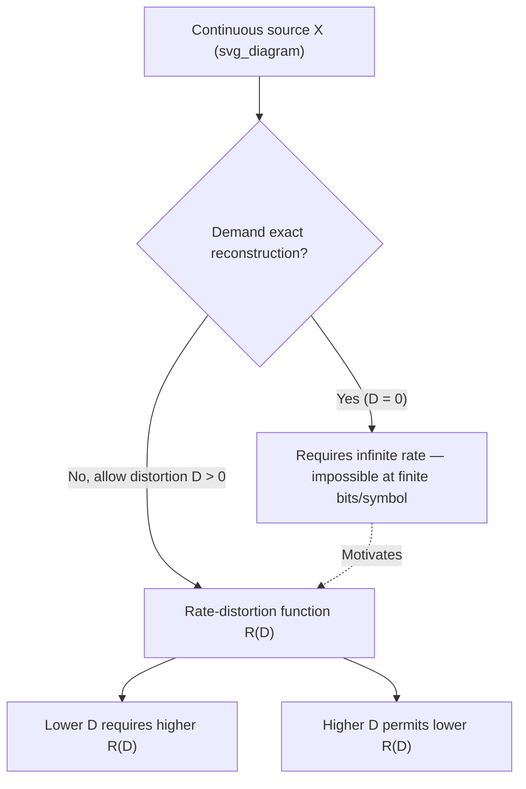

## Lossy Compression Motivation

### Why Lossy Compression Is Necessary

Lossless compression, governed by the source coding theorem, guarantees exact reconstruction of the original source at a rate bounded below by the source's entropy $H(X)$ (discrete case). For continuous-valued sources, however, this guarantee breaks down structurally: representing a continuous random variable to infinite precision requires infinitely many bits, since its differential entropy $h(X)$ is not an absolute bit-count and the underlying value can take uncountably many possible values. **Exact lossless compression of a genuinely continuous source is therefore impossible at any finite rate.** This is not a limitation of clever coding — it is a fundamental consequence of the discretization argument connecting $H(X^\Delta) \approx h(X) - \log\Delta$: driving reconstruction error to zero (equivalently, $\Delta \to 0$) forces the required rate to infinity.

This structural fact motivates **lossy compression**: instead of insisting on exact reconstruction, allow some controlled distortion between the original source $X$ and its reconstruction $\hat{X}$, and ask how few bits are needed to achieve a given, tolerable level of distortion. Rate-distortion theory formalizes this tradeoff.

### The Rate-Distortion Tradeoff

For any lossy compression scheme, there is an inherent tension:

- **Lower rate** (fewer bits per source symbol) generally forces **higher distortion** (worse reconstruction fidelity)
- **Lower distortion** (better fidelity) generally requires **higher rate** (more bits)

This tradeoff is not a heuristic engineering observation but a precise mathematical relationship, captured by the **rate-distortion function** $R(D)$: the minimum achievable rate (bits per symbol) such that the expected distortion between source and reconstruction does not exceed $D$. Rate-distortion theory, introduced by Shannon, provides the theoretical framework and fundamental limits for this tradeoff — the specific derivation of $R(D)$ for particular sources and distortion measures is treated as its own topic.

### Everyday Motivating Examples

**Key Points**

- **Audio**: CD-quality PCM audio is itself already a lossy digitization of a continuous acoustic waveform (quantized in both time and amplitude); formats like MP3 apply additional lossy compression exploiting psychoacoustic masking to discard information imperceptible to human hearing, achieving far lower bit rates than lossless PCM
- **Images**: JPEG compression discards high-frequency detail and fine color variation that the human visual system is less sensitive to, trading a controlled, often visually negligible quality loss for substantial file-size reduction
- **Video**: formats like H.264/H.265 combine lossy spatial compression (similar to JPEG, per frame) with lossy temporal compression (encoding only the differences between frames), since consecutive video frames are highly correlated and most of that redundancy can be discarded with minimal perceptual impact
- **Sensor and scientific data**: continuous physical measurements (temperature, voltage, pressure) are fundamentally real-valued and must be quantized to some finite precision for storage or transmission, an unavoidable lossy step even before any further compression is applied

### Distortion Measures

To make "how much loss is tolerable" mathematically precise, a **distortion measure** $d(x, \hat{x})$ quantifies the cost or penalty of reconstructing source value $x$ as $\hat{x}$. Common choices include:

**Squared-error distortion** (most common for continuous sources):

$$d(x,\hat{x}) = (x-\hat{x})^2$$

Widely used because of its mathematical tractability and its natural connection to mean-squared-error (MSE) metrics ubiquitous in signal processing.

**Absolute-error distortion**:

$$d(x,\hat{x}) = |x - \hat{x}|$$

Less sensitive to large outlier errors than squared error, since it penalizes error magnitude linearly rather than quadratically.

**Hamming distortion** (for discrete sources, included for completeness/contrast):

$$d(x,\hat{x}) = \begin{cases} 0 & x = \hat{x} \ 1 & x \neq \hat{x}\end{cases}$$

The expected distortion under a given coding scheme is $D = E[d(X,\hat{X})]$, averaged over the source distribution.

### Why Lossless Bounds Don't Apply

The source coding theorem's guarantee — that lossless compression can approach $H(X)$ bits per symbol with vanishing error probability — technically requires a discrete (or discretized) source with finite entropy. For continuous sources:

$$H(X^\Delta) \approx h(X) - \log \Delta \to \infty \text{ as } \Delta \to 0 \text{ (i.e., as reconstruction error} \to 0\text{)}$$

Any lossless scheme for a continuous source is therefore either restricted to a discretized (already lossy, at the quantization step) version of the source, or requires unbounded rate. This reframes the entire compression problem for continuous sources: **the question is never "can I compress losslessly," but "how does required rate grow as I demand lower distortion,"** which is exactly what $R(D)$ characterizes.

### Diagram: From Lossless Impossibility to Rate-Distortion Framing

### Operational Framing: Rate as a Function of Tolerable Distortion

Rather than asking for the minimum rate to represent a source exactly (undefined/infinite for continuous sources), lossy compression asks: given a maximum tolerable average distortion $D$, what is the smallest number of bits per symbol, $R(D)$, that can achieve it? This function is:

- **Non-increasing in $D$**: more tolerance for distortion never requires more rate.
- **Equal to zero at some finite or infinite $D_{\max}$**: beyond a certain distortion level (e.g., simply always guessing the source mean), zero bits may suffice.
- **Growing (often without bound) as $D \to 0$**: consistent with the impossibility of zero-distortion compression at finite rate for continuous sources.

### Worked Example (Conceptual, Not Yet the Full R(D) Derivation)

**Example**

Consider a temperature sensor producing continuous readings $X \sim \mathcal{N}(20, 4)$ (in °C, variance 4). Suppose the application only requires reconstructing the temperature to within an average squared error of $D = 0.1$ °C². Rather than attempting to transmit $X$ exactly (which would require infinite bits, per the argument above), the encoder needs only enough bits to distinguish among a finite set of quantized levels fine enough to guarantee squared error $\leq 0.1$ on average — a specific, finite rate governed by the Gaussian rate-distortion function (derived in the dedicated rate-distortion topic). This illustrates the motivating shift: the design question becomes "what quantization resolution achieves my error budget," not "how do I represent this exactly."

### Common Pitfalls

- Assuming lossy compression is merely "sloppy" lossless compression — it is a distinct, formally optimized problem with its own fundamental limit $R(D)$, not an ad hoc relaxation.
- Believing higher-quality (lower-distortion) compression is always achievable at proportionally higher rate — the relationship $R(D)$ is generally convex and often grows steeply as $D \to 0$, not linearly.
- Overlooking that any real-world digitization of a continuous signal (e.g., standard PCM audio sampling) is already a lossy step, even before any additional compression algorithm is applied.
- Choosing a distortion measure (e.g., squared error) without considering whether it reflects actual perceptual or task-relevant quality — mathematically convenient distortion measures do not always align with subjective or downstream-task quality.

**Related Topics**

- Rate-distortion function derivation for the Gaussian source
- Rate-distortion theorem (achievability and converse)
- Quantization theory and optimal scalar/vector quantizers
- Perceptual coding and psychoacoustic/psychovisual models
- Distributed source coding and the Wyner-Ziv problem

