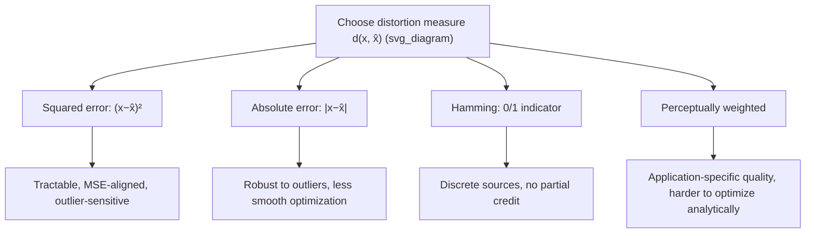

## Distortion Measures

### Definition and Role

A distortion measure $d(x, \hat{x})$ is a function quantifying the cost, penalty, or dissimilarity incurred when a source value $x$ is reconstructed (or represented) as $\hat{x}$ in a lossy compression scheme. Formally, it is a mapping:

$$d: \mathcal{X} \times \hat{\mathcal{X}} \to [0, \infty)$$

where $\mathcal{X}$ is the source alphabet and $\hat{\mathcal{X}}$ is the reconstruction alphabet (often, but not necessarily, the same set). The distortion measure is the object that gives operational meaning to "how lossy" a compression scheme is — without it, there is no way to compare two lossy schemes that both use the same rate but produce different reconstruction errors. It is a design choice, not something derived from the source distribution alone, and different choices of $d$ lead to different rate-distortion functions $R(D)$ for the same source.

### Required Properties

A valid distortion measure is typically required to satisfy:

- **Non-negativity**: $d(x,\hat{x}) \geq 0$ for all $x, \hat{x}$
- **Zero self-distortion**: $d(x,x) = 0$ (reconstructing exactly incurs no penalty) — though this is a common convention rather than a strict mathematical necessity for the theory to apply
- **Boundedness or finite expectation**: $E[d(X,\hat{X})]$ must be finite for the reconstruction schemes under consideration, or the rate-distortion analysis becomes vacuous

Distortion measures are **not** required to be symmetric ($d(x,\hat{x}) \neq d(\hat{x},x)$ in general) or to satisfy the triangle inequality — unlike a true mathematical distance metric, a distortion measure is a much weaker, more flexible object, chosen for its relevance to the application rather than for abstract mathematical elegance.

### Single-Letter Distortion Measures

The most common setting extends a per-symbol distortion measure to sequences via averaging:

$$d(x^n, \hat{x}^n) = \frac{1}{n}\sum_{i=1}^n d(x_i, \hat{x}_i)$$

This is called a **single-letter** distortion measure because the sequence-level distortion is simply the average of per-symbol distortions, with no cross-symbol interaction terms. Single-letter measures are the standard assumption throughout classical rate-distortion theory because they make the mathematics tractable while still capturing the essential engineering tradeoff; more general (non-single-letter) distortion measures exist but are used far less commonly.

### Squared-Error Distortion

$$d(x,\hat{x}) = (x-\hat{x})^2$$

This is by far the most widely used distortion measure for continuous-valued sources, for several converging reasons:

- **Mathematical tractability**: it leads to closed-form rate-distortion functions for important source classes (notably the Gaussian, covered in the dedicated rate-distortion topic)
- **Direct connection to mean-squared error (MSE)**: a metric already deeply embedded in classical signal processing, estimation theory, and engineering practice
- **Differentiability**: as a smooth, convex function of the error $x - \hat{x}$, it is well-suited to gradient-based and calculus-of-variations optimization techniques used to derive optimal quantizers and coders
- **Relation to variance**: for a fixed encoding scheme, expected squared-error distortion directly relates to the residual variance of the reconstruction error, a quantity with clear physical/statistical interpretation

Its main drawback is sensitivity to outliers: because error is squared, a single large reconstruction error contributes disproportionately to the average distortion, which may not reflect actual perceptual or task-relevant importance.

### Absolute-Error Distortion

$$d(x,\hat{x}) = |x-\hat{x}|$$

Penalizes error linearly rather than quadratically, making it more robust to occasional large errors (outliers) than squared-error distortion. It is less mathematically convenient — the resulting optimization problems are generally non-smooth at $x=\hat{x}$ — but it is preferred in settings where large infrequent errors should not dominate the overall distortion metric, or where the error's physical units (rather than squared units) are more directly meaningful.

### Hamming Distortion

$$d(x,\hat{x}) = \begin{cases} 0 & x=\hat{x} \\ 1 & x \neq \hat{x} \end{cases}$$

Applicable primarily to discrete sources: it counts a symbol as either "correct" (zero cost) or "incorrect" (unit cost), with no notion of "how wrong" an incorrect reconstruction is. Included here for contrast with continuous-source measures — it is the natural distortion measure when any deviation from the exact source symbol is equally undesirable, such as in some categorical or symbolic coding contexts.

### Weighted and Generalized Distortion Measures

More sophisticated distortion measures can be constructed to better reflect application-specific notions of quality:

**Weighted squared error**: $d(x,\hat{x}) = w(x)(x-\hat{x})^2$, where $w(x)$ upweights the penalty for errors at certain source values (e.g., penalizing errors more heavily near perceptually important signal levels).

**$p$-th power error**: $d(x,\hat{x}) = |x-\hat{x}|^p$, generalizing both absolute error ($p=1$) and squared error ($p=2$); larger $p$ increasingly penalizes large deviations, approaching a near-Hamming-like behavior (heavily penalizing any large deviation) as $p \to \infty$.

**Perceptually weighted measures**: in audio and image/video coding, distortion measures are often constructed (or entire coding pipelines redesigned) to approximate human perceptual sensitivity rather than raw numerical error — for example, weighting frequency components according to psychoacoustic masking curves in audio, or weighting spatial frequencies according to models of human contrast sensitivity in images. [Inference] These perceptual measures are generally more predictive of subjective quality than simple mathematical distortion measures like squared error, though they are more complex to define rigorously and to optimize against analytically, which is why classical rate-distortion theory typically develops its foundational results using squared error before extending to perceptual variants in applied codec design.

### Key Points

- A distortion measure $d(x,\hat{x})$ quantifies reconstruction cost and is a design choice, not derived from the source
- Need not be symmetric or satisfy the triangle inequality — a much weaker requirement than a true metric
- Single-letter measures average per-symbol distortion across a sequence, the standard tractable assumption
- Squared-error distortion dominates continuous-source theory due to tractability and its MSE connection
- The choice of distortion measure directly determines the resulting rate-distortion function $R(D)$ — different measures yield different tradeoff curves for the identical source

### Diagram: Distortion Measure Choices and Tradeoffs

### Worked Example

**Example**

A source produces value $x = 5.0$. Two candidate reconstructions are proposed: $\hat{x}_1 = 5.4$ and $\hat{x}_2 = 4.0$. Compare both under squared-error and absolute-error distortion.

Squared error:

$$d(x,\hat{x}_1) = (5.0-5.4)^2 = 0.16, \quad d(x,\hat{x}_2) = (5.0-4.0)^2 = 1.0$$

Absolute error:

$$d(x,\hat{x}_1) = |5.0-5.4| = 0.4, \quad d(x,\hat{x}_2) = |5.0-4.0| = 1.0$$

Under both measures, $\hat{x}_1$ is judged the better reconstruction, but the relative gap differs sharply: squared error rates $\hat{x}_2$ as $1.0/0.16 = 6.25\times$ worse, while absolute error rates it as only $1.0/0.4 = 2.5\times$ worse. This illustrates concretely how the choice of distortion measure changes not just absolute distortion values but the relative ranking magnitude between candidate reconstructions — a choice with real consequences for which encoder design is judged "optimal."

### Common Pitfalls

- Assuming a distortion measure must be a metric (symmetric, satisfying triangle inequality) — most useful distortion measures in practice are not metrics.
- Defaulting to squared-error distortion without considering whether it aligns with the actual application's notion of acceptable quality (e.g., using MSE for perceptual audio/image quality assessment, where it is known to correlate poorly with subjective judgments in many cases).
- Treating the distortion measure as fixed/universal for a source — the same source $X$ has a different rate-distortion function $R(D)$ under each different distortion measure; $R(D)$ is a property of the pair (source, distortion measure), not the source alone.
- Ignoring that non-single-letter (sequence-level, context-dependent) distortion measures exist and may better model some real applications, even though single-letter measures dominate the classical theory for tractability.

**Related Topics**

- Rate-distortion function derivation for squared-error distortion (Gaussian source)
- Rate-distortion theorem: achievability and converse proofs
- Vector quantization and the generalized Lloyd algorithm
- Perceptual coding models in audio (psychoacoustics) and image/video (contrast sensitivity)
- Bit allocation across multiple distortion-sensitive components