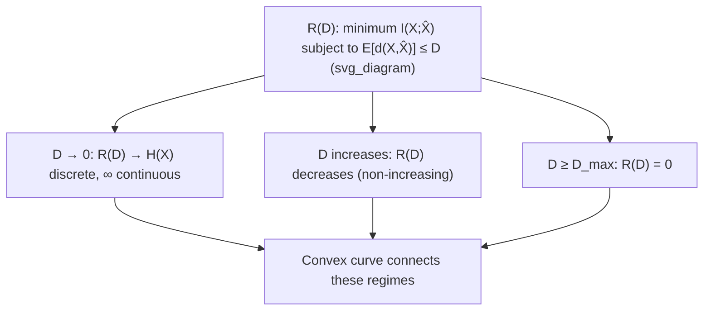

## Rate Distortion Function Definition

### Setup

Let $X$ be a source random variable with distribution $f(x)$, and let $\hat{X}$ denote its reconstruction, taking values in a (possibly different) alphabet $\hat{\mathcal{X}}$. A distortion measure $d(x,\hat{x})$ is fixed, as established previously. A lossy compression scheme is characterized by a **reconstruction mapping** — formally, a conditional distribution $Q(\hat{x} \mid x)$ (or, for a specific encoder-decoder pair, a deterministic map $\hat{x} = g(x)$) describing how source values are mapped to reconstructions, generally via an intermediate encoding into a rate-limited index or codeword.

### Formal Definition

The **rate-distortion function** $R(D)$ is defined as the infimum of achievable rates $R$ (bits per source symbol) such that there exists a reconstruction scheme achieving expected distortion no greater than $D$:

$$R(D) = \min_{Q(\hat{x}\mid x): \, E[d(X,\hat{X})] \leq D} I(X;\hat{X})$$

where the minimization is over all conditional distributions $Q(\hat{x}\mid x)$ (equivalently, all joint distributions $p(x)Q(\hat{x}\mid x)$ with the given source marginal $p(x)$) satisfying the distortion constraint, and $I(X;\hat{X})$ is the mutual information between the source and its reconstruction under that joint distribution. This is the **information rate-distortion function** — it is a purely information-theoretic optimization, defined without direct reference to any specific code, and it is proven (via the rate-distortion theorem) to equal the **operational rate-distortion function**: the true minimum achievable coding rate for expected distortion $\leq D$, in the limit of long block lengths.

### Why Mutual Information Appears

The appearance of $I(X;\hat{X})$ rather than some other quantity is not arbitrary — it reflects the same operational logic as channel capacity, but inverted. In channel coding, capacity $C = \max I(X;Y)$ measures the maximum information that can be reliably pushed *through* a noisy channel. In rate-distortion theory, $R(D) = \min I(X;\hat{X})$ measures the minimum information that must be *extracted from* the source to guarantee a reconstruction within distortion $D$ — effectively treating the encoder-decoder pair as an artificial "channel" $X \to \hat{X}$ whose "noise" (the discrepancy between $X$ and $\hat{X}$) is deliberately introduced to save rate, rather than being a physical impairment to overcome. This duality between channel coding (maximize $I$ subject to a reliability constraint) and rate-distortion coding (minimize $I$ subject to a distortion constraint) is a recurring structural theme in information theory.

### Key Points

- $R(D) = \min_{Q(\hat{x}|x):\,E[d]\leq D} I(X;\hat{X})$ — minimum mutual information over all schemes meeting the distortion budget
- The information and operational rate-distortion functions coincide, by the rate-distortion theorem (an achievability + converse result, parallel to channel coding)
- $R(D)$ is a property of the pair (source distribution, distortion measure) — changing either changes the function
- Structurally dual to channel capacity: capacity maximizes $I(X;Y)$ subject to a constraint; $R(D)$ minimizes $I(X;\hat X)$ subject to a constraint
- $R(D)$ is proven to be non-increasing and convex in $D$

### Properties of $R(D)$

**Non-increasing in $D$.** Allowing more distortion can never require more rate: if $D_1 < D_2$, then $R(D_1) \geq R(D_2)$, since any scheme achieving distortion $D_1$ automatically satisfies the looser constraint $D \leq D_2$, so the feasible set for $R(D_2)$ is at least as large as for $R(D_1)$, and minimizing over a larger set cannot increase the minimum.

**Convexity.** $R(D)$ is a convex function of $D$. This follows from the joint convexity of mutual information in the conditional distribution $Q(\hat x|x)$ for fixed source marginal $p(x)$, combined with the fact that the constraint set $\{Q : E[d]\leq D\}$ is convex in $(Q, D)$ jointly — standard convex-analysis arguments then establish convexity of the resulting minimum-value function. Convexity has an important practical consequence: linear interpolation (time-sharing) between two achievable (rate, distortion) operating points is always achievable, and no scheme lying below the $R(D)$ curve, at any distortion level, can be constructed.

**$R(0)$: the lossless endpoint.** At $D=0$ (no distortion tolerated, exact reconstruction required), $R(0)$ typically equals $H(X)$ for a discrete source (recovering the source coding theorem exactly as a special case), while for a continuous source, $R(0) = \infty$ — consistent with the earlier established impossibility of finite-rate, zero-distortion compression of continuous sources. This shows the discrete lossless source coding theorem as a special, zero-distortion case of the more general rate-distortion framework.

**$R(D_{\max}) = 0$.** There exists a finite distortion level $D_{\max}$ (dependent on the source and distortion measure) beyond which zero rate suffices — e.g., for squared-error distortion, simply always reconstructing $\hat{X}$ as the source mean $E[X]$ (ignoring the actual transmitted symbol entirely, at zero rate) achieves distortion equal to $\text{Var}(X)$. Thus $D_{\max} = \text{Var}(X)$ for squared-error distortion, and $R(D) = 0$ for all $D \geq D_{\max}$.

### Diagram: The Rate-Distortion Curve

### The Rate-Distortion Theorem (Statement Only)

The rate-distortion theorem establishes that $R(D)$ as defined above (the information rate-distortion function) is both:

- **Achievable**: for any rate $R > R(D)$, there exists a sequence of codes (for large enough block length $n$) that achieves expected distortion arbitrarily close to $D$ (or below), with the encoding using rate $R$.
- **A converse bound**: no code operating at rate $R < R(D)$ can achieve expected distortion $\leq D$, regardless of code complexity or block length.

This mirrors the two-sided (achievability + converse) structure of the channel coding theorem exactly, cementing the source-channel duality noted above. The full proof (via random coding arguments for achievability and a data-processing/Fano-type argument for the converse) is treated in the dedicated rate-distortion theorem topic.

### Worked Example: Verifying $R(D)$ Endpoints Conceptually

**Example**

For a source $X \sim \mathcal{N}(0, \sigma^2)$ under squared-error distortion, the closed-form rate-distortion function (derived in the dedicated Gaussian rate-distortion topic) is:

$$R(D) = \begin{cases} \frac{1}{2}\log_2\left(\dfrac{\sigma^2}{D}\right) & 0 \leq D \leq \sigma^2 \\ 0 & D > \sigma^2 \end{cases}$$

Checking the endpoints against the general properties above: as $D \to 0$, $R(D) = \frac{1}{2}\log_2(\sigma^2/D) \to \infty$, consistent with $R(0) = \infty$ for a continuous source. At $D = \sigma^2 = D_{\max}$, $R(D) = \frac{1}{2}\log_2(1) = 0$, exactly matching the "always guess the mean" zero-rate argument, since $\text{Var}(X) = \sigma^2$ here. Both endpoint behaviors predicted by the general theory are confirmed by this specific closed form, illustrating how the general properties of $R(D)$ constrain and sanity-check any specific derived formula.

### Common Pitfalls

- Confusing the information rate-distortion function (a minimization over mutual information, an abstract optimization) with the operational one (actual achievable coding rate) — they are proven equal by the rate-distortion theorem, but they are conceptually distinct objects until that theorem is invoked.
- Forgetting that $R(D)$ depends on both the source distribution and the chosen distortion measure — quoting a specific $R(D)$ formula (e.g., the Gaussian squared-error result above) without confirming both match the situation at hand leads to incorrect conclusions.
- Assuming $R(D)$ is strictly decreasing everywhere — it is non-increasing, and is exactly zero (flat) for all $D \geq D_{\max}$, not asymptotically approaching zero.
- Treating the rate-distortion theorem's achievability as constructive/practical — like the channel coding theorem, it is an existence proof relying on random coding arguments and asymptotically long block lengths; it does not itself provide a simple, implementable optimal code for finite block lengths.

**Related Topics**
- Rate-distortion function for the Gaussian source (full derivation)
- Rate-distortion theorem: achievability and converse proofs
- Reverse water-filling for Gaussian sources with independent components
- Source-channel separation theorem
- Vector quantization as a practical approximation to rate-distortion-optimal coding
