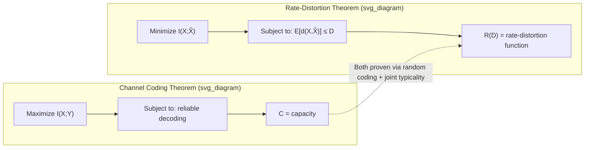

## Rate Distortion Theorem

### Statement

The rate-distortion theorem establishes that the **information rate-distortion function**

$$R(D) = \min_{Q(\hat{x}\mid x):\, E[d(X,\hat{X})]\leq D} I(X;\hat{X})$$

equals the **operational rate-distortion function** $R_{\text{op}}(D)$ — the infimum of rates $R$ for which there exists a sequence of block codes, as block length $n \to \infty$, achieving expected per-symbol distortion at most $D$ (in the limit) with encoding rate at most $R$ bits per symbol. Formally:

$$R(D) = R_{\text{op}}(D)$$

This equality is established via two separate directions of proof, exactly mirroring the structure of the channel coding theorem: an **achievability** part (rates above $R(D)$ are attainable) and a **converse** part (rates below $R(D)$ are not).

### Formal Statement of the Two Parts

**Achievability**: For any rate $R > R(D)$ and any $\epsilon > 0$, there exists, for sufficiently large block length $n$, an encoder-decoder pair $(f_n, g_n)$ with $f_n: \mathcal{X}^n \to \{1,\dots,2^{nR}\}$ and $g_n: \{1,\dots,2^{nR}\} \to \hat{\mathcal{X}}^n$, such that the expected per-symbol distortion satisfies:

$$E\left[\frac{1}{n}\sum_{i=1}^n d(X_i, g_n(f_n(X^n))_i)\right] \leq D + \epsilon$$

**Converse**: For any encoder-decoder pair operating at rate $R < R(D)$, the achievable expected distortion cannot be made arbitrarily close to $D$ — more precisely, any such scheme must incur expected distortion strictly greater than $D$ (bounded away from $D$), no matter how large $n$ is chosen or how cleverly the code is designed.

Together, these establish $R(D)$ as a sharp, tight boundary: it is simultaneously the best possible (converse) and the achievable (achievability) tradeoff between rate and distortion, not merely an upper or lower bound in isolation.

### Proof Sketch: Converse (Why $R < R(D)$ Is Impossible)

The converse direction uses the chain rule for mutual information together with the data processing inequality, applied to the Markov chain structure $X^n \to \text{(index)} \to \hat{X}^n$ implicit in any encoder-decoder pair. Sketch of the key steps:

1. For any code with rate $R$, the encoded index takes at most $2^{nR}$ values, so $I(X^n; \hat{X}^n) \leq H(\text{index}) \leq nR$ (mutual information is bounded by the entropy of the message that carries it).
2. By the chain rule and the single-letter structure of the distortion measure, $I(X^n;\hat{X}^n) \geq \sum_{i=1}^n I(X_i;\hat{X}_i) \geq \sum_i R(D_i)$, where $D_i = E[d(X_i,\hat{X}_i)]$, using the definition of $R(\cdot)$ applied per-symbol.
3. By convexity of $R(D)$ (established previously) and Jensen's inequality, $\frac{1}{n}\sum_i R(D_i) \geq R\left(\frac{1}{n}\sum_i D_i\right) = R(D)$, where $D$ is the overall average distortion.
4. Combining: $nR \geq I(X^n;\hat X^n) \geq nR(D)$, giving $R \geq R(D)$ — so any code with $R < R(D)$ cannot achieve average distortion $D$, establishing the converse.

This argument structurally parallels the channel coding converse (which uses Fano's inequality and the same chain-rule-plus-convexity machinery), reinforcing the duality between the two theorems.

### Proof Sketch: Achievability (Random Coding Argument)

The achievability proof uses a random coding construction analogous to Shannon's original channel coding proof, adapted to the rate-distortion setting:

1. Fix a conditional distribution $Q^*(\hat x|x)$ achieving (or nearly achieving) the minimum defining $R(D)$.
2. Generate a random codebook of $2^{nR}$ reconstruction sequences $\hat{x}^n$, each drawn i.i.d. according to the marginal $\hat{p}(\hat x) = \sum_x p(x)Q^*(\hat x|x)$ induced by this optimal conditional distribution.
3. For a given source sequence $x^n$, the encoder searches the codebook for a reconstruction sequence $\hat x^n$ that is **jointly typical** with $x^n$ under the joint distribution $p(x)Q^*(\hat x|x)$ (a rate-distortion analogue of the joint typicality used in channel coding proofs).
4. The theory of joint typicality (via the covering lemma, a close relative of the joint asymptotic equipartition property) guarantees that, provided $R > I(X;\hat X) = R(D)$, a jointly typical codeword exists in the random codebook with probability approaching 1 as $n \to \infty$, and that any such jointly typical pair has empirical distortion close to $E[d(X,\hat X)] \leq D$ under $Q^*$.
5. Averaging over the random codebook construction shows that at least one specific codebook achieves the required performance, completing the achievability argument.

[Inference] This sketch omits substantial technical machinery (precise typicality definitions, careful error-probability bookkeeping across the random coding ensemble, and the covering lemma's formal statement), which are standard but intricate parts of the complete proof found in dedicated information theory references; the high-level logic — random codebook generation plus joint-typicality-based encoding — is the essential and reliably correct structural takeaway.

### Key Points

- $R(D) = R_{\text{op}}(D)$: the information-theoretic minimization equals the true achievable operational rate, proven via matching achievability and converse arguments
- The converse relies on the chain rule, single-letter distortion structure, and convexity of $R(D)$ via Jensen's inequality
- The achievability relies on random codebook generation and joint typicality, directly paralleling the channel coding achievability proof
- The theorem is asymptotic: exact achievability requires $n \to \infty$; finite block lengths only approach the bound
- This is the second major coding theorem (alongside channel capacity) built on the same joint-typicality proof machinery, reflecting a unifying method across information theory

### Diagram: Structural Parallel to Channel Coding

### Source-Channel Duality Recap

The rate-distortion theorem and the channel coding theorem are dual in a precise sense: channel coding asks how much information can be reliably transmitted through a noisy channel at a given rate, while rate-distortion coding asks how much a source's information content can be reduced (compressed) while keeping reconstruction error bounded. Both proofs use the identical technical toolkit (chain rule, convexity/concavity arguments, joint typicality, random coding), reflecting that both problems are, at their core, about characterizing the extremal values of mutual information subject to a constraint — maximized under a reliability constraint in one case, minimized under a distortion constraint in the other.

### Worked Example: Interpreting the Theorem for a Specific Point

**Example**

For the Gaussian source rate-distortion function $R(D) = \frac{1}{2}\log_2(\sigma^2/D)$ (for $0 \leq D \leq \sigma^2$), suppose $\sigma^2 = 9$ and the application requires distortion $D = 1$. The theorem guarantees:

$$R(1) = \frac{1}{2}\log_2(9/1) = \frac{1}{2}\log_2(9) \approx \frac{1}{2}(3.17) \approx 1.585 \text{ bits/symbol}$$

By achievability, this means codes exist (for sufficiently large block length) using slightly more than 1.585 bits per source symbol that achieve expected squared-error distortion arbitrarily close to 1. By the converse, no code using fewer than 1.585 bits per symbol can achieve expected distortion as low as 1, regardless of design sophistication or block length. The theorem thus pins down 1.585 bits/symbol as the exact, unimprovable operating point for this distortion target — not merely a rough estimate or heuristic bound.

### Common Pitfalls

- Treating the theorem as providing an explicit, constructive optimal code — like the channel coding theorem, it is fundamentally an existence proof; specific optimal finite-length codes generally require separate, often much harder, construction techniques (or practical approximations like vector quantization).
- Applying the converse direction loosely, e.g., assuming a rate slightly below $R(D)$ merely gives "slightly worse" distortion — the converse shows a fundamental gap, not a graceful degradation, though the precise quantitative gap depends on the specific source and code.
- Forgetting the asymptotic ($n\to\infty$) nature of both directions — real, finite-block-length systems only approach $R(D)$, and the gap at practical block lengths can be significant depending on the source and target distortion.
- Assuming the achievability proof's random-codebook construction is itself a practical coding scheme — it establishes existence via averaging arguments, not a deployable algorithm; practical lossy coders use structured approaches (transform coding, vector quantization, learned codecs) rather than literal random codebooks.

**Related Topics**
- Rate-distortion function for the Gaussian source (closed-form derivation)
- Joint typicality and the asymptotic equipartition property
- Source-channel separation theorem
- Practical lossy coding: transform coding, vector quantization, learned neural codecs
- Reverse water-filling for vector Gaussian sources