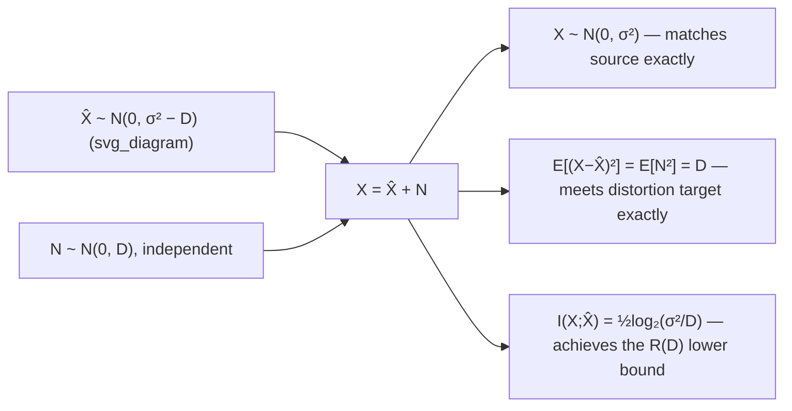

## Rate Distortion for Gaussian Sources

### Setup

Let $X \sim \mathcal{N}(0, \sigma^2)$ be a memoryless Gaussian source (mean fixed at 0 without loss of generality, by translation invariance of the problem structure), and let the distortion measure be squared error: $d(x,\hat{x}) = (x-\hat{x})^2$. This is the canonical, most thoroughly worked-out case in rate-distortion theory, both because it admits a clean closed form and because it directly parallels the Gaussian channel capacity result — reinforcing the recurring role of the Gaussian distribution as the extremal case on both sides of the channel-coding / source-coding duality.

### The Closed-Form Result

$$R(D) = \begin{cases} \dfrac{1}{2}\log_2\left(\dfrac{\sigma^2}{D}\right) & 0 \leq D \leq \sigma^2 \\[2mm] 0 & D > \sigma^2 \end{cases}$$

Equivalently, solving for $D$ as a function of $R$ (the **distortion-rate function**, the inverse relationship):

$$D(R) = \sigma^2 2^{-2R}$$

This inverse form is often more intuitive for engineering interpretation: each additional bit of rate ($R \to R+1$) reduces achievable distortion by a factor of 4 ($2^{-2}$), a direct quantitative statement of diminishing returns from added rate — closely paralleling the "6 dB per bit" rule of thumb familiar from quantization theory.

### Derivation Sketch

The derivation solves the constrained minimization $R(D) = \min_{Q(\hat x|x): E[(X-\hat X)^2]\leq D} I(X;\hat X)$ directly.

**Step 1 — Lower bound via entropy manipulation.** For any joint distribution of $(X,\hat X)$ with $E[(X-\hat X)^2] \leq D$:

$$I(X;\hat X) = h(X) - h(X|\hat X)$$

Since $X - \hat X$ has variance at most $D$ (given the distortion constraint), and among all distributions with a fixed variance the Gaussian maximizes differential entropy (the maximum-entropy result established earlier):

$$h(X|\hat X) \leq h(X - \hat X \mid \hat X) \leq h(X-\hat X) \leq \frac{1}{2}\log_2(2\pi e D)$$

(the first inequality is an identity since conditioning by a function of $\hat X$ doesn't change $X - \hat X$'s value given $\hat X$; the second drops conditioning, since conditioning cannot increase entropy; the third invokes the Gaussian maximum-entropy bound for a variable of variance $\leq D$).

**Step 2 — Combine.** Using $h(X) = \frac{1}{2}\log_2(2\pi e \sigma^2)$ for the Gaussian source:

$$I(X;\hat X) \geq h(X) - \frac{1}{2}\log_2(2\pi e D) = \frac{1}{2}\log_2\left(\frac{2\pi e\sigma^2}{2\pi eD}\right) = \frac{1}{2}\log_2\left(\frac{\sigma^2}{D}\right)$$

establishing $R(D) \geq \frac{1}{2}\log_2(\sigma^2/D)$ as a lower bound valid for any admissible scheme.

**Step 3 — Achievability (matching upper bound).** This lower bound is shown to be achieved (with equality) by the specific **backward** (or "test-channel") construction:

$$X = \hat X + N, \quad \hat X \sim \mathcal{N}\left(0,\, \sigma^2 - D\right), \quad N \sim \mathcal{N}(0, D), \quad \hat X \perp N$$

Under this construction, $\hat X$ plays the role of an "encoded" version of $X$, and $N$ represents the reconstruction error, deliberately modeled as independent Gaussian noise of variance exactly $D$. Direct calculation confirms $X = \hat X + N$ has variance $(\sigma^2-D)+D=\sigma^2$ as required, $E[(X-\hat X)^2]=E[N^2]=D$ exactly meeting the distortion constraint, and computing $I(X;\hat X)$ for this specific joint Gaussian construction yields exactly $\frac{1}{2}\log_2(\sigma^2/D)$, matching the lower bound and confirming tightness.

### The "Test Channel" / "Backward Channel" Interpretation

The achieving construction above is called the **test channel** (or **backward channel**) because it is structurally the reverse of how one might naively think about lossy compression: rather than modeling the reconstruction $\hat X$ as a noisy/degraded version of the source $X$ (i.e., $\hat X = X + \text{noise}$), the optimal construction instead models the *source* $X$ as $\hat X$ plus independent noise. This inversion is precisely dual to the Gaussian channel capacity result, where the channel input $X^*$ achieving capacity is also Gaussian, and output $Y=X+Z$; here, the source $X$ itself decomposes as $\hat X + N$, with $\hat X$ playing the input-like role and $N$ the noise-like role.

### Diagram: The Test Channel Construction

### Key Points

- $R(D) = \frac{1}{2}\log_2(\sigma^2/D)$ for $0\leq D\leq\sigma^2$; zero beyond $D=\sigma^2$
- Equivalently, $D(R) = \sigma^2 2^{-2R}$: each added bit quarters the achievable distortion
- Derivation combines the Gaussian maximum-entropy bound (lower bound on $R(D)$) with an explicit achieving test-channel construction (matching upper bound)
- The optimal test channel models the source as reconstruction-plus-independent-noise, $X = \hat X + N$, the reverse framing of a physical noisy channel
- Directly dual to the Gaussian channel capacity derivation, reusing the identical maximum-entropy machinery on the "other side" of the source/channel duality

### Numerical Behavior and the "6 dB per Bit" Rule

Expressing $D(R) = \sigma^2 2^{-2R}$ in decibels (using $10\log_{10}$ for power ratios):

$$10\log_{10}D(R) = 10\log_{10}\sigma^2 - 2R \times 10\log_{10}2 \approx 10\log_{10}\sigma^2 - 6.02R \text{ dB}$$

Each additional bit of rate reduces distortion (in dB) by approximately **6 dB** — a widely cited engineering rule of thumb in quantization and coding practice, directly derivable from the closed-form Gaussian rate-distortion function.

### Worked Example

**Example**

A Gaussian source has $\sigma^2 = 16$. Compute $R(D)$ for $D=4$, and separately compute $D(R)$ for $R = 3$ bits/symbol.

Rate at $D=4$:

$$R(4) = \frac{1}{2}\log_2\left(\frac{16}{4}\right) = \frac{1}{2}\log_2(4) = \frac{1}{2}(2) = 1 \text{ bit/symbol}$$

Distortion at $R=3$:

$$D(3) = 16 \times 2^{-2(3)} = 16 \times 2^{-6} = 16/64 = 0.25$$

Cross-check consistency: at $R=3$ bits, distortion should be $16 \times 2^{-6}=0.25$; verify via $R(D)$: $R(0.25) = \frac{1}{2}\log_2(16/0.25)=\frac{1}{2}\log_2(64)=\frac{1}{2}(6)=3$ bits — matches exactly, confirming $R(D)$ and $D(R)$ are proper inverses of each other.

### Extension: Vector Gaussian Sources and Reverse Water-Filling

For a source consisting of $k$ independent Gaussian components $X_i \sim \mathcal{N}(0,\sigma_i^2)$ (e.g., decorrelated transform coefficients, or the independent components of a Gaussian vector source after a Karhunen-Loève / PCA-style transform), and an overall distortion budget $D_{\text{total}} = \sum_i D_i$, the rate-minimizing allocation of distortion across components follows a **reverse water-filling** solution:

$$D_i^* = \min(\theta, \sigma_i^2)$$

where $\theta$ (again a "water level," but here bounding distortion from above rather than power from below) is chosen so $\sum_i D_i^* = D_{\text{total}}$. Components with small variance $\sigma_i^2 < \theta$ are reconstructed essentially exactly (distortion capped at their own variance, since allocating more distortion budget than the component's total variance is wasteful); components with large variance $\sigma_i^2 \geq \theta$ each receive exactly $\theta$ distortion, with any remaining rate budget spent compressing them only partially. This is termed "reverse" water-filling because, in contrast to power water-filling (which fills low-noise channels first with power), it effectively "empties" high-variance components down to a common distortion floor rather than filling a common power level — the same fundamental Lagrangian optimization structure, applied to the dual problem.

[Inference] The precise duality mapping between power water-filling (channel capacity, filling upward to a common level from noise floors) and distortion "reverse" water-filling (source coding, capping downward to a common level from variances) is a well-established structural parallel in the literature, though the exact sign conventions and which quantity plays the "floor" versus "ceiling" role can differ slightly depending on the specific textbook presentation — the qualitative duality (both are Lagrangian-optimal allocations of a shared budget across independent sub-problems) is the robust, reliable takeaway.

### Common Pitfalls

- Applying the closed-form Gaussian $R(D)$ formula to a non-Gaussian source — the Gaussian result is specific to Gaussian sources under squared-error distortion; other source distributions have different (generally more complex, sometimes non-closed-form) rate-distortion functions.
- Forgetting the flat-zero region for $D > \sigma^2$ — the formula $\frac{1}{2}\log_2(\sigma^2/D)$ alone would give a negative (nonsensical) rate for $D>\sigma^2$; the correct function is explicitly capped at zero there.
- Misapplying the "6 dB per bit" rule outside the Gaussian squared-error setting — while a widely used heuristic in general quantization contexts, its precise derivation here is specific to this source/distortion pairing, and quantitative accuracy elsewhere should be treated as an approximation. [Inference] The heuristic is commonly applied more broadly in practice as a rough guide for many quantizer designs, though its exact numerical accuracy outside the Gaussian case is not guaranteed by this derivation.
- Confusing the "test channel" construction with an actual physical channel — it is a mathematical artifact of the achievability proof (a specific joint distribution construction), not a description of any real transmission channel.

**Related Topics**
- Reverse water-filling for vector/correlated Gaussian sources in full detail
- Rate-distortion theorem: general achievability and converse (prior topic)
- Practical scalar and vector quantizer design (Lloyd-Max algorithm)
- Rate-distortion functions for non-Gaussian sources (e.g., Laplacian, uniform)
- Source-channel separation theorem and its implications for joint design