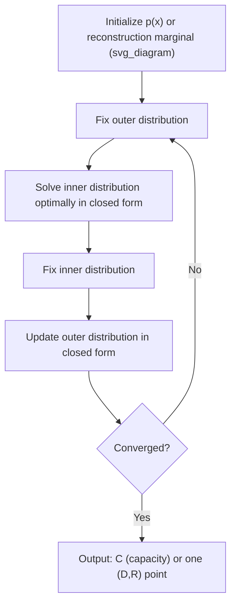

## Blahut-Arimoto Algorithm

### Purpose

The Blahut-Arimoto algorithm is an iterative numerical procedure for computing two closely related information-theoretic optimizations that generally lack closed-form solutions:

- **Channel capacity**: $C = \max_{p(x)} I(X;Y)$ for an arbitrary discrete memoryless channel $p(y|x)$
- **Rate-distortion function**: $R(D) = \min_{Q(\hat x|x):E[d]\leq D} I(X;\hat X)$ for an arbitrary source and distortion measure

While closed-form results exist for special cases (the Gaussian channel capacity, the Gaussian rate-distortion function), most channels and sources do not admit such clean analytical solutions. The Blahut-Arimoto algorithm provides a provably convergent numerical method applicable to arbitrary discrete channels and sources, making it the standard practical tool for computing $C$ or $R(D)$ outside the small set of analytically tractable cases.

### The Channel Capacity Version

**Goal**: given a fixed channel transition matrix $p(y|x)$, find the input distribution $p(x)$ maximizing $I(X;Y)$.

**Key identity underlying the algorithm.** Mutual information can be re-expressed via an auxiliary distribution $q(x|y)$ as:

$$I(X;Y) = \max_{q(x|y)} \sum_x \sum_y p(x)p(y|x) \log\frac{q(x|y)}{p(x)}$$

with the maximum over $q(x|y)$ achieved exactly at the true posterior $q(x|y) = p(x)p(y|x)/p(y)$ (Bayes' rule). This reformulation turns the original single-variable maximization over $p(x)$ into a **double maximization** over the pair $(p(x), q(x|y))$ — a structure well-suited to **alternating optimization**: fix one variable, optimize the other in closed form, and iterate.

### Channel Capacity Algorithm Steps

1. **Initialize** $p^{(0)}(x)$ arbitrarily (e.g., uniform over the input alphabet).
2. **E-step-like update**: given current $p^{(t)}(x)$, compute the optimal $q(x|y)$ via Bayes' rule:
   $$q^{(t)}(x|y) = \frac{p^{(t)}(x)\,p(y|x)}{\sum_{x'} p^{(t)}(x')\,p(y|x')}$$
3. **M-step-like update**: given $q^{(t)}(x|y)$, update $p(x)$ via:
   $$p^{(t+1)}(x) = \frac{p^{(t)}(x)\exp\left(\sum_y p(y|x)\log q^{(t)}(x|y)\right)}{\sum_{x'} p^{(t)}(x')\exp\left(\sum_y p(y|x')\log q^{(t)}(x'|y)\right)}$$
4. **Repeat** steps 2–3 until $p^{(t)}(x)$ converges (change between iterations falls below a chosen tolerance).
5. The converged $p^{(t)}(x)$ approximates the capacity-achieving input distribution, and $I(X;Y)$ evaluated at this distribution approximates $C$.

This alternating structure closely parallels the Expectation-Maximization (EM) algorithm used in statistics for maximum-likelihood estimation with latent variables — both alternate between a "soft assignment" step (computing $q$) and a "parameter update" step (updating $p$), and both are guaranteed to monotonically improve (never decrease) the objective at each iteration.

### The Rate-Distortion Version

**Goal**: given a fixed source distribution $p(x)$ and target distortion $D$, find the conditional distribution $Q(\hat x|x)$ minimizing $I(X;\hat X)$ subject to $E[d(X,\hat X)]\leq D$.

The rate-distortion version uses a Lagrangian reformulation to handle the distortion constraint, introducing a Lagrange multiplier $\beta \geq 0$ (called the "slope parameter," since it corresponds to the slope $dR/dD$ at the resulting operating point) and minimizing the unconstrained functional:

$$\min_{Q(\hat x|x)} \left[I(X;\hat X) + \beta\, E[d(X,\hat X)]\right]$$

for a fixed $\beta$; varying $\beta$ over $[0,\infty)$ traces out the entire $R(D)$ curve, one $(R,D)$ point per value of $\beta$.

### Rate-Distortion Algorithm Steps

1. **Choose** a value of $\beta \geq 0$ (each choice traces one point on the $R(D)$ curve).
2. **Initialize** $\hat{p}^{(0)}(\hat x)$, the reconstruction marginal, arbitrarily (e.g., uniform).
3. **Update the conditional** via:
   $$Q^{(t)}(\hat x | x) = \frac{\hat p^{(t)}(\hat x)\exp(-\beta\, d(x,\hat x))}{\sum_{\hat x'} \hat p^{(t)}(\hat x')\exp(-\beta\, d(x,\hat x'))}$$
4. **Update the reconstruction marginal**:
   $$\hat p^{(t+1)}(\hat x) = \sum_x p(x)\, Q^{(t)}(\hat x|x)$$
5. **Repeat** steps 3–4 until convergence.
6. At convergence, compute the resulting rate $R = I(X;\hat X)$ and distortion $D = E[d(X,\hat X)]$ under the converged $Q(\hat x|x)$ — this gives one point $(D,R)$ on the rate-distortion curve, corresponding to the chosen $\beta$.

### Key Points

- Blahut-Arimoto computes $C$ or $R(D)$ numerically for arbitrary discrete channels/sources lacking closed-form solutions
- Structured as alternating optimization between two coupled distributions — analogous in spirit to the EM algorithm
- The rate-distortion version requires sweeping a Lagrange multiplier $\beta$ to trace out the full $R(D)$ curve, one point per $\beta$
- Both versions are provably convergent: the objective is monotonically non-decreasing (capacity version) or non-increasing (rate-distortion version) at each iteration
- Convergence is guaranteed but generally not to a closed-form expression — output is numerical, not symbolic

### Convergence Guarantee

Both versions of the algorithm are provably convergent to the global optimum ($C$ or the correct point on $R(D)$), because the underlying objective functions ($I(X;Y)$ in $p(x)$, or the Lagrangian in $Q(\hat x|x)$) are concave (capacity case) or convex (rate-distortion case) in the variable being optimized, and the alternating-maximization (or minimization) scheme is a special case of a more general class of algorithms (related to alternating projections / block coordinate ascent-descent) with established convergence guarantees for such convex/concave structures. [Inference] The precise convergence rate (how many iterations are needed for a given numerical tolerance) depends on the specific channel or source characteristics and is not uniform across all problem instances, though the algorithm reliably converges in practice within a modest number of iterations for typical textbook-scale problems.

### Diagram: Alternating Optimization Structure

### Worked Example (Conceptual Walkthrough, One Iteration)

**Example**

Consider a simple binary symmetric channel with crossover probability $p_e = 0.1$, i.e., $p(y|x)$: $P(Y=X)=0.9$, $P(Y\neq X)=0.1$, over binary input/output alphabets $\{0,1\}$. Initialize $p^{(0)}(0)=p^{(0)}(1)=0.5$ (uniform).

**Step 2 (compute $q(x|y)$)**: by symmetry of the BSC and the uniform initial input distribution, Bayes' rule gives $q^{(0)}(x=0|y=0) = q^{(0)}(x=1|y=1) = 0.9$ and $q^{(0)}(x=1|y=0)=q^{(0)}(x=0|y=1)=0.1$ (the posterior simply reflects the channel's own symmetric crossover structure, since the prior is uniform).

**Step 3 (update $p(x)$)**: because of the channel's inherent symmetry (crossover probability identical in both directions) and the symmetric starting point, the update leaves $p^{(1)}(x) = 0.5$ for both symbols unchanged — the uniform distribution is already a fixed point for this particular symmetric channel.

**Interpretation**: this example is a degenerate case (uniform input is already optimal for any symmetric binary channel, a fact provable directly without running the algorithm), so it converges in a single iteration; asymmetric channels or channels with more than two symbols generally require many iterations, with the input distribution shifting incrementally at each step until reaching the true capacity-achieving distribution. This illustrates why symmetric channels (like the BSC) are commonly used as textbook first examples — the algorithm's mechanics are visible without extensive iteration bookkeeping — while realistic asymmetric channels require the full iterative procedure to converge.

### Common Pitfalls

- Expecting the algorithm to output a closed-form expression — it produces numerical values (a capacity number, or discrete $(D,R)$ points), not a symbolic formula, even though the underlying true $C$ or $R(D)$ may or may not have closed form.
- Forgetting that the rate-distortion version requires sweeping $\beta$ over a range of values to trace the full curve — a single run with one fixed $\beta$ yields only one point on $R(D)$, not the entire function.
- Applying the algorithm to continuous alphabets without first discretizing — the standard Blahut-Arimoto algorithm as presented operates on discrete distributions; continuous-alphabet extensions require additional care (fine discretization or specialized continuous variants).
- Assuming a fixed, small number of iterations always suffices — convergence rate varies by problem instance, and practical implementations should check a convergence criterion (e.g., change in the objective value between iterations) rather than assuming a hardcoded iteration count is sufficient.

**Related Topics**
- Expectation-Maximization (EM) algorithm and its structural parallels to Blahut-Arimoto
- Convex optimization and alternating minimization/projection methods
- Numerical computation of channel capacity for non-symmetric, multi-symbol channels
- Practical implementation considerations: discretization, convergence criteria, numerical stability
- Rate-distortion theory for sources without closed-form solutions (e.g., Laplacian, mixture distributions)