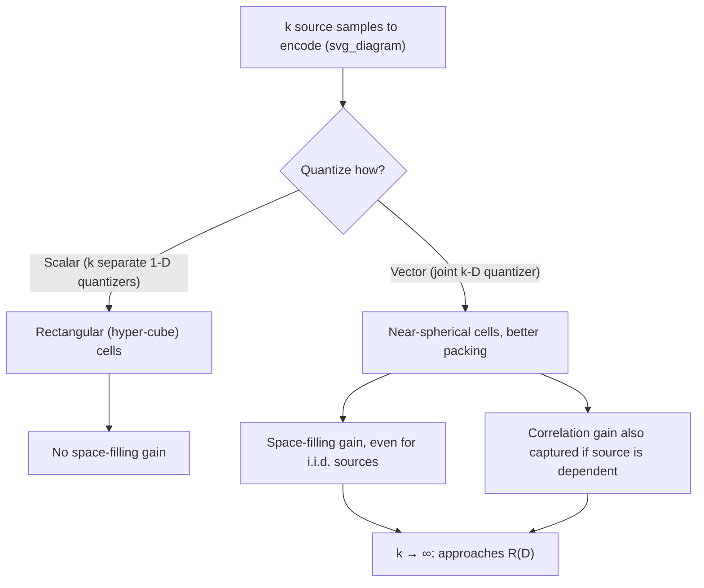

## Vector Quantization

### Definition

Vector quantization (VQ) generalizes scalar quantization by mapping blocks (vectors) of $k$ source samples jointly to a single codeword, rather than quantizing each sample independently. Formally, a vector quantizer of dimension $k$ and rate $R$ bits/symbol is defined by:

- A **codebook** $\mathcal{C} = \{\mathbf{y}_1, \dots, \mathbf{y}_M\} \subset \mathbb{R}^k$ of $M = 2^{kR}$ reconstruction vectors (codewords)
- An **encoder** $\alpha: \mathbb{R}^k \to \{1,\dots,M\}$, mapping each input vector $\mathbf{x}$ to the index of its nearest codeword (under the chosen distortion measure)
- A **decoder** $\beta: \{1,\dots,M\} \to \mathcal{C}$, mapping each index back to its corresponding codeword

The encoder typically applies the **nearest-neighbor rule**: $\alpha(\mathbf{x}) = \arg\min_i d(\mathbf{x}, \mathbf{y}_i)$, selecting whichever codeword minimizes distortion to the input vector.

### Why Vector Quantization Outperforms Scalar Quantization

A foundational and somewhat counterintuitive result in rate-distortion theory: **even for a source with independent, identically distributed components**, jointly quantizing blocks of samples (vector quantization) can achieve strictly lower distortion, at the same rate, than quantizing each sample independently (scalar quantization) — provided $k \geq 2$. This is not because VQ exploits statistical dependence between samples (there may be none), but because of a purely geometric effect: in higher dimensions, quantization cells can be shaped more efficiently (closer to spherical, minimizing average distance from any point in the cell to its representative codeword) than the rectangular (hyper-cube) cells implicitly imposed by independent scalar quantization of each coordinate.

This geometric advantage is known as **space-filling gain**: in dimension $k$, the optimal quantization cell shape becomes closer to a $k$-dimensional sphere as $k$ increases, and spheres are the most efficient (lowest average squared distance from center to boundary, for fixed cell volume) space-filling shape in high dimensions among the achievable tessellation options — though a perfect sphere-only tessellation isn't itself achievable for $k>1$ in the tiling sense, real optimal high-dimensional quantizer cells approach the efficiency of sphere-packing bounds as $k$ grows.

### Key Points

- VQ jointly encodes $k$-dimensional vectors using $M=2^{kR}$ codewords, one representative per cell of a partition of $\mathbb{R}^k$
- Strictly outperforms scalar quantization even for i.i.d. sources, due to geometric space-filling gain, not statistical dependence
- The nearest-neighbor encoding rule is optimal for a fixed codebook, given the chosen distortion measure
- As $k \to \infty$, optimal VQ performance approaches the rate-distortion function $R(D)$ itself
- Practical VQ design (e.g., the generalized Lloyd algorithm) is a local, iterative optimization — global optimality is not generally guaranteed for finite codebooks

### Sources of VQ's Rate Gain

Two distinct effects contribute to VQ's advantage over scalar quantization, and it is important to distinguish them:

1. **Correlation gain**: if source samples are statistically dependent (correlated), VQ can exploit that structure directly, achieving further gains beyond what any scalar (per-sample-independent) scheme can achieve — this is the more intuitive source of gain.
2. **Space-filling gain**: even for i.i.d. (uncorrelated) sources, VQ still outperforms scalar quantization purely due to the geometric cell-shape effect described above. This gain persists even when correlation gain is entirely absent, and is the more subtle, less intuitive contribution.

The Shannon rate-distortion function $R(D)$ represents the fundamental limit achievable in the limit $k \to \infty$, capturing both gains simultaneously; scalar quantization ($k=1$) captures neither.

### Asymptotic Optimality

As the vector dimension $k \to \infty$, the performance of an optimally designed vector quantizer approaches the rate-distortion bound $R(D)$ arbitrarily closely — this is, in fact, essentially a constructive echo of the achievability direction of the rate-distortion theorem, since the theorem's proof itself relies on a random-codebook / joint-typicality argument that is conceptually a (randomly constructed, asymptotically large-$k$) vector quantizer. VQ can therefore be understood as the practical, structured attempt to realize what the rate-distortion theorem proves exists in principle.

### Diagram: Scalar vs. Vector Quantization Cell Geometry

### The Generalized Lloyd Algorithm (LBG Algorithm)

The standard practical method for designing a VQ codebook from training data is the **generalized Lloyd algorithm**, also known as the **Linde-Buzo-Gray (LBG) algorithm**, an iterative two-step (alternating optimization) procedure directly analogous in structure to Blahut-Arimoto and to $k$-means clustering:

1. **Initialize** a codebook of $M$ codewords (e.g., via random selection from training data, or a splitting procedure starting from $M=1$).
2. **Nearest-neighbor assignment (encoder update)**: assign every training vector to its nearest codeword under the distortion measure, partitioning the training set into $M$ clusters (Voronoi-like regions).
3. **Centroid update (decoder update)**: recompute each codeword as the centroid (distortion-minimizing representative) of the training vectors assigned to it — for squared-error distortion, this is simply the arithmetic mean of the assigned vectors.
4. **Repeat** steps 2–3 until the codebook stabilizes or average distortion improvement falls below a threshold.

This algorithm is structurally identical to the $k$-means clustering algorithm from unsupervised learning (in fact, $k$-means is a special case of LBG under squared-error distortion) and shares the same convergence property: monotonically non-increasing distortion at each iteration, guaranteed convergence to a local optimum, but no guarantee of finding the global optimum — final codebook quality depends on initialization.

### Worked Example (Conceptual)

**Example**

Consider quantizing pairs of i.i.d. Gaussian samples $(X_1, X_2)$, each $\mathcal{N}(0,1)$, at total rate $R=1$ bit per sample (so $2$ bits per pair, $M=4$ codewords for $k=2$). A scalar quantizer would independently quantize each coordinate into $2$ levels (1 bit each), producing $4$ codewords arranged at the corners of a square in the $(X_1,X_2)$ plane — a rectangular partition of the plane into $4$ quadrant-like cells. An optimal 2-D vector quantizer instead places its $4$ codewords and partitions the plane into $4$ cells shaped to better match the circular (radially symmetric) contours of the bivariate Gaussian density, reducing average squared distortion for the same rate. [Inference] The exact quantitative distortion gap between the optimal scalar and optimal 2-D vector quantizer at this specific rate depends on precise numerical optimization of both quantizers' cell boundaries and codeword placements, which is why such gains are typically reported from published rate-distortion/quantization performance studies or explicit numerical experiments rather than derived by hand in closed form.

### Applications

Vector quantization is directly used or closely related to techniques in: speech coding (e.g., codebook-based speech codecs such as early CELP variants), image compression (block-based VQ was an early competitor to transform coding methods like JPEG's DCT approach), and — more recently — as a core building block in neural network-based generative models and compression systems (e.g., VQ-VAE architectures use a learned, differentiable form of vector quantization as a discrete bottleneck layer).

### Common Pitfalls

- Assuming VQ's advantage over scalar quantization requires correlated source samples — the space-filling gain persists even for i.i.d. sources, a frequently underappreciated point.
- Treating the generalized Lloyd/LBG algorithm as guaranteed to find the globally optimal codebook — like $k$-means, it converges only to a local optimum, and results can be sensitive to codebook initialization; multiple random restarts are a common practical mitigation.
- Believing arbitrarily large $k$ is always practical — computational and memory cost of VQ encoding (nearest-neighbor search over $M=2^{kR}$ codewords) grows exponentially with $k$ at fixed rate $R$, making very high-dimensional VQ computationally prohibitive without structured approximations (e.g., tree-structured or lattice VQ).
- Confusing VQ's asymptotic optimality (as $k\to\infty$) with practical finite-$k$ performance — real systems use modest, computationally feasible $k$, and the realized gain over scalar quantization, while often significant, falls short of the full asymptotic $R(D)$ bound.

**Related Topics**
- Lattice vector quantization and structured codebook designs
- $k$-means clustering and its formal equivalence to squared-error VQ design
- VQ-VAE and learned vector quantization in deep generative models
- Tree-structured and multistage vector quantization for reduced search complexity
- Transform coding as an alternative practical approach to approaching R(D)