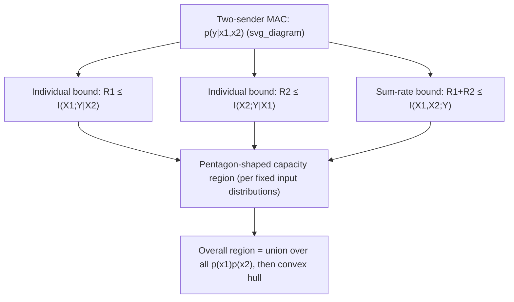

## Multiple Access Channels

### Definition

A multiple access channel (MAC) models a communication scenario in which several independent transmitters share a common channel to a single receiver. For the two-sender case (the canonical model extended straightforwardly to $m$ senders), the channel is characterized by a conditional distribution:

$$p(y \mid x_1, x_2)$$

where $X_1$ and $X_2$ are the inputs from two independent senders, and $Y$ is the single output observed by one common receiver. Each sender encodes its own independent message using only its own codebook, with no coordination between senders during transmission — coordination happens only at the design stage (both encoders and the decoder are fixed in advance and known to all parties), not during actual signal transmission. This models real scenarios such as multiple users transmitting on the same wireless frequency band, uplink cellular communication (multiple phones to one base station), or multiple write heads sharing one storage read-back channel.

### Why Single-Channel Capacity Doesn't Apply

Unlike the single-sender channels studied previously, a MAC has **two independent rates** to characterize — $R_1$ (sender 1's rate) and $R_2$ (sender 2's rate) — rather than one scalar capacity. It is not meaningful to ask "what is the capacity" as a single number, because there is a fundamental tradeoff: increasing $R_1$ generally requires decreasing $R_2$ to maintain reliable joint decoding, and vice versa. The object that fully characterizes a MAC's fundamental limits is therefore a **capacity region** — a two-dimensional (or $m$-dimensional, for $m$ senders) set of achievable rate pairs $(R_1,R_2)$, not a single number.

### The Capacity Region

The capacity region of a two-sender discrete memoryless MAC is the closure of the set of all rate pairs $(R_1, R_2)$ satisfying, for some product input distribution $p(x_1)p(x_2)$:

$$R_1 \leq I(X_1; Y \mid X_2)$$
$$R_2 \leq I(X_2; Y \mid X_1)$$
$$R_1 + R_2 \leq I(X_1, X_2; Y)$$

with the overall capacity region defined as the union (convex hull) of all such rate-pair sets over all valid choices of independent input distributions $p(x_1)$ and $p(x_2)$.

### Interpreting the Three Constraints

**Individual rate bounds** ($R_1 \leq I(X_1;Y|X_2)$ and symmetric for $R_2$): each sender's achievable rate is bounded by the mutual information between its own input and the output, *given that the receiver also knows the other sender's message* (conditioning on $X_2$ models the scenario where sender 2's contribution can be treated as already known/decoded when bounding sender 1's rate).

**Sum-rate bound** ($R_1+R_2 \leq I(X_1,X_2;Y)$): the *total* combined rate of both senders is bounded by the joint mutual information between both inputs together and the output — this reflects that the receiver must ultimately disambiguate messages from both senders using the combined information in a single received signal $Y$, so total throughput is fundamentally capped regardless of how it's split between the two senders.

### Diagram: The Capacity Region Shape

### Key Points

- MAC capacity is a **region** of achievable $(R_1,R_2)$ pairs, not a single number, because multiple independent senders share one channel
- Three constraints define the region for fixed input distributions: two individual bounds and one sum-rate bound
- The overall capacity region is the convex hull of the union over all product input distributions $p(x_1)p(x_2)$
- For fixed input distributions, the region's boundary is typically pentagon-shaped in the $(R_1,R_2)$ plane
- Achieving the full region generally requires successive cancellation / joint decoding, not simple independent single-user decoding

### The Pentagon Shape (Fixed Input Distributions)

For a fixed pair of input distributions $p(x_1), p(x_2)$, the three inequalities carve out a pentagon-shaped region in the $(R_1,R_2)$ plane: a rectangle (bounded independently by the two individual-rate constraints) with its top-right corner clipped off by the sum-rate constraint (whenever the sum-rate bound is more restrictive than simply adding the two individual bounds, which is the typical/generic case). The two "corner points" of this pentagon — where one sender achieves close to its maximum individual rate while the other is pushed down to satisfy the sum constraint — correspond to specific, achievable operating points using a decoding technique called **successive interference cancellation**.

### Successive Cancellation Decoding

At a corner point of the pentagon (say, the one favoring sender 1), the achieving decoding strategy is:

1. **First decode sender 2's message**, treating sender 1's signal as additional noise (this works because sender 2 is operating at a rate low enough, relative to its "share" of the channel, to be decoded reliably even with this interference present).
2. **Subtract off (cancel) sender 2's now-known, decoded contribution** from the received signal $Y$.
3. **Decode sender 1's message** from the residual signal, now free of sender 2's interference, achieving the higher rate $R_1 = I(X_1;Y|X_2)$ (the full individual bound, since sender 2's contribution has effectively been removed).

The other corner point (favoring sender 2) is achieved by reversing the decoding order. Points along the pentagon's sloped edge between the two corners are achieved via time-sharing (or rate-splitting) between the two corner-point strategies.

### Why Time-Sharing Achieves the Convex Hull

Because any two achievable rate pairs can be combined via time-sharing (using each strategy for a fraction of the total transmission time, achieving a rate pair that is the corresponding weighted average), the achievable region is automatically convex — this is why the overall capacity region, unioned over all valid input distributions, must additionally be convex-hulled: even if two specific input distributions each achieve rate pairs that are extremal in different directions, time-sharing between the two encoding schemes achieves any point on the line segment connecting them, filling in the convex hull.

### Worked Example

**Example**

Consider a simple binary MAC where $Y = X_1 \oplus X_2$ (modulo-2 addition, both $X_1, X_2 \in \{0,1\}$, uniform independent inputs). Compute the individual and sum-rate bounds.

Since $Y$ is a deterministic function of $(X_1,X_2)$: given $X_2$, knowing $X_1$ fully determines $Y$ (since $Y \oplus X_2 = X_1$), so $H(Y|X_1,X_2)=0$, and:

$$I(X_1;Y|X_2) = H(Y|X_2) - H(Y|X_1,X_2) = H(Y|X_2) - 0 = H(Y|X_2)$$

For uniform independent $X_1$, given any fixed $X_2$, $Y = X_1 \oplus X_2$ is uniform over $\{0,1\}$ (a bijective function of uniform $X_1$), so $H(Y|X_2) = 1$ bit. Thus $I(X_1;Y|X_2) = 1$ bit, and by symmetry $I(X_2;Y|X_1) = 1$ bit as well.

For the sum-rate bound: $I(X_1,X_2;Y) = H(Y) - H(Y|X_1,X_2) = H(Y) - 0$. Since $Y=X_1\oplus X_2$ with both inputs uniform independent, $Y$ itself is uniform over $\{0,1\}$, so $H(Y)=1$ bit. Thus $I(X_1,X_2;Y)=1$ bit.

**Interpretation**: individually, each sender could achieve up to 1 bit if the other's contribution were somehow known/removed, but the sum-rate bound also caps $R_1+R_2 \leq 1$ bit total — reflecting that the binary XOR output $Y$ can carry at most 1 bit total of information regardless of how it's split, since the two inputs are fundamentally entangled (aliased) through a many-to-one deterministic map at the output. [Inference] This specific channel is a degenerate/extreme example (both individual bounds equal the sum bound), chosen for its clean closed-form computation; more general MACs exhibit strictly looser individual bounds relative to the sum-rate bound, producing genuinely pentagon-shaped (rather than triangular/degenerate) regions.

### Common Pitfalls

- Treating MAC "capacity" as a single number — it is fundamentally a two-dimensional (or higher) region; asking for "the capacity" without specifying which rate pair or tradeoff point is ill-posed.
- Assuming independent, single-user decoding (treating the other sender purely as noise, without cancellation) achieves the full capacity region — it generally only achieves an interior, suboptimal subset; reaching the pentagon's corners requires successive cancellation.
- Forgetting that the input distributions $p(x_1)$ and $p(x_2)$ must be independent (a product distribution) in the capacity region definition, reflecting the senders' inability to coordinate their actual transmitted symbols in real time.
- Neglecting the final convex-hull step — the region for a single fixed pair of input distributions is only a subset (one pentagon) of the full capacity region, which unions over all valid input distribution choices and convex-hulls the result.

**Related Topics**
- Gaussian multiple access channel and its capacity region
- Broadcast channels (the "opposite" scenario: one sender, multiple receivers)
- Successive interference cancellation in practical multiuser wireless systems (e.g., NOMA)
- Time-sharing and rate-splitting techniques for achieving convex hull points
- Interference channels (two independent sender-receiver pairs sharing a medium)