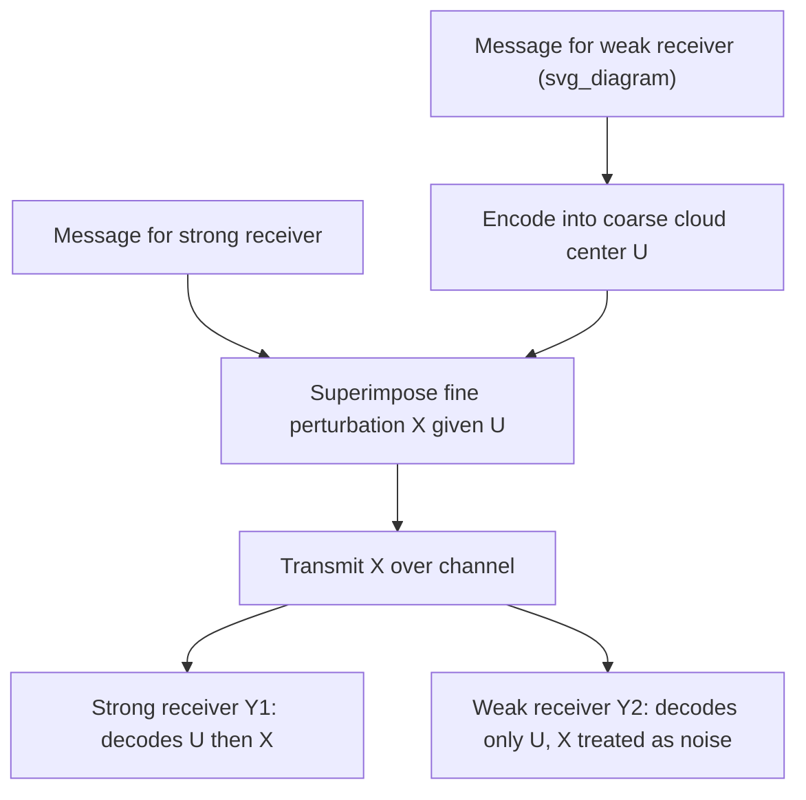

## Broadcast Channels

### Definition

A broadcast channel (BC) models the reverse scenario to the multiple access channel: a single transmitter sends information to two (or more) independent receivers over a shared channel. It is characterized by a conditional distribution:

$$p(y_1, y_2 \mid x)$$

where $X$ is the single transmitted signal, and $Y_1, Y_2$ are the (generally different, degraded, or differently-corrupted) signals observed by receiver 1 and receiver 2 respectively. The sender typically wishes to send a **common message** to both receivers, **independent private messages** to each receiver, or some combination of both, and the fundamental question is again a capacity **region** — the set of achievable rate pairs $(R_1, R_2)$ for private messages to receivers 1 and 2 — rather than a single capacity number, mirroring the MAC's structural complexity but arising from the opposite physical topology.

### Physical Motivation

Broadcast channels model scenarios such as: a single cellular base station transmitting downlink signals to multiple mobile users at different distances/channel qualities, a satellite broadcasting to multiple ground receivers with different signal strengths, or a Wi-Fi access point serving multiple client devices simultaneously. In each case, one transmitted signal is observed differently by different receivers — often because receivers experience different noise levels, distances, or channel conditions — creating an inherent tension in how to allocate the shared transmission to serve multiple receivers' needs simultaneously.

### Degraded Broadcast Channels

The most thoroughly characterized special case is the **degraded broadcast channel**, in which one receiver's observation is statistically "worse" than the other's in a precise sense: $Y_1, Y_2$ form a Markov chain with $X$, such that:

$$X \to Y_1 \to Y_2$$

meaning $Y_2$ can be modeled as a further-degraded (noisier) version of $Y_1$ — equivalently, $Y_2$ is conditionally independent of $X$ given $Y_1$. Physically, this captures the common scenario where one receiver simply has a worse channel (more noise, greater distance, weaker signal) than the other, and the "weaker" receiver's signal is statistically equivalent to first passing through the "stronger" receiver's channel and then adding further degradation.

### Capacity Region for the Degraded Broadcast Channel

For a degraded broadcast channel with $X \to Y_1 \to Y_2$ (receiver 1 the "strong"/less-noisy receiver, receiver 2 the "weak"/more-noisy receiver), the capacity region for sending independent private messages to both receivers is characterized using an auxiliary random variable $U$ (representing a "cloud center" or common coarse signal layer) via the following rate region, over all joint distributions $p(u)p(x|u)$ forming the Markov chain $U \to X \to Y_1 \to Y_2$:

$$R_2 \leq I(U;Y_2)$$
$$R_1 \leq I(X;Y_1|U)$$

with the overall region taken as the union (convex hull) over all valid choices of $p(u), p(x|u)$.

### The Superposition Coding Intuition

The auxiliary variable $U$ formalizes **superposition coding**, the achieving strategy: the transmitter encodes the weak receiver's message into a coarse, low-rate "cloud center" signal $U$ (robust enough that even the weak receiver 2, despite its worse channel, can reliably decode it), and then superimposes the strong receiver's message as a finer perturbation $X$ around each cloud center point (a refinement only the strong receiver 1's better channel can reliably resolve). Receiver 1 (strong), having a better channel, can decode both layers — first the coarse cloud center $U$, then the fine perturbation carrying its own message — while receiver 2 (weak) can only reliably decode the coarse layer $U$, treating the fine perturbation as effectively noise it cannot resolve.

### Diagram: Superposition Coding Structure

### Key Points

- Broadcast channel: one sender, multiple receivers with (generally) different channel qualities, characterized by $p(y_1,y_2|x)$
- Like the MAC, capacity is a region of achievable rate pairs, not a single number
- The degraded case ($X\to Y_1\to Y_2$) has a fully known capacity region via superposition coding
- Superposition coding layers a coarse "cloud center" $U$ (decodable by the weak receiver) with a fine perturbation (decodable only by the strong receiver)
- The general (non-degraded) broadcast channel capacity region remains, in many cases, an open or only partially solved problem

### The Gaussian Degraded Broadcast Channel

A canonical and fully solved special case: a Gaussian broadcast channel with $Y_1 = X + Z_1$, $Y_2 = X + Z_2$, where $Z_1 \sim \mathcal{N}(0,N_1)$, $Z_2\sim\mathcal{N}(0,N_2)$, and $N_1 < N_2$ (receiver 1 has less noise, hence is the "strong" receiver; this ordering makes the Gaussian BC automatically degraded, a special structural feature of the Gaussian case). Under a power constraint $E[X^2]\leq P$, and splitting the total power as $P = \alpha P + (1-\alpha)P$ for some power-splitting fraction $\alpha \in [0,1]$ (the fraction allocated to the strong receiver's private message):

$$R_1 \leq \frac{1}{2}\log_2\left(1+\frac{\alpha P}{N_1}\right)$$
$$R_2 \leq \frac{1}{2}\log_2\left(1+\frac{(1-\alpha)P}{\alpha P + N_2}\right)$$

Here $\alpha P$ is the power allocated to receiver 1's fine (superposed) signal, and $(1-\alpha)P$ is allocated to the shared coarse cloud-center signal (decodable by receiver 2, and also usable by receiver 1 since it has a strictly better channel). Varying $\alpha \in [0,1]$ traces out the entire boundary of the achievable rate region, from $\alpha=0$ (all power to the common/weak-receiver message, maximizing $R_2$ at the cost of $R_1=0$) to $\alpha=1$ (all power to the strong receiver's private message, maximizing $R_1$, with $R_2$ reduced to whatever residual rate the weak receiver can extract).

### Worked Example

**Example**

A Gaussian BC has $P=10$, $N_1=1$ (strong receiver), $N_2=4$ (weak receiver). Compute $(R_1,R_2)$ at power-split $\alpha=0.5$.

$$R_1 = \frac{1}{2}\log_2\left(1+\frac{0.5\times 10}{1}\right) = \frac{1}{2}\log_2(6) \approx \frac{1}{2}(2.585) \approx 1.29 \text{ bits}$$

$$R_2 = \frac{1}{2}\log_2\left(1+\frac{0.5\times10}{0.5\times10+4}\right) = \frac{1}{2}\log_2\left(1+\frac{5}{9}\right) = \frac{1}{2}\log_2(1.556) \approx \frac{1}{2}(0.638) \approx 0.32 \text{ bits}$$

Compare to the extreme $\alpha=1$ (all power to strong receiver, none reserved for weak): $R_1 = \frac{1}{2}\log_2(1+10) = \frac{1}{2}\log_2(11)\approx1.73$ bits, $R_2=0$. Reducing $\alpha$ from 1 to 0.5 sacrifices some of receiver 1's rate ($1.73\to1.29$) to open up nonzero rate for receiver 2 ($0\to0.32$) — a direct numerical illustration of the fundamental rate tradeoff the capacity region formalizes.

### Comparison: Broadcast vs. Multiple Access Duality

**Key Points**
- MAC: many senders, one receiver; sum-rate constraint arises because one receiver must jointly disambiguate multiple independent signals
- BC: one sender, many receivers; rate tradeoff arises because one transmitted signal must simultaneously serve receivers with different channel qualities
- Both problems are characterized by rate *regions*, not single capacity numbers
- The Gaussian MAC and Gaussian BC exhibit a deep mathematical duality: their capacity regions are related by a power-allocation transformation, and achieving schemes (successive cancellation for MAC, superposition coding for BC) are structurally mirror images of each other
- [Inference] This MAC-BC duality is a well-established result in multiuser information theory, generally presented as an exact capacity region correspondence for the Gaussian case specifically; its extension to fully general (non-Gaussian) channels is more nuanced and typically requires additional conditions to hold exactly, so care should be taken before assuming the duality applies unconditionally outside the Gaussian setting.

### Common Pitfalls

- Assuming all broadcast channels are degraded — the fully general, non-degraded BC capacity region is not completely known in the literature for common message + private message combinations, unlike the fully solved degraded case.
- Confusing the "strong"/"weak" receiver terminology with anything other than relative noise/channel quality as formalized by the degradation Markov chain $X\to Y_1\to Y_2$ — it is a precise statistical ordering, not merely an informal notion of signal strength.
- Treating a single power-split value $\alpha$ as "the" capacity-achieving choice — different $\alpha$ values trade off $R_1$ against $R_2$ along the boundary of the region; which $\alpha$ is "best" depends on the specific rate requirements or fairness criteria of the application, not a universal optimum.
- Overextending the elegant Gaussian BC-MAC duality result to general broadcast channels without verifying the specific structural conditions required for the duality to hold exactly.

**Related Topics**
- MAC-BC duality and its precise conditions in the Gaussian case
- Superposition coding and successive decoding in practical systems (e.g., NOMA downlink)
- Capacity region of the general (non-degraded) broadcast channel — open problems
- Broadcast channel with a common message plus independent private messages
- Multiuser MIMO broadcast channels and dirty paper coding