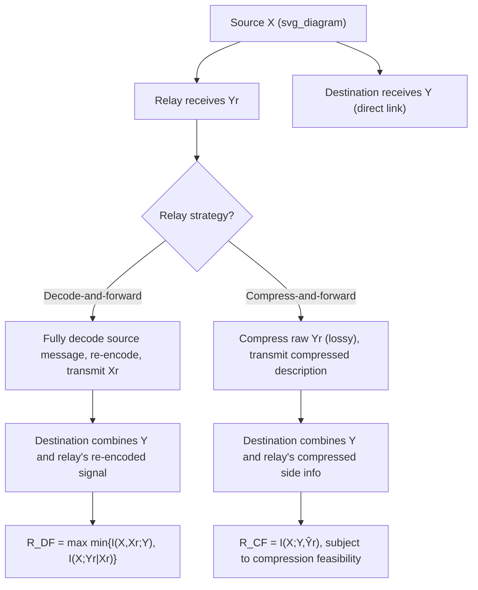

## Relay Channels

### Definition

A relay channel models a communication scenario in which a source transmits information to a destination with the assistance of one or more intermediate **relay** nodes, which receive the source's signal and retransmit some processed version of it to help the destination decode. The simplest (single-relay) case is characterized by a joint conditional distribution:

$$p(y, y_r \mid x, x_r)$$

where $X$ is the source's transmitted signal, $X_r$ is the relay's transmitted signal, $Y_r$ is what the relay receives (from the source), and $Y$ is what the destination receives (from both the source and the relay, generally). Unlike the MAC (many senders, one receiver) or the BC (one sender, many receivers), the relay channel involves a single source-destination pair assisted by an intermediary — a three-terminal network with a genuinely different topology from either previous case.

### Why Relaying Helps

Intuitively, a relay can improve the effective source-to-destination channel in ways a direct link cannot, primarily because the relay typically has a better vantage point relative to the destination (e.g., positioned partway between source and destination, experiencing less severe path loss or fading than a direct long-distance link) and can apply processing (decoding, re-encoding, amplification, or other signal transformations) before retransmitting. The central information-theoretic question is precisely how much capacity gain relaying can provide over the direct source-destination link alone, and what relaying *strategy* the relay should use.

### Key Points

- Relay channel: source → relay → destination, with a genuinely three-terminal topology distinct from MAC or BC
- Relay assistance can strictly increase achievable rate over the direct link alone
- Two canonical relaying strategies — decode-and-forward and compress-and-forward — bound achievable rates from different structural approaches, each optimal in different channel regimes
- Unlike the MAC and (degraded) BC, the general relay channel capacity is **not** fully known/solved in general
- The degraded relay channel (an analogue to the degraded BC) is the primary special case with an exactly known capacity

### Decode-and-Forward

In the **decode-and-forward** (DF) strategy, the relay fully decodes the source's message (or a portion of it) from its received signal $Y_r$, re-encodes it (potentially into a different, relay-specific codeword), and transmits this re-encoded signal to the destination. The destination then combines information from both the direct source-destination link and the relay's retransmission to decode the final message — typically via a joint decoding process across a block-Markov coding scheme spanning multiple transmission blocks.

**Achievable rate (decode-and-forward, general relay channel)**:

$$R_{\text{DF}} = \max_{p(x,x_r)} \min\big\{I(X,X_r;Y),\ I(X;Y_r|X_r)\big\}$$

The minimum of two mutual information terms reflects a fundamental bottleneck structure: the achievable rate cannot exceed what the relay itself can reliably decode from the source ($I(X;Y_r|X_r)$, the source-to-relay link capacity, conditioned on knowing the relay's own past transmission), nor can it exceed what the destination can extract from the combined source-plus-relay signal ($I(X,X_r;Y)$). DF is most effective when the source-to-relay link is strong (high $I(X;Y_r|X_r)$), so the relay's own decoding does not become the binding constraint.

### Compress-and-Forward

In the **compress-and-forward** (CF) strategy, the relay does *not* attempt to fully decode the source's message; instead, it compresses (using lossy source coding / rate-distortion principles) its own noisy received observation $Y_r$ and forwards this compressed description to the destination. The destination then combines this compressed side information with its own direct-link observation $Y$ to decode the source's message.

**Achievable rate (compress-and-forward, general relay channel)**:

$$R_{\text{CF}} = I(X;Y,\hat{Y}_r)$$

subject to a compression-feasibility (Wyner-Ziv-type) constraint relating the compression rate of $\hat Y_r$ (the relay's quantized/compressed version of $Y_r$) to the relay-to-destination link capacity: $I(Y_r;\hat Y_r|X_r,Y) \leq I(X_r;Y)$, ensuring the relay's compressed description can itself be reliably conveyed over the relay-to-destination link. CF is most effective when the source-to-relay link is comparatively weak (so full decoding at the relay, as DF would require, is not reliably achievable) but the relay's raw observation $Y_r$ is nonetheless still usefully correlated with $X$, making even an imperfectly compressed version of it valuable side information at the destination.

### Diagram: Relay Channel Strategies

### The Degraded Relay Channel

Analogous to the degraded broadcast channel, a **degraded relay channel** satisfies a Markov chain condition where the relay's observation is, in a precise statistical sense, at least as informative as the destination's:

$$X \to (Y_r, X_r) \to Y$$

For this degraded case, decode-and-forward is proven to be **capacity-achieving** (not merely a lower bound) — the achievable DF rate exactly equals the channel's true capacity:

$$C = \max_{p(x,x_r)} \min\{I(X,X_r;Y),\ I(X;Y_r|X_r)\}$$

This is one of the few relay channel configurations with a fully resolved, exact capacity characterization — the general (non-degraded) relay channel capacity remains, in the broader literature, an open problem, with DF and CF representing the two best known general-purpose achievable-rate strategies (and their max, or more sophisticated hybrid combinations, typically providing the best known achievable lower bounds on capacity for channels outside the degraded special case).

### Cutset Upper Bound

A general (not always tight) upper bound on relay channel capacity, applicable regardless of degradedness, is the **cutset bound**:

$$C \leq \max_{p(x,x_r)} \min\big\{I(X,X_r;Y),\ I(X;Y,Y_r|X_r)\big\}$$

This bound arises from considering two possible "cuts" separating source from destination in the three-terminal network: one cut isolating the source alone (bounding the rate by what a receiver seeing both $Y$ and $Y_r$, i.e., destination-plus-relay jointly, could extract from $X$), and another cut isolating the destination alone (bounding the rate by what the destination can extract from both source and relay's transmissions jointly, $I(X,X_r;Y)$). For the degraded relay channel specifically, this cutset bound coincides exactly with the DF achievable rate, which is precisely why DF is proven optimal (achievability meets converse) in that special case.

### Worked Example (Conceptual)

**Example**

Consider a relay channel where the source-to-relay link is very strong (near error-free, e.g., $I(X;Y_r|X_r)$ close to $\log_2|\mathcal{X}|$, the maximum possible) but the relay-to-destination link is comparatively weaker. In this regime, decode-and-forward is well-suited: the relay can reliably decode nearly all source information, so the DF rate's binding constraint becomes $I(X,X_r;Y)$ (limited by the combined signal reaching the destination), not the source-to-relay link — and this matches the cutset upper bound closely in this regime, since the "isolate the source" cut ($I(X;Y,Y_r|X_r)$) is not binding when the relay already captures nearly all of $X$'s information. [Inference] Conversely, in a regime where the source-to-relay link is weak but the raw relay observation $Y_r$ remains statistically informative about $X$ even if not fully decodable, compress-and-forward would typically be expected to outperform decode-and-forward, since DF's rate would otherwise be capped by the weak $I(X;Y_r|X_r)$ term regardless of how strong the relay-to-destination link is; this qualitative crossover between DF and CF dominance in different regimes is a standard structural takeaway, though the precise numerical crossover point depends on the specific channel parameters.

### Common Pitfalls

- Assuming decode-and-forward is always the better (or capacity-achieving) strategy — it is only proven optimal for the degraded relay channel; in general, compress-and-forward can outperform DF, particularly when the source-to-relay link is comparatively weak.
- Treating the relay channel as a simple concatenation of two separate point-to-point links (source-to-relay, then relay-to-destination) — this ignores the direct source-to-destination link and the joint/combined decoding across multiple blocks that both DF and CF actually exploit, generally understating true achievable rates.
- Assuming the general relay channel capacity is fully known — unlike the MAC and the degraded BC, the general (non-degraded) relay channel remains an open problem in information theory, with only bounds (cutset bound, DF, CF) and special-case exact results (degraded case) established.
- Forgetting the compression-feasibility constraint in compress-and-forward — the relay cannot forward an arbitrarily fine-grained compressed description of $Y_r$; the compression rate is itself limited by the relay-to-destination link's own capacity, a Wyner-Ziv-type constraint that must be checked explicitly.

**Related Topics**
- Wyner-Ziv coding (source coding with decoder side information) underlying compress-and-forward
- Multi-relay and relay network generalizations (multiple relays, more complex topologies)
- Cooperative communication and cooperative diversity in wireless networks
- Network coding and its relationship to relay/routing strategies
- Amplify-and-forward as a simpler (non-regenerative) relaying strategy