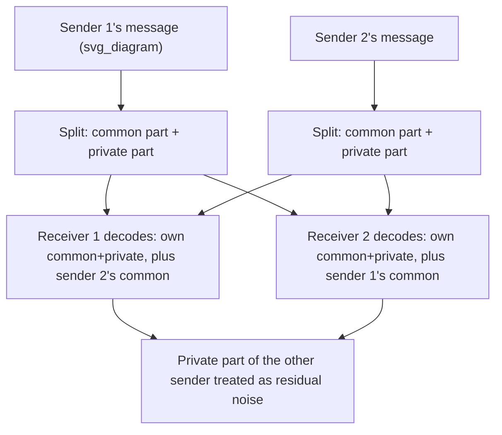

## Interference Channels

### Definition

An interference channel (IC) models a scenario with two (or more) independent sender-receiver pairs sharing a common medium, where each receiver is primarily interested only in its *own* sender's message, but each receiver's observation is corrupted by the *other* sender's transmission as unwanted interference. The two-user case is characterized by:

$$p(y_1, y_2 \mid x_1, x_2)$$

where sender $i$ transmits $X_i$ intending to communicate with receiver $i$ only, and receiver $i$ observes $Y_i$, a signal affected by both its own intended sender and the other sender's interfering transmission. This is structurally distinct from both the MAC (where a single receiver wants messages from *both* senders) and the BC (where a single sender wants to reach *both* receivers with, generally, related content) — in the IC, the two source-destination pairs are fundamentally independent communication links that merely happen to interfere with each other, with **no cooperative intent** between the two pairs.

### Why the Interference Channel Is Harder Than MAC or BC

The general interference channel's capacity region remains, to this day, an open problem in information theory — unlike the MAC (fully solved) and the degraded BC (fully solved), no complete, general capacity region characterization exists for the general IC. This makes the IC one of the most actively studied unsolved problems in multiuser information theory, and understanding *why* it resists a clean solution constitutes much of the topic's foundational content.

### Key Points

- IC: two independent sender-receiver pairs, each receiver interested only in its own sender's message, corrupted by the other's interference
- The general two-user IC capacity region is an **open problem** — no complete solution is known
- The best known general achievable region is the **Han-Kobayashi region**, based on splitting each message into "common" and "private" parts
- Two important, fully or near-fully solved special cases exist: the **very strong interference** regime and the **strong interference** regime
- Interference alignment is a more recent technique achieving substantial gains in specific many-user or multi-antenna regimes

### The Han-Kobayashi Achievable Region

The most general and best-known achievability result for the two-user interference channel is the **Han-Kobayashi (HK) scheme**, which splits each sender's message into two parts:

- A **common part**, encoded so that *both* receivers can decode it (making it partially "visible" and hence removable/manageable by the unintended receiver)
- A **private part**, encoded so that only the intended receiver decodes it, with the unintended receiver treating it purely as noise

Each receiver then jointly decodes its own message (both common and private parts) along with the *other* sender's common part (needed so it can be treated as known, rather than as unresolved interference, when decoding). This message-splitting strategy allows a controlled, partial reduction of interference (via the common parts, which both receivers can resolve and hence "subtract" or account for) while accepting some irreducible residual interference from the other sender's private part.

The Han-Kobayashi achievable rate region is described by a system of inequalities involving the common and private message rates and various mutual information terms — it is known to be the best available general achievable region, but it has not been proven to be capacity-achieving (tight) in general; it is conjectured to be very close to (and in specific cases proven to equal) the true capacity region, but a full general converse matching it remains unestablished.

### Diagram: Han-Kobayashi Message Splitting

### Special Case: Very Strong Interference

When the interference is **very strong** — precisely, when the cross-link (interfering) channel is strong enough that each receiver can *fully decode the other sender's message first*, then subtract it out before decoding its own message (a successive-cancellation-like structure reminiscent of the MAC) — the capacity region is exactly known and coincides with treating the two links essentially as if there were no interference at all (each achieves its own point-to-point capacity, since the interference is strong enough to be entirely decoded and removed rather than being a genuine impairment). This is a somewhat counterintuitive result: interference so strong that it can be fully decoded is, paradoxically, easier to handle than moderate interference that is strong enough to be harmful but too weak to be reliably decoded and cancelled.

### Special Case: Strong Interference

A related, slightly less restrictive condition, **strong interference**, also admits a known, exact capacity region (a proper subset of the general problem that has been fully resolved), characterized by a system of inequalities similar in flavor to the MAC capacity region — reflecting the intuition that under strong interference, each receiver effectively faces a MAC-like joint decoding problem (needing to resolve both its own and the other's signal, at least partially) rather than an untreatable degradation.

### Interference Alignment

For interference channels with more than two users (or with multiple antennas at each terminal), a technique called **interference alignment** has demonstrated that surprising gains are achievable in certain regimes — for example, in a $K$-user interference channel under suitable conditions, each user can achieve close to *half* of its interference-free point-to-point capacity, simultaneously, regardless of how large $K$ grows (a result popularly summarized as each user getting access to "half the cake" even as the number of interfering users increases without bound). The technique works by designing transmit signals (typically via precoding across multiple time slots, frequencies, or antennas) so that, from the perspective of any given unintended receiver, all the *other* users' interfering signals collapse into (align within) a lower-dimensional subspace, leaving a clear, interference-free subspace for the intended signal to be recovered from. [Inference] The precise achievability of this "half the cake" degrees-of-freedom result depends on specific channel model assumptions (typically time-varying or frequency-selective channels with sufficient diversity for the alignment construction to be feasible), and its translation into concrete finite-SNR rate gains (rather than asymptotic degrees-of-freedom gains) in practical deployed systems is an active area of engineering research rather than a settled, universally realized practical gain.

### Worked Example (Conceptual)

**Example**

Consider a two-user Gaussian interference channel where the cross-interference gain is very high — so high that, from receiver 1's perspective, sender 2's interfering signal actually arrives *more* strongly than at its own intended receiver 2, making it trivially decodable at receiver 1 (a proxy for the "very strong interference" condition). In this regime, receiver 1 first decodes and removes sender 2's message entirely, then decodes its own message from an effectively interference-free residual channel — achieving its own point-to-point Gaussian channel capacity $\frac{1}{2}\log_2(1+P_1/N_1)$ exactly, as if sender 2 didn't exist. Symmetric reasoning applies for receiver 2. This illustrates concretely why very strong interference reduces to the "no interference" capacity result, matching the general very-strong-interference theorem described above.

### Common Pitfalls

- Assuming the general two-user IC capacity region is fully known, by analogy with the (solved) MAC and degraded BC — it is explicitly *not* solved in general; only the very-strong and strong interference special cases have exact solutions.
- Treating interference always as purely harmful — the very-strong interference result shows that sufficiently strong interference, precisely because it becomes fully decodable, can be entirely eliminated via cancellation, unlike moderate interference which is genuinely damaging.
- Confusing the Han-Kobayashi achievable region (a lower bound / achievability result, best known but not proven universally tight) with the true, unknown general capacity region.
- Overgeneralizing interference alignment's asymptotic (large-$K$, or specific channel diversity) degrees-of-freedom gains to arbitrary practical finite-SNR, finite-diversity deployment scenarios without checking that the required channel conditions for alignment actually hold.

**Related Topics**
- The Han-Kobayashi region in full inequality form and its relation to the true capacity region
- Gaussian interference channel and the weak/moderate interference regime characterization
- Interference alignment: precoding design and degrees-of-freedom analysis
- Cognitive radio channels (interference channel with one-sided message cooperation)
- Deterministic channel models (e.g., the ADT deterministic model) as a simplifying tool for IC capacity approximation