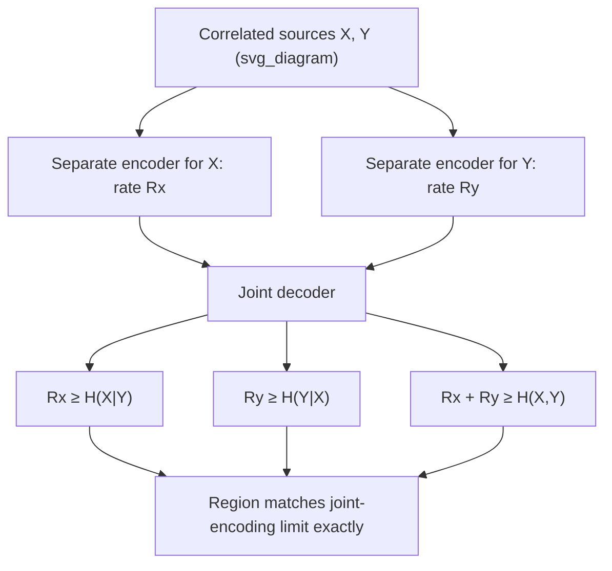

## Slepian-Wolf Coding for Distributed Source Compression

### Motivation

Classical source coding assumes a single encoder with full joint access to all the data it is compressing. But many practical systems involve **distributed sources**: multiple correlated data streams generated at physically separate locations, each with its own encoder that has *no access* to the other streams — for example, sensors scattered across a field measuring correlated environmental data, or multiple cameras capturing correlated views of the same scene, each compressing its own feed independently before transmission to a common receiver. The natural question is: does encoding separately (without access to the other correlated source) force a rate penalty compared to joint encoding, where a single encoder sees both sources together and can directly exploit their correlation?

### The Slepian-Wolf Theorem: Surprising Result

The Slepian-Wolf theorem, remarkably, shows that **separate encoding of correlated sources can achieve the same total rate as joint encoding**, provided the two encoders' outputs are **decoded jointly** at a single common receiver. This is a striking and non-obvious result: intuitively, one might expect that an encoder unable to see the other correlated source must "waste" rate by not exploiting the correlation directly at encoding time, but the theorem shows this intuition is wrong — as long as joint decoding is used, no rate penalty is incurred, even though encoding remains fully separate and uncoordinated.

### Setup

Let $X$ and $Y$ be two correlated discrete random variables (or, more generally, i.i.d. sequences $X^n, Y^n$ drawn from a joint distribution $p(x,y)$), each observed and encoded by a *separate* encoder with no access to the other source. Each encoder produces a compressed representation at rates $R_X$ and $R_Y$ respectively; a single joint decoder receives both compressed representations and attempts to reconstruct both $X^n$ and $Y^n$ exactly (losslessly).

### The Slepian-Wolf Rate Region

The set of achievable rate pairs $(R_X, R_Y)$ for lossless joint reconstruction, with fully separate encoding, is:

$$R_X \geq H(X\mid Y)$$
$$R_Y \geq H(Y\mid X)$$
$$R_X + R_Y \geq H(X,Y)$$

This region, remarkably, is **identical** to what would be achievable if a single joint encoder had access to both $X$ and $Y$ simultaneously and could exploit their correlation directly — the sum-rate bound $H(X,Y)$ is exactly the joint entropy, the same fundamental limit that would apply under joint encoding. Separate encoding costs nothing in total rate, provided joint decoding is employed.

### Diagram: The Slepian-Wolf Rate Region

### Key Points

- Slepian-Wolf coding: separately encode correlated sources $X,Y$, jointly decode at a common receiver
- Achievable rate region matches the joint-encoding bound exactly — no rate penalty for encoding separately
- Individual rate bounds ($R_X \geq H(X|Y)$, etc.) reflect that each source can be compressed down to its own conditional entropy given the other, *as if* the encoder secretly knew the other source (even though it does not)
- The sum-rate bound $R_X+R_Y \geq H(X,Y)$ matches the joint entropy exactly, the same bound that would apply for a single combined encoder
- The result requires joint decoding; it does *not* claim each source can be compressed alone (without the other's help at decoding time) down to its conditional entropy

### Why This Result Is Surprising: The Intuition Gap

The counterintuitive part is the individual bound $R_X \geq H(X|Y)$: this says $X$ can be compressed down to its *conditional* entropy given $Y$ — a quantity that, by definition, reflects how much uncertainty remains in $X$ *if $Y$ were known* — **even though the encoder compressing $X$ never observes $Y$ at all**. The resolution of this apparent paradox is that the *decoder* does have access to both compressed streams jointly, and can use the compressed version of $Y$ (received separately) as side information when decoding $X$'s compressed stream — so the correlation is exploited at decoding time, not encoding time, and this turns out to be just as effective for total rate purposes.

### Achievability Sketch: Random Binning

The proof of achievability uses a technique called **random binning**, which is structurally quite different from typical single-source compression proofs (e.g., typical-set-based source coding):

1. For source $X$, randomly partition the entire set of typical sequences $x^n$ into $2^{nR_X}$ **bins**, assigning each typical sequence to a bin independently and uniformly at random.
2. The encoder for $X$, upon observing a specific sequence $x^n$, transmits only the **bin index** (not the sequence itself) — requiring only $R_X$ bits, since there are $2^{nR_X}$ bins.
3. Similarly, encode $Y^n$ into its own random bins at rate $R_Y$.
4. At the joint decoder, having received both bin indices, search within the corresponding two bins (the set of $x^n$ sequences consistent with $X$'s bin index, and $y^n$ sequences consistent with $Y$'s bin index) for a **unique jointly typical pair** $(x^n,y^n)$ — a pair whose joint statistics match the true joint distribution $p(x,y)$ closely.
5. Because truly correlated (jointly typical) pairs are relatively rare compared to the total space of possible sequence pairs, if the bins are large enough (rates high enough, per the stated region), a unique jointly typical pair exists within the received bins with high probability as $n\to\infty$, allowing correct joint decoding.

The key insight making random binning work is that jointly typical *pairs* are far rarer than the individually typical sequences that make up each bin — so even though many $x^n$ sequences share the same bin index, only one of them is likely to form a jointly typical pair with the received $y^n$ bin's content, making disambiguation possible.

### Worked Example

**Example**

Let $X$ and $Y$ be binary random variables with joint distribution: $P(X=Y) = 0.9$, $P(X\neq Y) = 0.1$ (i.e., $Y$ is $X$ passed through a binary symmetric "correlation channel" with crossover 0.1), with $X$ (and hence $Y$, by symmetry of this construction) individually uniform on $\{0,1\}$.

Compute the relevant entropies. Since $X\oplus Y$ (the discrepancy) is Bernoulli(0.1), independent of $X$ under this symmetric construction:

$$H(Y|X) = H(X\oplus Y) = H_b(0.1) \approx 0.469 \text{ bits}$$

(using the binary entropy function $H_b(p) = -p\log_2p-(1-p)\log_2(1-p)$). By the same symmetric reasoning, $H(X|Y) = H_b(0.1) \approx 0.469$ bits as well. Individual marginal entropy: $H(X)=H(Y)=1$ bit (uniform binary). Joint entropy via chain rule: $H(X,Y) = H(X)+H(Y|X) = 1+0.469=1.469$ bits.

**Slepian-Wolf region**: $R_X \geq 0.469$, $R_Y\geq0.469$, $R_X+R_Y\geq1.469$. A valid symmetric operating point is $R_X=R_Y=0.7345$ bits (half the sum bound), satisfying all three constraints with a small margin above each individual bound — achievable via separate encoding with joint decoding, at a *combined* rate of 1.469 bits, identical to what joint encoding of the correlated pair would require (since $H(X,Y)=1.469$ is the fundamental joint-encoding limit too).

### Practical Applications and the Wyner-Ziv Extension

Slepian-Wolf coding underlies practical distributed source coding schemes, particularly in **distributed video coding** (where computational complexity is deliberately shifted from encoder to decoder, useful for low-power sensor/camera devices) and **sensor network data aggregation** (where individual sensors compress readings without coordinating with neighboring, correlated sensors). The theorem's natural extension to **lossy** distributed compression — allowing some distortion rather than requiring exact reconstruction, with one source available as decoder-only side information — is the **Wyner-Ziv problem**, a distinct but closely related topic building directly on the Slepian-Wolf framework's random-binning technique combined with rate-distortion principles.

### Common Pitfalls

- Believing Slepian-Wolf implies each source alone can be compressed to its conditional entropy *without* the decoder needing the other stream — the result requires **joint decoding** using both compressed streams together; a decoder with access to only $X$'s compressed bin index (and no side information about $Y$) generally cannot recover $X^n$ from a rate-$H(X|Y)$ encoding.
- Assuming the achievability proof (random binning) is a directly practical, implementable coding scheme "out of the box" — like other Shannon-theoretic achievability results, it is an existence proof relying on random constructions and asymptotic block lengths; practical Slepian-Wolf-inspired codes use structured approaches (e.g., syndrome-based coding using channel codes like LDPC codes, exploiting the analogy between binning and coset/syndrome decoding).
- Confusing Slepian-Wolf (lossless distributed compression) with Wyner-Ziv (lossy distributed compression with decoder side information) — they address related but distinct problems, with Wyner-Ziv building on but generalizing beyond the lossless Slepian-Wolf setting.
- Treating the individual rate bound $R_X \geq H(X|Y)$ as achievable by $X$'s encoder alone without any coordination assumptions — while the encoders operate independently at encoding time, the overall system design (choice of binning rates, decoder architecture) is still designed jointly in advance, based on known statistics of the joint distribution $p(x,y)$.

**Related Topics**
- Wyner-Ziv coding: lossy distributed source coding with decoder side information
- Random binning and its relation to channel coding via syndrome/coset decoding
- Distributed video coding and practical LDPC-based Slepian-Wolf implementations
- Multiterminal source coding for more than two correlated sources
- Common information and the Gács-Körner / Wyner common information measures