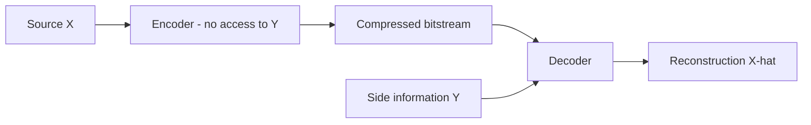
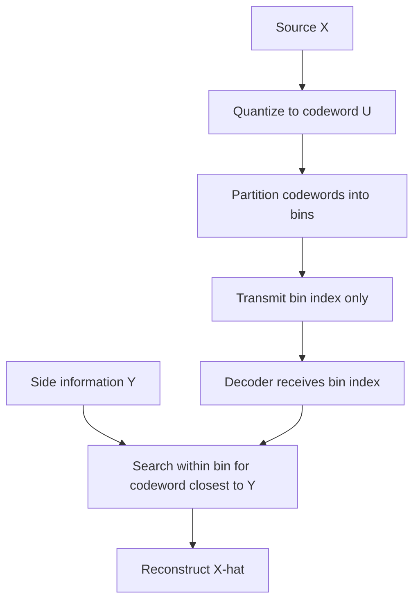

## Wyner-Ziv Coding with Side Information

### Overview

Wyner-Ziv coding is a form of lossy source coding in which a source is compressed without access to correlated side information at the encoder, while the decoder does have access to that side information. It generalizes the Slepian-Wolf theorem (lossless distributed coding) to the lossy case and forms the theoretical foundation for distributed source coding, with applications ranging from distributed sensor networks to low-complexity video encoding.

### Historical Background

The problem was formulated and solved by Aaron Wyner and Jacob Ziv in 1976, extending the earlier lossless result of Slepian and Wolf (1973). The counterintuitive and foundational result of the Wyner-Ziv theorem is that, under certain conditions, an encoder without access to side information can achieve nearly the same rate-distortion performance as an encoder that does have access to it, provided the decoder has the side information.

### Problem Setup

**System Model**

Consider a source $X$ that must be compressed to satisfy a distortion constraint $D$, and correlated side information $Y$ that is available only at the decoder, not the encoder:

The encoder must design a compression scheme that anticipates the statistical correlation between $X$ and $Y$ without directly observing $Y$.

**Contrast with Conventional Coding**

- **Conventional (joint) coding**: both encoder and decoder have access to $Y$; this is the baseline for comparison
- **Wyner-Ziv coding**: only the decoder has $Y$
- The Wyner-Ziv theorem characterizes the rate penalty (if any) incurred by the encoder's lack of access to $Y$

### The Wyner-Ziv Rate-Distortion Function

The minimum achievable rate for a target distortion $D$, given side information $Y$ available only at the decoder, is defined as:

$$R_{WZ}(D) = \min_{p(u \mid x), \, f(u,y)} \left[ I(X; U) - I(Y; U) \right]$$

subject to the existence of a reconstruction function $f(u, y)$ achieving distortion $D$, where $U$ is an auxiliary random variable satisfying the Markov relationship $U \to X \to Y$.

**Interpretation**

- $I(X; U)$ represents the information the encoder must convey about the auxiliary variable $U$
- $I(Y; U)$ represents information about $U$ that the decoder can already infer from its own side information $Y$, and therefore does not need to be transmitted
- The difference is the actual transmission rate required

### The Key Result: No Rate Loss for Gaussian Sources

**Wyner-Ziv Theorem for Jointly Gaussian Sources**

For the important special case where $X$ and $Y$ are jointly Gaussian and distortion is measured by mean squared error, the Wyner-Ziv rate-distortion function equals the conditional rate-distortion function achieved when the encoder *also* has access to $Y$:

$$R_{WZ}(D) = R_{X \mid Y}(D)$$

This means there is no loss in rate-distortion performance from the encoder's lack of access to side information, in the Gaussian quadratic case. This result is often summarized as: **for jointly Gaussian sources, "not knowing" the side information at the encoder costs nothing**.

**General Case**

For general (non-Gaussian) sources and general distortion measures, this rate loss is not always zero: in general, $R_{WZ}(D) \geq R_{X \mid Y}(D)$, with equality holding only for special cases (jointly Gaussian sources with quadratic distortion being the most prominent one) [Inference: the precise conditions under which equality holds beyond the Gaussian case are an active subject of specialized literature and not fully generalized to arbitrary source/distortion pairs].

### Relationship to Slepian-Wolf Coding

Wyner-Ziv coding is the lossy-source-coding counterpart to Slepian-Wolf coding:

| Aspect | Slepian-Wolf | Wyner-Ziv |
|---|---|---|
| Source type | Discrete, lossless | Continuous or discrete, lossy |
| Distortion | None (exact reconstruction) | Bounded by $D$ |
| Result | Compression rate can match joint entropy conditioned on side info, even without access to it at encoder | Achievable rate approaches (or in Gaussian case, equals) rate with side info at encoder |

Wyner-Ziv coding can be viewed as combining Slepian-Wolf-style binning with conventional quantization.

### Practical Coding Architecture: Binning

The conceptual mechanism behind achieving Wyner-Ziv performance is **binning**:

**1. Quantization**

The source $X$ is first quantized to an auxiliary codeword $U$ using a standard rate-distortion-optimal quantizer, ignoring $Y$.

**2. Binning**

The space of possible quantized values is partitioned into "bins," where each bin contains multiple quantization codewords that are sufficiently different from one another (analogous to coset partitioning in channel coding). Rather than transmitting the specific codeword, the encoder transmits only the bin index.

**3. Decoding**

The decoder uses the side information $Y$ together with the received bin index to determine which codeword within that bin is most likely to be the correct one, exploiting the correlation between $X$ and $Y$.

**Duality with Channel Coding**

This binning structure is closely related to channel coding with side information (the Gelfand-Pinsker problem and its Costa "dirty paper coding" special case), reflecting a broader duality between source coding with decoder side information and channel coding with encoder side information.

### Practical Implementations

**Wyner-Ziv Video Coding (Distributed Video Coding)**

The most prominent practical application is distributed video coding (DVC), motivated by the desire to shift computational complexity from the encoder to the decoder:

- Conventional video codecs (e.g., motion-compensated predictive coding) place heavy computational burden on the encoder for motion estimation
- In Wyner-Ziv video coding, the encoder performs simple, low-complexity per-frame compression (e.g., using channel codes such as turbo codes or LDPC codes for binning)
- The decoder performs the computationally expensive task of generating side information (a predicted frame, often via motion-compensated interpolation from previously decoded frames) and exploiting it for reconstruction
- This role reversal is attractive for uplink-constrained scenarios such as wireless sensor networks, mobile cameras, and some surveillance systems, where encoder simplicity (low power, low complexity) is more valuable than decoder simplicity

**Practical Binning with Channel Codes**

Real implementations approximate the theoretical binning construction using structured channel codes:

- **Syndrome-based coding**: uses the syndrome of a channel code (e.g., an LDPC or turbo code) as the "bin index"; the decoder performs channel decoding using $Y$ as a noisy version of $X$ combined with the received syndrome
- This approach directly reuses efficient channel coding machinery (Slepian-Wolf coding via syndromes was itself pioneered using trellis and later LDPC-based codes)

### Key Points

- Wyner-Ziv coding compresses a source when correlated side information is available only at the decoder
- For jointly Gaussian sources with quadratic distortion, there is no rate loss compared to having side information at the encoder
- The practical mechanism is binning: partitioning quantized codewords into bins and using side information to resolve ambiguity within a bin at the decoder
- Wyner-Ziv coding is the lossy-source counterpart to Slepian-Wolf coding and is dual to channel coding with side information at the encoder (Gelfand-Pinsker)
- Distributed video coding is the most prominent practical application, motivated by shifting complexity from encoder to decoder

### Applications

- Distributed video coding (low-power video encoding for sensor networks, wireless cameras, and some medical imaging devices)
- Wireless sensor networks with correlated sensor readings across nodes
- Multi-view and stereo image/video compression
- Biometric and secure/private data compression, where side information relates to correlated but non-identical biometric or private data readings [Inference: application to biometric security systems is a documented research direction rather than a single universally standardized deployment]

### Advantages and Limitations

**Advantages**
- Enables very low-complexity encoders by shifting computational burden to the decoder
- Achieves rate-distortion performance matching (in the Gaussian case) or approaching (in general) the case where side information is available at the encoder
- Provides a rigorous theoretical foundation for distributed source coding systems

**Limitations**
- Practical performance depends heavily on how accurately the decoder can generate or estimate side information (e.g., accurate motion-compensated interpolation in video)
- Requires accurate knowledge or estimation of the correlation statistics between source and side information for effective binning design
- Non-Gaussian, non-quadratic-distortion cases generally incur some rate loss relative to the ideal encoder-side-information scenario
- Real-world coding gains are often smaller than theoretical predictions due to practical constraints in quantizer and channel code design [Inference: the magnitude of this gap is implementation- and application-specific]

### Related Topics

- Slepian-Wolf coding (lossless distributed source coding)
- Rate-distortion theory
- Gelfand-Pinsker channel coding with side information
- Costa's dirty paper coding
- Distributed video coding architectures
- LDPC and turbo codes for syndrome-based binning
- Multiterminal (network) information theory
- Quantization theory