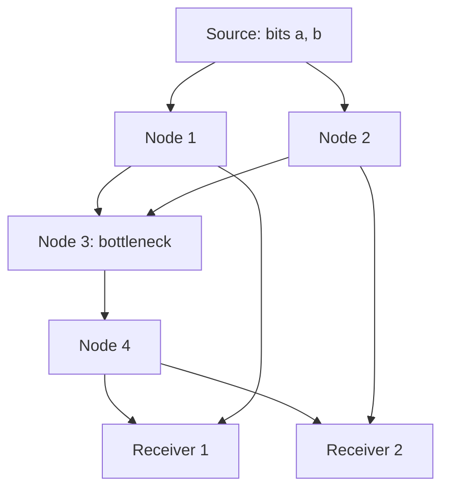

## Network Coding Fundamentals

### Overview

Network coding is a paradigm in which intermediate nodes in a network combine (rather than merely forward or replicate) the data packets they receive before transmitting them onward. Unlike traditional routing, where each node simply relays copies of received packets, network coding allows nodes to perform algebraic operations—typically over a finite field—on incoming packets, producing outgoing packets that are combinations of multiple inputs. This approach can achieve the theoretical max-flow min-cut capacity of a network for multicast traffic, something traditional routing generally cannot guarantee.

### Historical Background

The foundational result was established by Ahlswede, Cai, Li, and Yeung in their 2000 paper, which proved that network coding can achieve the max-flow min-cut bound for single-source multicast networks—a capacity that pure routing (store-and-forward) cannot always reach. This result initiated a substantial body of research spanning information theory, coding theory, and networking.

### The Butterfly Network: Canonical Example

The classic illustration of network coding's benefit is the "butterfly network," in which a single source must multicast two bits to two receivers over a network with a shared bottleneck link.

**Without network coding**: the bottleneck link (Node 3 to Node 4) can carry only one bit per use, forcing a choice between sending $a$ or $b$; one receiver is left waiting for the missing bit via retransmission, reducing throughput below the network's theoretical capacity.

**With network coding**: Node 3 transmits the XOR, $a \oplus b$, across the bottleneck. Receiver 1 (who already has $a$ from Node 1) computes $b = a \oplus (a \oplus b)$. Receiver 2 (who already has $b$ from Node 2) computes $a = b \oplus (a \oplus b)$. Both receivers obtain both bits using only one transmission on the bottleneck link, achieving the max-flow min-cut capacity that pure routing cannot reach in this topology.

### Max-Flow Min-Cut Theorem for Network Coding

**Classical Max-Flow Min-Cut**

In classical network flow theory, the maximum flow between a source and a single sink equals the minimum cut capacity separating them.

**Multicast Generalization**

The Ahlswede-Cai-Li-Yeung theorem extends this to multicast: with network coding, a source can simultaneously send information to multiple sinks at a rate equal to the *minimum*, over all sinks, of the max-flow min-cut value between the source and that sink:

$$R = \min_{t \in T} \, \text{maxflow}(s, t)$$

where $T$ is the set of sink (receiver) nodes. Achieving this rate simultaneously to all receivers using ordinary routing is not possible in general, as the butterfly network demonstrates; network coding makes it achievable.

### Linear Network Coding

**Concept**

In linear network coding, each outgoing packet at a node is formed as a linear combination (over a finite field $GF(q)$) of the incoming packets at that node:

$$y = \sum_{i} c_i x_i$$

where $x_i$ are incoming packet vectors and $c_i \in GF(q)$ are coding coefficients.

**Global Encoding Vectors**

Because linear combinations of linear combinations are themselves linear combinations, each packet observed anywhere in the network can be expressed as a linear combination of the original source packets:

$$y = \sum_{j} g_j m_j$$

The vector $(g_1, g_2, \ldots)$ is called the global encoding vector for that packet. A receiver can recover the original source packets once it has collected enough packets with linearly independent global encoding vectors to invert the resulting linear system.

**Random Linear Network Coding**

Rather than designing coding coefficients deterministically for a specific network topology (which requires global topology knowledge), coefficients can be chosen randomly and independently at each node:

- Each node selects random coefficients from $GF(q)$ to combine its incoming packets
- The global encoding vector is typically transmitted alongside the packet (e.g., prepended as a header) so receivers can perform Gaussian elimination once enough packets arrive
- For sufficiently large field size $q$, randomly chosen coefficients are linearly independent with high probability, allowing decentralized operation without requiring nodes to know the full network topology

### Linear Independence and Decoding

At a receiver, decoding amounts to solving a system of linear equations:

$$\mathbf{Y} = \mathbf{G} \mathbf{M}$$

where $\mathbf{Y}$ is the matrix of received packets, $\mathbf{G}$ is the matrix of global encoding vectors, and $\mathbf{M}$ is the matrix of original source packets. If $\mathbf{G}$ has full rank (equal to the number of source packets), Gaussian elimination recovers $\mathbf{M} = \mathbf{G}^{-1}\mathbf{Y}$.

### Key Points

- Network coding allows intermediate nodes to combine, not just forward, packets
- It can achieve the max-flow min-cut capacity for multicast, which pure routing generally cannot
- Linear network coding, particularly random linear network coding, is the dominant practical approach
- Decoding reduces to solving a linear system via Gaussian elimination once enough linearly independent combinations are received
- The approach is naturally robust to packet loss and topology changes, since any sufficiently large set of linearly independent combinations suffices for decoding

### Benefits Beyond Capacity

**Robustness to Packet Loss**

Because any sufficiently large collection of linearly independent combinations can be used for decoding (not a specific predetermined set of packets), random linear network coding is naturally robust to packet erasures—useful in lossy or dynamic networks such as wireless mesh and peer-to-peer systems.

**Throughput in Wireless Networks**

Network coding, particularly using XOR-based combining (a special case with $GF(2)$), has been applied to improve throughput in wireless networks by exploiting the broadcast nature of the wireless medium (e.g., the well-known COPE architecture for opportunistic wireless network coding).

**Distributed Storage**

Network coding techniques underpin regenerating codes and related constructions in distributed storage systems, where efficient repair of failed storage nodes benefits from coded rather than replicated or simply erasure-coded data.

### Practical Considerations

**Field Size Selection**

Larger field sizes $GF(q)$ reduce the probability of coding coefficient collisions leading to linear dependence, but increase per-symbol overhead; there is a design trade-off between overhead and decoding reliability [Inference: specific field size choices in deployed systems reflect this trade-off but vary by application and are not governed by a single universal rule].

**Overhead**

Transmitting global encoding vectors alongside data introduces header overhead, particularly significant for networks with many source packets combined together (generation size); this is typically mitigated by coding within bounded-size "generations" of packets rather than across an entire unbounded stream.

**Security Considerations**

Network coding introduces unique security concerns not present in routing:

- **Pollution attacks**: a malicious or faulty node injecting corrupted linear combinations can propagate errors that contaminate many downstream packets, since errors combine linearly with legitimate data
- Countermeasures include network-coding-specific error-correcting codes (extensions of classical coding theory to the network coding "channel"), homomorphic signatures, and hashing schemes that allow verification of linear combinations without decoding

### Network Error Correction

Network coding has motivated a network-level generalization of classical error-correcting code theory, where errors can be injected at any node in the network rather than only at a single point-to-point channel:

- The network Singleton bound generalizes the classical Singleton bound to network coding settings
- Network error-correcting codes can correct a bounded number of erroneous or adversarially controlled links across the network, analogous to how classical codes correct symbol errors in a single channel

### Relationship to Other Areas

| Concept | Relationship to Network Coding |
|---|---|
| Distributed source coding (Slepian-Wolf) | Both address multiterminal information flow; network coding addresses routing/combining, distributed source coding addresses correlated sources |
| Erasure coding | Network coding generalizes and often outperforms end-to-end erasure coding in networks with intermediate combining opportunities |
| Index coding | A related problem involving broadcasting to receivers with different side information, connected to network coding through common coding techniques |
| Matroid theory | The achievability and limits of linear network coding are deeply connected to matroid representability |

### Advantages and Limitations

**Advantages**
- Achieves max-flow min-cut multicast capacity, unbeatable by routing alone
- Naturally robust to packet loss and dynamic topologies
- Enables decentralized, topology-oblivious operation via random linear network coding
- Improves efficiency in wireless broadcast and distributed storage settings

**Limitations**
- Computational cost of encoding/decoding (matrix operations) at intermediate and receiver nodes
- Header overhead from transmitting encoding vectors
- Vulnerability to pollution attacks requiring additional security mechanisms
- Benefits are most pronounced for multicast; for single unicast flows, the capacity gains over routing are more limited [Inference: the extent of unicast gains remains an active and nuanced research question, particularly the network coding gain for general unicast networks, which is not as cleanly characterized as the multicast case]

### Related Topics

- Max-flow min-cut theorem (classical network flow theory)
- Random linear network coding and Gaussian elimination decoding
- Index coding problem
- Distributed storage and regenerating codes
- Network error correction and the network Singleton bound
- Matroid theory and representability
- Slepian-Wolf distributed source coding
- Secure and robust network coding against pollution attacks