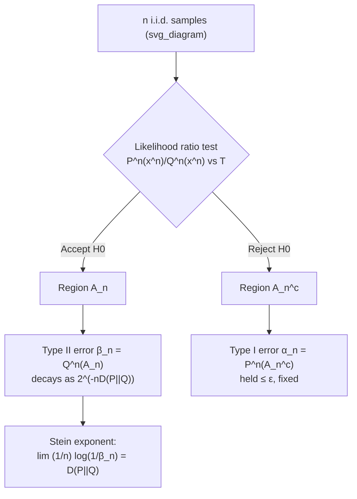

## Hypothesis Testing and Stein's Lemma

### Overview

Hypothesis testing in information theory asks how well one can distinguish between two probability distributions given a sequence of observations. Stein's lemma quantifies the exponential rate at which the probability of one type of error can be driven to zero while the other is held at a fixed, tolerable level. The relative entropy (Kullback-Leibler divergence) between the two distributions emerges as the fundamental limit governing this exponential rate, providing an operational interpretation of KL divergence beyond its role as a measure of distributional difference.

### Setup: Binary Hypothesis Testing

Consider i.i.d. samples $X_1, X_2, \ldots, X_n$ drawn from an unknown distribution, and two competing hypotheses:

$$H_0: X_i \sim P \qquad H_1: X_i \sim Q$$

A test is a decision rule that partitions the sample space $\mathcal{X}^n$ into an acceptance region $A_n$ for $H_0$ and its complement $A_n^c$ for $H_1$.

Two types of error arise:

- **Type I error** (false alarm): rejecting $H_0$ when it is true.
$$\alpha_n = P^n(A_n^c)$$
- **Type II error** (miss): accepting $H_0$ when $H_1$ is true.
$$\beta_n = Q^n(A_n)$$

There is an inherent trade-off between $\alpha_n$ and $\beta_n$; no test can simultaneously drive both to zero at an arbitrary rate for finite $n$. The central question is: if $\alpha_n$ is held below some fixed threshold $\varepsilon$, how fast can $\beta_n$ decay as $n \to \infty$?

### The Neyman-Pearson Lemma

Stein's lemma relies on the Neyman-Pearson lemma, which characterizes the optimal test for a fixed sample size.

**Statement:** For testing $P$ versus $Q$ using $n$ samples, the test that minimizes $\beta_n$ for a given bound on $\alpha_n$ is a likelihood ratio test. The optimal acceptance region has the form

$$A_n = \left\{ x^n \in \mathcal{X}^n : \frac{P^n(x^n)}{Q^n(x^n)} > T \right\}$$

for some threshold $T$ chosen to satisfy the constraint on $\alpha_n$. This result establishes that likelihood ratio tests are optimal in the Neyman-Pearson sense, and it is the tool used to construct the tests that achieve the exponent identified by Stein's lemma.

### Stein's Lemma: Statement

Let $P$ and $Q$ be two distributions on a finite alphabet, with $D(P \| Q) < \infty$. Fix $\varepsilon \in (0, 1)$ and define

$$\beta_n^{\varepsilon} = \min_{A_n \subseteq \mathcal{X}^n : \, P^n(A_n) \geq 1 - \varepsilon} Q^n(A_n)$$

That is, $\beta_n^{\varepsilon}$ is the smallest achievable Type II error among all tests whose Type I error is at most $\varepsilon$.

**Stein's lemma** states that

$$\lim_{n \to \infty} \frac{1}{n} \log \frac{1}{\beta_n^{\varepsilon}} = D(P \| Q)$$

for every fixed $\varepsilon \in (0, 1)$. Equivalently,

$$\beta_n^{\varepsilon} \doteq 2^{-nD(P\|Q)}$$

where $\doteq$ denotes equality to first order in the exponent. Crucially, this limit does not depend on the choice of $\varepsilon$ — the exponential rate of decay of $\beta_n$ is the same regardless of how loosely or tightly $\alpha_n$ is constrained, as long as it stays fixed and strictly between 0 and 1.

**Key Points**
- The relative entropy $D(P\|Q)$ is not merely a divergence measure — it is the operationally meaningful exponent for the best achievable Type II error probability.
- The result is asymmetric: $D(P\|Q) \neq D(Q\|P)$ in general, reflecting the asymmetric roles of $P$ (true distribution under $H_0$) and $Q$ (alternative).
- The Type I error bound $\varepsilon$ can be any constant in $(0,1)$ — even $\varepsilon \to 0$ slowly with $n$ — without changing the first-order exponent, though the second-order behavior does depend on $\varepsilon$ (see the refinements below).

### Proof Sketch via Method of Types

The proof uses the method of types and the properties of typical sets.

**Achievability (upper bound on the exponent).** Construct the acceptance region as the typical set with respect to $P$:

$$A_n = \left\{ x^n : \left| -\frac{1}{n} \log P^n(x^n) - H(P) \right| \leq \delta \right\} \cap \left\{ x^n : \left| \frac{1}{n} \log \frac{P^n(x^n)}{Q^n(x^n)} - D(P\|Q) \right| \leq \delta \right\}$$

By the law of large numbers, $P^n(A_n) \to 1$, so for large enough $n$, $P^n(A_n) \geq 1 - \varepsilon$. For any $x^n \in A_n$,

$$Q^n(x^n) \leq P^n(x^n) \, 2^{-n(D(P\|Q) - \delta)}$$

Summing over $x^n \in A_n$ and using $P^n(A_n) \leq 1$ gives

$$Q^n(A_n) \leq 2^{-n(D(P\|Q) - \delta)}$$

This shows a test exists achieving $\beta_n \leq 2^{-n(D(P\|Q)-\delta)}$, establishing the exponent is at least $D(P\|Q) - \delta$.

**Converse (lower bound on the exponent).** For any sequence of acceptance regions $A_n$ with $P^n(A_n) \geq 1 - \varepsilon$, one shows via the Neyman-Pearson characterization and typical set properties that

$$Q^n(A_n) \geq (1-\varepsilon-\delta') \, 2^{-n(D(P\|Q)+\delta')}$$

for large $n$, meaning $\beta_n$ cannot decay faster than rate $D(P\|Q)$. Combining both directions and letting $\delta, \delta' \to 0$ yields the exact limit.

### Diagram: Error Trade-off Structure

### Worked Example

Let $\mathcal{X} = \{0, 1\}$, with

$$P(0) = 0.7, \; P(1) = 0.3 \qquad Q(0) = 0.5, \; Q(1) = 0.5$$

Compute the relative entropy:

$$D(P\|Q) = 0.7 \log_2 \frac{0.7}{0.5} + 0.3 \log_2 \frac{0.3}{0.5} \approx 0.7(0.485) + 0.3(-0.737) \approx 0.339 - 0.221 = 0.118 \text{ bits}$$

By Stein's lemma, for any fixed $\varepsilon \in (0,1)$,

$$\beta_n^{\varepsilon} \approx 2^{-0.118n}$$

**Example**
For $n = 100$: $\beta_{100}^{\varepsilon} \approx 2^{-11.8} \approx 2.9 \times 10^{-4}$.
For $n = 1000$: $\beta_{1000}^{\varepsilon} \approx 2^{-118} \approx 1.9 \times 10^{-36}$.

This illustrates how, even for a moderate divergence of about $0.118$ bits, the Type II error collapses exponentially fast as the sample size grows, while the Type I error remains bounded by whatever fixed $\varepsilon$ was chosen (e.g., $0.05$).

### Refinements and Related Results

- **Chernoff-Stein exponent with symmetric errors:** If instead both $\alpha_n$ and $\beta_n$ are allowed to go to zero simultaneously, the relevant rate is governed by the **Chernoff information**
$$C(P,Q) = -\min_{0 \leq \lambda \leq 1} \log \sum_{x} P(x)^{\lambda} Q(x)^{1-\lambda}$$
which gives the best achievable exponent when the two error types are treated symmetrically (Chernoff's theorem), rather than one being held at a fixed constant as in Stein's setup.
- **Second-order refinements:** [Unverified] More refined versions of Stein's lemma (Strassen-type expansions) characterize the $O(\sqrt{n})$ correction term involving the variance of the log-likelihood ratio and the Gaussian quantile associated with $\varepsilon$; the precise form depends on regularity conditions on $P$ and $Q$ and is more delicate than the first-order result presented above.
- **Continuous alphabets:** The lemma extends to general (non-finite) alphabets under suitable conditions (e.g., $Q$ absolutely continuous with respect to $P$ or vice versa, finite relative entropy), though the method-of-types proof technique must be replaced with large-deviations arguments suited to continuous distributions.
- **Connection to large deviations:** Stein's lemma can be viewed as a special case of Sanov's theorem and large deviation exponents, where the "rare event" is the event that samples from $Q$ look like they came from $P$.

### Why the Result Matters

**Key Points**
- Stein's lemma gives KL divergence an operational, decision-theoretic meaning: it is literally the exponential rate of error decay in optimal hypothesis testing, not just an abstract information measure.
- It underlies the design of detection systems (e.g., in signal processing, anomaly detection, and communications) where one error type (false alarms) must be strictly controlled while the other (missed detections) is minimized.
- It provides intuition for why distributions with small KL divergence are fundamentally hard to distinguish reliably from finite samples — the required sample size to achieve a given Type II error scales as $n \approx \frac{1}{D(P\|Q)} \log \frac{1}{\beta}$.
- It connects information theory to statistical decision theory, forming a bridge exploited throughout large-deviations theory, statistical learning theory, and the analysis of estimator efficiency.

**Related Topics**
- Chernoff information and the Chernoff-Stein lemma (symmetric error exponents)
- Sanov's theorem and large deviations for empirical distributions
- Method of types (types, typical sets, and their probability bounds)
- Neyman-Pearson lemma and likelihood ratio tests in classical statistics
- Fisher information and the Cramér-Rao bound
- Bayesian hypothesis testing and error exponents under priors
- Composite hypothesis testing and minimax rates
- Applications to anomaly detection and statistical signal detection