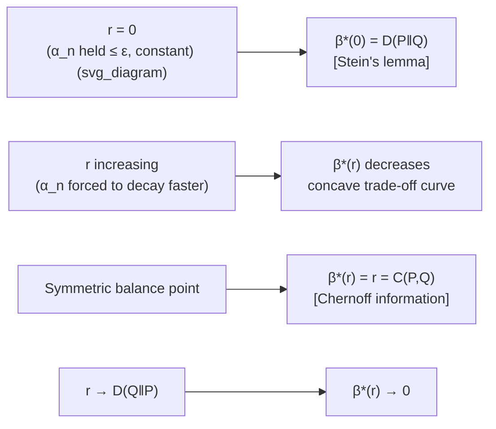

## Chernoff-Stein Lemma

### Overview

The Chernoff-Stein lemma sharpens the picture established by Stein's lemma by describing the full asymptotic trade-off curve between Type I and Type II error exponents, rather than fixing one error at a constant $\varepsilon$ and optimizing the other. It shows that the achievable region of error exponents is governed by a one-parameter family of divergence-like quantities, and that the boundary case — where both errors are permitted to decay together — is captured cleanly by holding $\alpha_n \to 0$ arbitrarily slowly, recovering the $D(P\|Q)$ exponent as a special case while situating it within a broader theory of error exponents.

### Recap: The Setting

As in Stein's lemma, i.i.d. samples $X_1, \ldots, X_n$ are drawn under one of two hypotheses:

$$H_0: X_i \sim P \qquad H_1: X_i \sim Q$$

with acceptance region $A_n \subseteq \mathcal{X}^n$ for $H_0$, and errors

$$\alpha_n = P^n(A_n^c) \qquad \beta_n = Q^n(A_n)$$

Stein's lemma fixes $\alpha_n \leq \varepsilon$ for constant $\varepsilon \in (0,1)$ and finds the best exponential rate for $\beta_n$, obtaining $D(P\|Q)$. The Chernoff-Stein lemma asks a more refined question: what happens to that rate as $\varepsilon$ itself is allowed to shrink toward zero with $n$, and more generally, what is the complete trade-off between the exponents of $\alpha_n$ and $\beta_n$?

### Statement

**Chernoff-Stein Lemma.** Let $A_n$ be chosen so that $\alpha_n \to 0$ as $n \to \infty$ (i.e., the Type I error is driven to zero, but possibly very slowly — no fixed exponential rate is imposed on $\alpha_n$). Then the best possible exponential rate for $\beta_n$ is still

$$\lim_{n \to \infty} \frac{1}{n} \log \frac{1}{\beta_n} = D(P\|Q)$$

This is a stronger statement than the original Stein's lemma: it shows that $D(P\|Q)$ remains the exact Type II exponent even in the limiting regime where the Type I error constraint $\varepsilon$ is relaxed to $0$, provided it goes to zero more slowly than exponentially in $n$. In other words, the rate $D(P\|Q)$ is remarkably robust to how the Type I error is handled, as long as it is not simultaneously forced to decay at its own exponential rate.

**Key Points**
- If $\alpha_n$ is required to decay exponentially as well (both errors treated symmetrically), the relevant exponent changes to the **Chernoff information**, not $D(P\|Q)$ — this is the distinction between the Chernoff-Stein lemma and Chernoff's theorem proper.
- The Chernoff-Stein result confirms $D(P\|Q)$ as the operative rate across the entire regime where $\alpha_n \to 0$ subexponentially, unifying the fixed-$\varepsilon$ case with the vanishing-$\varepsilon$ case.

### The Error Exponent Trade-off Curve

A more complete characterization considers, for a fixed exponential rate $r \geq 0$ imposed on the Type I error,

$$\alpha_n \doteq 2^{-nr}$$

the best achievable exponent for $\beta_n$. Define

$$\beta^*(r) = \lim_{n \to \infty} \left( -\frac{1}{n} \log \min_{A_n:\, \alpha_n \leq 2^{-nr}} \beta_n \right)$$

This function $\beta^*(r)$ traces a trade-off curve:

- At $r = 0$ (Type I error only required to not grow, i.e., held below a constant $\varepsilon$), $\beta^*(0) = D(P\|Q)$ — this is exactly Stein's lemma.
- As $r$ increases (Type I error required to decay faster), $\beta^*(r)$ decreases, since a stricter constraint on $\alpha_n$ leaves less room to optimize $\beta_n$.
- At the symmetric point where both exponents are equalized, the common value is the **Chernoff information** $C(P,Q)$.
- As $r \to D(Q\|P)$, $\beta^*(r) \to 0$, since forcing the Type I exponent up to $D(Q\|P)$ exhausts the ability to keep $\beta_n$ from vanishing rate (this boundary reflects the symmetric role reversal of $P$ and $Q$).

**Key Points**
- The trade-off curve $\beta^*(r)$ is a concave, non-increasing function of $r$.
- It interpolates between the Stein's lemma value $D(P\|Q)$ at $r=0$ and the fully symmetric Chernoff exponent at the balanced point.
- This curve is the hypothesis-testing analogue of a rate-distortion function or a capacity-cost trade-off curve elsewhere in information theory.

### Diagram: Error Exponent Trade-off

### Relationship to Chernoff's Theorem

Chernoff's theorem addresses the case where the *total* error probability $P_e^{(n)} = \pi_0 \alpha_n + \pi_1 \beta_n$ (for some prior weights $\pi_0, \pi_1$ on the two hypotheses) is minimized without artificially privileging one error type. In that symmetric setting, the best achievable exponent is the **Chernoff information**:

$$C(P,Q) = -\min_{0 \leq \lambda \leq 1} \log \sum_{x \in \mathcal{X}} P(x)^{\lambda} Q(x)^{1-\lambda}$$

The Chernoff-Stein lemma and Chernoff's theorem thus address two different operating points on the same trade-off curve $\beta^*(r)$:

- **Chernoff-Stein lemma:** asymmetric treatment — $\alpha_n \to 0$ with no exponential rate demanded, and the Type II exponent achieved is $D(P\|Q)$.
- **Chernoff's theorem:** symmetric treatment — both errors decay at the same exponential rate, which is the Chernoff information $C(P,Q)$, and this is optimal for the overall (prior-weighted) error probability.

**Key Points**
- $C(P,Q) \leq \min(D(P\|Q), D(Q\|P))$, since the symmetric exponent can never exceed the best purely asymmetric one in either direction.
- When $P = Q$, both $D(P\|Q)$ and $C(P,Q)$ are zero, correctly reflecting that no test can distinguish identical distributions with any positive exponent.

### Worked Example

Reuse the binary example: $P(0)=0.7, P(1)=0.3$ and $Q(0)=0.5, Q(1)=0.5$.

From before, $D(P\|Q) \approx 0.118$ bits. Compute the reverse divergence:

$$D(Q\|P) = 0.5 \log_2\frac{0.5}{0.7} + 0.5 \log_2\frac{0.5}{0.3} \approx 0.5(-0.485) + 0.5(0.737) \approx 0.126 \text{ bits}$$

The Chernoff information requires minimizing over $\lambda \in [0,1]$:

$$f(\lambda) = -\log_2\left[ (0.7^\lambda \cdot 0.5^{1-\lambda}) + (0.3^\lambda \cdot 0.5^{1-\lambda}) \right]$$

**Example**
Evaluating numerically at a few points:
- $\lambda = 0.5$: $0.7^{0.5} \approx 0.837$, $0.3^{0.5} \approx 0.548$, $0.5^{0.5} \approx 0.707$, giving sum $\approx 0.707(0.837+0.548) = 0.979$, so $f(0.5) \approx -\log_2(0.979) \approx 0.031$ bits.
- [Unverified] A finer numerical search over $\lambda$ would be needed to pin down the exact minimizing $\lambda^*$ and the precise value of $C(P,Q)$; the value at $\lambda=0.5$ above is illustrative of the order of magnitude, not necessarily the minimum.

This confirms qualitatively that $C(P,Q) \leq \min(D(P\|Q), D(Q\|P)) \approx 0.118$, consistent with the general inequality, since the Chernoff information must sit at or below both one-sided divergences.

### Why the Result Matters

**Key Points**
- The Chernoff-Stein lemma clarifies exactly which asymptotic regime yields $D(P\|Q)$ as the governing exponent: it is robust to letting $\alpha_n \to 0$, not merely to holding it at a fixed constant.
- Together with Chernoff's theorem, it gives a complete asymptotic theory of binary hypothesis testing error exponents, showing that $D(P\|Q)$, $D(Q\|P)$, and $C(P,Q)$ are all extremal points or values along the same underlying trade-off curve.
- This full picture is foundational for designing detectors where the relative costs or tolerances of false alarms versus missed detections must be traded off explicitly, rather than assuming one error type is fixed at an arbitrary constant.
- It reinforces that Chernoff information, not KL divergence, is the right quantity when errors are to be treated symmetrically — a distinction with direct consequences in classifier design and statistical testing under balanced risk.

**Related Topics**
- Chernoff information and Chernoff bounds in large deviations
- The full error-exponent trade-off curve and its concavity properties
- Bayesian hypothesis testing with prior probabilities on $H_0, H_1$
- Sanov's theorem and large deviations for empirical measures
- Bhattacharyya distance and its relation to $C(P,Q)$ at $\lambda = 1/2$
- Composite and multiple hypothesis testing generalizations
- Applications in classifier error-rate analysis and detection theory