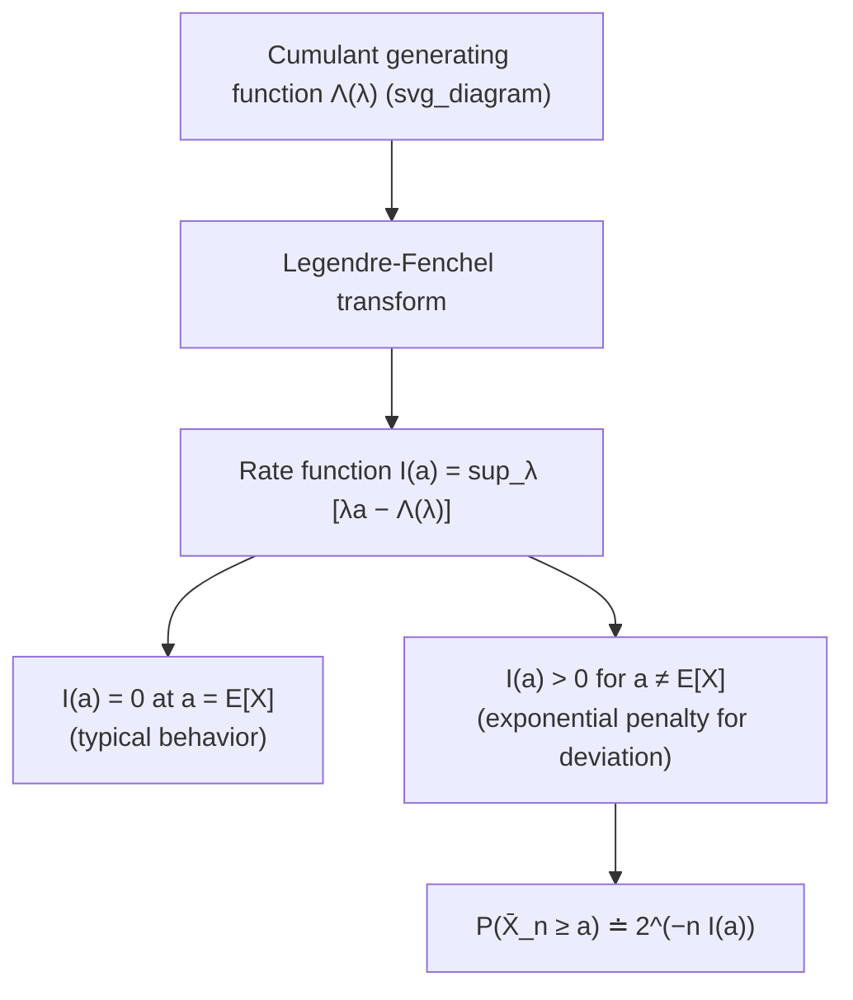

## Large Deviations Theory

### Overview

Large deviations theory provides the mathematical framework for quantifying the exponentially small probability that an empirical average or empirical distribution deviates substantially from its expected value. Where the law of large numbers guarantees convergence and the central limit theorem describes fluctuations of order $\sqrt{n}$, large deviations theory characterizes the exponential rate of decay for atypical, "rare" events of order $n$. In information theory, this framework underlies the method of types, Stein's lemma, Sanov's theorem, and the error-exponent analysis of channel coding, unifying them under a single mathematical language built around rate functions.

### Motivating Question

Given i.i.d. random variables $X_1, \ldots, X_n$ with mean $\mu$, the sample mean $\bar{X}_n = \frac{1}{n}\sum_i X_i$ converges to $\mu$ almost surely. Large deviations theory asks: for $a \neq \mu$, how fast does

$$P(\bar{X}_n \geq a)$$

decay to zero as $n \to \infty$? The answer, under suitable conditions, takes the exponential form

$$P(\bar{X}_n \geq a) \doteq 2^{-n I(a)}$$

where $I(a) \geq 0$ is called the **rate function**, and $\doteq$ denotes equality in the exponent (i.e., $\frac{1}{n}\log P(\bar X_n \ge a) \to -I(a)$).

### Cramér's Theorem

**Cramér's theorem** is the foundational result of large deviations theory for sums of i.i.d. real-valued random variables.

Define the **cumulant generating function**

$$\Lambda(\lambda) = \log \mathbb{E}\left[ e^{\lambda X} \right]$$

and its **Legendre-Fenchel transform** (the rate function)

$$I(a) = \sup_{\lambda \in \mathbb{R}} \left[ \lambda a - \Lambda(\lambda) \right]$$

**Statement (Cramér's Theorem).** For i.i.d. $X_1, \ldots, X_n$ with cumulant generating function $\Lambda(\lambda)$ finite in a neighborhood of $0$,

$$\lim_{n\to\infty} \frac{1}{n} \log P(\bar{X}_n \geq a) = -I(a) \quad \text{for } a > \mathbb{E}[X]$$

with the analogous statement for $a < \mathbb{E}[X]$ using the infimum-side tail. The rate function $I(a)$ is convex, non-negative, and equals zero exactly at $a = \mathbb{E}[X]$.

**Key Points**
- $I(a) = 0$ at the mean reflects that the "typical" event has no exponential penalty.
- $I(a)$ is obtained via the Chernoff bound optimized over the tilting parameter $\lambda$; Cramér's theorem shows this bound is tight in the exponent, not merely an upper bound.
- The proof combines an upper bound from the Chernoff/Markov inequality with a matching lower bound via an exponential change of measure (tilting), a technique central to large deviations proofs generally.

### The Chernoff Bound as Upper Bound

For any $\lambda \geq 0$, Markov's inequality applied to $e^{\lambda \bar{X}_n \cdot n}$ gives

$$P(\bar{X}_n \geq a) = P\left(e^{\lambda \sum_i X_i} \geq e^{\lambda n a}\right) \leq e^{-\lambda n a} \, \mathbb{E}\left[e^{\lambda \sum_i X_i}\right] = e^{-n(\lambda a - \Lambda(\lambda))}$$

Minimizing the exponent over $\lambda \geq 0$ (equivalently maximizing $\lambda a - \Lambda(\lambda)$) yields

$$P(\bar{X}_n \geq a) \leq e^{-n I(a)}$$

This is the **Chernoff bound**, and it establishes the easy direction of Cramér's theorem. The harder direction — showing this exponent cannot be improved — requires the tilted-measure argument.

### Tilted Distributions and the Matching Lower Bound

To show the Chernoff bound is asymptotically tight, define the **exponentially tilted distribution**

$$dP_{\lambda^*}(x) = \frac{e^{\lambda^* x}}{\mathbb{E}[e^{\lambda^* X}]} \, dP(x)$$

where $\lambda^*$ is the maximizer in the definition of $I(a)$. Under $P_{\lambda^*}$, the mean of $X$ is shifted exactly to $a$ (by construction of the tilt), so under this new measure, $a$ becomes the *typical* value rather than a rare deviation. Reweighting probabilities back to the original measure $P$ and applying the law of large numbers under $P_{\lambda^*}$ shows that the probability of the rare event under $P$ is asymptotically no smaller than $e^{-nI(a)}$ (up to sub-exponential factors), matching the upper bound.

**Key Points**
- Tilting is the central technique of large deviations theory: it reinterprets a rare event under the original measure as a typical event under a suitably reweighted measure.
- This connects directly to importance sampling in Monte Carlo simulation, where tilted distributions are used to efficiently estimate rare-event probabilities.

### Diagram: Rate Function Structure

### Worked Example: Fair Coin

Let $X_i \in \{0, 1\}$ be i.i.d. Bernoulli($p = 0.5$). The cumulant generating function is

$$\Lambda(\lambda) = \log\left( \frac{1}{2} + \frac{1}{2} e^{\lambda} \right)$$

The rate function for the Bernoulli case has the well-known closed form (relative entropy to the base distribution):

$$I(a) = a \log_2 \frac{a}{0.5} + (1-a) \log_2 \frac{1-a}{0.5} = D(\text{Bern}(a) \,\|\, \text{Bern}(0.5))$$

**Example**
For $a = 0.7$ (a deviation from the mean of $0.5$):

$$I(0.7) = 0.7\log_2\frac{0.7}{0.5} + 0.3\log_2\frac{0.3}{0.5} \approx 0.7(0.485) + 0.3(-0.737) \approx 0.118 \text{ bits}$$

So $P(\bar{X}_n \geq 0.7) \doteq 2^{-0.118n}$. For $n = 100$, this gives roughly $2^{-11.8} \approx 2.9\times 10^{-4}$, meaning observing $70\%$ or more heads in $100$ fair-coin flips has probability on the order of $3$ in $10{,}000$ — small but far from negligible, illustrating how the exponential rate governs the decay but the constant sample size still matters in practice.

This is not a coincidence: for finite alphabets, Cramér's rate function for the sample mean of an indicator coincides with a relative entropy expression, foreshadowing the deeper connection made explicit in Sanov's theorem.

### Connection to the Method of Types and Sanov's Theorem

Large deviations theory generalizes naturally from scalar averages to entire empirical distributions. If $\hat{P}_{X^n}$ denotes the empirical distribution (type) of a sequence $X^n$ drawn i.i.d. from $P$, then for a set of distributions $E$,

$$P(\hat{P}_{X^n} \in E) \doteq 2^{-n \inf_{Q \in E} D(Q\|P)}$$

This is **Sanov's theorem**, and it identifies $D(Q\|P)$ as the rate function governing deviations of the empirical distribution from $P$ toward any particular alternative $Q$. Stein's lemma can be recovered as a special case of this more general large-deviations statement, since the acceptance/rejection regions in hypothesis testing are themselves sets of empirical distributions.

**Key Points**
- The scalar Cramér rate function $I(a)$ and the distributional rate function $D(Q\|P)$ are both instances of the same general principle: probabilities of rare events decay exponentially at a rate given by the "cost," in relative-entropy or Legendre-transform terms, of the least unlikely way the rare event can occur.
- This is often summarized by the heuristic: *the probability of a rare event is dominated by the most likely way it can happen* — the infimum in Sanov's theorem picks out exactly that most-likely deviation.

### General Framework: The Large Deviation Principle (LDP)

Beyond i.i.d. sums, large deviations theory is formalized abstractly. A sequence of probability measures $\{\mu_n\}$ on a space $\mathcal{X}$ is said to satisfy a **Large Deviation Principle** with rate function $I: \mathcal{X} \to [0,\infty]$ if, for all Borel sets $E$,

$$-\inf_{x \in E^{\circ}} I(x) \leq \liminf_{n\to\infty} \frac{1}{n}\log \mu_n(E) \leq \limsup_{n\to\infty} \frac{1}{n}\log \mu_n(E) \leq -\inf_{x \in \bar{E}} I(x)$$

where $E^{\circ}$ and $\bar{E}$ denote the interior and closure of $E$. This general definition subsumes Cramér's theorem, Sanov's theorem, and many results in statistical mechanics, queueing theory, and random matrix theory as special cases, unified by the identification of an appropriate rate function $I$.

**Key Points**
- [Inference] The abstract LDP framework, while more technical, is what allows large deviations tools to be applied uniformly across very different mathematical settings — from empirical process theory to statistical physics — beyond the scope of information-theoretic applications alone.
- The rate function $I$ typically has the interpretation of a relative entropy, an action functional, or a Legendre transform of a log-moment-generating function, depending on the setting.

### Why Large Deviations Theory Matters for Information Theory

**Key Points**
- It provides the rigorous foundation for the method of types, giving precise exponential bounds on the probability of atypical sequences and types.
- It underlies the achievability and converse proofs of Stein's lemma, Sanov's theorem, and Chernoff-Stein-type results in hypothesis testing.
- Channel coding error exponents (the rate at which decoding error probability vanishes as block length grows, for rates below capacity) are a large-deviations phenomenon, connecting large deviations theory directly to the constructive side of Shannon theory.
- The tilting technique used in the proofs reappears throughout information theory and statistics, including in the derivation of exponential families and maximum-entropy distributions.

**Related Topics**
- Sanov's theorem and large deviations for empirical distributions
- Method of types and type-counting bounds
- Exponential families and maximum entropy distributions
- Legendre-Fenchel duality and convex conjugate functions
- Channel coding error exponents and reliability functions
- Importance sampling and rare-event simulation via exponential tilting
- Large deviations in statistical mechanics (connection to free energy and entropy)
- Gärtner-Ellis theorem (large deviations for non-i.i.d. and dependent processes)