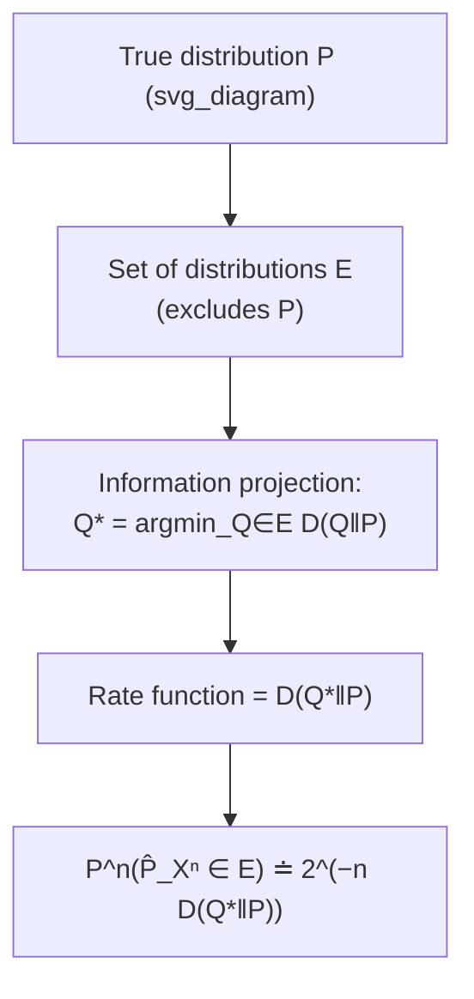

## Sanov's Theorem

### Overview

Sanov's theorem extends large deviations theory from scalar sample averages to entire empirical distributions, characterizing the exponential rate at which the empirical distribution (type) of an i.i.d. sample deviates from the true generating distribution. It identifies relative entropy as the universal rate function governing these deviations, and it serves as the technical engine underlying Stein's lemma, the method of types, and much of the asymptotic theory of hypothesis testing and statistics in the information-theoretic tradition.

### Setup: Empirical Distributions and Types

Let $X_1, \ldots, X_n$ be i.i.d. samples drawn from a distribution $P$ on a finite alphabet $\mathcal{X}$. The **empirical distribution** (or **type**) of the sample $X^n = (X_1, \ldots, X_n)$ is

$$\hat{P}_{X^n}(x) = \frac{1}{n} \sum_{i=1}^{n} \mathbb{1}\{X_i = x\}, \quad x \in \mathcal{X}$$

By the law of large numbers, $\hat{P}_{X^n} \to P$ almost surely as $n \to \infty$. Sanov's theorem asks: for a set $E$ of probability distributions on $\mathcal{X}$ that excludes $P$, how fast does

$$P^n\left( \hat{P}_{X^n} \in E \right)$$

decay to zero?

### Statement

Let $E$ be a set of probability distributions on $\mathcal{X}$, and let $\bar{E}$ and $E^{\circ}$ denote its closure and interior (with respect to the standard topology on the probability simplex). Assume $E$ is the closure of its interior (a mild regularity condition satisfied by most sets of practical interest, such as those defined by linear or continuous constraints).

**Sanov's Theorem.**

$$\lim_{n \to \infty} \frac{1}{n} \log P^n\left( \hat{P}_{X^n} \in E \right) = -\inf_{Q \in E} D(Q \| P)$$

Equivalently, in the type-counting form used more directly in information theory,

$$P^n\left( \hat{P}_{X^n} \in E \right) \doteq 2^{-n \, D(Q^* \| P)}$$

where $Q^* = \arg\min_{Q \in E} D(Q\|P)$ is the **information projection** of $P$ onto $E$ — the distribution in $E$ closest to $P$ in relative entropy.

**Key Points**
- The exponential rate is governed entirely by the single closest point $Q^*$ in $E$, reflecting the general large-deviations heuristic that a rare event's probability is dominated by its most likely realization.
- If $P \in E$ (or more precisely $P \in \bar E$), then $\inf_{Q \in E} D(Q\|P) = 0$, and the probability does not decay exponentially — consistent with the law of large numbers guaranteeing $\hat P_{X^n} \to P \in E$.
- $D(Q\|P) \geq 0$ always, with equality iff $Q = P$, so the exponent is strictly positive whenever $P \notin \bar{E}$.

### Proof Sketch via the Method of Types

The proof relies on two classical type-counting results.

**Number of types.** The number of distinct types of sequences of length $n$ over an alphabet of size $|\mathcal{X}|$ grows only polynomially:

$$|\mathcal{P}_n| \leq (n+1)^{|\mathcal{X}|}$$

where $\mathcal{P}_n$ is the set of types with denominator $n$.

**Probability of a type class.** For a type $Q \in \mathcal{P}_n$, the probability (under $P^n$) of observing any particular sequence of that type is $P^n(x^n) = 2^{-n(H(Q) + D(Q\|P))}$ for $x^n$ of type $Q$, and the type class $T(Q)$ (the set of all sequences of type $Q$) satisfies

$$\frac{1}{(n+1)^{|\mathcal{X}|}} 2^{-nD(Q\|P)} \leq P^n(T(Q)) \leq 2^{-nD(Q\|P)}$$

**Combining.** Since $E \cap \mathcal{P}_n$ consists of at most $(n+1)^{|\mathcal{X}|}$ types,

$$P^n(\hat{P}_{X^n} \in E) = \sum_{Q \in E \cap \mathcal{P}_n} P^n(T(Q)) \leq (n+1)^{|\mathcal{X}|} \max_{Q \in E \cap \mathcal{P}_n} 2^{-nD(Q\|P)} = (n+1)^{|\mathcal{X}|} 2^{-n \min_{Q \in E \cap \mathcal{P}_n} D(Q\|P)}$$

Taking $\frac{1}{n}\log$ and letting $n \to \infty$, the polynomial prefactor $(n+1)^{|\mathcal{X}|}$ vanishes in the exponent, giving the upper bound $-\inf_{Q\in E} D(Q\|P)$. A matching lower bound follows by restricting attention to the single type closest to $E$ and using the type-class probability lower bound above. Together these establish the theorem.

**Key Points**
- The polynomial number of types is what makes the exponential rate exact — there are only "few" competing types, so the sum over them does not affect the exponent, only the (irrelevant, sub-exponential) prefactor.
- This is the same core mechanism used in proving the achievability direction of Stein's lemma.

### Diagram: Information Projection

### Worked Example

Let $\mathcal{X} = \{0,1\}$ and $P(0) = 0.5, P(1) = 0.5$ (fair coin). Consider

$$E = \{Q : Q(1) \geq 0.7\}$$

the set of distributions in which the empirical fraction of $1$'s is at least $0.7$. The information projection $Q^*$ onto $E$ is the boundary point $Q^*(1) = 0.7, Q^*(0) = 0.3$, since $D(Q\|P)$ is increasing in $|Q(1) - 0.5|$ for Bernoulli distributions, so the closest point in $E$ to $P$ is the boundary of the constraint.

**Example**

$$D(Q^*\|P) = 0.7\log_2\frac{0.7}{0.5} + 0.3\log_2\frac{0.3}{0.5} \approx 0.118 \text{ bits}$$

So $P^n(\hat P_{X^n}(1) \geq 0.7) \doteq 2^{-0.118n}$ — recovering exactly the Cramér/large-deviations rate computed for the scalar sample mean in the fair-coin example, confirming that Sanov's theorem generalizes Cramér's theorem and agrees with it on this shared special case.

### Connection to Stein's Lemma

Stein's lemma is a direct corollary of Sanov's theorem. In the hypothesis-testing setup, the acceptance region $A_n$ for $H_0: X_i \sim P$ can be described (via the method of types) as a union of type classes corresponding to a set of empirical distributions $E_n$. The constraint $P^n(A_n) \geq 1-\varepsilon$ translates into $E_n$ containing (essentially) all types close to $P$, since $P^n$ concentrates there. The optimization

$$\beta_n = Q^n(A_n) \approx 2^{-n \inf_{R \in E_n} D(R\|Q)}$$

is then minimized by choosing $A_n$ (equivalently $E_n$) to exclude the type minimizing $D(R\|Q)$ subject to the constraint, and the analysis shows this minimum converges to $D(P\|Q)$ as $n\to\infty$ — the boundary of the typical set with respect to $P$ is precisely the type that is simultaneously "just barely" acceptable under $H_0$ and has minimal divergence from $Q$.

**Key Points**
- This shows Sanov's theorem is the more general statement, with Stein's lemma as a special case obtained by choosing $E_n$ to be the (complement of the) typical set with respect to $P$.
- The information-projection viewpoint of Sanov's theorem gives geometric intuition for Stein's lemma: the optimal test boundary sits at the type closest to $Q$ among those still "typical enough" for $P$.

### Sanov's Theorem and Convex Constraint Sets

A commonly encountered case is when $E$ is defined by linear (moment) constraints, e.g.

$$E = \left\{ Q : \mathbb{E}_Q[g(X)] \geq c \right\}$$

for some function $g$ and constant $c$. In this case, the information projection $Q^*$ has a known closed form via Lagrangian duality: it is a **tilted (exponential family) version of $P$**,

$$Q^*(x) \propto P(x) \, e^{\lambda^* g(x)}$$

where $\lambda^*$ is chosen so that $\mathbb{E}_{Q^*}[g(X)] = c$ (the constraint is met with equality, since the closest point in a convex set defined by a half-space constraint lies on its boundary).

**Key Points**
- This tilted-distribution structure is exactly the exponential tilting construction used in the Cramér's theorem proof, confirming the deep structural link between Sanov's theorem and classical large-deviations theory for sums.
- [Inference] This connects Sanov's theorem to maximum-entropy and exponential-family theory: the information projection of $P$ onto a moment-constraint set takes the same mathematical form as a maximum-entropy distribution subject to that moment constraint, differing mainly in whether $P$ or the uniform distribution is used as the reference measure.

### Why Sanov's Theorem Matters

**Key Points**
- It is the most general classical statement of large deviations for empirical distributions over finite alphabets, subsuming Cramér's theorem (via indicator functions as the statistic of interest) and underlying Stein's lemma.
- It formalizes the relative-entropy "cost" of an empirical distribution looking like some $Q \neq P$, giving a rigorous, quantitative version of the intuitive idea that a type $Q$ far from $P$ (in relative entropy) is exponentially unlikely to be observed.
- The information-projection perspective connects it to convex optimization, exponential families, and maximum-entropy modeling, situating it as a bridge between information theory, statistics, and statistical mechanics.
- It provides the rigorous justification for using empirical distributions (types) as sufficient statistics in asymptotic hypothesis testing and estimation problems.

**Related Topics**
- Method of types and type-class probability bounds
- Stein's lemma and Chernoff-Stein lemma (hypothesis testing corollaries)
- Cramér's theorem and large deviations for sample means
- Information projection and I-projections onto convex sets
- Exponential families and maximum-entropy distributions
- Conditional limit theorems (behavior of $X^n$ given $\hat P_{X^n} \in E$)
- Robust statistics and minimax approaches using information projections
- Large deviations for Markov chains (extensions beyond i.i.d. sampling)