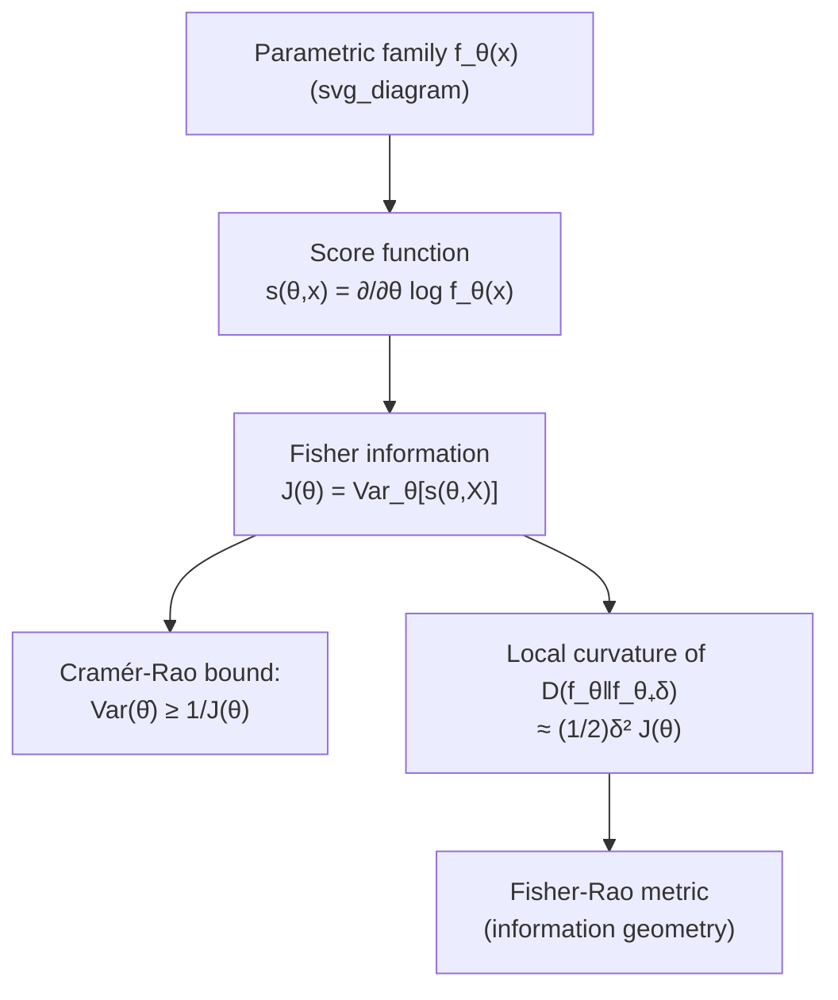

## Fisher Information

### Overview

Fisher information quantifies how much information an observable random variable carries about an unknown parameter governing its distribution. It measures the sharpness of the likelihood function around the true parameter value: high Fisher information means small changes in the parameter produce large, easily detectable changes in the probability distribution, while low Fisher information means the distribution is comparatively insensitive to the parameter. Fisher information underlies the Cramér-Rao bound on estimator variance, connects to relative entropy through a local quadratic approximation, and plays a role analogous to a Riemannian metric on the space of probability distributions.

### Definition

Let $\{f_{\theta}(x)\}_{\theta \in \Theta}$ be a parametric family of probability densities (or mass functions) indexed by a scalar parameter $\theta \in \mathbb{R}$, satisfying suitable regularity conditions (differentiability in $\theta$, and that the support of $f_\theta$ does not depend on $\theta$). The **score function** is

$$s(\theta, x) = \frac{\partial}{\partial \theta} \log f_{\theta}(x)$$

The **Fisher information** is defined as the variance of the score, evaluated at the true parameter:

$$J(\theta) = \mathbb{E}_{\theta}\left[ \left( \frac{\partial}{\partial \theta} \log f_{\theta}(X) \right)^2 \right]$$

Under regularity conditions permitting differentiation under the integral sign, $\mathbb{E}_\theta[s(\theta,X)] = 0$, so $J(\theta)$ is indeed the variance (not just the second moment) of the score.

**Key Points**
- $J(\theta) \geq 0$ always, since it is defined as a variance (an expectation of a squared quantity).
- Fisher information is a *local* quantity — it characterizes sensitivity to $\theta$ at a specific point, not globally across the parameter space.
- For a family with a "flatter" likelihood in $\theta$ (small perturbations in $\theta$ barely change $f_\theta$), $J(\theta)$ is small; for a "sharply peaked" likelihood, $J(\theta)$ is large.

### Equivalent Form via Second Derivative

Under additional regularity (twice differentiability, and that differentiation under the integral is valid), Fisher information has an equivalent expression:

$$J(\theta) = -\mathbb{E}_{\theta}\left[ \frac{\partial^2}{\partial \theta^2} \log f_{\theta}(X) \right]$$

This form is often more convenient computationally, since it avoids squaring the score and instead uses the expected curvature (negative expected second derivative) of the log-likelihood. Intuitively, a log-likelihood that is very "curved" (concave) around $\theta$ pins the parameter down tightly, corresponding to high information.

**Example**
For $X \sim \mathcal{N}(\theta, \sigma^2)$ with known $\sigma^2$:

$$\log f_\theta(x) = -\frac{(x-\theta)^2}{2\sigma^2} - \frac{1}{2}\log(2\pi\sigma^2)$$

$$\frac{\partial}{\partial\theta}\log f_\theta(x) = \frac{x-\theta}{\sigma^2}, \qquad \frac{\partial^2}{\partial\theta^2}\log f_\theta(x) = -\frac{1}{\sigma^2}$$

So $J(\theta) = -\mathbb{E}\left[-\frac{1}{\sigma^2}\right] = \frac{1}{\sigma^2}$ — Fisher information for the Gaussian mean is simply the reciprocal of the variance, independent of $\theta$ itself, reflecting that smaller-variance Gaussians make the mean easier to pin down from a single observation.

### The Cramér-Rao Bound

Fisher information's central operational role is bounding the variance of any unbiased estimator of $\theta$.

**Cramér-Rao Inequality.** For any unbiased estimator $\hat\theta(X)$ of $\theta$ based on a single observation $X \sim f_\theta$,

$$\text{Var}_\theta(\hat\theta) \geq \frac{1}{J(\theta)}$$

For $n$ i.i.d. observations $X_1, \ldots, X_n$, the Fisher information adds: $J_n(\theta) = n J(\theta)$, so

$$\text{Var}_\theta(\hat\theta) \geq \frac{1}{n J(\theta)}$$

**Key Points**
- The bound formalizes the intuitive idea that more Fisher information means a fundamentally more precise (lower-variance) estimator is possible.
- Additivity of Fisher information across independent observations, $J_n(\theta) = nJ(\theta)$, ensures the bound tightens as $O(1/n)$ with sample size — the standard parametric estimation rate.
- An estimator achieving the bound with equality is called **efficient**; the maximum likelihood estimator is asymptotically efficient under regularity conditions as $n \to \infty$.
- [Unverified] Whether a specific finite-sample estimator achieves the bound exactly depends on the family; in general only asymptotic (large-$n$) efficiency is guaranteed for MLE, not exact finite-sample efficiency.

### Multivariate Case: The Fisher Information Matrix

For a vector parameter $\theta = (\theta_1, \ldots, \theta_k) \in \mathbb{R}^k$, Fisher information generalizes to a $k \times k$ matrix:

$$[J(\theta)]_{ij} = \mathbb{E}_\theta\left[ \frac{\partial \log f_\theta(X)}{\partial \theta_i} \cdot \frac{\partial \log f_\theta(X)}{\partial \theta_j} \right] = -\mathbb{E}_\theta\left[ \frac{\partial^2 \log f_\theta(X)}{\partial \theta_i \partial \theta_j} \right]$$

The Cramér-Rao bound becomes a matrix inequality on the covariance of an unbiased estimator $\hat\theta$:

$$\text{Cov}_\theta(\hat\theta) \succeq J(\theta)^{-1}$$

where $\succeq$ denotes the Loewner (positive semi-definite) ordering, meaning $\text{Cov}_\theta(\hat\theta) - J(\theta)^{-1}$ is positive semi-definite.

**Key Points**
- The Fisher information matrix is symmetric and positive semi-definite by construction.
- Diagonal entries $[J(\theta)]_{ii}$ give the information about $\theta_i$ alone; off-diagonal entries capture how estimation of one parameter is entangled with another.

### Connection to Relative Entropy: The Local Quadratic Approximation

Fisher information arises as the local (second-order) behavior of relative entropy between nearby members of a parametric family. For small $\delta$,

$$D\big(f_\theta \,\|\, f_{\theta+\delta}\big) \approx \frac{1}{2} \delta^2 J(\theta)$$

This can be derived via a Taylor expansion of $D(f_\theta \| f_{\theta+\delta})$ in $\delta$ around $\delta = 0$: the zeroth-order term vanishes (since $D(f_\theta\|f_\theta)=0$), the first-order term vanishes (since $\delta=0$ is a minimum of $D(f_\theta\|f_{\theta+\delta})$ over $\delta$), and the second-order term is governed exactly by the Fisher information.

**Key Points**
- This identifies Fisher information as (twice) the local curvature of relative entropy — a bridge between the purely statistical definition of $J(\theta)$ and the information-theoretic quantity $D(\cdot\|\cdot)$.
- This local quadratic structure underlies the interpretation of Fisher information as a Riemannian metric (the **Fisher-Rao metric**) on the manifold of probability distributions parameterized by $\theta$, with $D(f_\theta\|f_{\theta+\delta})$ playing the role of squared "information distance" to leading order.
- This connection is foundational to **information geometry**, which studies statistical models as geometric objects using the Fisher-Rao metric and dual affine connections.

### Diagram: Fisher Information's Role

### Worked Example: Bernoulli Parameter

Let $X \sim \text{Bernoulli}(\theta)$, so $f_\theta(x) = \theta^x (1-\theta)^{1-x}$ for $x \in \{0,1\}$.

$$\log f_\theta(x) = x \log \theta + (1-x)\log(1-\theta)$$

$$\frac{\partial}{\partial\theta}\log f_\theta(x) = \frac{x}{\theta} - \frac{1-x}{1-\theta}$$

$$\frac{\partial^2}{\partial\theta^2}\log f_\theta(x) = -\frac{x}{\theta^2} - \frac{1-x}{(1-\theta)^2}$$

Taking expectation, using $\mathbb{E}[X] = \theta$:

$$J(\theta) = -\mathbb{E}\left[-\frac{X}{\theta^2} - \frac{1-X}{(1-\theta)^2}\right] = \frac{\theta}{\theta^2} + \frac{1-\theta}{(1-\theta)^2} = \frac{1}{\theta} + \frac{1}{1-\theta} = \frac{1}{\theta(1-\theta)}$$

**Example**
At $\theta = 0.5$: $J(0.5) = \frac{1}{0.25} = 4$. At $\theta = 0.1$: $J(0.1) = \frac{1}{0.09} \approx 11.1$.

This shows Fisher information is *not* constant across the parameter space for the Bernoulli family (unlike the Gaussian mean example) — it grows as $\theta$ approaches the boundary values $0$ or $1$, reflecting that a single observation is comparatively more informative about $\theta$ when $\theta$ is near an extreme (a single flip strongly constrains an already near-deterministic coin), even though intuitively one might expect the opposite; this is a well known but sometimes counterintuitive feature of the Bernoulli Fisher information.

### Connection to Information Theory More Broadly

**Key Points**
- Fisher information plays a role in the **information inequality** version of the Cramér-Rao bound and is central to asymptotic statistics, but it is a fundamentally *local/parametric* notion, in contrast to relative entropy and mutual information, which are global and non-parametric.
- The **Fisher information inequality** for sums of independent random variables, $\frac{1}{J(X+Y)} \geq \frac{1}{J(X)} + \frac{1}{J(Y)}$, plays a role in proofs of entropy power inequalities and the entropy-theoretic version of the central limit theorem.
- [Inference] Because Fisher information governs the local quadratic behavior of relative entropy, many asymptotic results in statistics (asymptotic normality of the MLE, local asymptotic minimax bounds) can be phrased equivalently in terms of Fisher information or in terms of a local KL-divergence expansion, making it a natural bridge concept between statistical estimation theory and information theory proper.
- The Jeffreys prior in Bayesian statistics is defined proportional to $\sqrt{\det J(\theta)}$, making it invariant under reparameterization — a construction that relies directly on Fisher information's role as a Riemannian metric.

**Related Topics**
- Cramér-Rao bound and efficient estimation
- Information geometry and the Fisher-Rao metric
- Maximum likelihood estimation and asymptotic efficiency
- Entropy power inequality and its relation to Fisher information inequalities
- Jeffreys prior and objective Bayesian inference
- Exponential families and sufficient statistics
- Relative entropy and its local quadratic (second-order) expansion
- Score functions, efficient influence functions, and semiparametric efficiency bounds