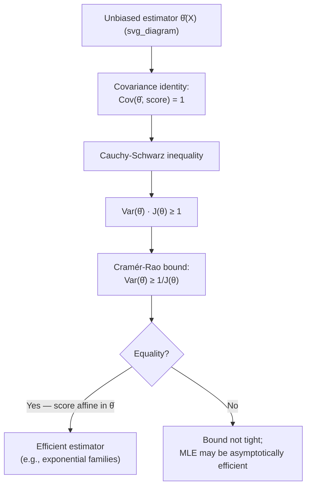

## Cramér-Rao Bound

### Overview

The Cramér-Rao bound is a foundational result in statistical estimation theory establishing a hard lower limit on the variance of any unbiased estimator of a parameter, expressed in terms of the Fisher information carried by the data. It formalizes the precise sense in which Fisher information measures the best possible estimation precision achievable from a given observation model, and it provides the benchmark against which the efficiency of concrete estimators — most notably the maximum likelihood estimator — is judged.

### Setup and Assumptions

Let $X \sim f_\theta$ belong to a parametric family $\{f_\theta\}_{\theta \in \Theta}$, $\Theta \subseteq \mathbb{R}$ an open interval, satisfying the following regularity conditions:

- The support of $f_\theta$ does not depend on $\theta$.
- $f_\theta(x)$ is differentiable in $\theta$ for almost every $x$.
- Differentiation and integration can be interchanged: $\frac{\partial}{\partial\theta}\int f_\theta(x)\,dx = \int \frac{\partial}{\partial\theta}f_\theta(x)\,dx$, and similarly for expectations of estimators.
- The Fisher information $J(\theta) = \mathbb{E}_\theta\left[\left(\frac{\partial}{\partial\theta}\log f_\theta(X)\right)^2\right]$ is finite and strictly positive.

Let $\hat\theta(X)$ be any **unbiased** estimator of $\theta$, meaning $\mathbb{E}_\theta[\hat\theta(X)] = \theta$ for all $\theta \in \Theta$.

**Key Points**
- The regularity conditions matter — they exclude pathological families (e.g., $\text{Uniform}(0,\theta)$, where the support depends on $\theta$) for which the bound as stated does not apply, and different or more subtle bounds are needed instead.
- The bound applies specifically to *unbiased* estimators; biased estimators can, in principle, achieve lower variance than $1/J(\theta)$ at the cost of introducing bias — this is the classical bias-variance trade-off.

### Statement

**Cramér-Rao Inequality.**

$$\text{Var}_\theta\big(\hat\theta(X)\big) \geq \frac{1}{J(\theta)}$$

for every $\theta \in \Theta$.

For $n$ i.i.d. observations $X_1, \ldots, X_n \sim f_\theta$, the Fisher information of the full sample is $J_n(\theta) = n J(\theta)$ (by additivity of Fisher information across independent observations), so

$$\text{Var}_\theta\big(\hat\theta(X_1,\ldots,X_n)\big) \geq \frac{1}{n J(\theta)}$$

**Key Points**
- The bound is a *lower* bound on variance — it says no unbiased estimator can do better than $1/J(\theta)$, not that every unbiased estimator achieves it.
- The $1/n$ scaling with sample size is the standard parametric convergence rate, and the bound shows this rate is information-theoretically unimprovable for unbiased estimators in regular families.

### Derivation via the Cauchy-Schwarz Inequality

The proof is a direct application of the Cauchy-Schwarz inequality to the score function and the estimator.

**Step 1 — Unbiasedness implies a covariance identity.** Starting from $\mathbb{E}_\theta[\hat\theta(X)] = \theta$, i.e., $\int \hat\theta(x) f_\theta(x)\,dx = \theta$, differentiate both sides with respect to $\theta$:

$$\int \hat\theta(x) \frac{\partial f_\theta(x)}{\partial \theta}\,dx = 1$$

Using the identity $\frac{\partial f_\theta}{\partial\theta} = f_\theta \cdot \frac{\partial}{\partial\theta}\log f_\theta$ (the score-function identity),

$$\int \hat\theta(x) \, s(\theta,x) \, f_\theta(x)\,dx = 1 \quad\Longleftrightarrow\quad \mathbb{E}_\theta\big[\hat\theta(X)\, s(\theta,X)\big] = 1$$

Since $\mathbb{E}_\theta[s(\theta,X)] = 0$ (a standard regularity consequence), this expectation is exactly the covariance:

$$\text{Cov}_\theta\big(\hat\theta(X),\, s(\theta,X)\big) = 1$$

**Step 2 — Apply Cauchy-Schwarz.** The Cauchy-Schwarz inequality for covariances states $\text{Cov}(A,B)^2 \leq \text{Var}(A)\,\text{Var}(B)$. Applying this with $A = \hat\theta(X)$ and $B = s(\theta,X)$:

$$1 = \text{Cov}_\theta\big(\hat\theta(X), s(\theta,X)\big)^2 \leq \text{Var}_\theta\big(\hat\theta(X)\big) \cdot \text{Var}_\theta\big(s(\theta,X)\big) = \text{Var}_\theta\big(\hat\theta(X)\big) \cdot J(\theta)$$

Rearranging gives the Cramér-Rao bound directly:

$$\text{Var}_\theta\big(\hat\theta(X)\big) \geq \frac{1}{J(\theta)}$$

**Key Points**
- The proof is elegant precisely because it reduces to a single application of Cauchy-Schwarz once the covariance identity is established — no deeper machinery is required.
- Equality in Cauchy-Schwarz holds if and only if $A$ and $B$ are affinely related (i.e., $\hat\theta(X) - \theta = c(\theta) \cdot s(\theta,X)$ for some constant $c(\theta)$), which gives the exact condition for an estimator to be efficient.

### Efficiency and the Equality Condition

An unbiased estimator $\hat\theta$ is called **efficient** if it achieves the Cramér-Rao bound with equality, i.e., $\text{Var}_\theta(\hat\theta) = 1/J(\theta)$ for all $\theta$.

From the Cauchy-Schwarz equality condition, $\hat\theta$ is efficient if and only if the score function is an exact affine function of the estimator:

$$s(\theta, x) = \frac{\partial}{\partial\theta}\log f_\theta(x) = J(\theta)\big(\hat\theta(x) - \theta\big)$$

This condition is quite restrictive — it holds only for specific families, most notably **exponential families** in their natural parameterization, where the sufficient statistic itself is (proportional to) an efficient estimator of the natural parameter.

**Example**
For $X_1,\ldots,X_n \overset{\text{i.i.d.}}{\sim}\mathcal{N}(\theta,\sigma^2)$ with $\sigma^2$ known, the sample mean $\hat\theta = \bar X_n$ is unbiased with $\text{Var}(\bar X_n) = \sigma^2/n$. The Fisher information of the sample is $J_n(\theta) = n/\sigma^2$ (from the earlier single-observation result $J(\theta)=1/\sigma^2$, scaled by $n$), so the bound gives $\text{Var}(\hat\theta) \geq \sigma^2/n$ — matched exactly by $\bar X_n$. The sample mean is therefore an efficient estimator of the Gaussian mean.

**Key Points**
- Not every family admits an efficient estimator for every parameter of interest — efficiency is the exception rather than the rule outside exponential families.
- When no efficient (finite-sample) estimator exists, the maximum likelihood estimator still typically achieves the bound *asymptotically* as $n \to \infty$, a property known as asymptotic efficiency.

### Diagram: Structure of the Bound

### Worked Example: Bernoulli Parameter

For $X_1,\ldots,X_n \overset{\text{i.i.d.}}{\sim}\text{Bernoulli}(\theta)$, the sample proportion $\hat\theta = \bar X_n$ is the natural unbiased estimator, with

$$\text{Var}(\hat\theta) = \frac{\theta(1-\theta)}{n}$$

From the earlier Fisher information computation, $J(\theta) = \frac{1}{\theta(1-\theta)}$ for a single observation, so $J_n(\theta) = \frac{n}{\theta(1-\theta)}$, giving a Cramér-Rao bound of

$$\text{Var}(\hat\theta) \geq \frac{1}{J_n(\theta)} = \frac{\theta(1-\theta)}{n}$$

**Example**
This matches $\text{Var}(\bar X_n) = \theta(1-\theta)/n$ exactly, so the sample proportion is an efficient estimator of the Bernoulli parameter — consistent with the Bernoulli family being an exponential family in $\theta$, where efficient estimation of the natural sufficient statistic (the sample mean) is expected.

### Multivariate (Matrix) Cramér-Rao Bound

For a vector parameter $\theta \in \mathbb{R}^k$ and an unbiased estimator $\hat\theta(X) \in \mathbb{R}^k$, the bound becomes a matrix inequality:

$$\text{Cov}_\theta(\hat\theta) \succeq J(\theta)^{-1}$$

where $J(\theta)$ is the $k \times k$ Fisher information matrix and $\succeq$ denotes the positive semi-definite (Loewner) ordering, meaning $\text{Cov}_\theta(\hat\theta) - J(\theta)^{-1}$ is positive semi-definite. Taking the diagonal entries gives individual variance bounds $\text{Var}(\hat\theta_i) \geq [J(\theta)^{-1}]_{ii}$, but note this is generally *not* the same as $1/[J(\theta)]_{ii}$ unless $J(\theta)$ is diagonal (i.e., the parameters are "orthogonal" in the Fisher information sense).

**Key Points**
- Correlations between parameters (off-diagonal terms in $J(\theta)$) can inflate the achievable variance bound for any single parameter above the naive single-parameter formula — this is sometimes described informally as parameters "competing" for estimation precision.
- Reparameterizing to make $J(\theta)$ diagonal (when possible) decouples the estimation problems for each parameter and recovers the simple per-parameter bound.

### Extensions and Related Bounds

- **Biased estimators:** For a biased estimator with bias function $b(\theta) = \mathbb{E}_\theta[\hat\theta] - \theta$, the bound generalizes to $\text{Var}_\theta(\hat\theta) \geq \frac{(1+b'(\theta))^2}{J(\theta)}$, showing that a well-chosen bias can, in principle, reduce variance below the unbiased bound — the foundation of the bias-variance trade-off in estimation.
- **Bayesian (van Trees) version:** [Unverified] A Bayesian analogue, sometimes called the van Trees inequality or Bayesian Cramér-Rao bound, incorporates a prior distribution on $\theta$ and bounds the Bayes risk using an average of the Fisher information plus a prior-information term; the precise form and regularity requirements are more involved than the classical bound above.
- **Non-regular families:** For families violating the regularity conditions (e.g., $\text{Uniform}(0,\theta)$), the Cramér-Rao bound does not apply, and estimators can in fact achieve variance decaying faster than $O(1/n)$ — a well-known exception illustrating that the bound is not universal.

**Key Points**
- These extensions show the classical Cramér-Rao bound is the base case of a broader family of information-theoretic estimation bounds, each adapted to a different estimation setting (biased, Bayesian, non-regular).

### Why the Cramér-Rao Bound Matters

**Key Points**
- It gives a concrete, computable benchmark for evaluating whether an estimator is "good" — if an unbiased estimator's variance matches $1/J(\theta)$, no further improvement (within the unbiased class) is possible.
- It formalizes the operational meaning of Fisher information as a precision resource, directly linking the earlier abstract definition of $J(\theta)$ to a concrete guarantee about estimation performance.
- The equality condition identifies exponential families as the natural home for exact finite-sample efficient estimation, while motivating the broader asymptotic theory (asymptotic efficiency of MLE) for other families.
- It anchors a wider ecosystem of information-theoretic lower bounds in statistics and estimation theory, including Bayesian and biased-estimator variants, and connects estimation theory to information geometry via the role of $J(\theta)$ as a Riemannian metric.

**Related Topics**
- Fisher information and the score function
- Efficient estimation and exponential families
- Maximum likelihood estimation and asymptotic efficiency
- Bayesian Cramér-Rao (van Trees) inequality
- Information geometry and the Fisher-Rao metric
- Bias-variance trade-off in statistical estimation
- Rao-Blackwell theorem and sufficient statistics
- Asymptotic normality of the MLE and local asymptotic minimax theory