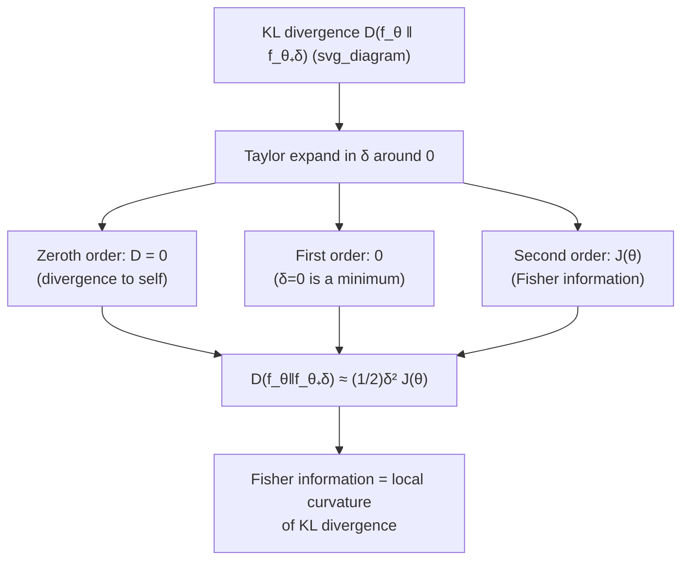

## Relationship Between Fisher Information and KL Divergence

### Overview

Fisher information and Kullback-Leibler divergence originate from different traditions — one from classical statistical estimation theory, the other from information theory — yet they are tightly linked. Fisher information emerges as the local, second-order (quadratic) behavior of KL divergence between two nearby members of a parametric family. This connection unifies the statistical notion of "how sharply the likelihood identifies a parameter" with the information-theoretic notion of "how distinguishable two distributions are," and it is the foundation of information geometry, where KL divergence supplies a natural Riemannian metric via its Fisher information Hessian.

### Recap of the Two Quantities

**KL divergence** between two distributions $P$ and $Q$ on the same alphabet:

$$D(P\|Q) = \sum_x P(x) \log \frac{P(x)}{Q(x)} \quad \text{(discrete)}, \qquad D(P\|Q) = \int p(x)\log\frac{p(x)}{q(x)}\,dx \quad \text{(continuous)}$$

**Fisher information** at $\theta$ for a parametric family $\{f_\theta\}$:

$$J(\theta) = \mathbb{E}_\theta\left[\left(\frac{\partial}{\partial\theta}\log f_\theta(X)\right)^2\right] = -\mathbb{E}_\theta\left[\frac{\partial^2}{\partial\theta^2}\log f_\theta(X)\right]$$

These look unrelated at first glance — one is a global measure of divergence between two arbitrary distributions, the other a local, parameter-specific curvature quantity — but a Taylor expansion reveals the connection directly.

### The Local Quadratic Expansion

Fix $\theta$ and consider $D(f_\theta \,\|\, f_{\theta+\delta})$ as a function of a small perturbation $\delta$. Expand this in a Taylor series around $\delta = 0$.

**Zeroth order.** $D(f_\theta \| f_\theta) = 0$, since KL divergence between a distribution and itself vanishes.

**First order.** Differentiating $D(f_\theta\|f_{\theta+\delta})$ with respect to $\delta$ and evaluating at $\delta = 0$ gives zero. This follows because $D(f_\theta\|f_{\theta+\delta}) \geq 0$ for all $\delta$ with equality at $\delta=0$, so $\delta=0$ is a minimum, and the first derivative at an interior minimum vanishes (under the regularity conditions ensuring differentiability).

**Second order.** The second derivative, evaluated at $\delta=0$, is exactly the Fisher information:

$$\left.\frac{\partial^2}{\partial \delta^2} D(f_\theta\,\|\,f_{\theta+\delta})\right|_{\delta=0} = J(\theta)$$

Combining all three orders via Taylor's theorem:

$$D(f_\theta \,\|\, f_{\theta+\delta}) = \frac{1}{2}\delta^2 J(\theta) + o(\delta^2) \quad \text{as } \delta \to 0$$

**Key Points**
- This shows KL divergence behaves, to leading order near $\delta=0$, like a quadratic form with Fisher information as the coefficient — the divergence "grows" in proportion to $J(\theta)$ for small perturbations.
- The vanishing first-order term is essential: it reflects that $f_\theta$ is always a local minimum of $D(f_\theta\|\cdot)$ over the family (trivially, at zero divergence), so the leading-order behavior of the divergence must be quadratic, not linear.

### Derivation Sketch

Write $D(f_\theta\|f_{\theta+\delta}) = \int f_\theta(x) \log \frac{f_\theta(x)}{f_{\theta+\delta}(x)}\,dx = -\int f_\theta(x) \log f_{\theta+\delta}(x)\,dx + \int f_\theta(x)\log f_\theta(x)\,dx$.

Only the first term depends on $\delta$. Taylor-expand $\log f_{\theta+\delta}(x)$ in $\delta$ around $\delta=0$:

$$\log f_{\theta+\delta}(x) \approx \log f_\theta(x) + \delta \, \frac{\partial \log f_\theta(x)}{\partial \theta} + \frac{\delta^2}{2} \frac{\partial^2 \log f_\theta(x)}{\partial \theta^2}$$

Substituting and integrating term by term against $f_\theta(x)$:

$$D(f_\theta\|f_{\theta+\delta}) \approx -\delta\, \mathbb{E}_\theta\left[\frac{\partial \log f_\theta(X)}{\partial\theta}\right] - \frac{\delta^2}{2}\,\mathbb{E}_\theta\left[\frac{\partial^2 \log f_\theta(X)}{\partial\theta^2}\right]$$

The first-order term vanishes because $\mathbb{E}_\theta[s(\theta,X)] = 0$ (the mean-zero score property), leaving

$$D(f_\theta\|f_{\theta+\delta}) \approx -\frac{\delta^2}{2}\,\mathbb{E}_\theta\left[\frac{\partial^2\log f_\theta(X)}{\partial\theta^2}\right] = \frac{\delta^2}{2} J(\theta)$$

using the second-derivative form of Fisher information. This confirms the quadratic expansion directly.

**Key Points**
- The derivation relies on the same mean-zero score identity used in the Cramér-Rao bound proof, showing the two results share a common technical foundation.
- The approximation improves as $\delta \to 0$; for finite $\delta$, higher-order terms (related to higher cumulants of the score, and to concepts like skewness of the log-likelihood) contribute additional corrections.

### Diagram: From Global Divergence to Local Curvature

### Worked Example: Gaussian Mean

Let $f_\theta = \mathcal{N}(\theta, \sigma^2)$ with known $\sigma^2$. For two Gaussians with the same variance but means $\theta$ and $\theta+\delta$, the KL divergence has the closed form

$$D(f_\theta \,\|\, f_{\theta+\delta}) = \frac{\delta^2}{2\sigma^2}$$

**Example**
Comparing to the quadratic approximation $\frac{1}{2}\delta^2 J(\theta)$ with the previously computed $J(\theta) = 1/\sigma^2$ for the Gaussian mean:

$$\frac{1}{2}\delta^2 J(\theta) = \frac{1}{2}\delta^2 \cdot \frac{1}{\sigma^2} = \frac{\delta^2}{2\sigma^2}$$

This matches the exact KL divergence formula for *all* $\delta$, not just as $\delta \to 0$ — a special feature of the Gaussian family (where the log-density is exactly quadratic in $\theta$, so the Taylor expansion truncates exactly at second order with no remainder). This makes the Gaussian case a particularly clean illustration, though [Inference] this exactness is specific to location families with quadratic log-likelihoods and does not hold for general parametric families, where the quadratic approximation is only a leading-order local statement.

### Reverse Direction and Symmetry Near $\delta = 0$

An important subtlety: KL divergence is asymmetric in general ($D(P\|Q) \neq D(Q\|P)$), but the local quadratic expansion is **symmetric to leading order**:

$$D(f_{\theta+\delta}\,\|\,f_\theta) \approx \frac{1}{2}\delta^2 J(\theta) + o(\delta^2)$$

which agrees with $D(f_\theta\|f_{\theta+\delta})$ to the same leading order (the asymmetry only appears in the $o(\delta^2)$ remainder, typically at third order, related to derivatives of Fisher information itself).

**Key Points**
- This local symmetry is why Fisher information can serve as a genuine (symmetric) Riemannian metric even though its "parent" quantity, KL divergence, is asymmetric — the asymmetry is a higher-order effect invisible at the leading quadratic scale.
- This is analogous to how a asymmetric "distance-like" function can still induce a symmetric local metric structure, provided its Hessian at the diagonal is well-defined and symmetric — which is exactly the role $J(\theta)$ plays here.

### Information Geometry: Fisher Information as a Riemannian Metric

The local quadratic expansion motivates treating the parameter space $\Theta$ as a Riemannian manifold, where $J(\theta)$ serves as the metric tensor (the **Fisher-Rao metric**). Infinitesimal "information distance" between nearby distributions $f_\theta$ and $f_{\theta+d\theta}$ is defined as

$$ds^2 = d\theta^{\top} J(\theta) \, d\theta$$

directly generalizing the scalar relation $D(f_\theta\|f_{\theta+\delta}) \approx \frac{1}{2}\delta^2 J(\theta)$ to the multivariate case, where $J(\theta)$ is the Fisher information matrix.

**Key Points**
- This is the starting point of **information geometry**, a field studying families of probability distributions using differential-geometric tools, with the Fisher-Rao metric providing a canonical, reparameterization-invariant notion of "distance" between nearby distributions.
- Geodesic distances under the Fisher-Rao metric give a symmetric, global (not just local) notion of statistical distance between distributions in the same family, distinct from — but rooted in the same local structure as — the (asymmetric) KL divergence itself.
- [Unverified] The full geometric theory also involves dual affine connections (the e-connection and m-connection) associated with the asymmetry of KL divergence; the precise construction is more elaborate than the metric alone and is a specialized topic within information geometry.

### Why This Relationship Matters

**Key Points**
- It unifies two historically separate lines of thought — Fisher's statistical efficiency theory and Shannon's information theory — showing that Fisher information is not an independent primitive but a derived, local feature of KL divergence.
- It explains why Fisher information appears in both statistical estimation bounds (Cramér-Rao) and information-theoretic contexts (asymptotic behavior of the method of types, local hypothesis testing) — both trace back to the same quadratic structure of KL divergence near coincidence.
- It underlies the asymptotic theory of statistics: local hypothesis testing (distinguishing $\theta$ from $\theta+\delta$ for small $\delta$, as $n$ grows so that $\delta \sim 1/\sqrt{n}$) has error probabilities governed by $J(\theta)$, connecting directly back to Stein's lemma and Chernoff-type exponents in the local regime.
- It provides the conceptual foundation for information geometry, giving a principled geometric structure to statistical models that is used in areas including natural gradient optimization, model selection, and efficient estimation theory.

**Related Topics**
- Information geometry and the Fisher-Rao metric
- Cramér-Rao bound and efficient estimation
- Local asymptotic normality and contiguity in statistics
- Natural gradient descent (use of Fisher information in optimization)
- Chi-squared divergence and other $f$-divergences (alternative local expansions)
- Jeffreys prior and its invariance under reparameterization
- Exponential families and dual coordinate systems in information geometry
- Second-order asymptotics in hypothesis testing (local alternatives)