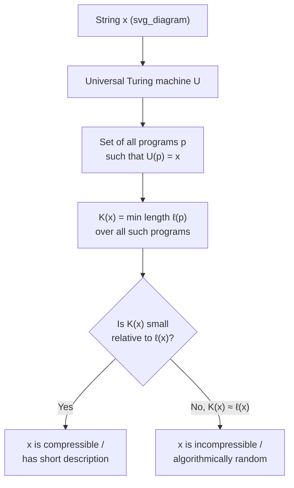

## Definition of Kolmogorov Complexity

### Overview

Kolmogorov complexity formalizes the idea that the "complexity" of an individual object — most commonly a binary string — is the length of the shortest computer program that produces it. Unlike Shannon entropy, which measures the average information content of a random source over a probability distribution, Kolmogorov complexity assigns a complexity value to a *single, specific* string, with no reference to any underlying probability model at all. It provides the foundation of algorithmic information theory, connecting computability theory to information theory and giving a rigorous, machine-independent notion of randomness for individual finite objects.

### Motivation: Complexity Without Probability

Shannon entropy $H(X)$ measures the average number of bits needed to describe a random variable $X$, but it says nothing about how "complex" or "random" any single realized outcome is. Two very different-looking strings of length $n$ can come from the same source and hence be treated identically by Shannon theory, yet intuitively be very different in complexity. For instance:

$$s_1 = 0101010101010101 \qquad s_2 = 1101001000101101$$

Both are equally likely under a fair-coin i.i.d. model (each has probability $2^{-16}$), so Shannon's framework treats them identically. Yet $s_1$ has an obvious short description ("$01$ repeated $8$ times"), while $s_2$ appears to have no such shortcut. Kolmogorov complexity is designed precisely to capture this distinction.

**Key Points**
- Kolmogorov complexity is a property of the *string itself*, not of a distribution the string was drawn from.
- This makes it a fundamentally different, though related, notion from Shannon entropy — one is about individual objects, the other about ensembles.

### Formal Definition

Fix a **universal Turing machine** $U$ that takes a binary program $p$ as input and, if it halts, produces a binary string $U(p)$ as output.

**Definition (Kolmogorov Complexity).** The Kolmogorov complexity of a binary string $x$ with respect to $U$ is

$$K_U(x) = \min_{p \,:\, U(p) = x} \ell(p)$$

where $\ell(p)$ denotes the length (in bits) of the program $p$, and the minimum is taken over all programs $p$ that, when run on $U$, halt and output exactly $x$. If no such program exists, $K_U(x) = \infty$ (though for a universal machine, some program producing $x$ always exists — trivially, one that hardcodes $x$ literally — so $K_U(x) \leq \ell(x) + O(1)$).

**Key Points**
- $K_U(x)$ is the length of the *shortest* self-contained description (as an executable program) that reconstructs $x$ exactly.
- The definition depends on the choice of universal machine $U$ — but as shown next, this dependence is only up to an additive constant.

### The Invariance Theorem

The apparent machine-dependence of $K_U(x)$ is resolved by a foundational result.

**Invariance Theorem.** For any two universal Turing machines $U_1$ and $U_2$, there exists a constant $c_{U_1,U_2}$ (depending on the machines but not on $x$) such that

$$\big| K_{U_1}(x) - K_{U_2}(x) \big| \leq c_{U_1, U_2} \quad \text{for all strings } x$$

**Proof idea.** Since $U_1$ is universal, it can simulate $U_2$: there is a fixed-length "translator" program $\pi$ (a simulator of $U_2$ written for $U_1$) such that running $U_1$ on $\pi$ followed by any program $p$ for $U_2$ reproduces $U_2(p)$. Thus any program of length $\ell(p)$ that makes $U_2$ output $x$ can be converted into a program of length $\ell(p) + \ell(\pi)$ that makes $U_1$ output $x$, where $\ell(\pi)$ is a constant independent of $x$. This gives $K_{U_1}(x) \leq K_{U_2}(x) + \ell(\pi)$, and the symmetric argument gives the reverse inequality.

**Key Points**
- This theorem is what makes Kolmogorov complexity a meaningful, essentially machine-independent notion: for any fixed pair of universal machines, complexities agree up to a constant that does not grow with $x$.
- Consequently, one typically writes $K(x)$ without reference to a specific machine, understanding that the value is defined only up to an additive constant depending on the choice of reference machine — a form of asymptotic, rather than exact, universality.
- [Inference] This is analogous to how different but "reasonable" programming languages (e.g., Python versus C) can encode a universal interpreter for one another in a fixed, bounded amount of code, so the choice of language does not affect complexity comparisons for large or complex enough strings.

### Prefix-Free Kolmogorov Complexity

The definition above uses arbitrary programs, but a technical subtlety arises: if programs can be arbitrary binary strings, it becomes ambiguous where one program ends and the next begins when programs are concatenated, and certain desirable properties (like Kraft's inequality) fail to hold cleanly.

The standard refinement restricts to **prefix-free** programs — a set of programs in which no program is a prefix of another (so the machine can determine where a program ends without an explicit end-marker, since no valid program is itself a truncation of another valid program). This defines the **prefix Kolmogorov complexity**, usually denoted $K(x)$ in the modern literature (sometimes distinguished from the "plain" complexity $C(x)$ defined above).

**Key Points**
- Prefix-free programs satisfy Kraft's inequality: $\sum_p 2^{-\ell(p)} \leq 1$, summed over all halting programs $p$ in the prefix-free set — mirroring exactly the Kraft inequality for uniquely decodable codes in Shannon theory.
- This prefix-free version is the one used in most modern treatments (e.g., in deriving the connection to universal probability and Solomonoff induction), because it behaves better under composition — for instance, $K(x,y) \leq K(x) + K(y) + O(1)$ holds more cleanly for the prefix version.
- [Unverified] The precise inequalities relating plain complexity $C(x)$ and prefix complexity $K(x)$ (e.g., $K(x) \leq C(x) + O(\log C(x))$, or similar logarithmic-gap bounds) depend on details of the construction and are typically established via careful coding arguments rather than being immediate from the definitions.

### Diagram: The Complexity of a String

### Worked Example

Consider strings of length $n = 1000$.

**Example**
- $x_1 = $ "$0$" repeated $1000$ times. A program can simply be: *"print '0' 1000 times"*, which requires roughly $\log_2(1000) \approx 10$ bits to encode the repeat count, plus a small constant number of bits for the printing logic itself — so $K(x_1) = O(\log n)$, dramatically smaller than $n = 1000$.
- $x_2 = $ the binary digits of $\pi$ from some fixed starting position, for $1000$ digits. Although $x_2$ may look "random" by statistical tests, it has a short description as *"compute the $k$-th through $(k+1000)$-th binary digits of $\pi$"*, so $K(x_2) = O(\log n)$ as well — despite $x_2$ passing many statistical randomness tests, it is highly compressible algorithmically because $\pi$ itself is computable by a short program.
- A string $x_3$ generated by $1000$ independent fair coin flips will, with overwhelming probability, satisfy $K(x_3) \geq n - O(1)$ — i.e., no significantly shorter description than "print $x_3$ literally" exists. Such a string is called (algorithmically) **incompressible** or **random**.

This example — particularly $x_2$ — illustrates a key conceptual point: Kolmogorov complexity captures *computational* compressibility, which can differ sharply from apparent statistical randomness.

### Basic Properties

- **Upper bound:** $K(x) \leq \ell(x) + O(1)$ for all $x$, since the "print $x$ literally" program always works, up to a fixed encoding overhead.
- **Non-computability:** [Unverified — though this is a well-established foundational theorem, not merely uncertain] $K(x)$ is not a computable function of $x$; there is no algorithm that takes an arbitrary string $x$ as input and outputs $K(x)$ in finite time, a consequence closely related to the halting problem and formalized via a counting/diagonalization argument (the existence of strings that would let a hypothetical complexity-computing program derive a contradiction if it always terminated correctly).
- **Most strings are incompressible:** For any $n$, the number of strings of length $n$ with $K(x) < n - k$ is less than $2^{n-k}$, so the *fraction* of strings of length $n$ compressible by more than $k$ bits is at most $2^{-k}$ — a simple counting argument, since there are only $2^{n-k} - 1$ programs shorter than $n-k$ bits available to describe $2^n$ possible strings.

**Key Points**
- Non-computability is perhaps the most striking property of Kolmogorov complexity: even though it is a precisely, mathematically well-defined quantity, no algorithm can compute it in general — a sharp contrast with Shannon entropy, which is directly computable from a specified probability distribution.
- The counting argument for incompressibility is elementary but powerful: it shows algorithmic randomness (incompressibility) is the *generic* case among all strings of a given length, not a rare exception.

### Relationship to Shannon Entropy (Preview)

Although Kolmogorov complexity is defined without reference to probability, a deep connection exists: for a computable probability distribution $P$, the expected Kolmogorov complexity of strings drawn from $P$ is closely related to the Shannon entropy of $P$,

$$\mathbb{E}_{X \sim P}[K(X)] \approx H(P) \cdot n + O(1)$$

up to lower-order terms, for $n$-length strings and suitable regularity on $P$. [Inference] This relationship, along with the more detailed correspondence between Kolmogorov complexity, universal coding, and Shannon-optimal compression, is typically developed as a distinct topic (algorithmic information theory's connection to Shannon theory) built upon the basic definitions established here.

**Key Points**
- This preview signals that Kolmogorov complexity and Shannon entropy, despite their very different starting points (individual objects versus distributions), converge asymptotically under the right conditions — a recurring theme in algorithmic information theory.

### Why Kolmogorov Complexity Matters

**Key Points**
- It gives a rigorous, distribution-free definition of randomness for individual objects, resolving the conceptual gap left by Shannon theory (which can only speak of randomness of a *source*, not of a single outcome).
- The invariance theorem ensures the notion is robust and essentially machine-independent, making it a legitimate mathematical invariant of a string rather than an artifact of a particular encoding scheme.
- It underlies algorithmic information theory, Solomonoff's theory of inductive inference, minimum description length (MDL) approaches to model selection, and formal definitions of Martin-Löf randomness.
- Its non-computability is a foundational limitation with deep ties to Gödel's incompleteness theorems and the halting problem, illustrating fundamental boundaries on what can be algorithmically determined about complexity and randomness.

**Related Topics**
- Algorithmic (Martin-Löf) randomness and its formal definitions
- Prefix-free codes and Kraft's inequality in algorithmic information theory
- Solomonoff induction and universal prediction
- Minimum description length (MDL) principle
- Relationship between Kolmogorov complexity and Shannon entropy
- Chaitin's incompleteness theorem and the halting probability $\Omega$
- Computability theory and the halting problem
- Universal Turing machines and simulation arguments