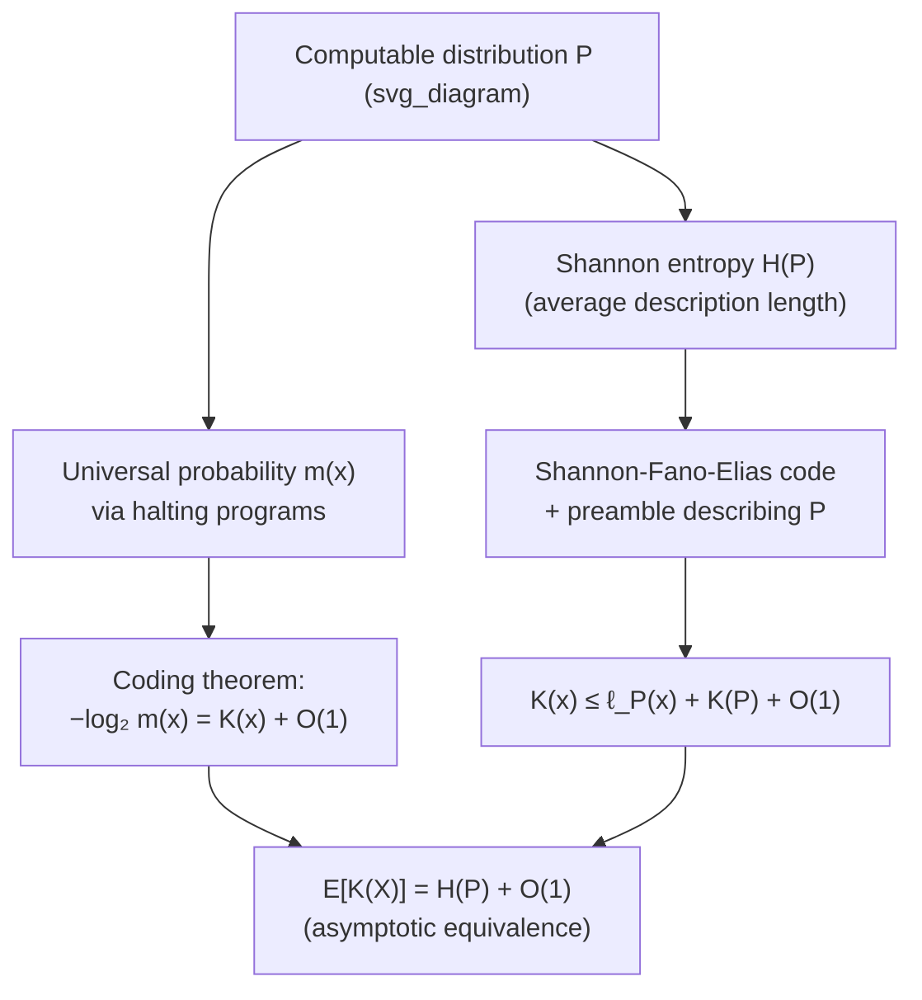

## Relationship to Shannon Entropy

### Overview

Kolmogorov complexity and Shannon entropy arise from fundamentally different starting points — one assigns a complexity value to a single fixed string via computability theory, the other measures the average information content of a random source via probability theory. Despite this divide, the two notions are asymptotically equivalent for computable sources: the expected Kolmogorov complexity of strings drawn from a computable distribution converges to the Shannon entropy rate, up to lower-order and machine-dependent correction terms. This equivalence is one of the deepest bridges in information theory, unifying algorithmic and probabilistic notions of information under a common asymptotic law.

### The Two Frameworks Contrasted

**Shannon entropy** is defined with respect to a probability distribution $P$ over a random variable $X$:

$$H(P) = -\sum_x P(x) \log_2 P(x)$$

It quantifies the *average* number of bits needed to describe an outcome of $X$, optimized over all possible (uniquely decodable, or prefix) codes, and says nothing about any single realized outcome individually.

**Kolmogorov complexity** $K(x)$ is defined with respect to a single fixed string $x$ and a universal Turing machine $U$, with no reference to any distribution:

$$K(x) = \min_{p:\,U(p)=x} \ell(p)$$

**Key Points**
- Shannon entropy is a property of a distribution; Kolmogorov complexity is a property of an individual object.
- Shannon theory is fundamentally probabilistic and asymptotic-in-expectation; Kolmogorov complexity theory is fundamentally computational and defined pointwise, with asymptotics entering only when studying its behavior *across* strings or under a distribution.
- Despite the conceptual gap, both are attempts to formalize the same intuitive idea: the "information content" or "descriptive complexity" of data.

### The Coding Theorem: Universal Probability and Complexity

The bridge between the two frameworks runs through the **algorithmic coding theorem**, which relates $K(x)$ to a universal notion of probability.

Define the **universal (a priori) probability** of a string $x$ as

$$m(x) = \sum_{p \,:\, U(p) = x} 2^{-\ell(p)}$$

summed over all halting programs $p$ (in a prefix-free program set) that output $x$ — this is the probability that a program consisting of uniformly random bits, fed to $U$, happens to halt and output $x$.

**Coding Theorem (Levin/Chaitin).**

$$-\log_2 m(x) = K(x) + O(1)$$

That is, the negative log of the universal probability of $x$ equals its prefix Kolmogorov complexity, up to an additive constant independent of $x$.

**Key Points**
- This result is the algorithmic analogue of the Shannon source-coding relationship between optimal code length and $-\log_2 P(x)$: it shows $K(x)$ behaves exactly like $-\log_2$ of a "probability" — the universal probability $m(x)$ — mirroring the Shannon-theoretic correspondence between probability and optimal code length.
- $m(x)$ dominates (up to a multiplicative constant) every computable, lower-semicomputable probability distribution, which is why it is called *universal*: it assigns at least as much probability, asymptotically, to every string as any effectively describable source would.

### Expected Complexity Under a Computable Distribution

Let $P$ be a **computable** probability distribution over strings of length $n$ (meaning there is an algorithm that, given $x$ and a precision parameter, computes $P(x)$ to that precision). The central asymptotic result connecting the two theories is:

$$\mathbb{E}_{X \sim P}\big[K(X)\big] = H(P) + O(1)$$

more precisely, for a computable $P$ on strings of length $n$,

$$\sum_x P(x) K(x) \leq H(P) + K(P) + O(1)$$

where $K(P)$ denotes the (small, essentially constant for a fixed source) complexity of describing the distribution $P$ itself, and a matching lower bound (up to the same order) also holds:

$$\sum_x P(x)\, K(x) \geq H(P) - O(1)$$

**Key Points**
- The additive gap between $\mathbb{E}[K(X)]$ and $H(P)$ is bounded by a constant depending on $P$ (specifically, on the complexity of describing $P$) but *not* growing with $n$ or with the entropy itself — a remarkably tight correspondence.
- The upper bound follows because a Shannon-optimal (or near-optimal) code for $P$, combined with a fixed-length description of $P$ itself, gives an explicit short program for any $x$: "here is a description of $P$; decode the following optimal code for $x$ under $P$."
- The lower bound follows from Kraft's inequality applied to the halting programs of length $\leq K(x)$, showing that if complexities were systematically much smaller than $-\log_2 P(x)$, the implied code would violate Kraft's inequality.

### Proof Sketch of the Upper Bound

Fix a computable distribution $P$. By the Kraft-McMillan / Shannon-Fano-Elias construction, there exists a prefix code assigning each string $x$ a codeword of length $\ell_P(x) = \lceil -\log_2 P(x) \rceil$, achieving

$$\mathbb{E}_{X\sim P}[\ell_P(X)] = H(P) + O(1)$$

(the standard near-optimality of Shannon-Fano-Elias-style codes, off from entropy by less than 1 bit).

Now construct a program for any specific $x$: first include a fixed-length preamble $\pi_P$ that encodes an algorithm for computing $P$ (a constant-length program, independent of $x$, of length $K(P)$), followed by the Shannon-Fano-Elias codeword for $x$ under $P$. Since $U$ can simulate this two-part program (run $\pi_P$ to reconstruct the coding scheme, then decode the codeword), this gives

$$K(x) \leq \ell_P(x) + K(P) + O(1)$$

Taking expectation over $X \sim P$:

$$\mathbb{E}_{X\sim P}[K(X)] \leq \mathbb{E}_{X\sim P}[\ell_P(X)] + K(P) + O(1) = H(P) + K(P) + O(1)$$

**Key Points**
- This proof directly reuses the Shannon-Fano-Elias / Kraft-inequality machinery from classical source coding, transplanted into the algorithmic setting via the "preamble + codeword" trick.
- The constant $K(P)$ is the price of describing the source itself — for a fixed distribution used repeatedly (e.g., across many $n$), this cost is amortized and becomes negligible relative to $H(P) \cdot n$ as $n$ grows, for distributions where entropy scales linearly in $n$ (e.g., i.i.d. or stationary ergodic sources).

### Diagram: Bridging the Two Theories

### Worked Example: I.I.D. Bernoulli Source

Let $X^n = X_1,\ldots,X_n$ be i.i.d. $\text{Bernoulli}(p)$ for a computable (e.g., rational) $p$. The Shannon entropy rate is

$$H(p) = -p\log_2 p - (1-p)\log_2(1-p)$$

so the total entropy of the length-$n$ block is $n H(p)$.

**Example**
For $p = 0.5$: $H(0.5) = 1$ bit per symbol, so $\mathbb{E}[K(X^n)] \approx n$ — a typical fair-coin string of length $n$ has Kolmogorov complexity close to $n$ itself (it is nearly incompressible), consistent with the earlier observation that random-looking strings from a fair-coin source resist short description.

For $p = 0.1$: $H(0.1) = -0.1\log_2 0.1 - 0.9\log_2 0.9 \approx 0.1(3.32) + 0.9(0.152) \approx 0.332 + 0.137 = 0.469$ bits per symbol, so $\mathbb{E}[K(X^n)] \approx 0.469\,n$ — a typical string from this biased source (mostly $0$s, occasional $1$s) is, on average, compressible to roughly $47\%$ of its raw length, matching the entropy-based compression rate predicted by Shannon theory, and achievable in the limit by an algorithmic description combining the source's bias with an efficient code.

This shows the expected Kolmogorov complexity per symbol converges to the Shannon entropy rate $H(p)$, exactly as classical source coding predicts for the *achievable compression rate* — but now stated as a fact about individual strings' algorithmic complexity rather than about a coding scheme's average performance.

### Key Conceptual Differences Despite the Asymptotic Equivalence

Even though the expectations coincide asymptotically, important distinctions remain:

- **Individual strings can deviate sharply.** The equivalence $\mathbb{E}[K(X)] \approx H(P) \cdot n$ is a statement about the *average* over $P$; specific outcomes — like the "digits of $\pi$" example from the plain-complexity discussion — can have $K(x) \ll -\log_2 P(x)$ even though they are statistically typical (high-probability) outcomes under $P$, because they happen to have exploitable algorithmic structure unrelated to the "generating" process.
- **Non-computability persists.** Even knowing $H(P)$ exactly (which is a straightforward, computable quantity given $P$) does not make $K(x)$ computable for individual $x$ — the coding-theorem relationship is an asymptotic/expectation statement, not a tool for computing $K(x)$ directly.
- **Universal probability versus actual source.** $m(x)$, the universal probability, is generally *not* equal to any specific computable $P(x)$ — it dominates all computable distributions simultaneously, so the coding theorem's $K(x) \approx -\log_2 m(x)$ is a statement about the best possible universal code, not about optimality with respect to any single fixed $P$.

**Key Points**
- These distinctions matter in practice: a string can "look" like a typical outcome of a simple statistical model while secretly having much lower Kolmogorov complexity due to hidden algorithmic structure (a famous example being sequences that look statistically random by standard tests but are generated by short recursive rules).
- [Inference] This is part of why Kolmogorov complexity is considered a more fundamental, though less directly computable, notion of randomness than statistical tests based on a presumed distribution — it does not depend on committing to any particular generative model in advance.

### Why This Relationship Matters

**Key Points**
- It establishes that Shannon's probabilistic theory of information and Kolmogorov's algorithmic theory of complexity, though built on entirely different foundations, agree asymptotically for computable sources — a deep consistency result rather than a coincidence.
- It gives an alternative, distribution-free justification for the operational meaning of entropy: entropy is not just the average optimal code length under a model, but also (in expectation) the average algorithmic complexity of the source's typical outputs.
- It underlies the theoretical foundations of universal compression and universal prediction (Solomonoff induction), where algorithmic complexity provides a way to reason about compression and prediction without assuming a specific probability model in advance.
- It clarifies the boundary between statistical and algorithmic notions of randomness, motivating formal definitions like Martin-Löf randomness that reconcile the two viewpoints for individual infinite sequences.

**Related Topics**
- Universal probability and the algorithmic coding theorem
- Solomonoff induction and universal prediction
- Martin-Löf randomness and algorithmic randomness tests
- Minimum description length (MDL) principle and model selection
- Shannon-Fano-Elias coding and near-optimal prefix codes
- Universal source coding (Lempel-Ziv and other computable-complexity-agnostic compressors)
- Chaitin's incompleteness theorem and the halting probability $\Omega$
- Algorithmic statistics and sufficient statistics in the Kolmogorov complexity sense