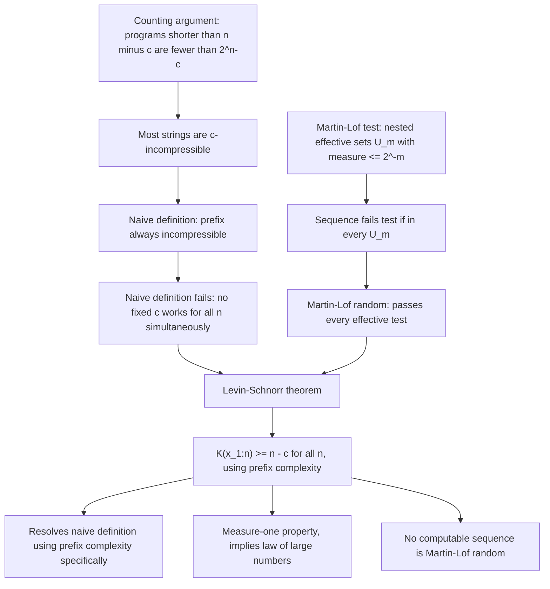

## Incompressibility and Randomness

### Overview

Incompressibility is the algorithmic-complexity foundation for defining what it means for an individual finite string, or an infinite sequence, to be **random**. Rather than defining randomness through a probabilistic generating process (as in "generated by a fair coin"), this framework defines randomness as an *intrinsic property of the object itself*: a string is random precisely when it has no shorter description than writing it out in full. This reframes randomness from a statement about a source into a statement about an outcome, and it culminates in the rigorous notion of **Martin-Löf randomness**, widely regarded as the correct formalization of algorithmic randomness for infinite sequences.

### Incompressible Strings: Definition

A string $x$ of length $n$ is called **$c$-incompressible** if:

$$K(x) \ge n - c$$

for a chosen constant $c \ge 0$. Intuitively, this means no program shorter than (roughly) $n - c$ bits can produce $x$ — the string cannot be compressed by more than $c$ bits relative to its own length. A string is simply called **incompressible** (without qualification) when $c$ is a small constant (often $c=0$ or a small fixed value), meaning $K(x) \approx n$.

### The Counting Argument: Most Strings Are Incompressible

This is the fundamental existence and prevalence result, established via a direct counting bound.

**Claim**: for any $n$ and any $c \ge 1$, the fraction of strings of length $n$ that are *not* $c$-incompressible (i.e., have $K(x) < n-c$) is less than $2^{-c+1}$.

**Proof**: The number of programs of length strictly less than $n - c$ is:

$$\sum_{i=0}^{n-c-1} 2^i = 2^{n-c} - 1 < 2^{n-c}$$

Since each such program can produce at most one output string, the number of strings $x$ of length $n$ with $K(x) < n - c$ is less than $2^{n-c}$. Since there are exactly $2^n$ strings of length $n$ total, the fraction failing $c$-incompressibility is less than:

$$\frac{2^{n-c}}{2^n} = 2^{-c}$$

This proves that the vast majority of strings, for any fixed $n$, have Kolmogorov complexity within a small additive gap of $n$ itself — they are essentially incompressible. As $c$ grows, the fraction of "highly compressible" strings (those compressible by more than $c$ bits) shrinks exponentially, mirroring the exponential concentration seen throughout large deviations theory and the AEP.

### Consequence: Existence of Incompressible Strings of Every Length

A direct corollary is that for every $n$, at least one string of length $n$ satisfies $K(x) \ge n$ (taking $c=0$ in the counting argument, since strictly fewer than $2^n$ strings can have complexity below $n$, at least one must have complexity at least $n$). This guarantees incompressible strings always exist — randomness, in this sense, is not a vacuous or empty notion.

### Why Individual-String Randomness Is Subtle: The Need for Uniformity

A first, naive attempt at defining an infinite sequence $x_1 x_2 x_3 \ldots$ as "random" might be: every finite prefix $x_{1:n}$ is incompressible (i.e., $K(x_{1:n}) \ge n - c$ for a fixed $c$, for all $n$). This naive definition, however, turns out to be **too strong** — no infinite sequence satisfies it for every $n$ simultaneously with a single fixed $c$. This is because $K(x_{1:n})$ must occasionally dip well below $n$ for deep number-theoretic and combinatorial reasons related to the structure of the halting problem (related to Chaitin's incompleteness phenomena), even for sequences that are intuitively "as random as possible." A workable definition needs a more careful, statistically robust criterion — leading to Martin-Löf's formulation via effective statistical tests, described next.

### Martin-Löf Randomness

**Martin-Löf randomness** is the standard rigorous definition of randomness for infinite binary sequences, formulated not directly via a raw Kolmogorov complexity threshold but via **effective statistical tests**.

A **Martin-Löf test** is a computably enumerable sequence of nested sets $U_1 \supseteq U_2 \supseteq U_3 \supseteq \cdots$ of infinite binary sequences (each $U_m$ specified as a computably enumerable union of cylinder sets — sets of sequences sharing a common finite prefix) such that, under the uniform (fair-coin) measure:

$$\mu(U_m) \le 2^{-m}$$

An infinite sequence $x$ **fails** the test if $x \in U_m$ for every $m$ (i.e., $x \in \bigcap_m U_m$) — meaning $x$ falls into an effectively describable set of vanishingly small measure, for every level of stringency $m$. A sequence $x$ is **Martin-Löf random** if it passes *every* Martin-Löf test — that is, for every such test, $x$ eventually exits $U_m$ for some finite $m$.

Intuitively, a Martin-Löf test formalizes "any effectively describable statistical pattern or regularity that a computer could check for." Martin-Löf randomness then means: **no computably describable statistical test can detect any regularity in $x$** — the sequence evades every possible effective pattern-detection procedure, which is the strongest reasonable formalization of "patternless" achievable within computability theory.

### The Levin–Schnorr Theorem: Connecting Randomness to Complexity

The **Levin–Schnorr theorem** provides the crucial equivalence between the statistical-test definition (Martin-Löf randomness) and a direct, prefix-Kolmogorov-complexity-based criterion, resolving the subtlety noted above:

An infinite sequence $x$ is Martin-Löf random **if and only if** there exists a constant $c$ such that for all $n$:

$$K(x_{1:n}) \ge n - c$$

using **prefix** Kolmogorov complexity specifically (the plain complexity $C(x)$ does not admit this clean characterization due to the additive logarithmic corrections discussed previously). This theorem is the rigorous justification for the intuitive idea that "random = incompressible," resolving the earlier subtlety: the naive incompressibility definition *is* correct, provided one uses prefix complexity rather than plain complexity, and this equivalence is exactly what makes the statistical-test-based and complexity-based approaches to randomness coincide.

### Properties of Martin-Löf Random Sequences

- **Measure-one property**: the set of Martin-Löf random sequences has measure $1$ under the uniform (fair-coin) distribution on infinite binary sequences — "almost every" infinite sequence, in the standard probabilistic sense, is Martin-Löf random. This reconciles the algorithmic definition with the classical probabilistic intuition that a fair-coin sequence is "generically" random.
- **Satisfies the Law of Large Numbers**: every Martin-Löf random sequence satisfies the strong law of large numbers with respect to symbol frequencies (the relative frequency of $1$s converges to $1/2$) — algorithmic randomness implies statistical typicality, though the converse (statistical typicality implies algorithmic randomness) is false, as the $\pi$-digit example from the previous topics illustrates.
- **No computable sequence is Martin-Löf random**: if $x$ is computable (produced by some fixed, finite program regardless of $n$), then $K(x_{1:n}) = O(\log n)$ (the program length plus the bits to specify $n$), which is far below $n - c$ for any fixed $c$ once $n$ is large — violating the Levin–Schnorr criterion. This confirms that "algorithmically generated" and "random" are, appropriately, mutually exclusive notions.
- **Closed under the equivalence of universal machines**: because the Invariance Theorem guarantees $K(x)$ is well-defined up to an additive constant regardless of the reference universal machine, the property "$K(x_{1:n}) \ge n - c$ for *some* constant $c$" — and hence Martin-Löf randomness itself — does not depend on which universal machine was used to define $K$.

### Worked Example: Distinguishing Compressible and Incompressible Behavior

Consider the sequence formed by concatenating the binary encodings of $1, 2, 3, 4, \ldots$ in order (the **Champernowne-like sequence**). Although this sequence passes many classical statistical randomness tests (it is known to be **normal** — every finite binary block appears with the statistically correct limiting frequency), it is **not** Martin-Löf random: there is an obvious short, fixed-length program that generates arbitrarily long prefixes of it (simply "output the binary representations of $1, 2, 3, \ldots$ in order, up to length $n$"), giving $K(x_{1:n}) = O(\log n)$ — far below the $n - c$ threshold required by the Levin–Schnorr criterion. This is the clearest illustration of the gap between **statistical normality** (a weaker, frequency-based notion) and **Martin-Löf randomness** (a strictly stronger notion requiring immunity to *every* effective test, not merely frequency-counting tests).

### Diagram: Hierarchy of Randomness Notions

<svg xmlns="http://www.w3.org/2000/svg" viewBox="0 0 700 420">
  <text x="350" y="30" text-anchor="middle" font-size="18" font-weight="bold" fill="#1a1a1a">Hierarchy of Randomness Notions (svg_diagram)</text>

  <rect x="120" y="60" width="460" height="320" rx="10" fill="#f8fafc" stroke="#333" stroke-width="2" />
  <text x="350" y="90" text-anchor="middle" font-size="14" font-weight="bold" fill="#333">All infinite binary sequences</text>

  <rect x="160" y="110" width="380" height="240" rx="10" fill="#eff6ff" stroke="#2563eb" stroke-width="2" />
  <text x="350" y="135" text-anchor="middle" font-size="13" font-weight="bold" fill="#1e3a8a">Normal sequences</text>
  <text x="350" y="151" text-anchor="middle" font-size="11" fill="#1e3a8a">(correct block frequencies)</text>

  <rect x="200" y="165" width="300" height="160" rx="10" fill="#f0fdf4" stroke="#16a34a" stroke-width="2" />
  <text x="350" y="190" text-anchor="middle" font-size="13" font-weight="bold" fill="#166534">Martin-Löf random</text>
  <text x="350" y="206" text-anchor="middle" font-size="11" fill="#166534">(passes every effective test)</text>
  <text x="350" y="222" text-anchor="middle" font-size="11" fill="#166534">K(x_1:n) &gt;= n - c for all n</text>
  <text x="350" y="238" text-anchor="middle" font-size="11" fill="#166534">measure 1 under fair coin</text>

  <circle cx="240" cy="140" r="4" fill="#dc2626" />
  <text x="250" y="145" font-size="11" fill="#dc2626">Champernowne-like sequence</text>
  <text x="250" y="159" font-size="11" fill="#dc2626">(normal but not ML-random)</text>

  <circle cx="350" cy="270" r="4" fill="#166534" />
  <text x="360" y="275" font-size="11" fill="#166534">typical fair-coin sequence</text>
</svg>

### Diagram: From Incompressibility to Martin-Löf Randomness

### Common Pitfalls

- Using plain (non-prefix) Kolmogorov complexity $C(x)$ in the Levin–Schnorr criterion: the clean equivalence $K(x_{1:n}) \ge n-c$ holds specifically for prefix complexity; the plain-complexity analogue requires additional logarithmic correction terms and does not characterize Martin-Löf randomness as cleanly.
- Equating statistical normality with algorithmic randomness: as the Champernowne-like example shows, a sequence can have perfectly correct limiting symbol and block frequencies (normality) while still being generated by an extremely short program, and hence being far from Martin-Löf random — normality is a necessary but not sufficient condition.
- Assuming a single finite string can be definitively labeled "random" in an absolute sense: strict incompressibility ($K(x) \ge n$) and Martin-Löf randomness are most naturally defined and meaningful for *infinite* sequences or in the asymptotic ($c$-incompressible, for varying $c$) sense for finite strings; for any single fixed finite string, whether it "counts" as random is inherently a matter of degree (the constant $c$), not a binary property.
- Believing Martin-Löf randomness is computable to verify: like Kolmogorov complexity itself, there is no algorithm that can verify, given a finite prefix, whether the infinite sequence it belongs to is Martin-Löf random — the definition is a limiting, non-constructive criterion over all effective tests, consistent with the broader non-computability results in algorithmic information theory. [Inference: specific known Martin-Löf random reals, such as Chaitin's $\Omega$, are proven random via indirect structural arguments rather than by direct verification of the test-passing definition.]

### Related Topics

- Kolmogorov complexity and its relationship to Shannon entropy
- Chaitin's constant $\Omega$ and algorithmic information theory
- Martin-Löf tests and effective statistical tests
- Schnorr randomness and other randomness notions (comparative hierarchy)
- The law of large numbers for random sequences
- Applications to cryptographic pseudorandomness and derandomization
- Algorithmic statistics and the structure function