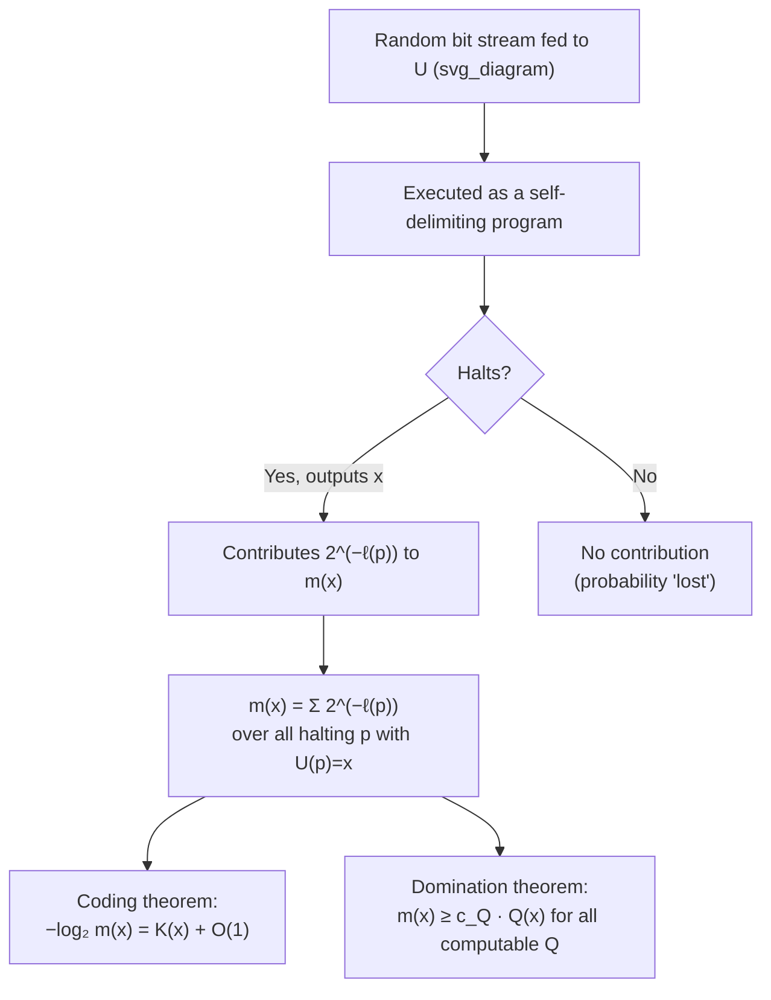

## Universal Probability

### Overview

Universal probability formalizes the notion of an a priori probability distribution over all possible finite strings, constructed from the behavior of a universal Turing machine fed random bits. It sits at the center of algorithmic information theory, linking Kolmogorov complexity to prediction and inference: the universal probability of a string is essentially the probability that a "random program" happens to produce it, and it dominates every computable distribution up to a multiplicative constant. This makes it the theoretical foundation for Solomonoff's theory of universal inductive inference and gives a rigorous algorithmic meaning to the informal idea of an "Occam's razor prior" that favors simpler hypotheses.

### Motivation: An A Priori Probability Without a Model

Shannon theory always presupposes a probability distribution $P$ is given in advance. But in many settings — prediction, inference, model selection — no such distribution is known a priori; the very problem is to infer or select one. Universal probability addresses this by defining a single, fixed distribution constructed purely from computability considerations, which can then serve as a universal prior usable regardless of which "true" computable process actually generated the data.

**Key Points**
- The goal is a distribution that is *universal* in the sense of assigning reasonable (non-negligible) probability to every computable pattern, without needing to know which pattern is the "correct" one in advance.
- This directly parallels the role of $K(x)$ as a distribution-free complexity measure — universal probability is its natural probabilistic counterpart.

### Formal Definition

Fix a universal Turing machine $U$ using prefix-free programs (so that no valid program is a prefix of another, ensuring the "random program" interpretation below is well-defined).

**Definition (Universal / Algorithmic Probability).**

$$m(x) = \sum_{p \,:\, U(p) = x} 2^{-\ell(p)}$$

summed over all halting programs $p$ in the prefix-free domain of $U$ that output exactly $x$.

**Interpretation.** Imagine feeding $U$ a stream of uniformly random bits, one at a time, and having $U$ execute them as a self-delimiting program. $m(x)$ is exactly the probability that this process halts and outputs $x$. Because programs are prefix-free, this is a well-defined experiment: the random bit stream is consumed exactly up to the end of some valid program, with no ambiguity about where the program ends.

**Key Points**
- $m$ is a **semi-measure**, not necessarily a proper probability measure: $\sum_x m(x) \leq 1$, with strict inequality possible because some random bit streams correspond to programs that never halt (a direct consequence of the undecidability of the halting problem).
- $m(x) > 0$ for every string $x$ that is the output of *some* halting program — in particular, since every string has at least the trivial "print $x$ literally" program, $m(x) > 0$ for all $x$.
- Shorter programs contribute more to $m(x)$ than longer ones, so $m(x)$ is dominated by the shortest programs producing $x$ — directly foreshadowing the connection to $K(x)$.

### The Coding Theorem

The central result connecting universal probability to Kolmogorov complexity is the **algorithmic coding theorem**, introduced from the complexity side in the previous discussion and restated here from the probability side:

$$-\log_2 m(x) = K(x) + O(1)$$

**Proof idea (sketch).**

*Upper bound on $-\log_2 m(x)$ (i.e., $m(x) \geq 2^{-K(x)-O(1)}$).* Since the shortest program $p^*$ for $x$ (of length $K(x)$) is itself one of the terms in the sum defining $m(x)$, trivially $m(x) \geq 2^{-K(x)}$, giving $-\log_2 m(x) \leq K(x)$ directly (no constant needed in this direction).

*Lower bound on $-\log_2 m(x)$ (i.e., $m(x) \leq 2^{-K(x)+O(1)}$, so $K(x) \leq -\log_2 m(x) + O(1)$).* This direction is more delicate: it requires constructing, from the semi-measure $m$ itself, a short program that can reconstruct $x$ given (an approximation to) $m(x)$. The construction uses the fact that $m$ is **lower semicomputable** (approximable from below by an algorithm, even though not fully computable), which allows enumerating strings in order of decreasing $m$-probability well enough to locate $x$ with a description length close to $-\log_2 m(x)$.

**Key Points**
- The easy direction ($m(x) \geq 2^{-K(x)}$) follows immediately from the definition of $m$ as a sum that includes the shortest program as one term.
- The harder direction requires the technical machinery of lower semicomputability and is the more substantial part of the theorem's proof; [Unverified] the precise construction (often via a variant of the Kraft inequality applied to an enumeration of $m$-probabilities) is somewhat involved and is typically treated as a specialized technical result in algorithmic information theory texts.
- The net effect is that $K(x)$ and $-\log_2 m(x)$ agree up to an additive constant — they induce the same "shape" of complexity ranking across all strings, differing by at most a fixed amount independent of $x$.

### Universality: Dominance Over All Computable Distributions

The property that gives $m$ its name is a domination result.

**Domination Theorem.** For any lower semicomputable semi-measure $Q$ (which includes every computable probability distribution as a special case), there exists a constant $c_Q > 0$ such that

$$m(x) \geq c_Q \cdot Q(x) \quad \text{for all } x$$

Equivalently, $-\log_2 m(x) \leq -\log_2 Q(x) + O(1)$ — the universal probability never assigns *much less* probability to any string than any computable alternative distribution $Q$ would, up to a constant factor depending on $Q$ (specifically, related to the complexity of describing $Q$ itself) but not on $x$.

**Key Points**
- This is the formal sense in which $m$ is "universal": it multiplicatively dominates every computable (or lower semicomputable) distribution simultaneously — no single computable distribution can assign systematically much larger probability to strings than $m$ does.
- The constant $c_Q$ typically shrinks as $Q$ becomes more complex to describe (i.e., $c_Q$ is roughly $2^{-K(Q)}$, tying the domination constant back to the complexity of specifying $Q$), so domination is "weaker" for more complex candidate distributions but still holds for all of them.
- This domination property is what makes $m$ suitable as a universal prior for inductive inference: whatever the "true" computable generating process $Q$ actually is, using $m$ instead only costs a bounded, $Q$-dependent constant factor, never a growing penalty.

### Diagram: Construction and Role of Universal Probability

### Worked Example: Comparing Two Strings

Reconsider the two length-$16$ strings from the earlier discussion of Kolmogorov complexity:

$$s_1 = 0101010101010101 \qquad s_2 = 1101001000101101$$

**Example**
Since $s_1$ has a short generating program ("repeat 01 eight times"), $K(s_1)$ is small (roughly $O(\log 16)$ plus a constant for the "repeat" logic), so by the coding theorem $m(s_1) \approx 2^{-K(s_1)}$ is comparatively large — much larger than the "flat" probability $2^{-16}$ that a uniform (maximum-entropy) distribution over all $16$-bit strings would assign.

If $s_2$ is algorithmically incompressible (as a generic random-looking string of this length would typically be), $K(s_2) \approx 16$, so $m(s_2) \approx 2^{-16}$, comparable to the uniform-distribution probability, since no shorter description than "print $s_2$ literally" is available.

This illustrates the core behavior of $m$: it is *not* a uniform distribution over strings of a given length; it concentrates probability mass on strings with short algorithmic descriptions (structured, patterned, or otherwise "simple" strings), exactly the sense in which it encodes an algorithmic Occam's razor.

### Connection to Solomonoff Induction

Universal probability is the foundation of **Solomonoff's theory of inductive inference**, a formal model of prediction and learning. Given an observed sequence $x_1, \ldots, x_n$, Solomonoff induction predicts the next symbol using the conditional probability derived from $m$:

$$m(x_{n+1} \mid x_1,\ldots,x_n) = \frac{m(x_1,\ldots,x_n, x_{n+1})}{m(x_1,\ldots,x_n)}$$

**Key Points**
- Because $m$ dominates every computable distribution, predictions made using $m$ converge (in a precise, provable sense) to the predictions of the *true* generating distribution, whatever computable process that turns out to be — a remarkable universality property for a single fixed prior.
- [Inference] This positions $m$ as a rigorous algorithmic formalization of Occam's razor: since $m$ assigns exponentially more probability to strings with short (simple) generating programs, Solomonoff induction based on $m$ automatically and provably favors simpler explanations consistent with the data, without this preference being separately built in as an ad hoc assumption.
- Solomonoff induction is not computable in general (since $m$ itself is not computable), so it serves as an idealized, theoretical benchmark for inductive inference rather than a directly implementable algorithm — analogous to how Kolmogorov complexity is an idealized, non-computable benchmark for compression.

### Non-Computability of Universal Probability

Since $m(x)$ is defined via a sum over halting programs, and determining whether a given program halts is undecidable, $m$ inherits non-computability from the halting problem.

**Key Points**
- $m$ is **lower semicomputable**: there is an algorithm that, given $x$, produces a non-decreasing sequence of rational numbers converging to $m(x)$ from below (by simulating more and more programs for longer and longer, accumulating contributions from those that halt) — but the algorithm never knows when it has reached the true value, since it cannot detect that no further halting programs remain to be found.
- This lower semicomputability is precisely the property invoked in the harder direction of the coding theorem's proof, and it is also what makes $m$ usable at all for approximate/idealized theoretical constructions, despite full non-computability.

### Why Universal Probability Matters

**Key Points**
- It provides the probabilistic dual to Kolmogorov complexity, completing the bridge between algorithmic and probabilistic notions of information via the coding theorem.
- Its domination property gives a rigorous sense in which a single, fixed, model-free distribution can serve as a valid prior for *any* computable data-generating process, up to a bounded penalty — a foundational idea for universal prediction and universal coding.
- It underlies Solomonoff induction, giving a formal, mathematically rigorous (if uncomputable) justification for preferring simpler hypotheses, directly formalizing the intuitive appeal of Occam's razor.
- Its non-computability mirrors and reinforces the analogous non-computability of Kolmogorov complexity, both tracing back to the same underlying undecidability of the halting problem — a recurring boundary throughout algorithmic information theory.

**Related Topics**
- Kolmogorov complexity and the algorithmic coding theorem
- Solomonoff induction and universal prediction
- Lower semicomputability and approximability of algorithmic quantities
- Minimum description length (MDL) principle and Occam's razor formalizations
- Martin-Löf randomness and algorithmic randomness tests
- Universal source coding and its relationship to universal probability
- The halting problem and its role in non-computability results
- Bayesian inference and the role of priors (compared to the universal prior $m$)