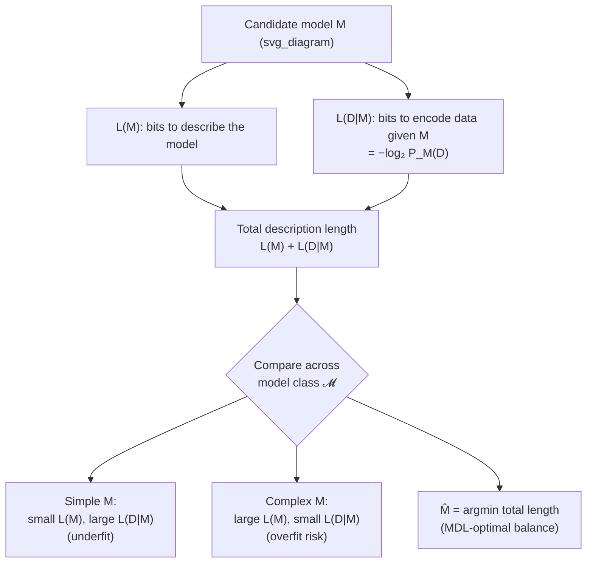
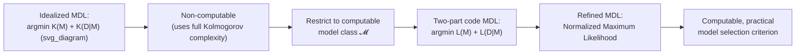

## Minimum Description Length Connection

### Overview

The Minimum Description Length (MDL) principle is a practical, computable framework for model selection built on the same conceptual foundation as Kolmogorov complexity: the best explanation of a dataset is the one that permits the shortest total description of the data. Where Kolmogorov complexity is an idealized, non-computable gold standard defined over all possible programs, MDL restricts attention to a specific, computable class of models and codes, turning the philosophical principle of algorithmic Occam's razor into a usable statistical and machine learning tool. This connection positions MDL as the computable descendant of algorithmic information theory, directly inheriting its coding-theoretic justification from Kolmogorov complexity and universal probability.

### From Idealized to Practical Occam's Razor

Kolmogorov complexity $K(x)$ formalizes "the shortest description of $x$" using the full generality of universal computation, but this generality is precisely what makes $K(x)$ non-computable — no algorithm can find or verify the shortest program for an arbitrary string. MDL addresses this by restricting the space of candidate "descriptions" to a specific, computable model class $\mathcal{M} = \{M_1, M_2, \ldots\}$, each $M_i$ paired with a description length (a code length for specifying the model itself, plus a code length for the data given the model).

**Key Points**
- MDL trades the full generality (and non-computability) of Kolmogorov complexity for computability, at the cost of only ranking models within a chosen class $\mathcal{M}$ rather than over all conceivable programs.
- This mirrors exactly the historical trajectory from Shannon's abstract entropy bound to concrete, implementable compression algorithms (Huffman coding, arithmetic coding) — MDL is the analogous concretization step for Kolmogorov complexity and universal probability.

### The Two-Part Code Formulation

The classical (crude) form of MDL selects a model according to a **two-part code**: a description of the model itself, followed by a description of the data given that model.

$$L(M) + L(D \mid M)$$

where $L(M)$ is the number of bits needed to specify model $M$ (from the class $\mathcal{M}$, using some fixed prefix code over models), and $L(D\mid M)$ is the number of bits needed to encode the observed data $D$ using an optimal code built from $M$ (typically taken as $L(D\mid M) = -\log_2 P_M(D)$, the Shannon-optimal code length under the distribution $P_M$ that model $M$ defines).

**MDL Principle (two-part version).** Select the model

$$\hat{M} = \arg\min_{M \in \mathcal{M}} \Big[ L(M) + L(D\mid M) \Big]$$

**Key Points**
- This is structurally identical to the "preamble + codeword" construction used in proving the upper bound of $K(x) \leq \ell_P(x) + K(P) + O(1)$ in the Kolmogorov-complexity–Shannon-entropy correspondence: $L(M)$ plays the role of $K(P)$ (the cost of describing the source/model), and $L(D\mid M)$ plays the role of the Shannon-optimal codeword length $\ell_P(x)$.
- The two-part code framing directly operationalizes the trade-off between model complexity and data fit: a very complex model ($L(M)$ large) might fit the data extremely well ($L(D\mid M)$ small), but MDL penalizes the total description length, not fit alone — providing an automatic, principled regularization against overfitting.

### Diagram: The Two-Part Code Trade-off
]

### Worked Example: Polynomial Model Selection

Suppose $n$ data points $(x_i, y_i)$ are observed, and the candidate model class consists of polynomials of degree $d = 0, 1, 2, \ldots$, fit by least squares, with residuals assumed approximately Gaussian with some variance $\sigma^2$.

**Example**
- **Model cost $L(M)$:** specifying a degree-$d$ polynomial requires encoding $d+1$ real-valued coefficients; at some fixed precision (say $b$ bits per coefficient), $L(M) \approx (d+1) b$ — growing linearly in $d$.
- **Data cost $L(D\mid M)$:** under a Gaussian residual model, the optimal code length for the data given the fitted polynomial is approximately $L(D\mid M) \approx \frac{n}{2}\log_2(2\pi e \hat\sigma_d^2)$, where $\hat\sigma_d^2$ is the residual variance after fitting degree $d$ — this term *decreases* as $d$ increases, since higher-degree polynomials fit the data more closely (up to $d = n-1$, an exact interpolating fit with $\hat\sigma_d^2 \to 0$).
- **MDL trade-off:** for $d=0$ (constant fit), $L(M)$ is minimal but $L(D\mid M)$ is large (poor fit); for $d = n-1$ (exact interpolation), $L(D\mid M) \to -\infty$ formally (an artifact of the idealized continuous code length, requiring care in practice), but $L(M)$ grows large. The MDL-selected degree $\hat d$ balances these two terms, typically landing well below $n-1$ and closely tracking the "true" underlying polynomial degree when the data was in fact generated from a low-degree polynomial plus noise.

This is the MDL analogue of the classical bias-variance trade-off in model selection, but derived from a coding-theoretic argument (total description length) rather than from a purely statistical loss-function argument, even though the two often yield numerically similar model choices in practice.

### Refined MDL: Universal Codes and the Normalized Maximum Likelihood

The crude two-part code, while intuitive, is known to be suboptimal — different valid encodings of $L(M)$ can lead to different model selections, undermining the objectivity the principle aims for. Modern **refined MDL** replaces the two-part code with a **universal code** relative to the model class $\mathcal{M}$, most notably via the **Normalized Maximum Likelihood (NML)** distribution:

$$P_{\text{NML}}(D) = \frac{\max_{M \in \mathcal{M}} P_M(D)}{\sum_{D'} \max_{M\in\mathcal{M}} P_M(D')}$$

The MDL-optimal description length under this refinement is $L_{\text{NML}}(D) = -\log_2 P_{\text{NML}}(D)$, which can be decomposed as

$$L_{\text{NML}}(D) = -\log_2 P_{\hat M(D)}(D) + \log_2\left(\sum_{D'} \max_{M} P_M(D')\right)$$

where $\hat M(D)$ is the maximum-likelihood model for the observed data $D$, and the second term (called the **parametric complexity** or **regret**) plays the role of an automatically and optimally computed model-complexity penalty, replacing the more ad hoc $L(M)$ term of the two-part code.

**Key Points**
- The parametric complexity term $\log_2\left(\sum_{D'} \max_M P_M(D')\right)$ is a property of the *entire model class* $\mathcal{M}$, not of any single model — it measures how much "flexibility" the class as a whole has to fit arbitrary data, directly generalizing the notion of model complexity beyond a simple bit-count of parameters.
- [Unverified] Computing the NML normalization constant (the sum over all possible datasets $D'$) is often intractable in closed form for continuous or high-dimensional data, requiring approximations (e.g., via Fisher information asymptotics, sometimes called the "Fisher information approximation to NML") in practical applications.
- Refined MDL is explicitly connected to universal coding theory (the same tradition as universal probability $m(x)$), since $P_{\text{NML}}$ is constructed to be a minimax-optimal universal code relative to $\mathcal{M}$ — the best possible single code that performs nearly as well as the best-fitting model in $\mathcal{M}$ for *any* dataset, echoing the domination property of universal probability discussed earlier.

### Formal Connection to Kolmogorov Complexity

MDL can be viewed precisely as a **computable relaxation** of the ideal Kolmogorov-complexity-based model selection criterion:

$$\hat{M}_{\text{ideal}} = \arg\min_{M} \big[K(M) + K(D\mid M)\big]$$

where $K(M)$ and $K(D\mid M)$ are (algorithmic, generally non-computable) Kolmogorov complexities of the model and of the data given the model, respectively. This ideal criterion — sometimes explicitly called **idealized MDL** — is non-computable in general (since $K$ itself is non-computable), but it is the conceptual target that practical, computable MDL (using $L(M)$ and $L(D\mid M)$ from an explicit, restricted, and computable code) approximates.

**Key Points**
- Practical MDL is best understood as *"Kolmogorov complexity, restricted to a computable, tractable code/model class"* — the same underlying philosophy (shortest total description wins), but made implementable by giving up universality in exchange for computability.
- This mirrors exactly the same trade-off seen in universal probability: $m(x)$ is the uncomputable ideal, while any specific computable code or model class (used in practical MDL) is a computable approximation that inherits the ideal's justification but sacrifices some of its generality and optimality guarantees.
- [Inference] Because idealized MDL uses $K(M) + K(D\mid M)$, which by the earlier coding theorem is tied to $-\log_2 m(M) - \log_2 m(D\mid M)$, idealized MDL, universal probability, and Kolmogorov complexity can all be seen as different facets of the same underlying algorithmic-information-theoretic principle, differing mainly in whether the emphasis is on complexity (bits), probability, or model selection.

### Diagram: From Kolmogorov Complexity to Practical MDL

flowchart LR
    A["Idealized MDL: argmin K(M) + K(D|M) (svg_diagram)"] --> B["Non-computable (uses full Kolmogorov complexity)"]
    B --> C["Restrict to computable model class 𝓜"]
    C --> D["Two-part code MDL: argmin L(M) + L(D|M)"]
    D --> E["Refined MDL: Normalized Maximum Likelihood"]
    E --> F["Computable, practical model selection criterion"]

### Relationship to Other Model Selection Criteria

MDL is closely related to, but conceptually distinct from, several classical statistical model selection criteria:

- **Bayesian model selection:** Using $L(M) = -\log_2 \pi(M)$ for a prior $\pi$ over models, the two-part MDL code length becomes $-\log_2\pi(M) - \log_2 P_M(D) = -\log_2\big[\pi(M) P_M(D)\big]$, which is (up to the normalizing constant $P(D)$) exactly the negative log-posterior — so two-part MDL model selection coincides with **maximum a posteriori (MAP)** estimation under prior $\pi$.
- **Bayesian Information Criterion (BIC):** [Inference] BIC, which penalizes model complexity by $\frac{k}{2}\log n$ (for $k$ free parameters and $n$ data points), can be derived as a large-sample (Laplace) approximation to the refined MDL/NML description length, making BIC an asymptotic special case of the more general MDL framework rather than an independent principle.
- **Akaike Information Criterion (AIC):** AIC uses a fixed penalty of $k$ (not scaling with $\log n$) and is derived from a different asymptotic argument (minimizing expected prediction risk via Kullback-Leibler divergence to the true model), making it philosophically distinct from MDL's coding-length justification, even though both serve the practical purpose of penalizing model complexity.

**Key Points**
- The coincidence between two-part MDL and MAP estimation under a specific prior shows that MDL is not entirely separate from Bayesian statistics — rather, it offers a coding-theoretic *interpretation and justification* for using particular priors, tying the choice of $\pi$ directly to a description-length argument rather than treating it as a subjective belief.
- [Unverified] The precise asymptotic relationship between refined MDL/NML and BIC, and the conditions under which they agree to leading order versus diverge in lower-order terms, is a more technical topic addressed in the specialized MDL and information-theoretic statistics literature.

### Why the MDL Connection Matters

**Key Points**
- MDL demonstrates how the philosophically elegant but practically unusable idea of Kolmogorov-complexity-based Occam's razor can be made operational by restricting to a computable code/model class, without abandoning the underlying coding-theoretic justification.
- It provides a principled, automatic regularization mechanism for model selection and statistical learning, grounded in compression rather than in an externally imposed complexity penalty — the penalty *is* the cost of describing the model, not an ad hoc tuning parameter.
- Its formal connections to Bayesian MAP estimation, BIC, and universal coding tie together several major strands of statistical and information-theoretic model selection theory under a common coding-length lens.
- It exemplifies a recurring pattern in algorithmic information theory: an elegant but non-computable ideal (Kolmogorov complexity, universal probability, idealized MDL) motivates and justifies a restricted, computable, practically usable procedure, with the ideal serving as the theoretical benchmark against which the practical version is understood.

**Related Topics**
- Kolmogorov complexity and the coding theorem
- Universal probability and Solomonoff induction
- Bayesian model selection and maximum a posteriori estimation
- Bayesian Information Criterion (BIC) and Akaike Information Criterion (AIC)
- Normalized Maximum Likelihood and universal coding
- Overfitting, regularization, and the bias-variance trade-off
- Structural risk minimization in statistical learning theory
- Algorithmic statistics and Kolmogorov sufficient statistics