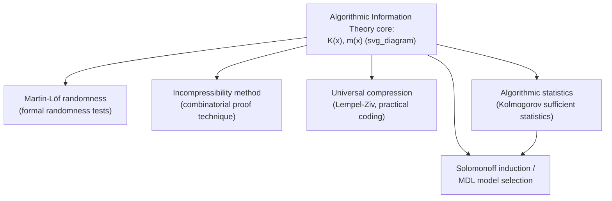

## Algorithmic Information Theory Applications

### Overview

Algorithmic information theory (AIT) — the framework built from Kolmogorov complexity, universal probability, and their descendants — extends far beyond its foundational definitions into a range of concrete applications across computer science, statistics, and the philosophy of science. These applications translate the abstract idea of "shortest description length" into tools for detecting structure in data, proving impossibility results, defining randomness rigorously, and grounding inductive inference. This survey draws together how the concepts already developed — Kolmogorov complexity, the coding theorem, universal probability, and MDL — are put to work in practice and in theory.

### Application 1: Formal Definitions of Randomness

One of AIT's most direct applications is providing a rigorous, mathematically precise definition of what it means for an infinite (or finite) sequence to be "random," addressing a gap left open by classical probability theory (which can describe a random *process* but struggles to certify that a single *outcome* is random).

**Martin-Löf randomness.** An infinite binary sequence $\omega$ is **Martin-Löf random** if it passes every effectively (algorithmically) describable statistical test for randomness — formally, if it avoids every element of every effectively enumerable sequence of nested, measure-shrinking sets (constructive null sets) that could serve as a "test for non-randomness."

An equivalent characterization, connecting directly back to Kolmogorov complexity: $\omega$ is Martin-Löf random if and only if there is a constant $c$ such that for all $n$, the complexity of the first $n$ bits satisfies

$$K(\omega_1 \cdots \omega_n) \geq n - c$$

That is, no prefix of $\omega$ is ever significantly compressible — a direct, finite-complexity characterization of an infinite-sequence property.

**Key Points**
- This resolves the tension noted earlier between "statistically typical" and "algorithmically complex": Martin-Löf randomness is defined precisely so that it captures *all* effective statistical tests simultaneously, not just a single presumed model, closing the gap left by the $\pi$-digits example (which can pass many but not all statistical tests, and indeed is not Martin-Löf random since it has a short generating program).
- [Unverified] The equivalence between the "passes all effective tests" definition and the "incompressible prefixes" characterization (the Levin-Schnorr theorem) is a substantial theorem in its own right, and different equivalent formulations exist in the literature with varying technical prerequisites.
- This gives cryptography, pseudorandom number generation, and simulation methodology a rigorous target concept: true randomness, against which practical (necessarily computable) pseudorandom generators can only ever be an approximation.

### Application 2: Kolmogorov Complexity as a Proof Technique — The Incompressibility Method

AIT provides a distinctive proof technique in combinatorics and theoretical computer science: the **incompressibility method**. The idea is to assume, for contradiction or for a typical-case argument, that a specific object is *incompressible* (i.e., a "generic" or "most" object, since incompressible strings are the overwhelming majority by the counting argument established earlier), and then derive a contradiction or a bound from properties that an incompressible string must have.

**Example**
A classical illustration: proving that most sorting algorithms require $\Omega(n \log n)$ comparisons in the worst case. If a hypothetical algorithm sorted an incompressible permutation of $n$ elements using fewer comparisons, the sequence of comparison outcomes (each a few bits) plus a short description of the algorithm would together constitute a description of the permutation shorter than $\log_2(n!) \approx n\log_2 n$ bits — contradicting the assumption that the permutation is incompressible (since incompressible permutations require close to $\log_2(n!)$ bits to specify, by the same counting argument used for strings).

**Key Points**
- The incompressibility method turns worst-case or average-case combinatorial arguments into cleaner "assume incompressibility, derive contradiction" arguments, often shorter and more intuitive than direct counting or probabilistic arguments.
- [Inference] This technique has been applied to lower bounds in areas including sorting and searching, formal language theory (e.g., proving certain languages are not regular or not context-free), and circuit complexity, though the specific results and their current state depend on the particular subfield and are not exhaustively covered by the core definitions introduced here.

### Application 3: Universal Compression and Practical Coding

While Kolmogorov complexity itself is non-computable, it directly motivates and provides the theoretical benchmark for **universal compression algorithms** — compressors that achieve asymptotically optimal compression *without* knowing the source distribution in advance, such as Lempel-Ziv (LZ77/LZ78) and its descendants (widely used in gzip, DEFLATE, and related formats).

**Key Points**
- Universal compressors are judged by how closely their achieved compression rate approaches the Shannon entropy rate of the (unknown) source — precisely the same benchmark established by the coding-theorem relationship between $K(x)$ and $H(P)$ discussed earlier, now applied as a practical performance target rather than a theoretical equivalence.
- The Lempel-Ziv family achieves **universal optimality**: for any stationary ergodic source, the compression rate converges to the source's entropy rate as the input length grows, without the algorithm ever being told the source's statistics — a computable analogue of universal probability's domination property, achieved via explicit dictionary-based coding rather than via the uncomputable $m(x)$.
- [Inference] This positions practical universal compression as occupying a middle ground between classical Shannon coding (which requires a known distribution) and idealized Kolmogorov-complexity-based compression (which requires solving an uncomputable optimization) — achieving distribution-free optimality through a specific, efficient, computable algorithmic construction.

### Application 4: Kolmogorov Sufficient Statistics and Algorithmic Statistics

**Algorithmic statistics** extends the classical statistical notion of a sufficient statistic into the algorithmic domain, asking: for a given data string $x$, what is the simplest set (or model) $S$ that "explains" $x$ in the sense that $x$ is a "typical" element of $S$, while $S$ itself has low Kolmogorov complexity?

Formally, a set $S \ni x$ is a **Kolmogorov sufficient statistic** for $x$ if

$$K(S) + \log_2 |S| \approx K(x)$$

meaning the two-part description "describe $S$, then specify $x$'s index within $S$ (which costs $\log_2|S|$ bits if $x$ is treated as an arbitrary, essentially incompressible element of $S$)" is nearly as short as the direct shortest description of $x$ itself.

**Key Points**
- This is the algorithmic analogue of the two-part MDL code discussed previously — $K(S)$ plays the role of the model-description cost $L(M)$, and $\log_2|S|$ plays the role of the data-given-model cost $L(D\mid M)$, but now expressed in terms of idealized Kolmogorov complexity rather than a restricted computable code.
- Algorithmic statistics thus provides the theoretical (non-computable) target that practical MDL model selection approximates, closing the loop between the abstract AIT foundations and the applied MDL machinery covered earlier.
- [Inference] This framework has been proposed as a way to formalize the intuitive statistical idea of separating "meaningful structure" in data from "incompressible noise," though making this fully rigorous and computationally tractable involves substantial technical subtlety beyond the basic definition given here.

### Diagram: Map of AIT Applications

### Application 5: Chaitin's Incompleteness Theorem and the Limits of Formal Systems

AIT also has deep applications to mathematical logic, most notably **Chaitin's incompleteness theorem**, which uses Kolmogorov complexity to give an information-theoretic strengthening of Gödel's incompleteness theorem.

**Chaitin's Theorem (informal statement).** For any consistent, sufficiently powerful formal axiomatic system $F$, there exists a constant $c_F$ (depending on $F$) such that $F$ cannot prove any specific statement of the form "$K(x) > c_F$" for any string $x$, even though infinitely many such true statements exist (since, by the counting argument, most strings have high complexity).

**Key Points**
- This gives an information-theoretic flavor to incompleteness: any fixed formal system has a "complexity ceiling" $c_F$, roughly reflecting the complexity of the axioms of $F$ itself, beyond which it cannot certify specific complexity lower bounds, even though it can prove that such high-complexity strings exist in general (via the counting argument, which is a purely combinatorial fact provable in ordinary arithmetic).
- [Unverified] The exact relationship between $c_F$ and the complexity of $F$'s axioms, and the precise technical statement of the theorem, involve careful definitions (e.g., of what it means for $F$ to "prove" a Kolmogorov complexity statement) that go beyond this informal summary.
- The related **halting probability** $\Omega = \sum_{p:\, U(p)\downarrow} 2^{-\ell(p)}$ (a special case of $m$ restricted to programs that halt with no specific required output, summed as a single real number rather than per-string) is a concrete, algorithmically random real number whose bits are individually uncomputable, often cited as a striking, self-contained illustration of the reach of AIT into foundational mathematics.

### Application 6: Connections to Machine Learning and Deep Learning Theory

More recent and exploratory applications connect AIT to modern machine learning, particularly around generalization and simplicity biases.

**Key Points**
- [Speculation] Some researchers have proposed that neural network training implicitly favors low-complexity (in an approximate, computable sense) functions among those consistent with the training data, echoing the MDL/Occam's-razor intuition, though this connection is an active area of research rather than an established, settled application, and the precise sense in which "complexity" should be measured for neural networks remains contested.
- MDL-based and description-length-inspired regularization terms have been used explicitly in some machine learning architectures and training objectives (e.g., variational approaches motivated by minimizing a description length of both model and data), representing a more concrete and established bridge between AIT and applied learning theory than the more speculative implicit-bias claims above.
- [Inference] The core theoretical tools (compression-based generalization bounds, description-length regularization) trace their lineage directly back to the two-part code and refined MDL frameworks discussed earlier, situating this as a genuine extension of established AIT applications rather than an entirely separate development.

### Why These Applications Matter Collectively

**Key Points**
- Together, these applications show that AIT is not merely a philosophical curiosity but a working toolkit spanning randomness certification, combinatorial lower-bound proofs, practical compression algorithm design, statistical model selection, and foundational mathematical logic.
- The recurring pattern across applications is the same one seen throughout this topic sequence: an elegant but uncomputable ideal (Kolmogorov complexity, universal probability, Kolmogorov sufficient statistics) motivates and is approximated by a computable, practically usable tool (Martin-Löf tests restricted to practical use, Lempel-Ziv compression, MDL, complexity-based regularization).
- The theory's reach into mathematical logic (Chaitin's theorem, $\Omega$) demonstrates that the consequences of defining complexity algorithmically are not confined to computer science and statistics but extend to fundamental questions about the limits of formal reasoning itself.
- This breadth illustrates why AIT is often regarded as a unifying framework connecting computability theory, information theory, probability, and statistics under the single organizing idea of description length.

**Related Topics**
- Martin-Löf randomness and constructive null sets
- The incompressibility method in combinatorics and complexity theory
- Lempel-Ziv coding and universal source coding algorithms
- Algorithmic (Kolmogorov) sufficient statistics
- Chaitin's incompleteness theorem and the halting probability $\Omega$
- Compression-based generalization bounds in machine learning theory
- Structural risk minimization and description-length regularization
- Computability theory and the foundations of mathematical logic