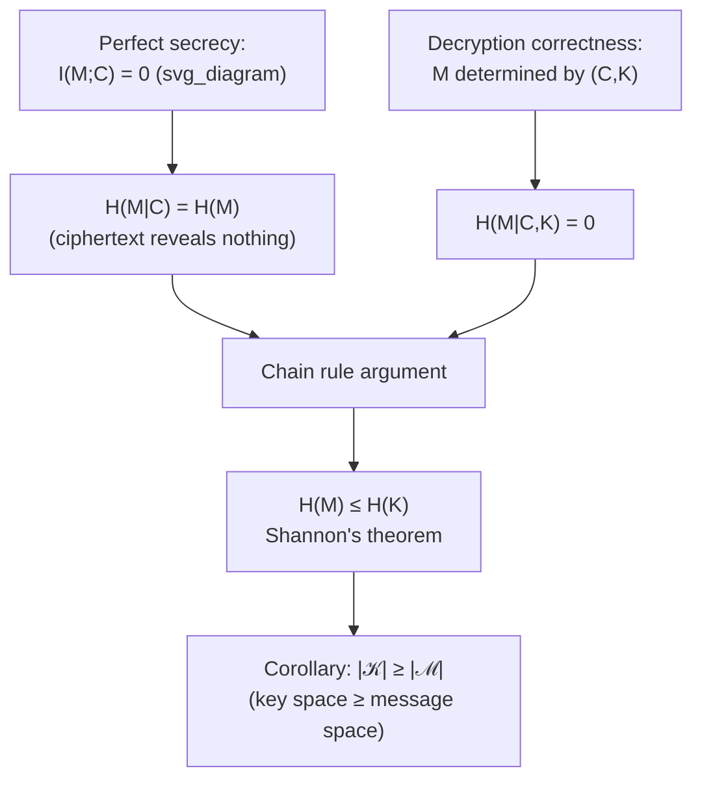

## Perfect Secrecy and Shannon's Theorem

### Overview

Perfect secrecy is the strongest possible cryptographic guarantee: a ciphertext reveals absolutely nothing about the underlying plaintext, even to an adversary with unlimited computational power. Shannon formalized this notion using the language of probability and information theory, and proved a striking impossibility result — perfect secrecy is achievable, but only at a steep and unavoidable cost in key length. This result marks the entry point of information theory into cryptography, providing the first rigorous mathematical treatment of what "secure" can mean, and setting a benchmark (the one-time pad) against which all subsequent computational cryptography implicitly positions itself.

### Setup: The Cryptosystem Model

A (private-key) cryptosystem consists of:

- A set of plaintexts $\mathcal{M}$, with a probability distribution $P_M$ over messages $M \in \mathcal{M}$ (reflecting the adversary's prior beliefs about which message is likely to be sent).
- A set of keys $\mathcal{K}$, with a probability distribution $P_K$ over keys $K \in \mathcal{K}$, chosen independently of $M$.
- A set of ciphertexts $\mathcal{C}$, and an encryption function $E: \mathcal{M} \times \mathcal{K} \to \mathcal{C}$, together with a corresponding decryption function $D$ such that $D(E(M,K), K) = M$ for all $M, K$.

The induced ciphertext $C = E(M,K)$ is itself a random variable, with a distribution $P_C$ determined jointly by $P_M$ and $P_K$.

**Key Points**
- The adversary is assumed to know the full system design (the sets $\mathcal{M}, \mathcal{K}, \mathcal{C}$, the functions $E, D$, and the distributions $P_M, P_K$) — only the specific realized values of $M$ and $K$ are secret. This is **Kerckhoffs's principle**, and it is a standing assumption throughout Shannon's analysis.
- The adversary is assumed computationally *unbounded* — perfect secrecy is a statement about information leakage, not about computational hardness, distinguishing it sharply from later, computational notions of security.

### Definition of Perfect Secrecy

**Definition (Shannon, 1949).** A cryptosystem has **perfect secrecy** if the plaintext $M$ and the ciphertext $C$ are statistically independent random variables:

$$P(M = m \mid C = c) = P(M = m) \quad \text{for all } m \in \mathcal{M}, \, c \in \mathcal{C} \text{ with } P(C=c) > 0$$

Equivalently, observing the ciphertext gives the adversary *no updated information whatsoever* about which plaintext was sent — the posterior distribution over messages equals the prior distribution exactly.

**Key Points**
- This is an extremely strong requirement: it must hold for *every* prior distribution $P_M$ the adversary might have, and for every possible ciphertext value, not merely on average or for a "typical" message.
- Perfect secrecy is precisely captured, in information-theoretic language, by the statement that mutual information between plaintext and ciphertext vanishes: $I(M; C) = 0$.

### Perfect Secrecy in Terms of Mutual Information

The independence-based definition translates directly into the language of information theory already developed.

**Equivalent formulation.** A cryptosystem achieves perfect secrecy if and only if

$$I(M; C) = 0$$

This follows immediately from the general fact that mutual information vanishes exactly when the two random variables are independent — $I(M;C) = 0 \iff M \perp C$ — so this is simply a restatement of Shannon's original independence definition using mutual information notation.

**Key Points**
- Since $I(M;C) = H(M) - H(M\mid C)$, perfect secrecy is equivalently the statement $H(M \mid C) = H(M)$: knowing the ciphertext leaves the *entropy* (uncertainty) about the message completely unchanged — not merely unchanged in expectation, but unchanged pointwise for every ciphertext value, as required by the stronger independence condition above.
- This framing directly connects cryptographic secrecy to the same entropy and mutual-information machinery used throughout Shannon theory for channels and source coding, situating cryptography as another domain where these quantities carry direct operational meaning.

### Shannon's Theorem: The Key Length Bound

Shannon's central result shows that perfect secrecy, while achievable, imposes a severe structural requirement on the key.

**Shannon's Theorem.** If a cryptosystem achieves perfect secrecy, then

$$H(K) \geq H(M)$$

**Proof.** Since decryption must recover $M$ exactly from $(C,K)$, $M$ is a deterministic function of $(C,K)$, so $H(M \mid C, K) = 0$. Using the chain rule for entropy,

$$H(M \mid C) \leq H(M, K \mid C) = H(K\mid C) + H(M \mid C, K) = H(K \mid C) \leq H(K)$$

where the first inequality uses that conditioning on additional information ($K$, alongside $C$) cannot increase entropy, $H(M,K\mid C)$ expands via the chain rule with the last term vanishing as noted, and the final step uses that conditioning ($H(K\mid C) \leq H(K)$) cannot increase entropy either. Combining this chain with the perfect-secrecy condition $H(M\mid C) = H(M)$ gives directly

$$H(M) = H(M\mid C) \leq H(K)$$

**Key Points**
- The proof uses only the chain rule for entropy and the basic fact that conditioning cannot increase entropy — both elementary Shannon-theoretic tools, applied here to a cryptographic setting.
- The result says the *uncertainty* in the key must be at least as large as the *uncertainty* in the message — informally, "the key must contain at least as much randomness as the message" for perfect secrecy to be possible.
- If $|\mathcal{K}|$ is the size of the key space, $H(K) \leq \log_2 |\mathcal{K}|$ always, so a corollary immediately follows: $\log_2|\mathcal{K}| \geq H(M)$, and if $M$ is uniform over $\mathcal{M}$ (the hardest case, maximizing $H(M) = \log_2|\mathcal{M}|$), this gives $|\mathcal{K}| \geq |\mathcal{M}|$ — the key space must be at least as large as the message space.

### Diagram: The Perfect Secrecy Bound

### The One-Time Pad: Achieving the Bound with Equality

Shannon's theorem establishes a lower bound on key entropy; the **one-time pad** shows this bound is achievable — perfect secrecy is not merely a theoretical abstraction but a construction that actually attains $H(K) = H(M)$.

**Construction.** Let $\mathcal{M} = \mathcal{K} = \mathcal{C} = \{0,1\}^n$. Let $K$ be uniformly distributed over $\{0,1\}^n$, independent of $M$. Define

$$C = M \oplus K$$

(bitwise XOR), with decryption $M = C \oplus K$ (since $K \oplus K = 0$).

**Proof of perfect secrecy.** For any fixed message $m$ and any ciphertext $c$,

$$P(C = c \mid M = m) = P(K = m \oplus c) = \frac{1}{2^n}$$

since $K$ is uniform over $\{0,1\}^n$ and $m \oplus c$ is a single fixed value. This probability is the *same* for every $m$ — it does not depend on which message was sent — so $C$ given $M=m$ has the identical (uniform) distribution regardless of $m$, which is precisely the condition for $M$ and $C$ to be independent, establishing perfect secrecy directly.

**Example**
For $n = 3$: $\mathcal{M} = \{000, 001, \ldots, 111\}$. If $M = 101$ and $K = 011$ (chosen uniformly at random and used only once), then $C = 101 \oplus 011 = 110$. An adversary observing $C = 110$ with no knowledge of $K$ considers every possible key equally likely, and hence every possible message $m$ (via $m = c \oplus k$ for each candidate $k$) equally likely — the ciphertext $110$ is exactly as consistent with $M=000$ (via $K=110$) as with $M=101$ (via $K=011$), or any other message, so no information about $M$ is leaked.

**Key Points**
- Since $K$ is uniform over $\{0,1\}^n$, $H(K) = n$ bits; if $M$ is also uniform (the maximal-entropy, hardest case), $H(M) = n$ bits as well — so $H(K) = H(M)$ exactly, meeting Shannon's bound with equality, confirming the one-time pad is optimal in the strongest possible sense.
- The name "one-time" is essential to the security proof: the independence argument above relies critically on $K$ being freshly uniform and used for only a single message; reusing the same key for a second message immediately destroys perfect secrecy, since XORing two ciphertexts encrypted under the same key cancels the key entirely ($C_1 \oplus C_2 = M_1 \oplus M_2$), leaking information directly about the relationship between the two plaintexts.

### The Practical Cost: Why Perfect Secrecy Is Rarely Used

Shannon's theorem is simultaneously a possibility result (perfect secrecy exists) and an impossibility result in a practical sense (it is prohibitively expensive to use at scale).

**Key Points**
- The requirement $H(K) \geq H(M)$ means the key must be at least as long (in an entropy sense) as *every* message ever encrypted with it — for a system sending large volumes of data, this requires generating and securely distributing a key at least as large as the total data volume, which is a substantial practical burden.
- The key must also be truly random (uniform) and never reused (as illustrated by the one-time pad's fragility under reuse), and must be transmitted to the receiver through some channel that is itself assumed secure — pushing the "secrecy problem" into a secure key-distribution problem rather than eliminating it.
- These practical costs are precisely why essentially all modern, widely deployed cryptographic systems abandon the goal of perfect (information-theoretic) secrecy in favor of **computational security**: security that relies on the presumed computational hardness of certain problems (e.g., factoring, discrete logarithm) for an adversary bounded by realistic computational resources, rather than on information-theoretic impossibility for an unbounded adversary.
- [Inference] This makes Shannon's theorem historically and conceptually foundational rather than a direct blueprint for everyday cryptographic practice — it defines the gold-standard notion of secrecy against which every computational assumption implicitly represents a deliberate, practical relaxation.

### Broader Significance for Information-Theoretic Cryptography

**Key Points**
- Shannon's 1949 paper establishing this theorem is widely regarded as the founding work of modern cryptography as a mathematical discipline, predating and directly motivating his own separate 1948 development of channel capacity and source coding theory.
- The information-theoretic framework introduced here — modeling secrecy via mutual information between plaintext and ciphertext — extends to more general settings beyond the basic private-key model, including information-theoretic notions of secrecy in the presence of eavesdroppers with degraded channel access (the wiretap channel) and secret-key agreement protocols.
- [Unverified] The precise relationship between perfect secrecy (as defined here) and later, related but distinct notions such as semantic security (which is typically defined computationally rather than information-theoretically) involves care in translating between the information-theoretic and computational security paradigms, and is usually treated as a substantial topic connecting classical and modern cryptography.
- The result exemplifies a recurring theme across this entire body of material: an information-theoretic quantity (here, mutual information and entropy) provides both a rigorous *definition* of an operational concept (secrecy) and a *provable limit* on what is achievable, in the same spirit as channel capacity bounding achievable communication rates or Stein's lemma bounding achievable hypothesis-testing error exponents.

**Related Topics**
- The one-time pad and stream cipher constructions
- Wiretap channel and information-theoretic secrecy over noisy channels
- Secret-key agreement and key distribution protocols
- Computational security and the shift from information-theoretic to complexity-theoretic cryptography
- Semantic security and modern cryptographic security definitions
- Entropy, mutual information, and the chain rule for entropy
- Kerckhoffs's principle and adversary modeling in cryptography
- Quantum key distribution (information-theoretic key agreement using quantum channels)