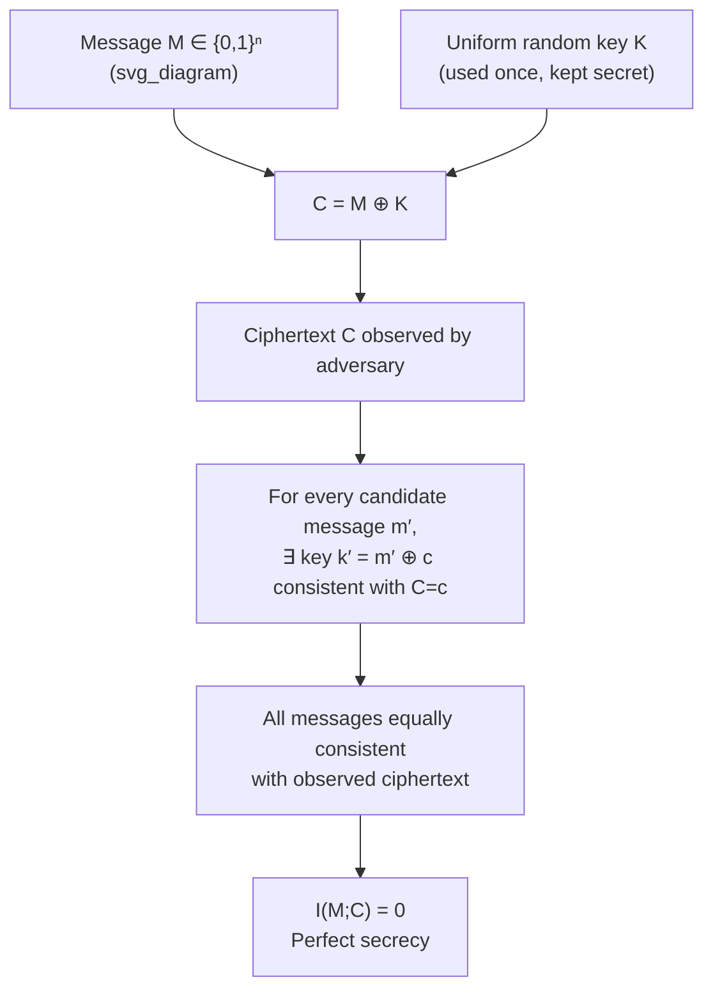
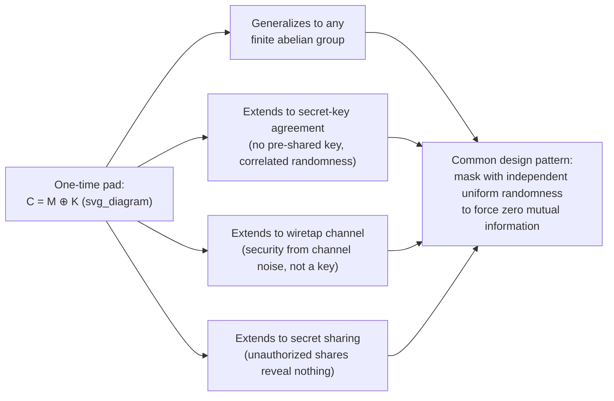

## One-Time Pad and Information-Theoretic Security

### Overview

The one-time pad is the canonical construction achieving perfect secrecy, and it serves as the archetype for a broader class of security guarantees known as information-theoretic security — guarantees that hold against adversaries with unbounded computational power, derived from probabilistic and entropy arguments rather than from assumptions about computational hardness. This topic examines the one-time pad's structure and proof of security in depth, its fragility under key reuse, its generalizations beyond the binary XOR construction, and its place within the wider landscape of information-theoretic security notions that extend past the single-message, single-key setting already covered under perfect secrecy.

### The One-Time Pad: Formal Construction

Let $\mathcal{M} = \mathcal{K} = \mathcal{C} = \{0,1\}^n$ for some fixed length $n$. The one-time pad cryptosystem is defined by:

- **Key generation:** $K$ is sampled uniformly at random from $\{0,1\}^n$, independent of the message $M$.
- **Encryption:** $C = E(M,K) = M \oplus K$ (bitwise XOR).
- **Decryption:** $D(C,K) = C \oplus K = (M\oplus K)\oplus K = M$ (using $K \oplus K = 0^n$ and associativity of XOR).

**Key Points**
- The scheme is symmetric and involutive: the same operation (XOR with $K$) is used for both encryption and decryption, since XOR is its own inverse.
- Correctness ($D(E(M,K),K) = M$ for all $M,K$) is immediate from the algebraic properties of XOR over $\{0,1\}^n$ (associativity and the fact that every element is its own additive inverse), requiring no probabilistic argument at all.

### Proof of Perfect Secrecy Revisited

The perfect-secrecy property established previously follows from a clean algebraic argument worth restating in full generality.

**Claim.** For any distribution $P_M$ on $\mathcal{M}$ (not necessarily uniform), the one-time pad achieves $I(M;C) = 0$.

**Proof.** Fix any ciphertext value $c \in \{0,1\}^n$. For any message $m$,

$$P(C=c \mid M=m) = P(M\oplus K = c \mid M=m) = P(K = m\oplus c) = \frac{1}{2^n}$$

using that $K$ is independent of $M$ and uniform over $\{0,1\}^n$. Since this conditional probability equals $\frac{1}{2^n}$ *regardless of $m$*, it follows that $C$ is uniform over $\{0,1\}^n$ unconditionally, and moreover $P(C=c\mid M=m) = P(C=c)$ for every $m$ and $c$ — the defining condition for independence of $M$ and $C$.

**Key Points**
- The crucial feature is that the conditional distribution of $C$ given $M=m$ is the *same uniform distribution* for every possible $m$ — this is what makes the ciphertext utterly uninformative about which message was sent, regardless of the prior $P_M$ the adversary holds.
- This proof makes no assumption about the distribution of $M$ whatsoever, confirming that perfect secrecy (as required by Shannon's definition) holds universally across all possible message priors, not merely for a uniform or otherwise "convenient" one.
- The argument is a direct instance of the general principle that XOR with an independent uniform mask perfectly "randomizes away" any input distribution — a fact reused throughout cryptography wherever uniform masking is employed (e.g., in secret sharing and secure multiparty computation).

### Diagram: One-Time Pad Encryption and Security

### Key Reuse: Catastrophic Failure of Security

The "one-time" requirement is not a minor operational detail but a load-bearing security assumption. Reusing the same key $K$ to encrypt two distinct messages $M_1, M_2$ produces $C_1 = M_1 \oplus K$ and $C_2 = M_2 \oplus K$.

**The attack.**

$$C_1 \oplus C_2 = (M_1 \oplus K) \oplus (M_2 \oplus K) = M_1 \oplus M_2$$

The key cancels entirely, and the adversary learns $M_1 \oplus M_2$ exactly — the bitwise difference between the two plaintexts — without knowing $K$ at all.

**Example**
If $M_1$ and $M_2$ are both natural-language text (encoded, say, in ASCII), $M_1 \oplus M_2$ is typically *not* uniformly random: patterns in the XOR of two natural-language messages (e.g., predictable byte patterns from common letters, spaces, or structured formatting) can often be exploited via statistical and crib-dragging techniques to recover both $M_1$ and $M_2$ individually, even though neither was directly observed. [Unverified] The precise effectiveness of such recovery depends heavily on the structure and redundancy of the specific plaintexts involved, and is a well-documented but not universally guaranteed attack outcome — a real historical instance was the partial cryptanalysis of reused-key Soviet one-time-pad traffic in the Venona project.

**Key Points**
- This attack requires no computational assumptions and no brute-force search over keys — it is a direct, information-theoretic leak arising purely from the algebraic structure of reuse, illustrating exactly how fragile the perfect-secrecy guarantee is to violating its stated preconditions.
- This is the clearest illustration that Shannon's security proof is conditional on the stated assumptions (uniform, independent, single-use key) holding exactly — violating any one of them can void the guarantee entirely rather than merely degrading it gracefully.

### Necessity of True Randomness

Perfect secrecy also depends critically on $K$ being drawn from a **uniform** distribution, not merely a distribution that "looks random."

**Key Points**
- If $K$ is generated by a deterministic pseudorandom number generator (PRNG) seeded from a much shorter true-random seed, the entropy of the *effective* key is bounded by the seed's entropy (since $K$ becomes a deterministic function of the seed), and Shannon's theorem ($H(K) \geq H(M)$) is violated whenever the seed is shorter than the message — such a system may still be practically secure against realistic adversaries (this is essentially how stream ciphers work), but it no longer satisfies the information-theoretic perfect-secrecy definition, since a computationally unbounded adversary could in principle exhaust the smaller seed space.
- This distinction is exactly the boundary between information-theoretic security (unconditional, based on entropy) and computational security (conditional on the presumed hardness of predicting the PRNG's output) discussed as the practical resolution to perfect secrecy's key-length cost.
- Non-uniform key distributions (even ones with high entropy but not exactly uniform) can leak partial information: the general perfect-secrecy proof requires $P(C=c\mid M=m)$ to be identical across all $m$, which the uniform-XOR argument delivers exactly but a merely "high-entropy" key distribution does not guarantee in general.

### Generalizing Beyond Binary XOR

The one-time pad construction generalizes naturally to any finite abelian group.

**General construction.** Let $(\mathcal{M}, +)$ be a finite abelian group (with $\mathcal{K} = \mathcal{C} = \mathcal{M}$ as the same group). Let $K$ be uniform over $\mathcal{M}$, independent of $M$, and define $C = M + K$ (group operation), with decryption $M = C - K$.

**Key Points**
- The same proof structure applies essentially verbatim: for any fixed $c$, $P(C=c\mid M=m) = P(K = c-m) = \frac{1}{|\mathcal{M}|}$ for every $m$, by uniformity of $K$ over the group — independent of the specific group operation used.
- This shows binary XOR is simply the special case of the group being $(\mathbb{Z}/2\mathbb{Z})^n$; the same perfect-secrecy argument works equally well for, e.g., addition modulo $26$ over the alphabet (a group-theoretic generalization of the classical Vigenère-style cipher construction, made information-theoretically secure precisely by using a truly uniform, non-repeating, message-length key — which the historical Vigenère cipher, using a short repeating key, notably does not satisfy).
- [Inference] This group-theoretic generalization clarifies that the essential ingredient for perfect secrecy is not the specific XOR operation but the combination of group structure, key uniformity, key independence from the message, and single use — any construction preserving these properties inherits the same security guarantee.

### Beyond a Single Message: Information-Theoretic Security More Broadly

The one-time pad addresses the single-sender, single-message, shared-secret-key setting. Information-theoretic security extends to several related but distinct settings:

- **Secret-key agreement.** Two parties who do not initially share a key, but who have access to correlated sources of randomness (e.g., correlated observations from a common noisy channel) or a public but authenticated communication channel, attempt to agree on a shared secret key that is information-theoretically secure from an eavesdropper — a generalization of the one-time pad's key-generation problem, studied extensively under the Maurer/Ahlswede-Csiszár framework of common randomness and secret-key capacity.
- **Wiretap channel.** Introduced by Wyner, this model supposes the sender's message reaches the legitimate receiver through one channel and an eavesdropper through a second, degraded (noisier) channel; the wiretap channel's **secrecy capacity** characterizes the maximum rate at which information can be sent reliably to the legitimate receiver while remaining information-theoretically secret from the eavesdropper, without requiring a pre-shared key at all — security here arises purely from the physical channel noise difference rather than from a secret key.
- **Secret sharing.** A dealer splits a secret into several shares distributed among parties, such that any authorized subset of parties can reconstruct the secret, but any unauthorized subset learns *no information whatsoever* about it (an $I(\text{secret}; \text{unauthorized shares}) = 0$ guarantee, directly analogous to the one-time pad's $I(M;C)=0$) — Shamir's polynomial-based secret sharing scheme is a canonical construction achieving this.

**Key Points**
- All three settings generalize the core mechanism of the one-time pad — combining a message (or secret) with independent uniform randomness so that the observable quantity (ciphertext, or an unauthorized subset of shares) carries zero mutual information with the protected content.
- [Unverified] The precise capacity results and constructions in each of these areas (secret-key capacity formulas, wiretap channel secrecy capacity, threshold structures in secret sharing) are substantial independent bodies of work, each deserving separate, more detailed treatment beyond this overview.
- These generalizations show that "the one-time pad idea" — masking with independent uniform randomness to zero out mutual information — is a reusable design pattern throughout information-theoretic cryptography, not a one-off construction specific to simple message encryption.

### Diagram: The One-Time Pad as a Template

### Practical Deployment History

**Key Points**
- Despite its impracticality for general-purpose communication, the one-time pad has seen real historical and niche modern use in settings where its key-distribution cost is tolerable — most famously in high-stakes diplomatic and intelligence communications during the 20th century (including some Cold War-era usage), and in certain specialized links (e.g., some claimed government "red phone" or similarly ultra-high-security channels) where guaranteed unconditional security outweighs the logistical burden of distributing large true-random keys.
- [Unverified] Specific claims about which historical or current systems use genuine one-time pads (as opposed to strong stream ciphers colloquially described that way) are difficult to verify independently and are often subject to secrecy or dispute; general historical accounts of one-time-pad use in diplomatic and intelligence contexts are well documented, but comprehensive, precise, and current details are not readily confirmable.
- The Venona project's partial success against reused Soviet one-time pads (mentioned above) stands as a well-documented historical case study of both the theoretical strength of correctly used one-time pads and the practical catastrophe of key reuse.

### Why the One-Time Pad Matters

**Key Points**
- It is the concrete existence proof that Shannon's perfect-secrecy bound is not merely a theoretical ceiling but an achievable target, converting the abstract definition of perfect secrecy into a fully specified, provably secure algorithm.
- Its fragility under key reuse and its strict dependence on true (not merely pseudorandom) key material make it a powerful pedagogical illustration of how precisely security proofs depend on their stated assumptions — a lesson that generalizes well beyond cryptography to any information-theoretic guarantee.
- Its group-theoretic generalization and its role as a template for secret-key agreement, wiretap channels, and secret sharing show that its central design idea (masking with independent uniform randomness to zero mutual information) is a foundational and widely reused primitive across information-theoretic security.
- It marks the historical and conceptual starting point from which the entire field of information-theoretic (as opposed to computational) cryptography develops, situating later, more elaborate constructions as direct descendants of the same core insight first proven rigorously by Shannon.

**Related Topics**
- Shannon's theorem and the perfect-secrecy key-length bound
- Wiretap channel and secrecy capacity
- Secret-key agreement and common randomness (Maurer/Ahlswede-Csiszár framework)
- Secret sharing schemes (Shamir's scheme and threshold structures)
- Stream ciphers and pseudorandom generators (computational relaxations of the one-time pad)
- Computational versus information-theoretic security paradigms
- Quantum key distribution as a physical means of generating shared secret keys
- Authentication codes and information-theoretic message integrity