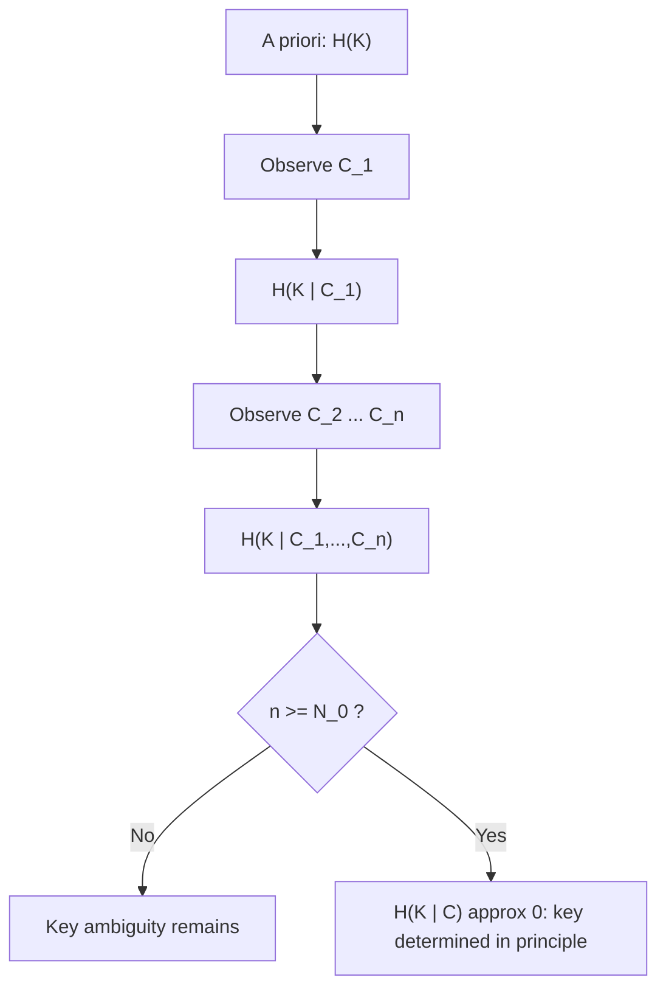

## Key Equivocation

### Definition

Key equivocation, denoted $H(K \mid C)$, is the conditional entropy of the secret key $K$ given the ciphertext $C$. It quantifies the residual uncertainty an observer with unlimited computational power retains about the key after observing ciphertext, under a known-plaintext or ciphertext-only model. It was introduced by Claude Shannon in his 1949 treatment of secrecy systems as the formal measure of how much a cipher "leaks" about its key.

$$H(K \mid C) = -\sum_{k,c} p(k,c) \log_2 p(k \mid c)$$

### Relation to Perfect Secrecy and Unicity

Key equivocation starts at the key's a priori entropy, $H(K \mid C_0) = H(K)$, when no ciphertext has been observed. As more ciphertext $C_1, C_2, \dots, C_n$ accumulates, equivocation is non-increasing:

$$H(K \mid C_1, \dots, C_n) \le H(K \mid C_1, \dots, C_{n-1})$$

This monotonic decrease is the basis for the **unicity distance** $N_0$: the expected ciphertext length at which $H(K \mid C_1,\dots,C_{N_0}) \approx 0$, meaning enough information has accumulated to determine the key uniquely (in principle, given unbounded computation). Shannon's approximation is

$$N_0 \approx \frac{H(K)}{D}$$

where $D$ is the **redundancy rate** of the plaintext language in bits per symbol (e.g., $D \approx 3.2$ bits/letter for English, since $\log_2 26 \approx 4.7$ and the true entropy rate of English is roughly $1.5$ bits/letter).

For a cipher to achieve **perfect secrecy** in Shannon's sense, equivocation must not decrease at all: $H(K \mid C) = H(K)$ for every ciphertext length, which forces $H(K) \ge H(M)$ — the key space must be at least as large as the message space, as in the one-time pad.

### Worked Example

Consider a simple substitution cipher over a small alphabet, with key space $|K| = 100$, so $H(K) = \log_2 100 \approx 6.64$ bits, and English plaintext with redundancy $D \approx 3.2$ bits/letter.

$$N_0 \approx \frac{6.64}{3.2} \approx 2.08 \text{ letters}$$

**Interpretation:** after roughly 2 letters of ciphertext, an unbounded adversary has, on average, enough statistical redundancy in the underlying plaintext to pin down the key uniquely. Equivocation $H(K \mid C_n)$ falls sharply from $6.64$ bits toward $0$ as $n$ grows past $N_0$, illustrating why small key spaces collapse almost immediately regardless of the substitution's algebraic complexity.

[Inference] Real-world unicity distances for classical ciphers (e.g., $N_0 \approx 25$–$30$ for simple monoalphabetic substitution with $|K| = 26!$) are commonly cited approximations derived from this formula; exact values depend on the specific redundancy model assumed for the plaintext source.

### Equivocation Curve (svg_diagram)

<svg xmlns="http://www.w3.org/2000/svg" viewBox="0 0 640 380">
  <rect x="0" y="0" width="640" height="380" fill="#ffffff" />
  <text x="320" y="28" font-family="sans-serif" font-size="16" font-weight="bold" text-anchor="middle" fill="#111111">Key Equivocation vs. Ciphertext Length (svg_diagram)</text>

  <line x1="70" y1="320" x2="600" y2="320" stroke="#333333" stroke-width="1.5" />
  <line x1="70" y1="320" x2="70" y2="50" stroke="#333333" stroke-width="1.5" />

  <text x="335" y="355" font-family="sans-serif" font-size="13" text-anchor="middle" fill="#333333">Ciphertext length n (symbols)</text>
  <text x="30" y="185" font-family="sans-serif" font-size="13" text-anchor="middle" fill="#333333" transform="rotate(-90 30 185)">H(K | C_n) (bits)</text>

  <line x1="70" y1="70" x2="600" y2="70" stroke="#cccccc" stroke-dasharray="4,4" />
  <text x="605" y="74" font-family="sans-serif" font-size="12" fill="#666666">H(K)</text>

  <path d="M 70 70 C 150 90, 220 260, 300 300 C 360 315, 450 319, 600 320" fill="none" stroke="#1a6fb5" stroke-width="2.5" />

  <line x1="300" y1="320" x2="300" y2="50" stroke="#c0392b" stroke-dasharray="6,3" stroke-width="1.5" />
  <text x="300" y="45" font-family="sans-serif" font-size="12" text-anchor="middle" fill="#c0392b">N_0 (unicity distance)</text>

  <circle cx="70" cy="70" r="4" fill="#1a6fb5" />
  <circle cx="300" cy="300" r="4" fill="#1a6fb5" />
  <circle cx="600" cy="320" r="4" fill="#1a6fb5" />

  <text x="70" y="335" font-family="sans-serif" font-size="11" text-anchor="middle" fill="#333333">0</text>
</svg>

### Message Equivocation

A related quantity, **message equivocation** $H(M \mid C)$, measures residual uncertainty about the plaintext itself given ciphertext. The two are linked through the key: if $K$ determines the mapping from $M$ to $C$ deterministically, then

$$H(M \mid C) \le H(K \mid C)$$

because full knowledge of $K$ (given $C$) resolves $M$ completely (in a deterministic cipher), so message uncertainty can never exceed key uncertainty. This inequality is the formal reason low key equivocation is treated as a proxy for eventual message compromise, even in ciphertext-only settings.

### Equivocation Under Cryptanalytic Models

- **Ciphertext-only model:** equivocation computed purely from $p(k,c)$ induced by the key and plaintext-source distributions; this is the classical Shannon setting used above.
- **Known-plaintext model:** conditioning additionally on observed $(m,c)$ pairs typically collapses equivocation far faster than $N_0$ predicts, since plaintext redundancy no longer needs to be inferred statistically.
- [Unverified] Equivocation-based analysis assumes an information-theoretic (unbounded-computation) adversary; it says nothing about *computational* difficulty. A cipher can have near-zero key equivocation at some ciphertext length while remaining computationally infeasible to break — this is why unicity distance is a **lower bound on required ciphertext for any attack**, not an estimate of attack cost.

### Limitations of the Classical Treatment

- The redundancy rate $D$ is itself a modeling choice (order-0 vs. higher-order Markov estimates of language entropy give different $N_0$ values); results are sensitive to this input.
- Equivocation analysis assumes a known probabilistic model of the plaintext source and key distribution; real-world plaintext (structured files, protocols) may have redundancy characteristics that diverge sharply from natural-language estimates.
- Modern symmetric ciphers (block/stream ciphers with large key spaces) are designed so that $N_0$ is effectively unreachable within realistic ciphertext volumes, shifting practical security analysis toward computational hardness assumptions rather than equivocation.

**Related Topics**
- Unicity distance derivation and redundancy estimation for natural languages
- Message equivocation and plaintext redundancy
- Perfect secrecy and the one-time pad (Shannon 1949)
- Computational vs. information-theoretic security models
- Entropy rate estimation for structured data sources
- Confusion and diffusion as equivocation-reducing design principles