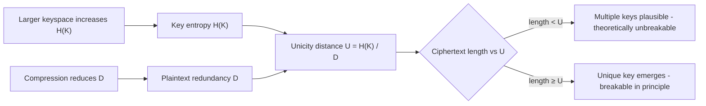

## Unicity Distance

### Definition

Unicity distance is the minimum length of ciphertext required, on average, for a cryptanalyst with unbounded computational power to reduce the number of possible keys consistent with that ciphertext to exactly one — the true key. The concept was introduced by Claude Shannon in his 1949 paper *Communication Theory of Secrecy Systems* as a way to quantify the theoretical strength of a cipher purely in information-theoretic terms, independent of the computational cost of actually finding the key.

Below the unicity distance, a ciphertext is theoretically unbreakable in the sense that multiple plausible keys remain consistent with it, and no amount of analysis (absent computational limits) can distinguish the correct key from the others using ciphertext alone. Above the unicity distance, in principle exactly one key becomes overwhelmingly likely to be correct, though finding it may still be computationally infeasible.

### Core Formula

Shannon expressed unicity distance as:

$$U = \frac{H(K)}{D}$$

Where:
- $U$ is the unicity distance, measured in units of ciphertext (typically characters or bits)
- $H(K)$ is the entropy of the key space — the number of bits of uncertainty in the key
- $D$ is the redundancy of the underlying plaintext language, in bits per character (or per symbol)

For a key chosen uniformly at random from a keyspace of size $N$, $H(K) = \log_2 N$.

### Redundancy of Language

Redundancy $D$ is the gap between the maximum possible entropy per symbol and the actual entropy of the language as used. For English text:

$$D = \log_2(L) - H_L$$

Where $L$ is the alphabet size (26 for English) and $H_L$ is the true per-character entropy of English, accounting for letter frequencies, digram/trigram statistics, and higher-order structure.

- Maximum entropy per character: $\log_2(26) \approx 4.7$ bits
- Estimated true entropy of English: roughly 1.0–1.5 bits per character [Inference — Shannon's own estimates from his 1951 entropy-of-English experiments range from about 0.6 to 1.3 bits per character depending on the order of the model used]
- Resulting redundancy: approximately 3.2–3.7 bits per character

This redundancy is what makes natural-language plaintext distinguishable from random noise — it's the reason a decrypted candidate can be recognized as "correct English" versus gibberish.

### Worked Example: Simple Substitution Cipher

Consider a monoalphabetic substitution cipher over the 26-letter English alphabet.

- Key space size: $26! \approx 4.03 \times 10^{26}$
- Key entropy: $H(K) = \log_2(26!) \approx 88.4$ bits
- Redundancy of English: $D \approx 3.2$ bits/character

$$U = \frac{88.4}{3.2} \approx 27.6 \text{ characters}$$

This matches the commonly cited figure that roughly 25–30 letters of ciphertext are sufficient, on average, to uniquely determine the key of a simple substitution cipher — consistent with practical experience that short substitution cryptograms (like newspaper cryptogram puzzles) are almost always solvable, while very short ones can have multiple valid solutions.

### Worked Example: One-Time Pad

For a true one-time pad used correctly (key as long as the message, truly random, never reused):

$$H(K) = n \text{ bits (for an } n\text{-bit message)}$$

Since the key entropy grows in lockstep with the message length, and $D$ is a fixed property of the language:

$$U = \frac{n}{D} $$

But because the key itself is $n$ bits and consumed only once, every ciphertext of length $n$ remains consistent with *every possible plaintext* of that length under some key — the unicity distance effectively becomes infinite. This is the information-theoretic basis for Shannon's proof of perfect secrecy: no amount of ciphertext, however large, narrows the key space, because a new, independent key segment is used for every symbol.

### Interpreting Unicity Distance

**Key Points**
- $U$ is an *average* or *expected* quantity, not a hard guarantee — some individual ciphertexts may be uniquely solvable below $U$, and some may remain ambiguous slightly above it.
- $U$ measures a *theoretical* threshold based on information content, not the *computational* difficulty of the search. A cipher can have a small unicity distance yet remain practically unbreakable if searching the key space is infeasible (and vice versa, [Inference] though the latter case is rare in practice since large keyspaces and computational hardness tend to correlate in well-designed systems).
- Larger key entropy $H(K)$ increases $U$; higher plaintext redundancy $D$ decreases it. Compression of plaintext before encryption (reducing redundancy) is a classical technique to push $U$ higher, since it removes the statistical structure an analyst relies on.
- Unicity distance assumes ciphertext-only attack conditions and an analyst with unlimited computational resources — it is a bound on information availability, not on effort.

### Redundancy Reduction and Practical Implications

Because $U = H(K)/D$, cryptographic practice historically exploited this relationship in two ways:

1. **Increasing $H(K)$** — larger, higher-entropy keys, which is the dominant modern approach (e.g., 128-bit or 256-bit symmetric keys).
2. **Decreasing $D$** — compressing plaintext prior to encryption. Well-compressed data approaches maximal entropy per symbol (redundancy near zero), which drives $U$ toward infinity in the idealized formula, since removing redundancy removes the statistical leverage an attacker uses to recognize the correct plaintext among candidates.

[Unverified] The practice of compress-then-encrypt is standard advice in applied cryptography, though modern justifications for it also cite protection against certain chosen-plaintext side channels (e.g., CRIME/BREACH-style compression oracle attacks) rather than unicity distance alone — the historical Shannon-era motivation and the modern security motivation are related but not identical, and conflating them risks an incomplete picture of current protocol-level guidance.

### Diagram: Unicity Distance Concept

<svg xmlns="http://www.w3.org/2000/svg" viewBox="0 0 720 320">
\<style\>
  .lbl { font-family: sans-serif; font-size: 13px; fill: #222; }
  .small { font-family: sans-serif; font-size: 11px; fill: #555; }
  .title { font-family: sans-serif; font-size: 14px; fill: #111; font-weight: bold; }
  .axis { stroke: #333; stroke-width: 1.5; }
  .curve { stroke: #1a5fb4; stroke-width: 2.5; fill: none; }
  .marker { stroke: #c01c28; stroke-width: 1.5; stroke-dasharray: 4,3; }
\</style\>
<text x="20" y="24" class="title">Unicity Distance (svg_diagram)</text>

<line x1="70" y1="270" x2="670" y2="270" class="axis" />
<line x1="70" y1="270" x2="70" y2="40" class="axis" />
<text x="360" y="300" class="lbl">Ciphertext length (characters)</text>
<text x="30" y="160" class="lbl" transform="rotate(-90 30 160)">Number of possible keys</text>

<path d="M 90 60 C 200 90, 280 160, 340 220 C 400 250, 500 262, 650 266" class="curve" />

<line x1="340" y1="270" x2="340" y2="40" class="marker" />
<text x="345" y="55" class="small">U (unicity distance)</text>

<text x="110" y="80" class="small">Many keys consistent</text>
<text x="110" y="95" class="small">with ciphertext</text>

<text x="440" y="240" class="small">≈ 1 key remains</text>
<text x="440" y="255" class="small">consistent</text>

<circle cx="200" cy="95" r="3" fill="#1a5fb4" />
<circle cx="500" cy="264" r="3" fill="#1a5fb4" />
</svg>

### Diagram: Relationship Between Variables

### Limitations of the Model

- Assumes plaintext redundancy is uniform and well-characterized; real language redundancy varies by context, genre, and even attacker's model sophistication [Inference].
- Assumes random, independent key selection and uniformly random ciphertext-plaintext mapping consistent with Shannon's original secrecy-system model; ciphers with structural weaknesses can be broken with far less ciphertext than $U$ predicts, since unicity distance says nothing about exploitable non-random structure in the cipher algorithm itself.
- Says nothing about known-plaintext, chosen-plaintext, or chosen-ciphertext attack models — it is strictly a ciphertext-only-attack, information-theoretic bound.
- Does not account for computational cost: a cipher can be "broken" per unicity distance (unique key exists in principle) while remaining secure in practice because no known algorithm finds that key efficiently.

**Related Topics**
- Perfect secrecy and the one-time pad (Shannon's proof)
- Redundancy and entropy estimation of natural languages
- Ciphertext-only attacks vs. known-plaintext/chosen-plaintext models
- Compression as a pre-encryption technique and its modern side-channel implications (CRIME/BREACH)
- Key equivocation and Shannon's equivocation function $H(K \mid C)$
- Confusion and diffusion (Shannon's other cryptographic design principles)