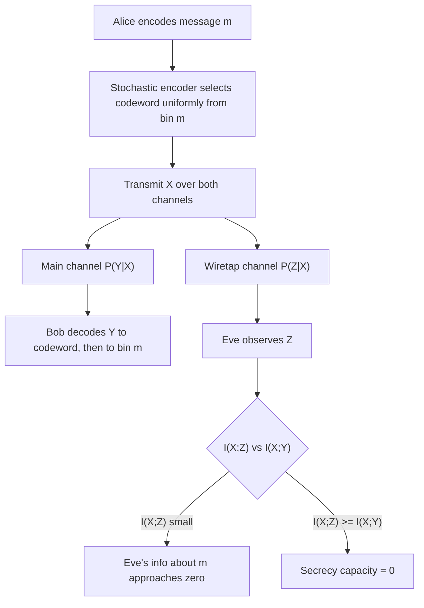

## Wiretap Channel and Secrecy Capacity

### Overview

The wiretap channel model, introduced by Aaron Wyner in 1975, formalizes secure communication as an information-theoretic problem rather than a computational one. A legitimate sender (Alice) wants to transmit a message to a legitimate receiver (Bob) over a noisy channel, while an eavesdropper (Eve) observes the transmission through a second, typically noisier, channel. Unlike Shannon's cipher-system model — which assumes a noiseless channel and relies on key secrecy — the wiretap channel exploits physical channel noise itself as the source of security, requiring no shared secret key between Alice and Bob at all.

### Channel Model

The setup consists of:

- **Main channel**: Alice → Bob, characterized by transition probability $P(Y \mid X)$
- **Wiretap channel**: Alice → Eve, characterized by transition probability $P(Z \mid X)$ (or, in the original degraded formulation, $P(Z \mid Y)$)

In Wyner's original **degraded wiretap channel**, Eve's channel is a stochastically degraded version of Bob's — meaning Eve's observation $Z$ can be modeled as $Y$ passed through an additional noisy channel. This ensures Eve's information about $X$ is never better than Bob's.

$$X \rightarrow \underbrace{P(Y \mid X)}_{\text{main channel}} \rightarrow Y \rightarrow \underbrace{P(Z \mid Y)}_{\text{degrading channel}} \rightarrow Z$$

### Diagram: Wiretap Channel Topology

<svg viewBox="0 0 720 300" xmlns="http://www.w3.org/2000/svg">  <defs> <marker id="arrowhead" markerWidth="8" markerHeight="8" refX="6" refY="3" orient="auto"> <path d="M0,0 L6,3 L0,6 Z" fill="#333"/> </marker> </defs> <text x="20" y="24" class="title">Wiretap Channel Topology (svg_diagram)</text> <rect x="40" y="120" width="90" height="50" rx="4" class="box"/> <text x="60" y="150" class="lbl">Alice (X)</text> <rect x="330" y="60" width="90" height="50" rx="4" class="box"/> <text x="345" y="90" class="lbl">Bob (Y)</text> <rect x="330" y="200" width="90" height="50" rx="4" class="eavbox"/> <text x="345" y="230" class="lbl">Eve (Z)</text> <path d="M130 140 L330 90" class="arrow"/> <text x="180" y="105" class="small">Main channel P(Y|X)</text> <path d="M375 110 L375 200" class="arrow"/> <text x="385" y="160" class="small">Degrading</text> <text x="385" y="173" class="small">channel P(Z|Y)</text> <path d="M130 155 L330 225" class="arrow"/> <text x="170" y="200" class="small">Direct P(Z|X)</text> <text x="170" y="212" class="small">(non-degraded case)</text> </svg>

### Secrecy Capacity

The **secrecy capacity** $C_s$ is the maximum rate at which Alice can reliably transmit information to Bob while keeping the message asymptotically hidden from Eve — formally, such that Eve's mutual information about the message approaches zero as block length grows (weak or strong secrecy, depending on the formulation).

For the degraded wiretap channel, Wyner showed:

$$C_s = \max_{P(X)} \left[ I(X;Y) - I(X;Z) \right]$$

Where:

- $I(X;Y)$ is the mutual information across the main channel (Alice–Bob)
- $I(X;Z)$ is the mutual information across the wiretap channel (Alice–Eve)
- The maximization is over the input distribution $P(X)$

This expression is the _secrecy rate_ for a given input distribution; $C_s$ is its maximum over all valid input distributions. The intuition is direct: secrecy capacity is the "extra" capacity Bob has over Eve, expressed in mutual-information terms. If Eve's channel is at least as good as Bob's ($I(X;Z) \geq I(X;Y)$ for all $P(X)$), then $C_s = 0$ — no positive secrecy rate is achievable regardless of coding scheme.

### Generalization: The Broadcast Channel With Confidential Messages

Csiszár and Körner (1978) extended Wyner's result to the non-degraded case, where Eve's channel need not be a degraded version of Bob's. The general secrecy capacity becomes:

$$C_s = \max_{P(U,X)} \left[ I(U;Y) - I(U;Z) \right]$$

Where $U$ is an auxiliary random variable (a preprocessing/prefixing variable) that Alice maps to $X$, used because directly maximizing $I(X;Y) - I(X;Z)$ over $P(X)$ is not always optimal when the channel isn't degraded. This is the standard general-case result cited in the information-theoretic security literature.

### Worked Example: Binary Symmetric Channels

Suppose both channels are binary symmetric channels (BSCs):

- Main channel: crossover probability $p$ (Alice–Bob)
- Wiretap channel: crossover probability $q$ (Alice–Eve), with $q > p$ (Eve's channel is noisier)

For BSCs, capacity is $C = 1 - H_b(p)$, where $H_b(p) = -p\log_2 p - (1-p)\log_2(1-p)$ is the binary entropy function. For the degraded BSC wiretap channel with uniform input, the secrecy capacity reduces to:

$$C_s = \left[1 - H_b(p)\right] - \left[1 - H_b(q)\right] = H_b(q) - H_b(p)$$

**Example values:** If $p = 0.05$ and $q = 0.25$:

- $H_b(0.05) \approx 0.286$ bits
- $H_b(0.25) \approx 0.811$ bits
- $C_s \approx 0.811 - 0.286 = 0.525$ bits per channel use

This represents the maximum rate at which Alice can send Bob information that remains information-theoretically hidden from Eve, using no pre-shared key — purely a consequence of Eve's channel being noisier than Bob's.

### Achievability: Coset Coding (Wyner's Scheme)

Wyner's original achievability proof uses a **coset coding** (binning) construction:

1. Partition the codeword space into $2^{nR}$ bins, each containing $2^{n(R_x - R)}$ codewords, where $R_x$ is the main channel's transmission rate and $R = C_s$ is the target secrecy rate.
2. To send message $m$, Alice randomly selects one codeword from bin $m$ (not a fixed one — randomization is essential to the security proof).
3. Bob decodes the received sequence to recover the specific codeword, then identifies which bin it belongs to, recovering $m$.
4. Eve's channel is too noisy to reliably identify even the specific codeword; more importantly, because each bin contains many codewords selected uniformly at random, Eve's observation carries near-zero mutual information about _which bin_ was used, even though she may partially decode aspects of the transmission.

**Key Points**

- Randomized encoding (stochastic encoders) is essential — a deterministic mapping from message to codeword would leak information to Eve through channel correlations, even if Eve's channel is noisier overall.
- Secrecy here is unconditional (information-theoretic), not computational — it holds regardless of Eve's computational power, in contrast to standard cryptographic security based on hardness assumptions.
- The wiretap channel requires the eavesdropper's channel to be strictly worse than the legitimate channel; if $I(X;Z) \geq I(X;Y)$ for every input distribution, $C_s = 0$ and no information-theoretic secrecy is achievable via this mechanism alone.

### Relationship to Classical Cryptography

[Inference] The wiretap channel is often framed as a physical-layer complement to, rather than a replacement for, computational cryptography — it depends on a physical noise/channel-quality advantage that a real communication system may or may not actually possess, whereas standard cryptography (e.g., AES, RSA) provides security guarantees independent of channel conditions, at the cost of relying on unproven computational hardness assumptions.

In practice, physical-layer security research (wiretap codes, secrecy capacity of fading and MIMO channels) has developed as its own subfield, particularly relevant to wireless communications where channel quality differences between legitimate and eavesdropping receivers can be substantial and are relatively straightforward to estimate.

### Diagram: Secrecy Capacity Region Concept

### Limitations and Extensions

- The degraded assumption simplifies analysis but is not required in general (Csiszár–Körner result covers the general broadcast channel with confidential messages).
- Extensions include the **Gaussian wiretap channel** (continuous-alphabet analog, relevant to real RF systems), **MIMO wiretap channels** (multiple antennas, where secrecy capacity depends on relative channel matrix ranks/eigenvalues), and **fading wiretap channels** (secrecy capacity varies with instantaneous channel state, motivating opportunistic secure transmission).
- [Unverified] Practical deployment of wiretap coding remains limited compared to computational cryptography, largely because guaranteeing a real, quantifiable channel advantage over an unknown, potentially adversarially-positioned eavesdropper is difficult to certify in real-world deployments — this is a commonly cited practical objection in the physical-layer security literature, though the extent of the gap depends on which specific wireless scenario is being discussed.
- Secrecy capacity is generally more restrictive than ordinary channel capacity; achieving $C_s > 0$ requires an actual quality gap, whereas ordinary reliable communication requires none.

**Related Topics**

- Csiszár–Körner broadcast channel with confidential messages
- Gaussian wiretap channel and secure degrees of freedom
- MIMO and fading wiretap channels
- Secret key agreement from correlated sources (Maurer, Ahlswede–Csiszár)
- Strong vs. weak secrecy definitions
- Polar codes and LDPC codes for wiretap channel achievability
- Physical-layer security in wireless networks

