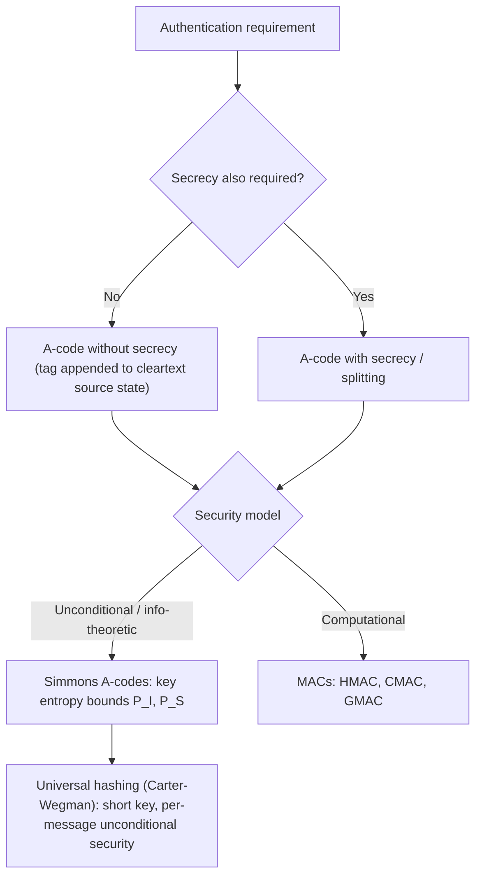

## Authentication and Information Theory

### Overview

Information-theoretic authentication addresses a distinct problem from secrecy: rather than hiding message content from an eavesdropper, it ensures a receiver can verify that a received message actually originated from the legitimate sender and was not altered or forged, with security guarantees that hold against an adversary of unbounded computational power. The foundational framework was developed by Gustavus Simmons in the early 1980s, extending Shannon's information-theoretic approach from secrecy to authenticity.

### The Authentication Model

The setup involves three parties:

- **Transmitter**: sends a message, possibly appending or transforming it using a shared secret key
- **Receiver**: verifies the received message against the same shared key
- **Opponent (Oscar)**: attempts either to inject a fraudulent message (**impersonation attack**) or to alter a legitimately transmitted message so it is accepted as different, valid content (**substitution attack**)

Unlike encryption, which maps plaintext to ciphertext for confidentiality, an authentication code (A-code) maps a **source state** (the underlying information to be conveyed) plus a **key** to a **message** (the transmitted authenticated value), such that the receiver — knowing the key — can verify the message's authenticity and recover the source state.

### Diagram: Authentication Model

<svg xmlns="http://www.w3.org/2000/svg" viewBox="0 0 720 300">
\<style\>
  .lbl { font-family: sans-serif; font-size: 13px; fill: #222; }
  .small { font-family: sans-serif; font-size: 11px; fill: #555; }
  .title { font-family: sans-serif; font-size: 14px; fill: #111; font-weight: bold; }
  .box { fill: #eef3fb; stroke: #1a5fb4; stroke-width: 1.5; }
  .oscarbox { fill: #fbeeee; stroke: #c01c28; stroke-width: 1.5; }
  .arrow { stroke: #333; stroke-width: 1.8; marker-end: url(#arrowhead2); fill: none; }
\</style\>
<text x="20" y="24" class="title">Authentication Model (svg_diagram)</text>

<rect x="40" y="120" width="110" height="50" rx="4" class="box" />
<text x="55" y="150" class="lbl">Transmitter</text>

<rect x="560" y="120" width="110" height="50" rx="4" class="box" />
<text x="585" y="150" class="lbl">Receiver</text>

<rect x="290" y="220" width="130" height="50" rx="4" class="oscarbox" />
<text x="315" y="250" class="lbl">Oscar (Opponent)</text>

<path d="M150 145 L560 145" class="arrow" />
<text x="290" y="130" class="small">Authenticated message</text>

<path d="M355 220 L355 175" class="arrow" stroke-dasharray="4,3" />
<text x="365" y="200" class="small">Inject / alter</text>

<rect x="150" y="60" width="420" height="30" rx="4" fill="#fff7e6" stroke="#c1980a" stroke-width="1" />
<text x="280" y="80" class="small">Shared secret key K (known to Transmitter and Receiver only)</text>
</svg>

### Two Attack Types

**Impersonation attack**: Oscar, without observing any prior legitimate transmission, sends a message and hopes the receiver accepts it as authentic. The probability of success, optimized over Oscar's best strategy, is denoted $P_I$.

**Substitution attack**: Oscar observes a legitimate message in transit and replaces it with a different message, hoping the receiver accepts the fraudulent substitute as authentic (and decodes it to a different, incorrect source state). The probability of success is denoted $P_S$.

The overall deception probability is generally defined as:

$$P_d = \max(P_I, P_S)$$

### Simmons' Bound

Simmons established a fundamental lower bound on deception probability in terms of the entropy of the key:

$$P_d \geq 2^{-I(M;K)}$$

More commonly cited in terms of key entropy directly, for authentication codes without secrecy (where the source state is not hidden, only authenticated):

$$H(K) \geq -\log_2 P_I - \log_2 P_S \quad \text{(informally, } H(K) \gtrsim -2\log_2 P_d \text{ in symmetric cases)}$$

[Unverified] The precise form of this bound varies somewhat across formulations in the literature depending on whether the code also provides secrecy (splitting), whether keys are reused across multiple messages, and which specific deception probability definition is used — the informal relation above captures the key qualitative result (more key entropy is required to bound deception probability lower) but should not be treated as the single canonical formula without checking the specific source-state/key model in question.

The core, well-established result is qualitative and robust across formulations: **achieving a low probability of successful deception requires a key with sufficient entropy**, analogous to how Shannon's unicity distance relates key entropy to the difficulty of breaking secrecy. Authentication, like encryption, cannot be made unconditionally secure with an arbitrarily small key — there is an information-theoretic floor.

### Worked Example: Simple Authentication Code

Consider a minimal example: 2 source states $\{s_0, s_1\}$, 4 possible keys $\{k_1, k_2, k_3, k_4\}$, each used with probability $1/4$, and each key defining a distinct mapping from source states to messages such that no two keys produce the same message for the same source state, and every message is achievable under exactly one key per source state (a common construction pattern for illustrating minimal A-codes).

If constructed so each message is consistent with exactly 2 of the 4 keys (given a fixed source state), then:

- $P_I$ (best impersonation probability) $= 2/4 = 0.5$ — Oscar guesses a message; it's valid under half the keys.
- With careful design, $P_S$ can be bounded similarly.

In practice, real authentication codes use much larger key and message spaces to drive $P_I$ and $P_S$ down to cryptographically negligible levels (e.g., $2^{-128}$), at the cost of correspondingly larger key entropy, consistent with Simmons' bound.

### Authentication Without Secrecy vs. With Secrecy

A-codes are classified by whether they also conceal the source state:

- **A-codes without secrecy**: The message reveals the source state in the clear (e.g., appended with a keyed tag/MAC-like value); only authenticity is protected, not confidentiality.
- **A-codes with secrecy (splitting)**: The message conceals the source state as well, requiring joint analysis of both the secrecy and authentication properties, since the two objectives interact through the shared key.

This distinction parallels the difference between a Message Authentication Code (MAC) appended to plaintext (authentication only) and an authenticated encryption scheme (both secrecy and authentication).

### Relationship to Modern MACs

**Key Points**
- Information-theoretic authentication (Simmons-style A-codes) provides unconditional security — valid against a computationally unbounded adversary — but generally requires long keys, often as long as or longer than the total data authenticated, especially for one-time-use constructions.
- Computational MACs (HMAC, CMAC, GMAC) instead rely on cryptographic hardness assumptions and short, fixed-length keys, trading unconditional security for practicality.
- Universal hash functions provide a middle ground: Carter–Wegman-style MACs (e.g., as used in Poly1305, GCM's authentication component) achieve information-theoretic security **per message** using a short key combined with a one-time pad-like key stream, offering strong provable security bounds without requiring key length proportional to total lifetime data volume, provided the one-time components are never reused. [Inference — this framing reflects the standard motivation given in the universal hashing / Carter–Wegman literature, though exact security bounds are scheme-specific and depend on hash family parameters.]

### Diagram: Authentication Code Design Space

### Universal Hashing and the Carter–Wegman Construction

A universal hash family $\mathcal{H} = \{h : X \rightarrow Y\}$ is $\epsilon$-almost universal if, for any two distinct inputs $x_1 \neq x_2$:

$$\Pr_{h \in \mathcal{H}}[h(x_1) = h(x_2)] \leq \epsilon$$

The Carter–Wegman authentication construction combines a universal hash of the message with a one-time key stream value:

$$\text{tag} = h_K(m) \oplus r$$

Where $h_K$ is drawn from a universal hash family keyed by $K$, and $r$ is a one-time random (or pseudorandom, in practical relaxations) pad value. This construction provides an information-theoretic bound on forgery probability approximately equal to $\epsilon$ (the collision probability of the hash family), independent of the adversary's computational power — provided $r$ is never reused. [Inference] This is the standard justification given for why GCM-mode authentication tags and similar constructions offer strong, provable forgery-resistance bounds distinct from the underlying block cipher's computational security.

### Limitations

- Unconditionally secure authentication generally requires substantial key material relative to the volume of data authenticated, making it impractical for high-throughput applications without hybrid approaches (short information-theoretic key expanded via computational pseudorandomness, as in Carter–Wegman-based MACs).
- Key reuse across multiple authenticated messages, without care, can violate the security assumptions underlying the bounds (particularly for one-time-pad-like components), reintroducing forgery vulnerabilities.
- The Simmons framework primarily addresses single-message or bounded-message authentication; extending unconditional guarantees to arbitrarily many messages under a fixed key generally requires the key length to grow, or requires accepting a purely computational security model instead.

**Related Topics**
- Message Authentication Codes (HMAC, CMAC, GMAC, Poly1305)
- Universal hashing and $\epsilon$-almost universal hash families
- Simmons' impersonation and substitution bounds
- Authenticated encryption (AEAD) constructions
- Secret sharing and its relationship to authentication codes
- Key derivation and key management for information-theoretic schemes