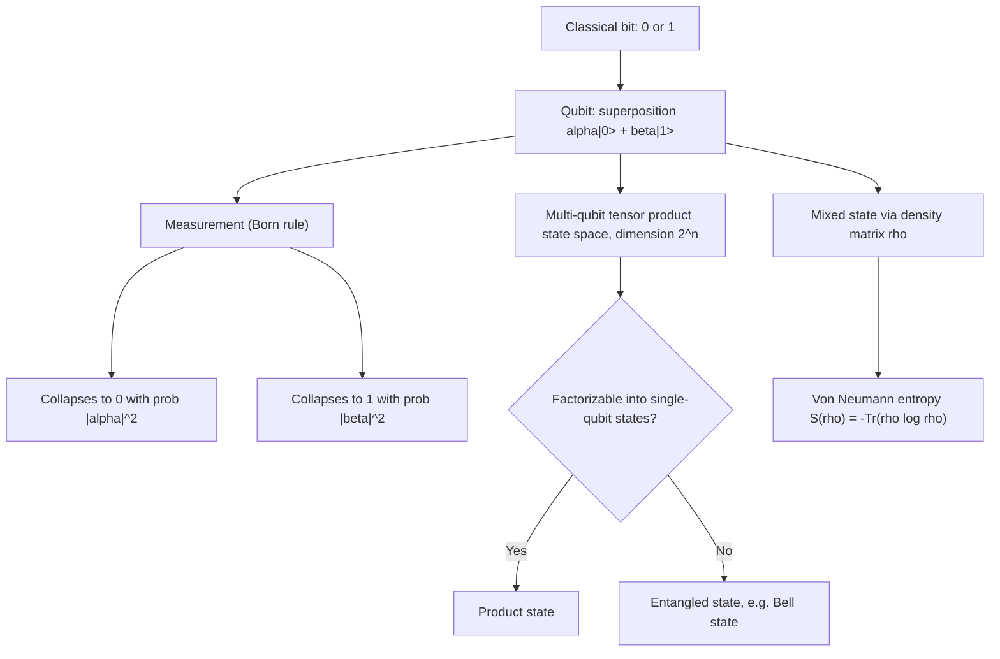

## Qubits and Quantum States

### Overview

A qubit (quantum bit) is the fundamental unit of quantum information, generalizing the classical bit. Where a classical bit is definitively 0 or 1, a qubit exists in a superposition of both basis states simultaneously, described by a vector in a two-dimensional complex Hilbert space. This generalization underlies quantum computing, quantum key distribution, and quantum information theory more broadly — the last of which extends Shannon's classical framework (entropy, channel capacity, source coding) into the quantum domain.

### Mathematical Representation

A qubit's state is written in Dirac (bra-ket) notation as a linear combination of the two computational basis states $|0\rangle$ and $|1\rangle$:

$$|\psi\rangle = \alpha|0\rangle + \beta|1\rangle$$

Where $\alpha, \beta \in \mathbb{C}$ are complex probability amplitudes satisfying the normalization condition:

$$|\alpha|^2 + |\beta|^2 = 1$$

The basis states correspond to the classical bit values:

$$|0\rangle = \begin{pmatrix} 1 \\ 0 \end{pmatrix}, \qquad |1\rangle = \begin{pmatrix} 0 \\ 1 \end{pmatrix}$$

### Measurement and Born's Rule

Measuring a qubit in the computational basis collapses the superposition to a definite classical outcome:

- Outcome $0$ with probability $|\alpha|^2$
- Outcome $1$ with probability $|\beta|^2$

This is **Born's rule**. Critically, measurement is destructive and probabilistic — the qubit's pre-measurement amplitudes $\alpha, \beta$ cannot be determined exactly from a single measurement of a single copy of the state, since only one classical bit of information (the collapsed outcome) is extracted regardless of how much "information" the amplitudes appeared to encode. This is a foundational asymmetry between quantum state description (continuous, complex-valued) and the classical information that can be extracted from it (discrete).

### The Bloch Sphere

A single qubit's pure state can be visualized geometrically on the **Bloch sphere**, a unit sphere in three real dimensions, using the parameterization:

$$|\psi\rangle = \cos\left(\frac{\theta}{2}\right)|0\rangle + e^{i\phi}\sin\left(\frac{\theta}{2}\right)|1\rangle$$

Where $\theta \in [0, \pi]$ is the polar angle and $\phi \in [0, 2\pi)$ is the azimuthal angle. The global phase of the state is physically unobservable and is factored out of this representation, which is why two real parameters ($\theta, \phi$) suffice to specify a pure single-qubit state despite the underlying complex vector nominally having more degrees of freedom.

### Diagram: Bloch Sphere

<svg xmlns="http://www.w3.org/2000/svg" viewBox="0 0 480 420">
\<style\>
  .lbl { font-family: sans-serif; font-size: 13px; fill: #222; }
  .small { font-family: sans-serif; font-size: 11px; fill: #555; }
  .title { font-family: sans-serif; font-size: 14px; fill: #111; font-weight: bold; }
  .sphere { fill: none; stroke: #888; stroke-width: 1; }
  .equator { fill: none; stroke: #aaa; stroke-width: 1; stroke-dasharray: 3,2; }
  .axis { stroke: #333; stroke-width: 1.2; }
  .vec { stroke: #1a5fb4; stroke-width: 2.2; marker-end: url(#arrowhead3); }
\</style\>
<text x="20" y="24" class="title">Bloch Sphere (svg_diagram)</text>

<ellipse cx="240" cy="220" rx="140" ry="140" class="sphere" />
<ellipse cx="240" cy="220" rx="140" ry="45" class="equator" />

<line x1="240" y1="80" x2="240" y2="360" class="axis" />
<text x="248" y="75" class="lbl">|0⟩</text>
<text x="248" y="378" class="lbl">|1⟩</text>

<line x1="100" y1="220" x2="380" y2="220" class="axis" />
<line x1="150" y1="290" x2="330" y2="150" class="axis" />

<line x1="240" y1="220" x2="340" y2="140" class="vec" />
<text x="348" y="135" class="small">|ψ⟩</text>
<text x="180" y="240" class="small">θ</text>
<text x="255" y="200" class="small">φ</text>
</svg>

### Multi-Qubit Systems and Entanglement

For $n$ qubits, the joint state lives in a $2^n$-dimensional Hilbert space, formed as the tensor product of individual qubit spaces. A general two-qubit state is:

$$|\psi\rangle = \alpha_{00}|00\rangle + \alpha_{01}|01\rangle + \alpha_{10}|10\rangle + \alpha_{11}|11\rangle$$

with $\sum |\alpha_{ij}|^2 = 1$. This exponential scaling of the state space with qubit count is the source of quantum computing's theoretical power for certain problems, and also of the classical simulation difficulty of quantum systems.

Some multi-qubit states cannot be factored into a tensor product of individual qubit states — these are **entangled states**. The canonical example is a Bell state:

$$|\Phi^+\rangle = \frac{1}{\sqrt{2}}\left(|00\rangle + |11\rangle\right)$$

Measuring one qubit of an entangled pair instantaneously determines the measurement outcome distribution of the other, regardless of spatial separation — a correlation stronger than any achievable with classical shared randomness, as formalized by Bell's theorem and experimentally confirmed via Bell inequality violations.

### Density Matrices and Mixed States

Pure states ($|\psi\rangle$) describe qubits with complete, definite quantum information. Real physical systems often involve **mixed states** — statistical ensembles of pure states arising from noise, decoherence, or partial information — represented instead by a density matrix:

$$\rho = \sum_i p_i |\psi_i\rangle\langle\psi_i|$$

Where $p_i$ are classical probabilities ($\sum p_i = 1$) over an ensemble of pure states $|\psi_i\rangle$. A pure state corresponds to $\rho = |\psi\rangle\langle\psi|$ with $\text{Tr}(\rho^2) = 1$; a mixed state has $\text{Tr}(\rho^2) < 1$.

**Key Points**
- Superposition allows a qubit to encode a continuum of amplitude values, but measurement extracts only classical information — the "no-cloning theorem" (arbitrary unknown quantum states cannot be copied exactly) is a direct consequence of the linearity of quantum mechanics and is foundational to quantum cryptography's security guarantees.
- Entanglement provides correlations with no classical analog, underlying protocols such as quantum teleportation and entanglement-based quantum key distribution (e.g., E91 protocol).
- The exponential dimensionality of $n$-qubit state space ($2^n$) is both quantum computing's source of potential advantage and the reason classical simulation of large quantum systems is generally intractable.

### Von Neumann Entropy: The Quantum Generalization

Just as Shannon entropy quantifies uncertainty in a classical probability distribution, **von Neumann entropy** quantifies uncertainty (mixedness) in a quantum state via its density matrix:

$$S(\rho) = -\text{Tr}(\rho \log_2 \rho)$$

Equivalently, if $\lambda_i$ are the eigenvalues of $\rho$:

$$S(\rho) = -\sum_i \lambda_i \log_2 \lambda_i$$

which is exactly the Shannon entropy of the eigenvalue distribution. For a pure state, $S(\rho) = 0$ (no uncertainty); for a maximally mixed single-qubit state ($\rho = I/2$), $S(\rho) = 1$ bit — the quantum analog of a fair coin flip. This quantity underlies quantum channel capacity theorems (Holevo bound, quantum analogs of Shannon's noisy channel coding theorem), which extend classical information theory into the quantum regime.

### Diagram: From Classical Bit to Qubit State Space

### Limitations and Scope Notes

- This treatment covers single- and multi-qubit state description at the level needed for quantum information theory; it does not cover quantum gate operations, circuit models, or specific quantum algorithms (Shor's, Grover's), which belong to quantum computing proper rather than quantum information theory.
- [Inference] The connection back to the cryptography sequence this content otherwise follows is most direct via quantum key distribution (BB84, E91), which relies on qubit superposition and the no-cloning theorem for its security proofs — that linkage is a natural next topic if the intent is to return to the cryptographic track.
- Physical realizations of qubits (superconducting circuits, trapped ions, photonic qubits, etc.) and their engineering trade-offs are outside the scope of this information-theoretic treatment.

**Related Topics**
- Von Neumann entropy and quantum relative entropy
- Holevo bound and quantum channel capacity
- No-cloning theorem
- Quantum key distribution (BB84, E91 protocols)
- Bell's theorem and CHSH inequality
- Quantum teleportation and superdense coding
- Density matrices, purity, and partial trace