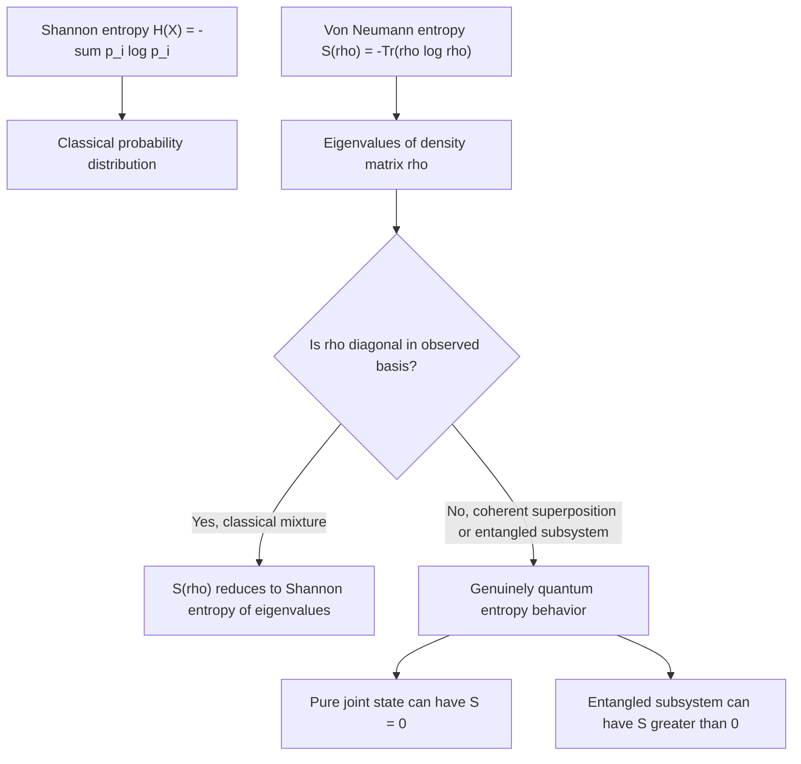

## Von Neumann Entropy

### Overview

Von Neumann entropy is the quantum-mechanical generalization of Shannon entropy, quantifying the uncertainty or "mixedness" of a quantum state. Introduced by John von Neumann in 1932 — predating Shannon's 1948 classical information theory — it plays the analogous foundational role in quantum information theory that Shannon entropy plays classically: measuring information content, bounding compression rates, and underlying quantum channel capacity theorems.

### Definition

For a quantum state described by density matrix $\rho$, the von Neumann entropy is:

$$S(\rho) = -\text{Tr}(\rho \log_2 \rho)$$

Since $\rho$ is Hermitian and positive semi-definite, it can be diagonalized with real, non-negative eigenvalues $\lambda_i$ (its spectral decomposition) satisfying $\sum_i \lambda_i = 1$. In this eigenbasis:

$$S(\rho) = -\sum_i \lambda_i \log_2 \lambda_i$$

This is precisely the Shannon entropy of the probability distribution formed by $\rho$'s eigenvalues. Von Neumann entropy therefore inherits Shannon entropy's functional form exactly, but applied to the eigenvalue spectrum of a density operator rather than to a directly observed classical probability distribution.

### Boundary Cases

- **Pure states**: If $\rho = |\psi\rangle\langle\psi|$ represents a pure state, $\rho$ has one eigenvalue equal to $1$ and all others $0$, giving $S(\rho) = 0$. A pure state carries no entropy — it represents complete quantum-mechanical knowledge of the system, even though measurement outcomes remain probabilistic.
- **Maximally mixed states**: For a $d$-dimensional system in the maximally mixed state $\rho = I/d$, all $d$ eigenvalues equal $1/d$, giving $S(\rho) = \log_2 d$. For a single qubit ($d=2$), this gives $S(\rho) = 1$ bit — maximal uncertainty, analogous to a fair classical coin flip.
- **General mixed states**: $0 < S(\rho) < \log_2 d$ for any state that is neither pure nor maximally mixed.

### Worked Example

Consider a qubit prepared as a classical statistical mixture: with probability $p$ in state $|0\rangle$, and probability $1-p$ in state $|1\rangle$ (no coherence between them — this is a genuinely mixed, not superposed, state):

$$\rho = p|0\rangle\langle 0| + (1-p)|1\rangle\langle 1| = \begin{pmatrix} p & 0 \\ 0 & 1-p \end{pmatrix}$$

Since this matrix is already diagonal, its eigenvalues are simply $p$ and $1-p$, giving:

$$S(\rho) = -p\log_2 p - (1-p)\log_2(1-p) = H_b(p)$$

This is exactly the classical binary entropy function. This example illustrates a general principle: when a density matrix is diagonal in some basis (i.e., represents a purely classical mixture with no quantum coherence between the basis states), von Neumann entropy reduces exactly to the Shannon entropy of the corresponding classical probability distribution.

### Key Properties

**Key Points**
- **Non-negativity**: $S(\rho) \geq 0$, with equality if and only if $\rho$ is pure.
- **Boundedness**: For a $d$-dimensional Hilbert space, $S(\rho) \leq \log_2 d$, with equality only for the maximally mixed state.
- **Invariance under unitary transformations**: $S(U\rho U^\dagger) = S(\rho)$ for any unitary $U$, since unitary evolution preserves eigenvalues — entropy does not change under closed-system, reversible quantum evolution.
- **Concavity**: $S(\sum_i p_i \rho_i) \geq \sum_i p_i S(\rho_i)$ — mixing quantum states can only increase or preserve entropy, never decrease it, mirroring the concavity of Shannon entropy over classical distributions.
- **Subadditivity**: For a composite system $AB$, $S(\rho_{AB}) \leq S(\rho_A) + S(\rho_B)$, with equality if and only if $\rho_{AB} = \rho_A \otimes \rho_B$ (no correlation between subsystems).

### Entanglement Entropy: A Distinctly Quantum Feature

The most consequential departure from classical entropy arises in composite systems. For a bipartite pure state $|\psi\rangle_{AB}$, the **entanglement entropy** is defined as the von Neumann entropy of either subsystem's reduced density matrix:

$$S(\rho_A) = S(\rho_B)$$

Where $\rho_A = \text{Tr}_B(|\psi\rangle\langle\psi|_{AB})$ is obtained by tracing out subsystem $B$ (the partial trace).

This produces a result with no classical analog: **even though the joint state $|\psi\rangle_{AB}$ is pure** (globally, $S(\rho_{AB}) = 0$), **each subsystem individually can be mixed** ($S(\rho_A) = S(\rho_B) > 0$) if the subsystems are entangled. Classically, if a joint distribution has zero entropy (a definite, known joint outcome), each marginal must also have zero entropy. Quantum mechanically, this classical intuition fails for entangled states.

**Worked example — Bell state:** For $|\Phi^+\rangle = \frac{1}{\sqrt{2}}(|00\rangle + |11\rangle)$:

$$\rho_A = \text{Tr}_B(|\Phi^+\rangle\langle\Phi^+|) = \frac{1}{2}\begin{pmatrix} 1 & 0 \\ 0 & 1 \end{pmatrix} = \frac{I}{2}$$

giving $S(\rho_A) = 1$ bit, the maximum possible for a single qubit — despite the joint two-qubit state being pure with $S(\rho_{AB}) = 0$. This gap between zero global entropy and maximal local entropy is a direct quantitative signature of entanglement.

### Diagram: Entropy of a Bipartite Pure State

<svg xmlns="http://www.w3.org/2000/svg" viewBox="0 0 700 320">
\<style\>
  .lbl { font-family: sans-serif; font-size: 13px; fill: #222; }
  .small { font-family: sans-serif; font-size: 11px; fill: #555; }
  .title { font-family: sans-serif; font-size: 14px; fill: #111; font-weight: bold; }
  .box { fill: #eef3fb; stroke: #1a5fb4; stroke-width: 1.5; }
  .arrow { stroke: #333; stroke-width: 1.6; marker-end: url(#arrowhead4); fill: none; }
\</style\>
<text x="20" y="24" class="title">Entanglement Entropy (svg_diagram)</text>

<rect x="240" y="40" width="220" height="55" rx="4" class="box" />
<text x="255" y="72" class="lbl">Joint state |ψ⟩_AB, S = 0 (pure)</text>

<path d="M300 95 L150 190" class="arrow" />
<text x="180" y="150" class="small">Partial trace over B</text>
<path d="M400 95 L550 190" class="arrow" />
<text x="490" y="150" class="small">Partial trace over A</text>

<rect x="60" y="190" width="180" height="55" rx="4" class="box" />
<text x="80" y="222" class="lbl">ρ_A, S(ρ_A) &gt; 0</text>

<rect x="460" y="190" width="180" height="55" rx="4" class="box" />
<text x="480" y="222" class="lbl">ρ_B, S(ρ_B) &gt; 0</text>

<text x="200" y="290" class="small">S(ρ_A) = S(ρ_B) when |ψ⟩_AB is pure and entangled</text>
</svg>

### Relative Entropy and Mutual Information (Quantum Generalizations)

Von Neumann entropy extends further into quantum analogs of standard information-theoretic quantities:

**Quantum relative entropy** (analog of Kullback-Leibler divergence):

$$S(\rho \| \sigma) = \text{Tr}(\rho \log_2 \rho) - \text{Tr}(\rho \log_2 \sigma)$$

**Quantum mutual information**:

$$I(A:B) = S(\rho_A) + S(\rho_B) - S(\rho_{AB})$$

For the Bell state example above, this gives $I(A:B) = 1 + 1 - 0 = 2$ bits — exceeding what is classically achievable for two classical bits with equivalent marginal entropies, reflecting the strength of quantum correlations. [Inference] This super-classical mutual information value is a widely cited illustrative consequence of entanglement in the quantum information literature, though care is needed in interpreting quantum mutual information operationally, since it does not directly correspond to a communication capacity the way classical mutual information often does.

### Applications

- **Quantum data compression**: Schumacher's theorem establishes that von Neumann entropy $S(\rho)$ is the minimum number of qubits per symbol needed to reliably compress a quantum information source — the direct quantum analog of Shannon's source coding theorem.
- **Quantum channel capacity**: The Holevo bound uses von Neumann entropy to bound the classical information extractable from a quantum ensemble, while quantum channel capacity theorems (e.g., for entanglement-assisted or unassisted transmission) are expressed in terms of von Neumann and related entropic quantities.
- **Entanglement quantification**: Entanglement entropy serves as the standard measure of bipartite entanglement for pure states, used extensively in quantum information theory and, [Inference] in areas of theoretical physics such as condensed matter and black hole information theory, where the specific technical role of entanglement entropy differs substantially from its use in quantum information proper.

### Diagram: Classical Entropy vs. Von Neumann Entropy

### Limitations and Scope Notes

- Von Neumann entropy quantifies mixedness/uncertainty about a quantum state, not directly the classical information an observer can extract from measuring it — that extraction is bounded separately by the Holevo bound, which is generally tighter than $S(\rho)$ suggests naively.
- Computing $S(\rho)$ requires full diagonalization of the density matrix, which becomes computationally intensive for large composite systems — a practical limitation in numerical quantum information studies, distinct from the conceptual/theoretical role of the quantity.
- [Unverified] Extensions such as Rényi entropies generalize von Neumann entropy with a tunable parameter and are used in some quantum information contexts (e.g., entanglement spectroscopy) where von Neumann entropy alone is difficult to estimate experimentally, but the comparative practical advantages depend heavily on the specific experimental or theoretical context and are not summarized well by a single general claim.

**Related Topics**
- Schumacher compression and quantum source coding
- Holevo bound and accessible information
- Quantum relative entropy and quantum Sanov-type results
- Entanglement measures (concurrence, negativity, entanglement of formation)
- Quantum channel capacity theorems
- Rényi entropy and its quantum generalizations