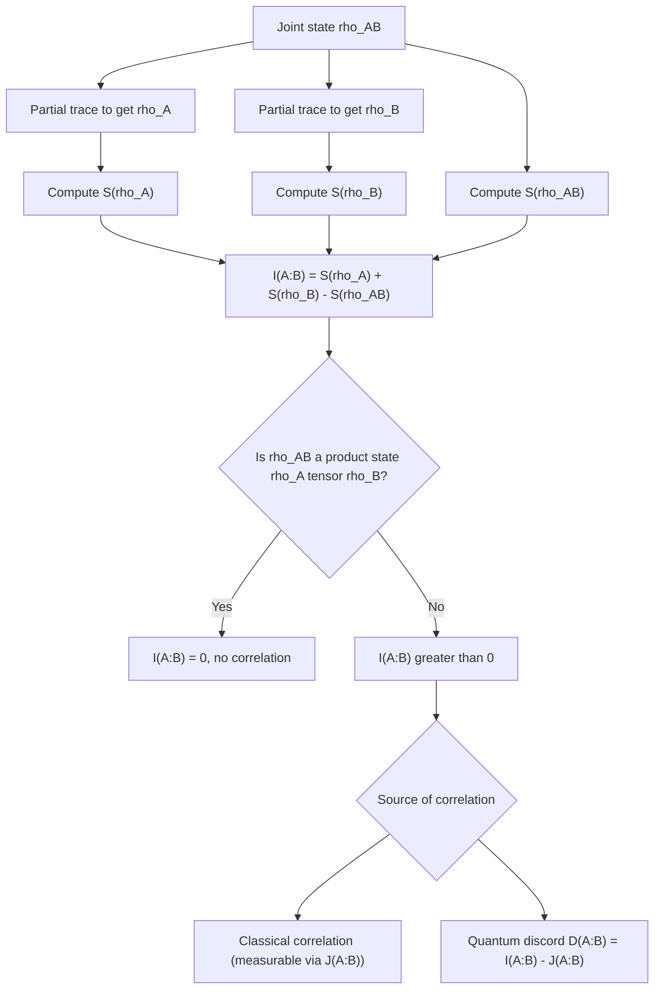

## Quantum Mutual Information

### Overview

Quantum mutual information generalizes classical mutual information to quantum systems, quantifying the total correlations — both classical and quantum — shared between two subsystems of a composite quantum state. It builds directly on von Neumann entropy and plays a central role in quantifying entanglement, characterizing quantum channel behavior, and bounding communication and correlation properties in composite quantum systems.

### Definition

For a bipartite quantum system $AB$ described by joint density matrix $\rho_{AB}$, with reduced density matrices $\rho_A = \text{Tr}_B(\rho_{AB})$ and $\rho_B = \text{Tr}_A(\rho_{AB})$, the quantum mutual information is:

$$I(A:B) = S(\rho_A) + S(\rho_B) - S(\rho_{AB})$$

This has the identical structural form to the classical definition $I(X;Y) = H(X) + H(Y) - H(X,Y)$, with Shannon entropy replaced by von Neumann entropy throughout. The colon notation $I(A:B)$ (rather than a comma or semicolon) is conventional in quantum information literature to denote the quantum mutual information between subsystems $A$ and $B$.

### Equivalent Formulation via Relative Entropy

Quantum mutual information can also be expressed as the quantum relative entropy between the joint state and the product of its marginals:

$$I(A:B) = S(\rho_{AB} \,\|\, \rho_A \otimes \rho_B)$$

Where $S(\rho \| \sigma) = \text{Tr}(\rho \log_2 \rho) - \text{Tr}(\rho \log_2 \sigma)$ is quantum relative entropy. This formulation makes explicit that $I(A:B)$ measures the "distance" between the actual joint state and the hypothetical fully uncorrelated state $\rho_A \otimes \rho_B$ — mirroring the classical interpretation of mutual information as KL-divergence between a joint distribution and the product of its marginals.

### Range and Boundary Values

**Key Points**
- $I(A:B) \geq 0$ always, by the non-negativity of quantum relative entropy — a direct quantum analog of the classical fact that mutual information is never negative.
- $I(A:B) = 0$ if and only if $\rho_{AB} = \rho_A \otimes \rho_B$ — the subsystems are completely uncorrelated (a product state), exactly analogous to classical statistical independence.
- For a $d_A$-dimensional and $d_B$-dimensional pair of subsystems, $I(A:B) \leq 2\min(\log_2 d_A, \log_2 d_B)$.
- Unlike classical mutual information, which is bounded by $\min(H(X), H(Y))$, quantum mutual information for entangled states can reach $2\min(S(\rho_A), S(\rho_B))$ — twice the classical bound — because it captures both classical-like correlations and purely quantum entanglement correlations simultaneously.

### Worked Example: Bell State

For the Bell state $|\Phi^+\rangle = \frac{1}{\sqrt{2}}(|00\rangle + |11\rangle)$:

- Joint state is pure: $S(\rho_{AB}) = 0$
- Each reduced state is maximally mixed: $S(\rho_A) = S(\rho_B) = 1$ bit

$$I(A:B) = 1 + 1 - 0 = 2 \text{ bits}$$

This value of 2 bits — double what two classical bits with the same individual (marginal) entropy could achieve — is the standard illustrative example of how entanglement inflates quantum mutual information beyond classical limits. For comparison, two classical bits perfectly correlated (always equal, e.g., both 0 or both 1 with equal probability) have $H(X) = H(Y) = 1$ bit and $H(X,Y) = 1$ bit, giving classical mutual information $I(X;Y) = 1 + 1 - 1 = 1$ bit — half the quantum value for the analogous maximally-correlated case.

### Worked Example: Classically Correlated (Non-Entangled) Mixed State

To isolate the difference between classical correlation and entanglement, consider a classically correlated mixed state:

$$\rho_{AB} = \frac{1}{2}|00\rangle\langle 00| + \frac{1}{2}|11\rangle\langle 11|$$

This is a classical statistical mixture (no coherence between $|00\rangle$ and $|11\rangle$), not an entangled pure state. Computing the pieces:

- $\rho_A = \frac{1}{2}|0\rangle\langle 0| + \frac{1}{2}|1\rangle\langle 1| = I/2$, so $S(\rho_A) = 1$ bit
- $\rho_B = I/2$ similarly, so $S(\rho_B) = 1$ bit
- $\rho_{AB}$ is already diagonal with eigenvalues $\{1/2, 1/2\}$, so $S(\rho_{AB}) = 1$ bit

$$I(A:B) = 1 + 1 - 1 = 1 \text{ bit}$$

This matches the classical mutual information of two perfectly correlated classical bits exactly — because this state, despite being written in quantum notation, encodes purely classical correlation with no entanglement. This contrast (1 bit here vs. 2 bits for the Bell state) is a standard way of illustrating that quantum mutual information counts entanglement as an additional correlation resource beyond what classical correlation alone provides.

### Diagram: Classical vs. Entangled Correlation

<svg xmlns="http://www.w3.org/2000/svg" viewBox="0 0 720 300">
\<style\>
  .lbl { font-family: sans-serif; font-size: 13px; fill: #222; }
  .small { font-family: sans-serif; font-size: 11px; fill: #555; }
  .title { font-family: sans-serif; font-size: 14px; fill: #111; font-weight: bold; }
  .box { fill: #eef3fb; stroke: #1a5fb4; stroke-width: 1.5; }
  .box2 { fill: #f3eefb; stroke: #7a1ac0; stroke-width: 1.5; }
\</style\>
<text x="20" y="24" class="title">Classical vs Entangled Correlation (svg_diagram)</text>

<rect x="40" y="60" width="280" height="180" rx="6" class="box" />
<text x="60" y="90" class="lbl">Classically correlated mixture</text>
<text x="60" y="115" class="small">rho_AB = 1/2|00&gt;&lt;00| + 1/2|11&gt;&lt;11|</text>
<text x="60" y="140" class="small">S(rho_A) = 1, S(rho_B) = 1</text>
<text x="60" y="160" class="small">S(rho_AB) = 1 (mixed joint state)</text>
<text x="60" y="190" class="lbl">I(A:B) = 1 bit</text>
<text x="60" y="212" class="small">Matches classical correlation limit</text>

<rect x="400" y="60" width="280" height="180" rx="6" class="box2" />
<text x="420" y="90" class="lbl">Entangled Bell state</text>
<text x="420" y="115" class="small">|Φ+&gt; = (|00&gt; + |11&gt;)/sqrt(2)</text>
<text x="420" y="140" class="small">S(rho_A) = 1, S(rho_B) = 1</text>
<text x="420" y="160" class="small">S(rho_AB) = 0 (pure joint state)</text>
<text x="420" y="190" class="lbl">I(A:B) = 2 bits</text>
<text x="420" y="212" class="small">Exceeds classical correlation limit</text>
</svg>

### Interpretive Caution: What Quantum Mutual Information Does Not Directly Mean

[Inference] Unlike its classical counterpart, quantum mutual information $I(A:B)$ does not straightforwardly correspond to an operationally achievable communication rate or a directly "extractable correlated bits" quantity — this interpretive gap is a commonly noted point of caution in quantum information theory texts, since part of $I(A:B)$ reflects entanglement (a resource with different operational properties than classical shared randomness) rather than purely classical, locally-accessible correlation. Decomposing quantum mutual information into distinctly classical and quantum contributions is the subject of separate frameworks (e.g., quantum discord), which are not captured by $I(A:B)$ alone.

### Quantum Discord: Separating Classical and Quantum Correlation

Quantum mutual information does not by itself distinguish how much correlation is "classical-like" versus genuinely quantum. **Quantum discord**, introduced by Ollivier and Zurek, attempts this decomposition by comparing $I(A:B)$ to a measurement-based classical correlation measure $J(A:B)$ (mutual information obtainable via optimal local measurement on one subsystem):

$$D(A:B) = I(A:B) - J(A:B)$$

[Unverified] Discord can be nonzero even for some separable (non-entangled) states, which has led to ongoing discussion in the literature about discord's role as a resource distinct from entanglement — the practical operational significance of discord (versus entanglement) for specific quantum information tasks remains an area of more specialized and, at points, debated research, and this summary should not be taken as settling that debate.

### Applications

- **Entanglement detection and quantification**: Elevated $I(A:B)$ beyond the classical maximum for given marginal entropies is a standard signature (though not the only one) used in identifying and quantifying entanglement between subsystems.
- **Quantum channel characterization**: Quantum mutual information between channel input and output informs entanglement-assisted classical capacity results (e.g., in the quantum analog of Shannon's channel coding framework).
- **Many-body physics**: [Inference] Quantum mutual information and related entropic quantities are used to characterize correlations in many-body quantum systems, though this application area extends well beyond the cryptography/information-theory scope of this material and involves substantial additional technical machinery (e.g., area laws, tensor network methods) not covered here.

### Diagram: Building Up Quantum Mutual Information

### Limitations and Scope Notes

- Quantum mutual information quantifies total correlation but does not by itself separate classical and quantum contributions — quantum discord and related measures address this, though with their own interpretive complexities and less settled operational meaning.
- Computing $I(A:B)$ requires diagonalizing $\rho_{AB}$, $\rho_A$, and $\rho_B$ — tractable for small systems (as in the worked examples above) but computationally demanding for large composite systems, mirroring the general computational limitation of von Neumann entropy.
- This treatment covers bipartite quantum mutual information; multipartite generalizations exist but introduce additional structural considerations not addressed here.

**Related Topics**
- Von Neumann entropy and entanglement entropy
- Quantum relative entropy
- Quantum discord and measurement-based correlation measures
- Entanglement measures (concurrence, negativity, entanglement of formation)
- Holevo bound and accessible information
- Quantum channel capacity and entanglement-assisted capacity