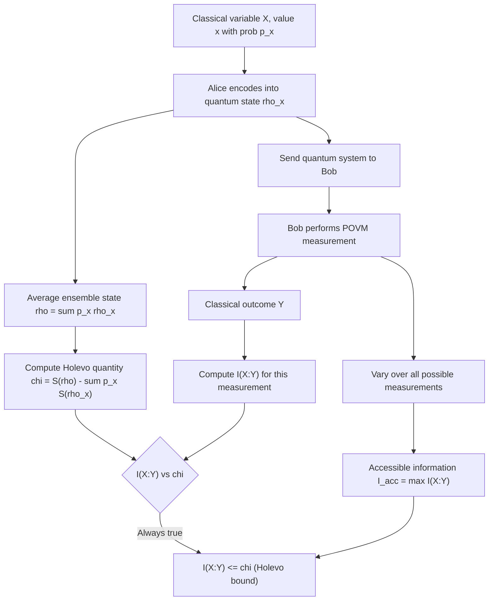

## Holevo Bound

### Overview

The Holevo bound, established by Alexander Holevo in 1973, sets a fundamental limit on how much classical information can be reliably extracted from a quantum system by measurement, regardless of how sophisticated the measurement strategy is. It resolves a natural question raised by quantum superposition: since a qubit's state is described by continuous amplitudes, does that mean it can encode unboundedly more classical information than a single classical bit? The Holevo bound answers no — access to that information is fundamentally constrained, even though the underlying quantum description is richer than a classical bit's.

### The Communication Scenario

Consider Alice encoding a classical random variable $X$, taking value $x$ with probability $p_x$, into one of a set of quantum states $\{\rho_x\}$. She sends the resulting quantum system to Bob, who performs some quantum measurement (described by a POVM — positive operator-valued measure) to try to infer $X$, producing a classical measurement outcome $Y$.

The question the Holevo bound answers: what is the maximum possible classical mutual information $I(X:Y)$ between Alice's input and Bob's measurement outcome, maximized over all possible measurement strategies Bob could use?

### Statement of the Bound

Define the **Holevo quantity** (often denoted $\chi$, chi):

$$\chi = S(\rho) - \sum_x p_x S(\rho_x)$$

Where:
- $\rho = \sum_x p_x \rho_x$ is the average density matrix (the ensemble state as seen without knowledge of $x$)
- $S(\rho_x)$ is the von Neumann entropy of the individual state associated with input $x$
- $S(\rho)$ is the von Neumann entropy of the average state

The Holevo bound states:

$$I(X:Y) \leq \chi$$

for any measurement strategy Bob might use to produce outcome $Y$ from the quantum system. No measurement — however cleverly designed — can extract more classical information about $X$ than $\chi$ bits, on average.

### Interpretation

**Key Points**
- $\chi$ depends only on the ensemble $\{p_x, \rho_x\}$ that Alice used to encode her information — it is a property of the encoding, not of any particular measurement Bob might choose.
- The bound is generally not tight: for most ensembles and most measurement strategies, $I(X:Y) < \chi$ strictly, meaning actual extractable information is often less than the Holevo quantity suggests is theoretically permitted.
- If all the $\rho_x$ are mutually orthogonal pure states, $\chi = S(\rho)$ exactly (since each $S(\rho_x) = 0$ for pure states), and this bound is achievable — a measurement in the basis distinguishing the orthogonal states extracts the full Holevo quantity. This recovers the classical case: orthogonal quantum states behave exactly like classical, perfectly distinguishable symbols.
- If the $\rho_x$ are non-orthogonal, they cannot be perfectly distinguished by any measurement (a general and fundamental feature of quantum mechanics), and $\chi$ is correspondingly reduced — encoding classical information into non-orthogonal quantum states inherently limits how much of it can later be recovered.

### Worked Example: Two Non-Orthogonal Pure States

Suppose Alice encodes a single classical bit using two non-orthogonal pure qubit states, each with probability $1/2$:

$$|\psi_0\rangle = |0\rangle, \qquad |\psi_1\rangle = \cos\theta\,|0\rangle + \sin\theta\,|1\rangle$$

For $\theta \neq \pi/2$, these states are non-orthogonal ($\langle\psi_0|\psi_1\rangle = \cos\theta \neq 0$).

Since both $\rho_0 = |\psi_0\rangle\langle\psi_0|$ and $\rho_1 = |\psi_1\rangle\langle\psi_1|$ are pure, $S(\rho_0) = S(\rho_1) = 0$, so:

$$\chi = S(\rho) - 0 = S(\rho)$$

The average state $\rho = \frac{1}{2}\rho_0 + \frac{1}{2}\rho_1$ is generally mixed (since $\rho_0 \neq \rho_1$), so $S(\rho) > 0$, but strictly less than $1$ bit whenever $\theta \neq \pi/2$ — the closer the two states are to each other (smaller $\theta$), the lower $\chi$, and the less classical information Bob can possibly extract about which state Alice sent. As $\theta \to 0$ (the states become identical), $\chi \to 0$: no information is extractable, matching intuition, since Alice's two "different" encodings become indistinguishable. As $\theta \to \pi/2$ (orthogonal states), $\chi \to 1$ bit, the maximum possible for a binary classical encoding.

### Diagram: Holevo Bound and State Distinguishability

<svg xmlns="http://www.w3.org/2000/svg" viewBox="0 0 720 300">
\<style\>
  .lbl { font-family: sans-serif; font-size: 13px; fill: #222; }
  .small { font-family: sans-serif; font-size: 11px; fill: #555; }
  .title { font-family: sans-serif; font-size: 14px; fill: #111; font-weight: bold; }
  .axis { stroke: #333; stroke-width: 1.5; }
  .curve { stroke: #1a5fb4; stroke-width: 2.5; fill: none; }
\</style\>
<text x="20" y="24" class="title">Holevo Quantity vs State Overlap (svg_diagram)</text>

<line x1="70" y1="260" x2="650" y2="260" class="axis" />
<line x1="70" y1="260" x2="70" y2="40" class="axis" />
<text x="300" y="290" class="lbl">theta (0 = identical, pi/2 = orthogonal)</text>
<text x="30" y="150" class="lbl" transform="rotate(-90 30 150)">Chi (bits)</text>

<path d="M 70 258 C 200 250, 350 180, 460 100 C 520 70, 580 55, 650 50" class="curve" />

<text x="80" y="270" class="small">theta=0</text>
<text x="600" y="40" class="small">theta=pi/2</text>
<text x="90" y="240" class="small">Chi -&gt; 0 (indistinguishable)</text>
<text x="440" y="60" class="small">Chi -&gt; 1 bit (orthogonal, fully distinguishable)</text>
</svg>

### Relationship to Accessible Information

The actual classical information extractable via the *optimal* measurement strategy is called the **accessible information**, $I_{acc}$:

$$I_{acc} = \max_{\{\text{measurements}\}} I(X:Y)$$

The Holevo bound gives $I_{acc} \leq \chi$. Finding $I_{acc}$ exactly — the optimal measurement and the resulting mutual information — is generally a hard optimization problem with no simple closed form for arbitrary ensembles; [Unverified] known closed-form solutions exist mainly for specific symmetric ensembles (e.g., certain equiprobable, symmetric-state constructions), and general-case accessible information typically requires numerical optimization over POVMs rather than analytical solution — the specific tractable cases depend on the ensemble's symmetry structure.

### Why the Bound Matters: Dense Coding Context

The Holevo bound explains why quantum superposition does not permit sending unboundedly more classical bits through a single qubit than can be sent classically, despite the qubit's continuous-amplitude description. For a $d$-dimensional quantum system:

$$\chi \leq \log_2 d$$

For a single qubit ($d=2$), $\chi \leq 1$ bit — at most one classical bit is extractable per qubit sent, in the absence of additional resources such as pre-shared entanglement. This is a foundational result constraining naive "quantum superposition gives infinite classical storage" intuitions.

[Inference] This bound is also the reason superdense coding — which transmits 2 classical bits using 1 qubit — requires pre-shared entanglement as an additional resource; the Holevo bound applies to the information carried by the transmitted qubit(s) alone, and superdense coding's apparent doubling is understood as arising from the entangled pair functioning jointly with the transmitted qubit, not as a violation of the bound applied to a single unassisted qubit.

### Diagram: Holevo Bound in the Communication Pipeline

### Applications

- **Quantum channel capacity**: The Holevo bound underlies the Holevo-Schumacher-Westmoreland (HSW) theorem, which establishes the classical capacity of a quantum channel — the maximum rate of reliable classical communication achievable by encoding into quantum states and transmitting through a noisy quantum channel.
- **Quantum cryptography security proofs**: Bounding an eavesdropper's accessible information via the Holevo bound is a standard technique in security proofs for quantum key distribution protocols (e.g., BB84), since it limits how much classical information Eve can extract from intercepted quantum states without being detected.
- **Quantum state discrimination**: The bound informs the broader theory of how well non-orthogonal quantum states can be distinguished, connecting to concepts like the Helstrom bound for optimal binary state discrimination.

### Limitations and Scope Notes

- The Holevo bound constrains information extractable from a *single* copy of the ensemble per use; it does not by itself address scenarios with multiple correlated copies or joint (collective) measurements across many qubits, which are treated in more general quantum channel capacity results.
- The bound is an upper limit, not generally achievable — actual accessible information can be substantially lower depending on the specific ensemble and available measurement strategies, so $\chi$ should not be treated as a guaranteed achievable communication rate without further analysis specific to the ensemble in question.
- This treatment addresses the bound's statement, interpretation, and qualitative implications; the full HSW capacity theorem and its regularization/additivity subtleties for quantum channel capacity are a substantially more involved topic beyond this scope.

**Related Topics**
- Holevo-Schumacher-Westmoreland (HSW) theorem and classical capacity of quantum channels
- Accessible information and optimal POVM measurement
- Quantum state discrimination and the Helstrom bound
- BB84 and quantum key distribution security proofs
- Superdense coding and entanglement-assisted communication
- Von Neumann entropy and quantum relative entropy